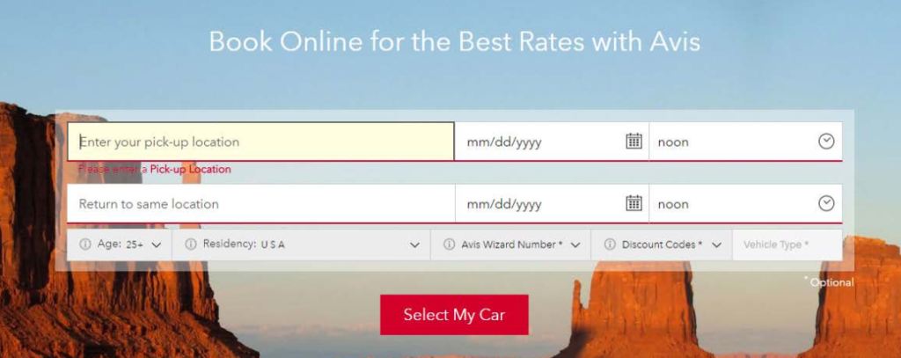

No i stało się. UA Europe, który odbył się w dniach 8-9 czerwca 2017 w
Harrogate, był ostatnim w historii. Na szczęście, załoga techwriter.pl tam była,
żeby się pożegnać. Czego się nauczyliśmy i jaka była tajemnicza rozrywka
wieczoru? O tym w dalszej części relacji.

<!--truncate-->

## Ciekawe wystąpienia

Oto podsumowanie najciekawszych, naszym zdaniem, wystąpień.

1. **Observations on Help** (Matthew Ellison), kilka uwag opartych o badania
   użytkowników:
   - Użytkownicy rzadko klikają w link typu "wróć do góry strony"
   - Boczne menu nawigacyjne często służy do odnajdowania się w treści
   - Search jest najbardziej pożądaną funkcją, więc powinien działać bardzo
     dobrze
   - Bardzo ważna jest jasno zaznaczona i łatwa do znalezienia sekcja typu
     "Getting Started"
   - Użytkownik skupia się na bardzo małej części ekranu i nie widzi informacji
     dookoła (nawigacji, pomocnych linków, itp.), dlatego jeżeli coś jest ważne
     musi być wyraźnie widoczne, i może **powinno być jedyną rzeczą na ekranie**
2. **Updating your task topics for the modern world** (Leah Guren), porady dla
   technical writerów dotyczące procedur i procesów:
   - Procedury pozwalają użytkownikowi od razu zacząć działać, dlatego są ważne
   - SME myślą o funkcjonalnościach produktów, technical writerzy muszą
     przetłumaczyć ich myślenie na czynności, które użytkownik będzie wykonywał
   - Procedura powinna mieć jasny tytuł, który zaczyna się od czasownika, jeśli
     to możliwe
   - Przed procedurą napiszmy krótko (max. dwa zdania) co użytkownik zyska z
     wykonania tej procedury
   - Przed procedurą napiszmy też czego użytkownik potrzebuje - opcjonalnie
     możemy to napisać jako pierwszy krok
   - Procedura powinna być tam gdzie użytkownik będzie jej szukał - może nie w
     helpie, ale w aplikacji (embedded UA), lub na YouTubie
3. **Software Support and Artificial Intelligence** (Kristof Van Tomme) -
   przyszłość online helpa:
   - Ludzie coraz częściej polegają na sztucznej inteligencji (artificial
     intelligence = AI) jak Google Assistant, Amazon Alexa, czy Siri; ten sam
     trend w końcu pojawi się komunikacji technicznej
   - AI będzie dawać ludziom pomocne uwagi w czasie gdy pracują z produktem (tak
     jak kiedyś [Clippy](https://en.wikipedia.org/wiki/Office_Assistant))
   - Kiedy już nie będzie potrzeby pisania treści (bo komputery będą ją same
     generowały), praca technical writerów w świecie AI będzie się wiązała z
     tworzeniem [grafów](https://en.wikipedia.org/wiki/Graph_database)
     dotyczących produktu. Na podstawie tych grafów AI będzie łączyć ze sobą
     elementy treści i polecać ją czytelnikom, kiedy będą używać określonych
     elementów produktu.
4. **Best-in-class Embedded UA** (Scott DeLoach) - przykłady pomocy
   kontekstowej:
   - Czasami zamiast osadzać pomoc, lepiej jest podać wyraźny, użytecznie
     sformułowany link do helpa
   - Można oszczędzić miejsce na formularzu, wpisując czego się oczekuje prosto
     w text box, podając nawet przykład, format daty, itp.
     
   - Pomoc kontekstową można też umieścić w bocznym panelu aplikacji
5. **Every Page is Page One** (Mark Baker) - jak pisać pomoc użytkownika w dobie
   Google'a
   - Użytkownicy nie czytają naszego "manuala" tylko trafiają na konkretną
     stronę dzięki wyszukiwaniu
   - Strona na którą trafią jest pierwszą stroną, którą widzą
   - Nie możemy zakładać, że wiedzą o czym pisaliśmy na innych stronach, ale
     powinniśmy zakładać jakiś poziom wiedzy
   - Pomoc, która tłumaczy zawsze wszystko od podstaw, tak jakby użytkownik nie
     miał żadnej wiedzy, nie jest pomocna dla nikogo

## Wieczorna rozrywka

Wieczorem po wykładach, uczestnicy zebrali się w sali teatralnej w hotelu z
drinkami w dłoniach. Wszyscy czekali na wielką niespodziankę wieczoru.

I nie zawiedli się. Na scenę wyszedł dziarski artysta i przywitał wszystkich
zadziornym wierszykiem o konferencji, sponsorach i prelegentach, po czym
przeszedł do śpiewania rubasznych piosenek przy akompaniamencie pianina. Był to
tradycyjny wykonawca z nurtu
[Music Hall](https://en.wikipedia.org/wiki/Music_hall). Choć tego typu występy
straciły na popularności w latach sześćdziesiątych XX wieku, są niewątpliwie
częścią brytyjskiej tradycji estradowej. Dla Polaka na widowni było to
niewątpliwie zaskakujące doświadczenie, ale jak to ujęła jedna z uczestniczek,
było to bardzo "kochane" (darling).

## Ostatni raz

Na koniec Matthew Ellison ogłosił, że nie będzie już kolejnej edycji UA Europe.
Matthew i jego żona Georgette organizowali wydarzenie przez ostatnie 21 lat,
jednak wszystko co dobre ma swój koniec. Zatem UA Europe przechodzi do historii,
a nam pozostają wspomnienia i zdobyta wiedza.

Techwriter.pl był dumnym partnerem medialnym konferencji.
