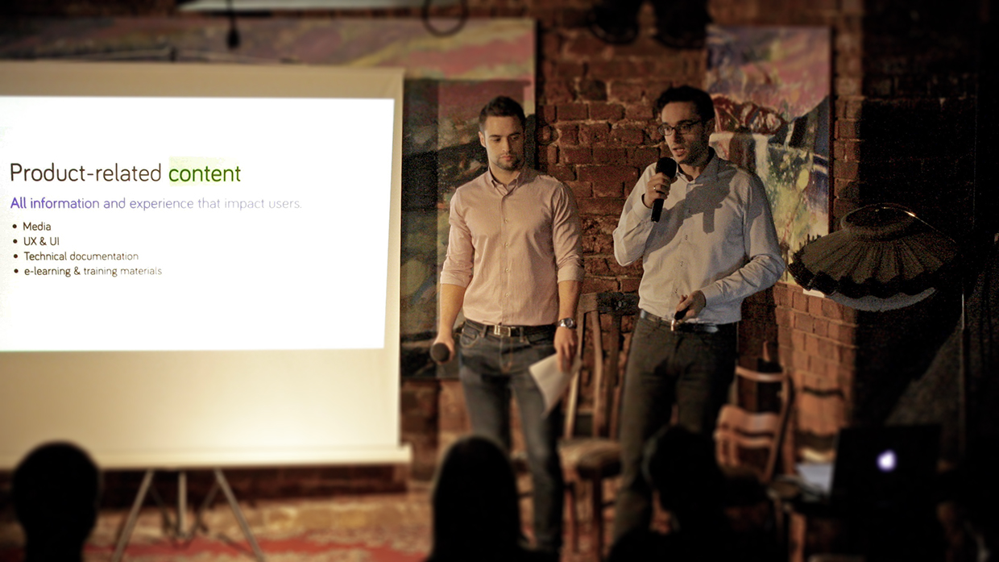
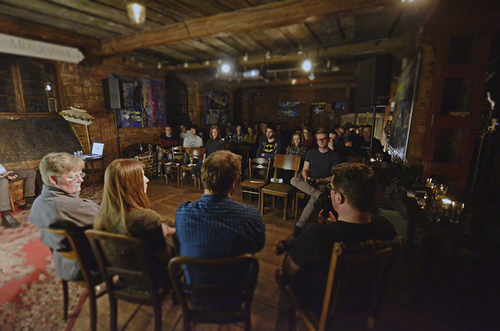
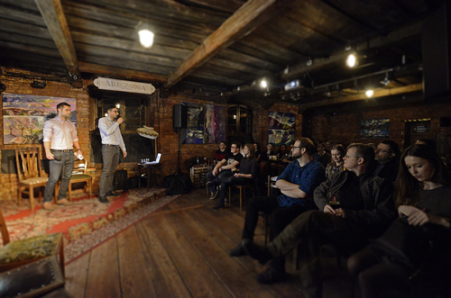

Dopiero
co [opisywaliśmy](http://techwriter.pl/relacja-z-kolejnej-edycji-krakowskiego-meetcontent/) trzecie
krakowskie spotkanie MeetContent, a już mamy dla Was kolejne sprawozdanie. Tym
razem publikujemy jeszcze ciepłą relację z meetupu inaugurującego wrocławski
cykl spotkań MeetContent. Tekst został przygotowany przez organizatorów, my
tylko puszczamy go dalej w świat 😊 Miłej lektury!

<!--truncate-->

\*\*\*

Czym jest „content”? Na czym polega praca z „contentem”? Jak wygląda kariera w
pracy z „contentem”?

Na takie pytania musieli odpowiedzieć paneliści na MeetContentWRO #1, czyli
pierwszej edycji wrocławskiego MeetContent.

Wrocławskie środowisko TechComm pokazało, że nie śpi.

Pierwszy meetup dotyczący pracy z contentem został zorganizowany przez
koordynatorów wrocławskiej edycji meetupów MeetContent, Daniela Barrio Fierro,
Wojtka Baranowskiego i Tomka Prusa.

Klimat krakowskiego „Artefakt Cafe” udało się odnaleźć we wrocławskiej
„Mleczarni”, a liczba gości pokazała, że we Wrocławiu jest spore zainteresowanie
tematami TechComm.

Meetup miał formę panelu dyskusyjnego prowadzonego przez Daniela i Wojtka.
Panelistami byli: **Erin Vang** – menedżerka działu technical communication w
Dolby Laboratories, **Gosia Radymiak** – założycielka soap! technical
communication (soapconf.com i meetcontent.org), **Wojtek Aleksander** –
specjalista od UX w GetResponse oraz **Tomek Prus** – menedżer w dziale
dokumentacji w Unit4.

W formularzu rejestracyjnym goście odpowiadali na pytanie czym jest dla nich
content:

„A set of assets that deliver experience”

„The words I write, the knowledge you gain”

„A piece of info that satisfies users’ needs”

„Content is what I can use to do things”

Ten zestaw odpowiedzi pokazuje o jak rozległym i ciekawym pojęciu mówimy.

Na szerokim spojrzeniu na content skupia się też działalność grupy MeetContent,
której głównymi tematami spotkań mają być zarówno dokumentacja techniczna, jak i
„media”, UX oraz e-learning.

Na  początku paneliści podzielili się z uczestnikami swoją historią w pracy z
contentem. Jak można się domyśleć, wspólnym mianownikiem dla wszystkich był
technical writing. Jednocześnie zwrócili uwagę, jak szerokie perspektywy otwiera
taka kariera – czy to wśród stanowisk technicznych (jak testerzy oprogramowania
czy software developerzy), czy stanowisk menedżerskich lub związanych z UX.

Co lubicie w pracy z contentem? Wojtek opowiedział o możliwości wpływania na
ludzi przy przy pomocy informacji oraz o elastyczności jaką ma w pracy. Tomek
stwierdził, że nigdy nie nudził się w pracy, ponieważ zawsze mógł pracować nad
wieloma różnymi rzeczami. Erin podsumowała, że najprzyjemniejsza jest możliwość
współpracy ze wspaniałymi ludźmi.

Dowiedzieliśmy się również, na jakie cechy zwracają uwagę menedżerowie w czasie
rekrutacji na stanowisko w pracy z contentem. Erin zawsze poszukuje ludzi,
którzy potrafią pokazać swoją osobowość i potrafią się szybko uczyć. Była
również pozytywnie zaskoczona, że w Polsce można spotkać tak dużo ludzi dobrze
przygotowanych do pracy w technical writingu. Z kolei Tomek stara się budować
zespół składający się z ludzi posiadających zróżnicowane umiejętności, a cechą
wspólną powinno być „detektywistyczne” podejście do pracy. Gosia zwróciła
również uwagę, jak znajomość języka obcego otwiera szerokie możliwości w
karierze związanej z contentem.

Ciężkim tematem, z którym musieli zmierzyć się paneliści było pytanie o
najtrudniejsze wyzwanie z jakim spotkali się w trakcie swojej kariery.
Usłyszeliśmy o problemach ze zmianą mentalności ludzi przy wprowadzaniu
standardu DITA, niedocenianiu pracy, ale także o tym jak mały błąd w
dokumentacji może spowodować zagrożenie życia inżyniera montującego system
radiowy na maszcie telekomunikacyjnym.

Na koniec padły pytania od publiczności.

„Trzeba być twardym jak wiking, który bije się o swoje” odpowiedział Wojtek na
pytanie o to jak w korporacji zawalczyć o możliwość uzyskania feedbacku od
klienta na temat dokumentacji.

„Wiking musi mieć również dobrą łódź w postaci wsparcia menedżerskiego”,
słusznie zauważył Tomek. Wszyscy paneliści zgodzili się, że jest to trudny temat
i warto pomyśleć o takich rozwiązaniach jak ankiety.

Dyskusję zamknęło pytanie o przyszłość.

Paneliści stwierdzili, że na pewno warto tworzyć informację w taki sposób, aby
nie była zależna od kontekstu – dzięki temu będzie ona zawsze aktualna,
niezależnie w jakiej postaci dostarczymy ją odbiorcy. A przedstawienie
informacji w prosty sposób pozwala czynić świat lepszym 😊

Z pewnością nie było to spotkanie które pozwoliło „odkryć Amerykę”, ale też nie
taki był cel tego panelu. Dzięki ciekawym rozmówcom udało się pokazać ludzką
stronę pracy z contentem, a wszyscy goście mogli poczuć, że poruszane były
problemy, które dotykają wszystkich, niezależnie od firmy czy branży.

Jednocześnie sądzę, że każdy mógł wynieść z tego spotkania coś dla siebie, jakąś
złotą myśl lub celną uwagę. A najważniejszy cel – pokazanie, że we Wrocławiu też
jest środowisko TechComm – z pewnością udało się spełnić.

\*\*\*

Zachęcamy do zaglądania na
[stronę społeczności MeetContent](http://meetcontent.org/), gdzie znajdziecie
informacje o kolejnych wydarzeniach we Wrocławiu i Krakowie, a także formularz
do zgłaszania własnych wystąpień. Wszystkie pytania i uwagi możecie przesyłać na
adres **[contact@meetcontent.org](mailto:contact@meetcontent.org)**.
