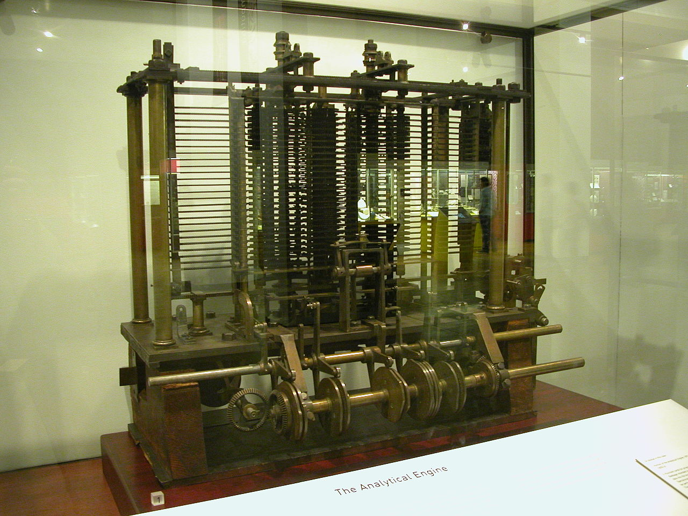

W środowisku krążą plotki o tym, że pierwszy techwriter był lowelasem. Nie
wierzcie w to.

<!--truncate-->

Pamiętacie artykuł o
[geografii komunikacji technicznej](http://techwriter.pl/komunikacja-techniczna-geograficznie/)?
Wyrobione oko bez trudu dojrzało na mapce zarys niebieskiej kropki. Kryje się za
nią następujący opis:

> ## Birthplace of Ada Lovelace
>
> _Other_
>
> Ada Lovelace (1815-1852) is sometimes called the first technical writer,
> thanks to her work on the notes for Charles Babbage's Analytical Engine.
>
> Piccadilly, London, England

Ciekawe, prawda? Postanowiliśmy to sprawdzić, w końcu jest piątek 😉

Okazało się, że
[Ada Lovelace była naprawdę ciekawą postacią](http://en.wikipedia.org/wiki/Ada_Lovelace).
Podobno pisała dokumentację do jednego z
[pierwszych komputerów](http://en.wikipedia.org/wiki/Analytical_Engine) (mechanicznego!),
który wyglądał mniej więcej tak:

Dla czytelników nowej generacji zamieszczamy również zdjęcie wersji mobajl:

Nie udało nam się niestety dotrzeć do potwierdzonych informacji czy Ada była
bezpośrednio spokrewniona z prototypem współczesnego lowelasa, czyli Robertem
Lovelace. Z dużą dozą prawdopodobieństwa można jednak powiedzieć że nie,
ponieważ Robert jest [postacią fikcyjną](http://en.wikipedia.org/wiki/Clarissa).
😊

Stanowczo natomiast sprzeciwiamy się nazywaniem jej pierwszym techwriterem!

Są przecież [niezbite dowody](http://techwriter.pl/5-sredniowiecznych-jaktosow/)
na to, że nasza profesja miała się całkiem dobrze już dużo, dużo wcześniej. Że o
hieroglifach nie wspomnimy.

A Ada Lovelace ma już nawet
[swój własny język programowania](<http://en.wikipedia.org/wiki/Ada_(programming_language)>).

Czego i Wam życzymy.
