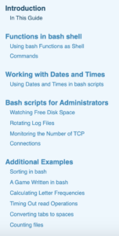
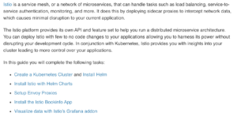

Mamy dziś dla Was propozycję ciekawej, wirtualnej biblioteki, której zasoby
możecie nie tylko przeglądać, ale też tworzyć, nie wstając z fotela. Szczegóły
poniżej. Zapraszamy!

<!--truncate-->

#### Linode - informacje ogólne

[Linode](https://www.linode.com/) to amerykańska firma oferująca usługi związane
z chmurą obliczeniową. Jest obecna na rynku od 2003 roku. Celem firmy jest
dotarcie do jak najszerszej liczby klientów, którzy w prosty i przyjazny
użytkownikowi sposób będą mogli korzystać z usług wirtualnej chmury stworzonej
przez pracowników Linode.

#### Linode a technical writing

Firma Linode posiada szeroką ofertę usług związanych z różnymi technologiami
dlatego jednym z ważnych elementów jej portfolio jest dobra dokumentacja. Jej
pracownicy nie tylko piszą ją dla konkretnych produktów oferowanych przez firmę,
ale także tworzą ogólnie dostępną bazę wiedzy, którą postaramy się przybliżyć w
dalszej części tekstu.

Jeśli posiadacie doświadczenie w tworzeniu dokumentacji technicznej i
zainteresują Was zasoby wiedzy oferowane przez Linode możecie sami zostać
członkami zespołu. Jak to zrobić?

#### Pisz dla Linode

[Pisz dla Linode](https://www.linode.com/lp/write-for-linode/) to nazwa programu
skierowana do freelancerów z doświadczeniem w pisaniu dokumentacji. Osoby
zainteresowane będą tworzyć materiały do Biblioteki Linode, o której
przeczytacie poniżej. W zależności od rodzaju dostarczonego tekstu, w ramach
programu można zarobić conajmniej $100 za aktualizację istniejącego dokumentu
lub minimum $300 za w pełni autorski tekst.

##### Jak dołączyć do programu?

Wystarczy wypełnić
[formularz](https://www.linode.com/lp/write-for-linode/#write-for-linode-form),
w którym, poza podstawowymi danymi o sobie, opiszecie krótko swoje doświadczenie
zawodowe oraz dołączycie próbkę tekstu. Obecnie w centrum zainteresowania
znajdują się teksty o Kubernetes, Linux oraz bazach danych.

Jeśli zgłoszenie zostanie przyjęte przed publikacją czekają Was następujące
kroki:

1. Współpraca z zespołem pracującym w Linodę nad tematem zaproponowanym przez
   Was lub zasugerowanym przez firmę. Otrzymacie
   [The Linode Writer's Guide](https://www.linode.com/docs/linode-writers-formatting-guide/),
   listę przydatnych zwrotów, które możecie użyć w tekście, wytyczne odnośnie
   stylu, jaki powinna mieć dokumentacja oraz instrukcje jak umieścić tekst w
   repozytorium GitHub.
2. Praca nad poprawkami w proponowanym tekście.
3. Publikacja tekstu wraz z promocją w social mediach oraz wypłata rzecz jasna
   😉.

Osoby, które będą chciały powtórnie napisać tekst dla Linode nie muszą
przechodzić weryfikacji. Wystarczy, że zgłoszą się z pomysłem do osoby, z którą
już współpracowały.

#### Biblioteka Linode

Firma posiada obszerną bazę z dokumentacją techniczną, zawierającą liczne
przewodniki, oraz dokumenty instruktażowe. Obecnie dysponuje ponad tysiącem
pozycji, a korzysta z niej ponad milion czytelników miesięcznie. Należy jednak
zaznaczyć, że aby mieć dostęp do części materiałów należy wykupić subskrypcję.

##### Co znajdziemy w bibliotece?

W centrum zainteresowania autorów z Linode jest dokumentacja open-source
dotycząca między innymi:

- narzędzi DevOps (Kubernetes, Docker itp.)
- infrastruktury (serwery webowe i aplikacyjne)
- przechowywania danych (bazy danych, block storage, object storage, szeroko
  rozumiany cloud storage)
- różne języki programowania
- Linux

Typy dokumentacji w bibliotece Linode:

- Tutoriale - na przykład:
  [Solving Real World Problems With Bash Scripts - A Tutorial](https://www.linode.com/docs/development/bash/solving-real-world-problems-with-bash-scripts-a-tutorial/)

- Wprowadzenia - na przykład:
  [A Beginner's Guide to Kubernetes](https://www.linode.com/docs/kubernetes/beginners-guide-to-kubernetes/)

- Przewodniki typu How-to - na przykład:
  [How to Deploy Istio with Kubernetes](https://www.linode.com/docs/kubernetes/how-to-deploy-istio-with-kubernetes/)

- Troubleshootings - na przykład:
  [Troubleshooting SSH](https://www.linode.com/docs/troubleshooting/troubleshooting-ssh/)

Jeśli jesteście zainteresowani zasobami biblioteki Linode to możecie je
przeglądać [pod tym linkiem](https://www.linode.com/docs/).

#### Społeczność Linode

Linode zrzesza wokół siebie ludzi, którzy chętnie dzielą się z innymi swoją
wiedzą. Członkowie społeczności angażują się w różne projekty, z których mogą
korzystać osoby nimi zainteresowane. Mamy tu wspomnianą już wyżej bibliotekę z
dokumentacją. Poza nią dostępny jest [blog](https://www.linode.com/blog/),
osobna [sekcja dla developerów](https://www.linode.com/developers/), czy
[baza Q&A](https://www.linode.com/community/questions/). Dla osób, które chętnie
korzystają z social mediów społeczność Linode jest stale obecna w różnych
kanałach jak na przykład Facebook, Instagram, Youtube czy GitHub.

Może ktoś z Was zechce dołączyć do Linode? A może macie już doświadczenie w
pisaniu dokumentacji do podobnych platform?
