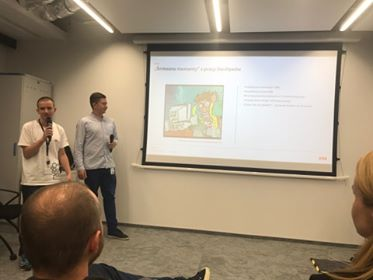

Jeżeli nie byliście na [zapowiadanym przez nas spotkaniu](http://techwriter.pl/spotkanie-technical-writerow-w-krakowie/) to... Wasza strata. Na pociechę nasz wysłannik krótko podsumowuje to wydarzenie :)

Meetupy już mocno wpisały się w krakowski rynek IT i oferują szeroki wybór tematów. W ten trend wpisują się również spotkania dla specjalistów od szeroko pojętej komunikacji technicznej. Dostrzegają to firmy informatyczne i coraz chętniej oferują swoje biura jako miejsce spotkań na wymianę wiedzy i doświadczeń. Dużo dobrego dla branży techcom w Polsce robią takie grupy jak MeetContent i organizatorzy konferencji Soap!.

Pisanie dokumentacji technicznej to wypadkowa wielu czynników. W procesie jej tworzenia ścierają się ze sobą umiejętności pisarskie dokumentalistów, wiedza ekspertów (SMEs) i oczekiwania użytkowników oprogramowania/czytelników dokumentacji. O tym właśnie był meetup 2 października, w którym mieliśmy przyjemność uczestniczyć w krakowskiej siedzibie ABB, a składał się z dwóch prezentacji:

## DevOps engineer najlepszym przyjacielem technical writera

DevOps to jedno ze słów, które od pewnego czasu robi zawrotną karierę. Coraz więcej firm chce mieć takich specjalistów u siebie. Kim oni są? Co robią? Jak ważni mogą być w procesie tworzenia dokumentacji? Jaka jest ulubiona odpowiedź DevOpsa na zadane pytanie? Na te i inne pytania starali się odpowiedzieć Łukasz Pieczyrak, Marcin Wilk, Piotr Sroka.

Naszym skromnym zdaniem wyszło im to nie najgorzej :)

## Jak przypadkiem wprowadziliśmy standard i czego nas to nauczyło

Paweł Kowaluk opowiedział nam swoją historię - w jego firmie chcieli mieć jeden standard utrzymywania źródeł dokumentacji. Życie jednak zweryfikowało te aspiracje i zmusiło do szukania innego rozwiązania, które ostatecznie okazało się dużo lepsze, przynajmniej w opinii prelegenta. Do tego stopnia, że nazwał je "architekturą informacji rodem z nadchodzącego stulecia"...

Lokalizacja biura ABB w centrum Krakowa i wybór tematów technicznych i nietechnicznych przyciągnęły ponad 50 osób oraz wywołały bardzo długie dyskusje. Cieszy nas fakt, że coraz aktywniej w tego typach wydarzeń biorą udział programiści, którzy chcąc nie chcąc ściśle współpracują z "dokumentalistami". Zespoły programistyczne wyrabiają w sobie lepszą świadomość i sami zaczynają szukać współpracy z techwriterami. Smaczna pizza, gadżety od ABB dla uczestników i dużo nowych twarzy sprawiły, że ten meetup był bardzo przyjemny.

Grono specjalistów od komunikacji technicznej w Krakowie rozwija się prężnie! Czekamy na kolejne wydarzenia.
