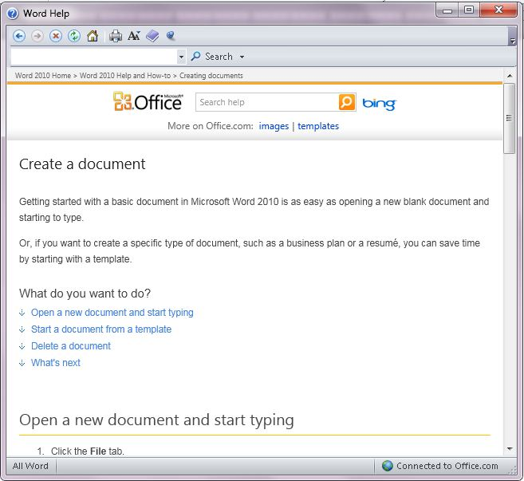

Czym zajmują się technical writerzy? Tworzą m.in. kontekstowe pomoce użytkownika
(ang. _on-line help_). A czym zajmują się pomoce użytkownika? I czym właściwie
są?

<!--truncate-->

Tradycyjnie już zaczynamy od Wikipedyjnej
[definicji](http://en.wikipedia.org/wiki/Online_help), która jest niestety dość
ogólna. Pomoc użytkownika to po prostu informacja o oprogramowaniu dostarczana
razem z nim i dostępna podczas jego używania. Na przykład po wciśnięciu klawisza
F1, kliknięciu na ikonkę ze znakiem zapytania, albo przycisk "Help". Często mamy
do czynienia z tzw. kontekstową pomocą użytkownika (_context-sensitive help_) -
wyświetlane informacje pomocy zależą od tego z której części systemu aktualnie
korzystamy.

On-line help ma to do siebie, że jest w całości dostępny dla wszystkich
użytkowników oprogramowania a jednocześnie nikt nigdy go w całości nie czyta 😊.
Poza dokumentalistami oczywiście.  Dostarczany najczęściej w formie plików .chm,
HTML, PDF, ostatnio często po prostu jako strony www.

Pomoc użytkownika powinna zawierać spis treści, skorowidz oraz system
wyszukiwania. Zazwyczaj można ją też wydrukować, ale to już dość staromodne
zastosowanie.
