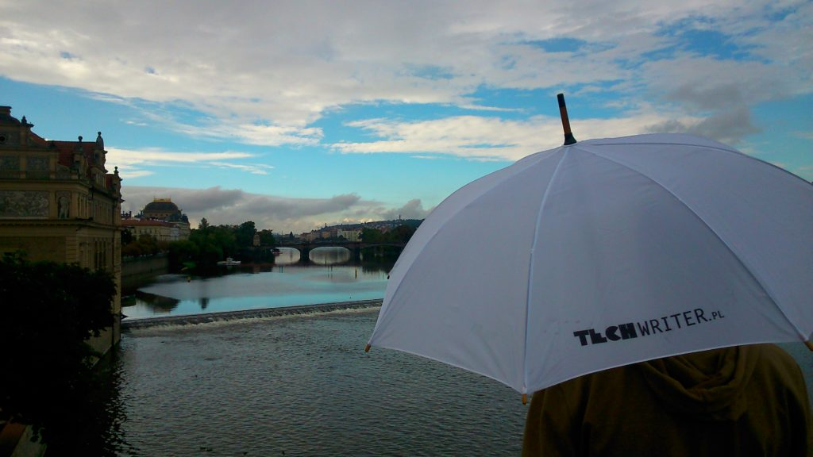

Czy wiecie, że dziś są trzecie urodziny Techwriter.pl? Nas też to zaskoczyło...
podczas wyjazdu na konferencję
[WriteTheDocs](http://www.writethedocs.org/conf/eu/2016/). W związku z tym
świętujemy!

Kiedy dokładnie trzy lata temu powstawał
[pierwszy wpis na naszej stronie](http://techwriter.pl/witaj-swiecie/), nie
mieliśmy chyba pojęcia dokąd nas to zaprowadzi, jak długo wytrwamy i czy w ogóle
warto...

Dziś możemy odpowiedzieć na wszystkie te pytania:

- W ciągu trzech lat opublikowaliśmy prawie ćwierć tysiąca artykułów.
- Liczba osób odwiedzających naszą stronę zbliża się do 30 tys.
- Staliśmy się partnerem dla kilku liczących się konferencji branżowych
  (sprawdźcie linki po prawej).
- Pomogliśmy wielu z Was znaleźć nową, lepszą pracę lub nowych, fajnych
  współpracowników.
- Powiększyliśmy grono redakcyjne i wciąż czekamy na kolejne osoby chętne do nas
  dołączyć.
- Nawiązaliśmy nowe znajomości i przyjaźnie.
- Wiele się nauczyliśmy.
- Mieliśmy masę dodatkowej pracy i jeszcze więcej zabawy!

Podsumowując - same sukcesy i splendory, wytrwaliśmy i zdecydowanie było warto
😊

Z optymizmem patrzymy w przyszłość...

... a także szykujemy dla Was (i dla nas) prezent-niespodziankę!

Dzięki za wszystko i bądźcie z nami 😊

Redakcja.
