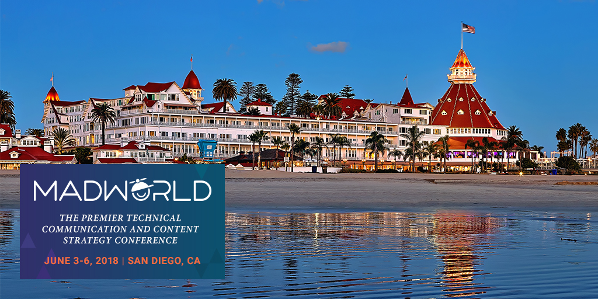
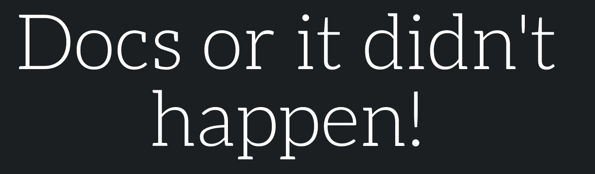
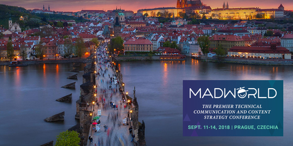

Ten rok zapowiada się dla nas pracowicie pod względem patronatów medialnych. Ale jest to dla nas tylko i wyłącznie powód do radości, bo to oznacza, że branża komunikacji technicznej na świecie ma się całkiem dobrze.

Poniżej przedstawiamy zestawienie konferencji, nad którymi mamy przyjemność sprawować patronat medialny w 2018 roku. Dla ułatwienia ustawiliśmy je w porządku chronologicznym. Poniższe zestawienie to tylko ogólny zarys tego co nas czeka. Szczegółowe informacje na temat każdego z tych wydarzeń będziemy publikować w niedalekiej przyszłości.

# Landing Festival

- Gdzie: Berlin, Niemcy
- Kiedy: 14-15 marca 2018
- Strona wydarzenia: [https://landingfestival.com/berlin](https://landingfestival.com/berlin)

Wydarzenie dla specjalistów z branży IT, które łączy w sobie konferencję, warsztaty i targi pracy. Jeśli pracujecie z nowymi technologiami i chcecie wyjść trochę poza świat komunikacji technicznej to Landing Festival może być tym czego szukacie. Więcej szczegółów znajdziecie w naszym [poście zapraszającym](http://techwriter.pl/zapraszamy-na-landing-festival-2018/) na to wydarzenie.

# soap!

- Gdzie: Kraków, Polska
- Kiedy: 23-25 maja 2018
- Strona wydarzenia: [http://soapconf.com/](http://soapconf.com/)

Nasz najstarszy patronat medialny. Z konferencją soap! współpracujemy od 2014 roku i po tylu latach właściwie nie wyobrażamy sobie, żeby mogło być inaczej. Obecnie, jest to jedyna polska konferencja dla specjalistów pracujących z szeroko pojętą treścią. Bardzo cieszy nas fakt, że swoim zasięgiem obejmuje nie tylko Polskę. Co roku do Krakowa z różnych krajów ściągają rzesze osób, dla których pomoc użytkownika to sprawa najwyższej wagi. Dlatego oprócz Tech Writerów spotkacie tutaj też m.in. UX Designerów, Product Managerów i Scrum Masterów. Naszą relację z zeszłorocznej edycji znajdziecie [tutaj](http://techwriter.pl/soap-2017-juz-za-nami-relacja/).

# MadWorld San Diego

- Gdzie: San Diego, Stany Zjednoczone
- Kiedy: 3-6 czerwca 2018
- Strona wydarzenia: [https://www.madcapsoftware.com/conference/madworld-2018/](https://www.madcapsoftware.com/conference/madworld-2018/)

Konferencję można by określić jako coroczny zjazd użytkowników produktów MadCapa. Dla Tech Writerów używających Flare’a jest to miejsce, w którym mogą zdobyć konkretną wiedzę, uzyskać pomoc od ekspertów, poznać nowe osoby, które mają podobne problemy i które mogą podzielić się swoim doświadczeniem. Umiejscowienie wydarzenia w słonecznej Kalifornii zdecydowanie jeszcze bardziej zachęca do wzięcia w nim udziału. Naszą relację z zeszłorocznej edycji znajdziecie [tutaj](http://techwriter.pl/madworld-2017-relacja/).

# Write the Docs Prague

- Gdzie: Praga, Czechy
- Kiedy: 9-11 września 2018
- Strona wydarzenia: [http://www.writethedocs.org/conf/prague/2018/](http://www.writethedocs.org/conf/prague/2018/)

Zdecydowanie jedna z najlepszych konferencji tech comm w Europie. Społeczność Write the Docs jest bardzo otwarta i jej głównym założeniem jest zrzeszanie osób, które w taki czy inny sposób są związane z dokumentacją. Dlatego duża część uczestników konferencji to programiści, testerzy i konsultanci. Tech Writerom daje to świetną okazję, żeby spojrzeć na dokumentację z innej perspektywy. Naszą relację z zeszłorocznej edycji znajdziecie [tutaj](http://techwriter.pl/write-the-docs-prague-2017-relacja/).

# MadWorld Prague

- Gdzie: Praga, Czechy
- Kiedy: 11-14 września 2018
- Strona wydarzenia: [https://www.madcapsoftware.com/conference/madworld-europe-2018/](https://www.madcapsoftware.com/conference/madworld-europe-2018/)

Całkowicie nowe wydarzenie branżowe. MadCap Software w tym roku startuje z pierwszą europejską edycją konferencji MadWorld. Jest to na pewno świetna informacja dla wszystkich użytkowników MadCap Flare w Polsce, którzy nie są w stanie wybrać się do San Diego.

# Zapraszamy!

W imieniu organizatorów serdecznie zapraszamy na opisane powyżej konferencje. Każde z tych wydarzeń skupia wokół siebie trochę inną grupę specjalistów, więc warto rozważyć udział w więcej niż jednym z nich.

Na koniec mała zachęta. Oprócz możliwości zdobycia cennej wiedzy i nawiązania nowych znajomości, kolejnym powodem, dla którego warto się wybrać jest to, że możecie tam spotkać nas. A takie doświadczenie jest doprawdy bezcenne ;)
