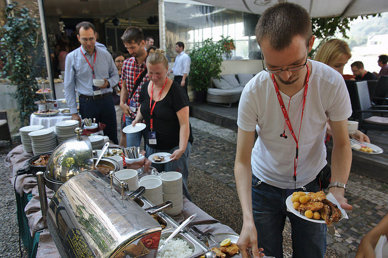
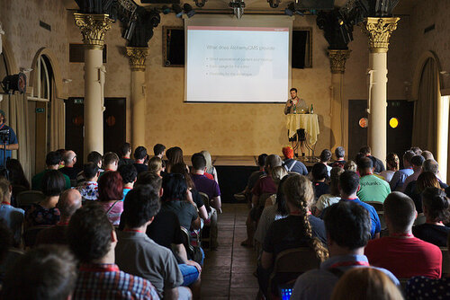

Write the Docs - piszcie dokumenty. To nie tylko hasło zagrzewające do
działania, ale również nazwa jednej z konferencji poświęconych komunikacji
technicznej, która odbywa się w Stanach Zjednoczonych i Europie. W związku z
tym, że w tym roku przypadł nam zaszczyt sprawowania patronatu medialnego nad
europejską edycją [Write the Docs](http://www.writethedocs.org/conf/eu/2016/),
chcielibyśmy Wam o niej trochę opowiedzieć.

<!--truncate-->

### Historia konferencji

Trzech facetów: [Eric Holscher](https://twitter.com/ericholscher) - programista
Python i twórca [Read the Docs](https://readthedocs.org/),
[Troy Howard](https://twitter.com/thoward37) - programista oraz
[Eric Redmond](https://twitter.com/coderoshi) - dokumentalista. Jeden z nich
wrzuca post na Twittera:

Drugi (Troy) odpowiada na niego krótko, acz treściwie: _stwórzmy konferencję_.
Podczas pierwszego spotkania dołącza do nich jeszcze Eric Redmond. W tak
kameralnym gronie odbywa się pierwsze zebranie społeczności zainteresowanej
tematyką dokumentacji. Tego wieczoru
powstaje [Manifest: Write the Docs](http://www.writethedocs.org/guide/about/vision/),
który zaczyna się od słów:

> There exists a tribe of documentarians in the world. Up until this point, they
> haven’t had a central place to meet each other, and coalesce into a community.
> We are providing the space to allow this to happen, both in person and online.

W krótkim czasie publikują notkę w
[Hacker News](https://news.ycombinator.com/item?id=5129425) i ku własnemu
zdziwieniu otrzymują ogromną ilość odpowiedzi. Tak rusza maszyna zwana Write the
Docs, skupiająca wokół siebie osoby z różnych profesji, które łączy fakt
posiadania dokumentacji w swoim centrum zainteresowań.

### **Write the Docs dzisiaj**

Dziś [konferencje](http://www.writethedocs.org/conf/) (jedna w Portland, druga w
jednej z europejskich stolic) goszczą każdego roku ponad 600 uczestników.
Zrzeszona wokół nich społeczność liczy ponad 1500 członków
regionalnych [grup spotykających się](http://www.writethedocs.org/meetups/) w 14
miastach rozrzuconych po Ameryce Północnej, Łacińskiej oraz Europie. Z roku na
rok liczba ta się zwiększa.

### Ważne fakty

Poniżej przedstawiamy najważniejsze informacje na temat Write the Docs Europe.

#### **Kiedy**

18-20 września 2016 roku

#### **Miejsce**

Praga, Czechy

#### **Rodzaje i ceny biletów:**

Bilety są już dostępne i, jak twierdzą organizatorzy, rozchodzą się jak świeże
bułeczki. Zatem chętnych zachęcamy do pośpiechu.

Bilet korporacyjny - gdy pracodawca płaci za bilet pracownika:

- €150 - przedsprzedaż (limit 25)
- €200 - cena regularna

Bilet indywidualny - dla osób jadących na własny koszt, pracujących w
wolontariacie lub dla firm posiadających mniej niż 10 pracowników:

- €75 - przedsprzedaż (limit 25)
- €100 - cena regularna

#### **Co zawiera cena biletu?**

- Śniadanie, przekąski oraz obiad podczas dwóch dni konferencji
- Przyjęcie zapoznawcze w dniu poprzedzającym konferencję oraz party po
  pierwszym dniu konferencji. Podczas obydwu imprez będą serwowane przekąski
  oraz darmowe napoje
- W dniach poprzedzających konferencję odbędzie się
  [Writing Day](http://www.writethedocs.org/conf/eu/2016/writingday/) oraz
  szereg atrakcji związanych ze zwiedzaniem stolicy Czech
- Wi-Fi

#### **Informacja dla sponsorów**

Firmy, które zostaną sponsorem konferencji otrzymają bilety wraz z pakietem
sponsorskim.

#### **Wsparcie finansowe**

Jeśli komuś bardzo zależy na udziale w konferencji, a nie może sobie pozwolić na
kupno biletu organizatorzy proszą o kontakt mailowy
[europe@writethedocs.org](mailto:europe@writethedocs.org) w celu znalezienia
rozwiązania.

#### **Podróż i zakwaterowanie**

Organizatorzy konferencji nie zapewniają transportu oraz noclegów podczas
wydarzenia, jednak służą pomocą w tych kwestiach. Zainteresowanych odsyłamy
[tutaj](http://www.writethedocs.org/conf/eu/2016/visiting/#where-to-stay).

#### Informacje dla prelegentów

Organizatorzy zachęcają do przesyłania propozycji prezentacji zarówno osoby z
doświadczeniem jak i świeżo upieczonych dokumentalistów. Jeśli planujecie się
zgłosić, możecie to zrobić za pomocą formularza umieszczonego
[na stronie konferencji](http://www.writethedocs.org/conf/eu/2016/cfp/). Radzimy
jednak się pospieszyć, gdyż termin upływa 3 czerwca.

Dla osób, które chciałyby coś zaprezentować, ale nie wiedzą od czego zacząć
przydatne mogą być zamieszczone na podlinkowanej powyżej stronie streszczenia
prezentacji wygłoszonych podczas poprzednich edycji, które według twórców
konferencji najlepiej oddają jej ducha.

Po zaakceptowaniu propozycji, o czym organizatorzy zamierzają poinformować 24
czerwca, prelegent może liczyć na darmowy wstęp na konferencję.

### Program konferencji

Write the Docs to nie tylko konferencja. To także szereg towarzyszących jej
inicjatyw i wydarzeń, podczas których uczestnicy mogą się poznać, współpracować
oraz uczyć.

#### **17 września (sobota)**

Dla osób, które wcześniej przyjadą do Pragi organizatorzy przygotowali
wycieczki, w trakcie których będzie można zwiedzić miasto oraz zapoznać się z
innymi uczestnikami.

#### **18 września (niedziela)**

Writing Day oraz wieczorne przyjęcie integracyjne.

#### **19 września (poniedziałek) - Dzień 1**

Panele tematyczne oraz wieczorna impreza.

#### **20 września (wtorek) - Dzień 2**

Panele tematyczne oraz wieczorne spotkanie zamykające konferencję.

### Linki do materiałów z poprzedniej edycji

Osoby zainteresowane tym, co się działo podczas poprzedniej konferencji odsyłamy
[tutaj](https://www.youtube.com/playlist?list=PLZAeFn6dfHplFNTsVdBuHk6vPZbsvHtDw).
A tych, którzy nadal się wahają zachęcamy do
[obejrzenia zdjęć](https://www.flickr.com/photos/writethedocs). Być może uroki
Pragi oraz uśmiechnięte twarze uczestników poprzednich edycji skłonią Was do
podjęcia decyzji i spędzenia czasu w stolicy Czech 😉.

### Warto?

Write the Docs Europe to, według naszych informacji, najtańsza europejska
konferencja w branży tech commu. Bez obaw - w parze z niską ceną nie pójdzie
niska jakość. Wprost przeciwnie, patrząc na cenę wejściówki oraz wszystko to, co
w tej cenie otrzymujemy doszliśmy do wniosku, że stosunek ilości (i jakości) do
ceny jest według nas bezkonkurencyjny i w cenie biletu dostajemy naprawdę sporo.

Pamiętajmy, że poza prezentacjami i innymi przygotowanymi przez organizatorów
atrakcjami kupujemy również znakomitą okazję, by poznać ludzi z branży
pochodzących z różnych krajów. Write the Docs tworzona jest przez pasjonatów i
to czuć na każdym kroku. Akcenty są równo rozłożone pomiędzy szerzenie wiedzy,
promowanie branży oraz aspekt społecznościowy. Jesteśmy przekonani, że każdy
znajdzie coś dla siebie.
