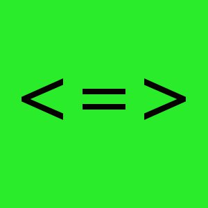

Pięć zasad użytecznej dokumentacji według User Experience Magazine. A może tylko
jedna?

<!--truncate-->

[Pisać jak najmniej, jak najprościej, jeszcze mniej, jeszcze prościej](http://uxmag.com/articles/five-principles-of-writing-for-users)...
nie pisać wcale? 😉

W idealnym świecie aplikacji nie trzeba dokumentować, bo ich interfejs jest
przejrzysty, intuicyjny i ergonomiczny.

W idealnym świecie guru UX każdy rozumie poniższy zapis tak samo jak powyższy:

I ten również:

Świat nie jest jednak idealny i dlatego wciąż jest dla nas wiele pracy😊. Ale o
tych pięciu zasadach warto pamiętać.
