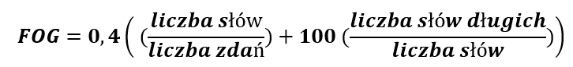

Wszyscy jesteśmy zajęci i często nie chcemy tracić czasu na zrozumienie
trudnych, rozwlekłych dokumentów. Analizy różnych tekstów potwierdziły, że
nietypowe słowa i długość zdań, były jedną z pierwszych przyczyn trudności w
czytaniu i rozumieniu tekstu. Wiemy, że w prostym języku (ang. plain language)
ważne są - budowa zdań i dobór słownictwa, o czym pisaliśmy już w naszych
poprzednich artykułach [tutaj](http://techwriter.pl/plain-language/) i
[tutaj](http://techwriter.pl/prosty-jezyk-w-tekstach-naukowych-i-technicznych/).
Pisanie prostym językiem może zatem oszczędzić nam czas i pieniądze. Pomoże nam
również zastosować przekazane informacje oraz ocalić drzewa 😊. Co jeszcze
możemy zyskać dzięki korzystaniu z dobrodziejstw prostego języka?

<!--truncate-->

### Jak pisanie prostym językiem ułatwia życie społeczeństwu

Gdy czytamy teksty urzędowe lub naukowe często tracimy sporo czasu na
znalezienie głównej informacji. Nie rozumiejąc tekstu, nie do końca potrafimy
zastosować informacje, które nam przekazano. W obecnych czasach, kiedy ogromne
ilości informacji zalewają nas każdego dnia, na pewno dobrze by było czytać
teksty, które będą bardziej przystępne.

Może lepiej czytać coś co jest napisane inaczej? Łatwiej? Jaśniej?

#### Trudno czy prosto?

Skupmy się na części praktycznej i przeanalizujmy kilka przykładów:

Przykład  1

| PRZED                                                                                                                                                         | PO                                                                                                                                                                                       |
| ------------------------------------------------------------------------------------------------------------------------------------------------------------- | ---------------------------------------------------------------------------------------------------------------------------------------------------------------------------------------- |
| Żadna osoba nie była upoważniona do udzielenia jakichkolwiek informacji ani składania oświadczeń innych niż zawarte lub włączone w tym wspólnym oświadczeniu. | Powinieneś polegać wyłącznie na informacjach zawartych w tym dokumencie lub na tych, do których cię skierowaliśmy. Nie upoważniliśmy nikogo do przekazania Ci informacji, które są inne. |

Przykład 2

| PRZED                                                                                                                                                                    | PO                                                                                                                                               |
| ------------------------------------------------------------------------------------------------------------------------------------------------------------------------ | ------------------------------------------------------------------------------------------------------------------------------------------------ |
| Pełnomocnicy zgłoszeni do udziału w Zgromadzeniu mogą zostać odwołani, z zastrzeżeniem procedur opisanych w niniejszym dokumencie, w każdym czasie do dnia Zgromadzenia. | Możesz odwołać swojego pełnomocnika i odebrać prawo do głosowania do dnia posiedzenia włącznie, postępując zgodnie ze wskazówkami na stronie 10. |

_Wnioski:_

Przy użyciu prostych codziennych słów, krótkich zdań oraz aktywnego głosu tekst
lepiej jest odbierany przez czytelnika.

Czy uważacie, że przepisany tekst odzwierciedla znaczenie oryginału? Czy
napisalibyście go inaczej?

Przykład 3

| PRZED                                                                                                                                                                                                                                                                           | PO  |
| ------------------------------------------------------------------------------------------------------------------------------------------------------------------------------------------------------------------------------------------------------------------------------- | --- |
| W przypadku wykonywania ostrych zakrętów lub gwałtownych manewrów pojazd może się przewrócić lub stracić kontrolę i zderzyć. Należy zapoznać się z wytycznymi i instrukcjami dotyczącymi prowadzenia pojazdu zawartymi w Instrukcji Obsługi, a także nosić pasy bezpieczeństwa. |     |

_Wnioski:_

Czasami obraz zastąpi nam tysiąc słów. Powyżej przykład, w jaki sposób prosta
koncepcja językowa, zastosowana wizualnie, może przekazać ważne informacje
dotyczące bezpieczeństwa skuteczniej niż słowa.

### Trochę matematyki i obliczeń

Przebrnęliśmy już przez część praktyczną. Skąd zatem wiemy, że Wasz tekst jest
przystępny?

Możemy sobie to sprawdzić, używając algorytmów. Więcej na temat algorytmów i ich
użycia możecie przeczytać
[tutaj](https://readabilityformulas.com/free-readability-formula-tests.php).

Żeby się nie rozpisywać, wymienimy dwa najczęściej używane algorytmy:

- **Indeks czytelności Flescha (FRES = Flesch Reading Ease Score)** - określa
  stopień trudności w rozumieniu danego tekstu w języku angielskim. Wartość
  indeksu jest wyliczana na podstawie liczby słów, sylab oraz zdań w tekście. Im
  niższe wartości FRES tym tekst jest trudniejszy do zrozumienia.

Nawiążemy trochę do matematyki i wzoru jak to można wyliczyć 😊.

Otrzymany rezultat można zinterpretować jak poniżej:

| Wynik  | Interpretacja                                            |
| ------ | -------------------------------------------------------- |
| 90-100 | tekst łatwy do zrozumienia dla jedenastoletniego ucznia  |
| 60-70  | tekst łatwy do zrozumienia dla uczniów w wieku 13-15 lat |
| 30-50  | tekst akademicki                                         |
| 0-30   | tekst naukowy, dla absolwentów uczelni wyższych          |

- **Indeks czytelności FOG** **(Gunning fog index)** – w języku polskim
  określany jako indeks mgły, określa czy ​​tekst może być łatwo odczytany przez
  docelowych odbiorców. Oryginalny indeks FOG został sformułowany dla
  języka angielskiego, ale istnieje też wariant dostosowany do specyfiki
  polszczyzny.

Jak to zrobić?

Wybierz fragment (najlepiej cały akapit) składający się z około 100 słów. Nie
pomijaj żadnych zdań. Aby wyliczyć indeks FOG, zastosuj wzór:

… i teraz możecie ocenić jak bardzo Wasz tekst jest przystępny:

| Wynik  | Interpretacja                                                                 |
| ------ | ----------------------------------------------------------------------------- |
| 1-6    | język bardzo prosty, zrozumiały dla uczniów szkoły podstawowej                |
| 7-9    | język prosty, zrozumiały dla uczniów gimnazjum                                |
| 10-12  | język dość prosty, zrozumiały dla uczniów liceum                              |
| 13-15  | język dość trudny, zrozumiały dla studentów studiów licencjackich             |
| 16-17  | język trudny, zrozumiały dla studentów studiów magisterskich                  |
| &lt;18 | język bardzo trudny, zrozumiały dla magistrów i osób z wyższym wykształceniem |

###   Narzędzia

Na szczęście nie musicie tego wszystkiego obliczać 😊. W sieci istnieje już
kilka dedykowanych dla języka polskiego narzędzi. Mogą pomóc w poprawieniu
czytelności i charakteru Waszych tekstów.

- [Zecerka](http://www.zecerka.pl/)
- [Jasnopis](https://jasnopis.pl/#)
- [LanguageTool](https://languagetool.org/)
- [Logios](https://logios.dev/)

### Krótko na koniec..

Kiedy w codziennym życiu nie ma czasu na czytanie  e-maili, to tym bardziej nie
starczy nam czasu na czytanie trudnych urzędowych tekstów.

Czy informacje napisane jasno i klarownie to dla Was właśnie prosty język? Czy
według Was teksty, które czytacie są przystępne, czy może zbyt trudne i
skomplikowane?

Zachęcamy do komentarzy i podzielenia się własną opinią!
