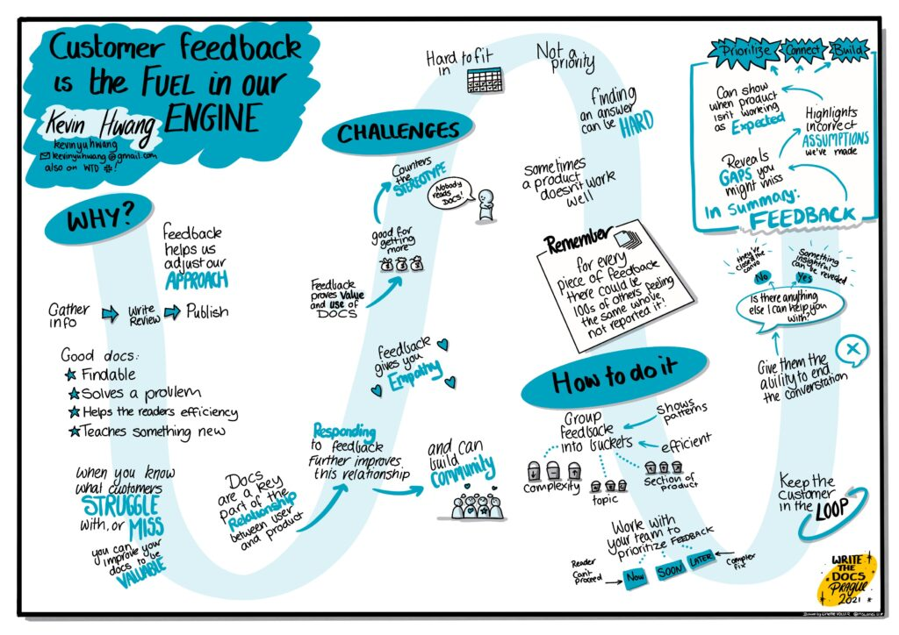
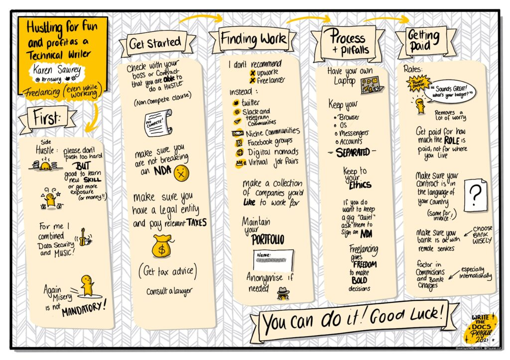
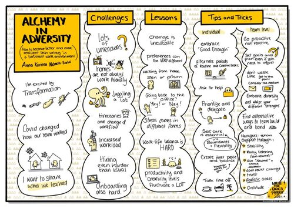
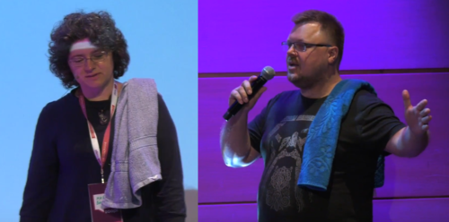
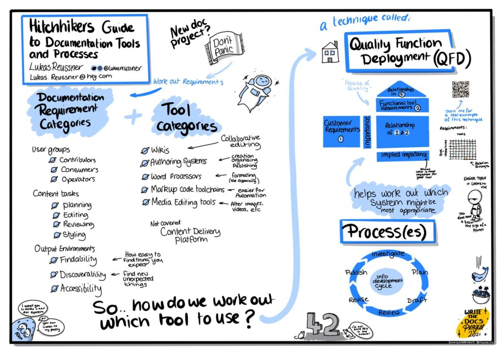
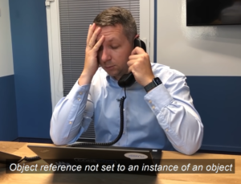
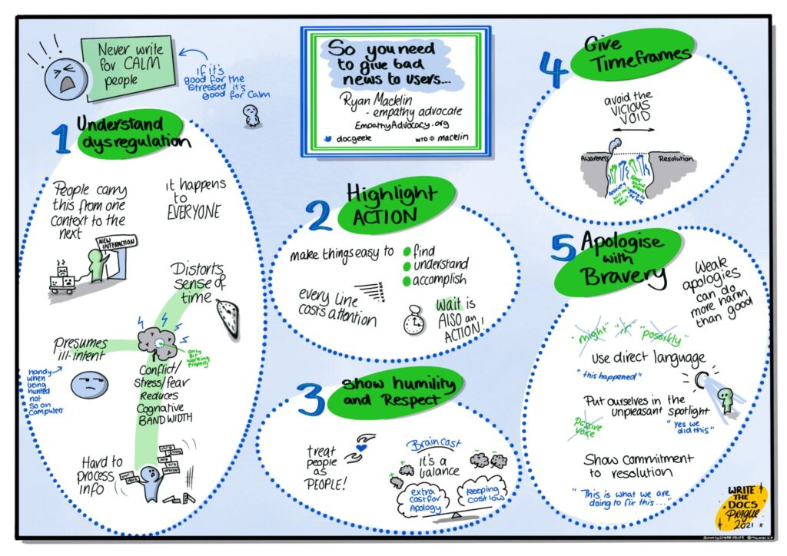
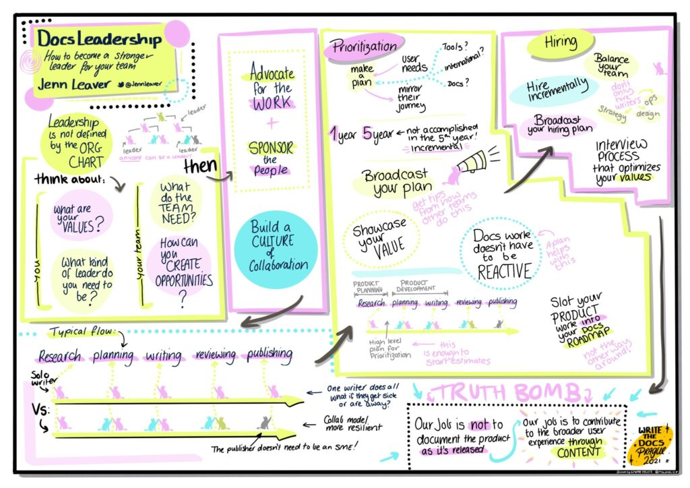
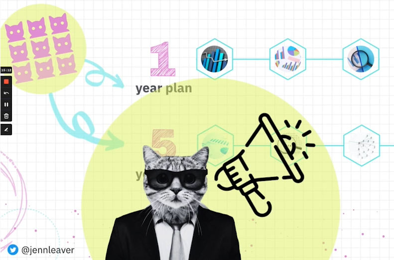

Na początku października odbyła się kolejna edycja dobrze już znanej konferencji
[Write the Docs Prague](https://www.writethedocs.org/conf/prague/2021/). Nie
mogło na niej zabraknąć przedstawicieli [techwriter.pl](http://techwriter.pl/).
Zapraszamy na relację!

<!--truncate-->

Pandemia zmieniła nasze funkcjonowanie, wpłynęła na sposób organizowania
wydarzeń społecznych, naszą pracę i życie. Przeniesienie spotkań do sieci było
dużym wyznawaniem, nie tylko pod względem organizacji, ale i próby odtworzenia
tego co wcześniej było już dobrze znane.

Po sukcesie zeszłorocznej edycji, organizatorzy Write the Docs Prague 2021
postanowili kontynuować konferencję w formie online. Jak było w tym roku? Czy
coś się zmieniło? Jakie były tematy? O tym, i nie tylko, przeczytacie w dalszej
części artykułu.

### Informacje ogólne

Podobnie jak
[Write the Docs Prague 2020](http://techwriter.pl/relacja-z-write-the-docs-prague-2020-online/),
wszystkie wydarzenia odbywały się na wirtualnej platformie
[Hopin](https://www.youtube.com/watch?v=aLtnc0ITzok). W konferencji wzięło
udział ponad 300 osób, 13 prelegentów, 8 osób wystąpiło podczas Lighting talks.
Zespół organizatora podczas całej konferencji czuwał i po każdym wystąpieniu
uczestniczył w sesjach Q&A, odpowiadał na pytania, pomagał w rozwiązywaniu
problemów, zwłaszcza osobom, które dołączyły do społeczności po raz pierwszy.

### Program

Pełną listę wystąpień i program znajdziecie
[tutaj](https://www.writethedocs.org/conf/prague/2021/schedule/#sunday-october-3).

Wydarzenie rozpoczęło się od
[Writing Day](https://www.writethedocs.org/conf/prague/2021/writing-day/),
podczas którego uczestnicy mogli zgłaszać projekty, nad którymi chcieliby
pracować. Jeden z tematów dotyczył open source'owego narzędzia Obsidian - bazy
wiedzy tworzonej na bazie plików z notatkami w formacie Markdown. Więcej
informacji o Obsidian znajdziesz
[tutaj](https://joshwin.imprint.to/post/how-i-use-obsidian-to-manage-my-goals-tasks-notes-and-software-development-knowledge-base)
i
[tutaj](https://medium.com/the-brave-writer/obsidian-is-the-practical-tool-you-need-to-transform-your-writing-process-bec20c01a430).

Kolejne dwa dni obfitowały w rozmowy między uczestnikami, liczne wykłady,
[Job Fairs](https://www.writethedocs.org/conf/prague/2021/job-fair/),
[Lightning Talks](https://www.writethedocs.org/conf/prague/2021/lightning-talks/)
i sesje
[Unconference](https://www.writethedocs.org/conf/prague/2021/unconference/).

### Najciekawsze przemówienia

Spośród 13 prezentacji wybraliśmy kilka, które najbardziej zapadły nam w pamięci
i którymi chcielibyśmy się z Wami podzielić 😊

No to zaczynamy!

#### Czy opinie klientów na temat dokumentacji mogą być przydatne?

Czy Wasza dokumentacja jest użyteczna? Co klient myśli o Waszym produkcie?
Dlaczego tak długo musicie czekać na odpowiedź, a może nie otrzymujecie jej
wcale?

[Kevin Hwang](https://twitter.com/kevinyuhwang) w swoim wykładzie
_[''Customer Feedback is the Fuel in our Engine''](https://www.youtube.com/watch?v=JbGTU15RlYk&list=PLZAeFn6dfHpnaoiOQyd9BYbQbprDGQjQ9&index=9)_,
opowiedział jak budować relacje z klientem, aby otrzymać od niego informację
zwrotną i na jej podstawie rozwijać swój produkt.

Autorką tego szkicu, jak i pozostałych użytych w tym
artykule, jest utalentowana
[Linette Voller.](https://www.linkedin.com/in/linettevoller/)

Praca technical writera nie polega tylko na gromadzeniu informacji,
przetwarzaniu ich i publikowaniu. Istotną częścią tego procesu powinna stać się
opinia klienta. Dlaczego?

Jeśli klient nie daje Wam odpowiedzi lub czekacie na nią bardzo długo, może to
oznaczać, że ma problem ze znalezieniem tego, co dla niego istotne.

Co daje Wam opinia klienta?

- Otrzymując odpowiedź zwrotną wiecie, że ktoś przeczytał Waszą dokumentację.
- Klient musi zaufać, że dostarczona dokumentacja jest użyteczna i ma wartość
  dodaną, czyli produkt bez dokumentacji nie nadaje się do użycia.
- Pozwoli stworzyć poczucie wspólnoty, być może inni użytkownicy, również
  doświadczają podobnych problemów, ale się nimi nie dzielą.
- Potwierdza wartość Waszych dokumentów i pozwala rozwijać produkt.

Jak interpretować odpowiedzi od klienta i nadawać im ważność?

Warto pogrupować informacje od klienta pod kątem złożoności zadań lub tematów,
których dotyczyły problemy / pytania, a następnie nadać im odpowiedni priorytet.
Ważne, aby pamiętać o kliencie i aktualizować dokumentację, informować klienta,
o tym co będzie zrobione a co nie, dać mu możliwość odpowiedzi. Taka postawa
pozwala na skuteczne rozwiązanie zadania i może także uczyć klienta jak używać
dany produkt.

Podsumowując

Sprawcie, aby pozyskiwanie opinii klientów stało się priorytetem w Waszej
organizacji. Kiedy otrzymacie wiadomość zwrotną, skontaktujcie się z klientem
oraz dajcie mu szansę na wypowiedzenie się!

#### Jak zostać Freelancerem?

Wystąpienie
[Karen Sawrey](https://twitter.com/krnswry?ref_src=twsrc%5Egoogle%7Ctwcamp%5Eserp%7Ctwgr%5Eauthor)
*[''Hustling for Fun and Profit as a Technical Writer: A Freelancing Starter Kit''](https://www.youtube.com/watch?v=doYpi9hEE7w&list=PLZAeFn6dfHpnaoiOQyd9BYbQbprDGQjQ9&index=11)* z
pewnością pomoże Wam odpowiedzieć na to pytanie!

Z czym wiąże się praca freelancera? Według Karen jest to: mniej snu, mniej
wolnego czasu, ale za to więcej doświadczenia, więcej pieniędzy, możliwość
uczenia się poprzez ciekawe projekty 😉 .

Oczywiście nie zapominajcie o higienie umysłu! Odpowiedni wypoczynek i przerwy
uchronią Was przed wypaleniem!Co należy zrobić
zaczynając jako freelancer?

- Upewnić się, że możecie prowadzić działalność gospodarczą.
- Zapoznać się z umową z poprzednim pracodawcą, czy przypadkiem nie ma w niej
  klauzuli mówiącej, że nie możecie wykonywać tej pracy przez kolejne 5 lat 😉 .
- Przestrzegać umowy o nieujawnianiu informacji (NDA).
- Zadbać o ubezpieczenie zdrowotne.
- Płacić podatki.
- Zatrudnić lub konsultować się z księgowym, bardzo przydatne zwłaszcza na
  początku.

Jak znaleźć pracę lub projekt?

- Stworzyć własne portfolio - ważne jest, żeby zaprezentować potencjalnemu
  zleceniodawcy swoje CV,  pokazać na czym się znacie i jakie macie
  umiejętności.
- Szukać zleceń w social mediach, na portalach dla freelancerów lub zbierając
  adresy firm, dla których chcecie pracować.

Na co uważać?

- Mądrze dobierać sobie pierwszych klientów, są tacy, których należy się
  wystrzegać! Z pewnością będziecie wiedzieć których 😉 .
- Nie używać osobistego sprzętu do pracy. Dlaczego? Niektóre umowy z klientami
  mogą zawierać zapisy o nieujawnianiu informacji, zapisy o przechowywaniu
  danych na określonych nośnikach lub zapisy dotyczące korzystania z produktów i
  licencji. Aby uchronić się przed potencjalnymi nieprzyjemnościami, lepiej
  zaopatrzyć się w oddzielny komputer 😉
- Rozdzielać wiadomości, konta, przeglądarki, żeby łatwiej monitorować przepływ
  informacji

...i co najważniejsze, płaca! Pamiętajcie, aby cenić swoje umiejętności i czas,
warto dowiedzieć się jaki budżet ma firma na dany projekt. Freelancing to Wasza
wolność podejmowania odważnych decyzji!

#### **Lingwistyka stosowana w pracy technical writera**

Czy zastanawialiście się jak rozumiana jest Wasza komunikacja? Czy Wasi rozmówcy
mówią po angielsku, czy w swoim własnym języku, używając angielskich słów? Jeśli
chcecie wiedzieć coś więcej na ten temat, przesłuchajcie wypowiedzi _[Kat Stoica
Ostenfeld](https://twitter.com/katstodian_?lang=en)_. W swoim przemówieniu
_[''How I use applied linguistics to be a better technical writer''](https://www.youtube.com/watch?v=5e1h3cMEg8Q&list=PLZAeFn6dfHpnaoiOQyd9BYbQbprDGQjQ9&index=12)\_
Kat zwróciła uwagę na ważny aspekt komunikacji pracując w środowisku
międzynarodowym. Wyjaśniła również co to jest
[lingwistyka stosowana](https://pl.wikipedia.org/wiki/Lingwistyka_stosowana)
oraz przedstawiła praktyczne przykłady jak się lepiej komunikować i rozumieć.

Kilka wskazówek jak radzić sobie z rozwiązywaniem problemów językowych:

- Zastanowić się czy mówicie w języku angielskim czy też w języku ojczystym
  używając angielskich słów 😉 .
- W różnych językach ten sam wyraz może mieć różne znaczenie, warto wiedzieć
  jakich słów używać.
- Przynależność do tej samej grupy (autorów, programistów) może wpływać na
  lepsze zrozumienie kontekstu.
- Wspólne konteksty są ważniejsze niż biegłość w danym języku.
- Jeśli jest problem ze zrozumieniem kontekstu, nie skupiać się na rozumieniu
  poszczególnych słów czy gramatyce,  taka ocena może wywołać negatywną reakcję
  mówcy i może on poczuć się niekomfortowo.
- Różne specjalizacje / zawody mają różny zasób słownictwa, specyficzny dla
  danej grupy, rozumienie tego samego wyrazu w różnych grupach zawodowych może
  być inne 😉.
- Zadawać proste pytania: who (kto?), what (co?), why (dlaczego?), where
  (gdzie?), how (jak?).

Pamiętajcie! Kontekst jest kluczem w komunikacji! Bądźcie dla siebie
wyrozumiali!

#### Jak radzić sobie z pracą w postcovidowej rzeczywistości?

Praca zdalna w czasie pandemii stała się koniecznością w wielu firmach.
Przeniesienie pracy z biura do domu nastąpiło dość szybko i nieoczekiwanie. Dla
jednych było to błogosławieństwem, inni nie najlepiej poradzili sobie z jej
niektórymi aspektami.

[Anna Korinna Németh Szabó](https://www.linkedin.com/in/anna-korinna-n%C3%A9meth-szab%C3%B3-084195a7/?originalSubdomain=hu)
w swojej prelekcji
[_''Alchemy in Adversity''_](https://www.youtube.com/watch?v=RwzrF1g2vf4&list=PLZAeFn6dfHpnaoiOQyd9BYbQbprDGQjQ9&index=8)
postanowiła podzielić się swoimi cennymi wskazówkami, z których dowiecie się co
można zrobić dla siebie i zespołu, aby praca nas nie przytłoczyła oraz jak
radzić sobie z trudnościami w niestabilnych okolicznościach
lockdownu.

Czego dotyczy problem?

- Brak odpowiedniego miejsca do pracy.
- Hałaśliwi sąsiedzi, dzieci, które nie mogły pójść do przedszkola czy szkoły,
  uciążliwy hałas z ulicy.
- Brak rozgraniczenia czasu wolnego od pracy, który prowadzi do przeciążenia.
- Izolacja społeczna i brak zrozumienia.
- Stres związany z brakiem stabilności.

To tylko niektóre z trudności związane z pracą z domu, które nas dotknęły. Nikt
się tego nie spodziewał dlatego warto pamiętać, że zmiany będą się pojawiały i
nie bardzo mamy na to wpływ.

Co można zrobić żeby radzić sobie z nimi lepiej i efektywnie funkcjonować? Jak
pracować i nie zwariować?

- Budować przekonanie, że jest się wystarczająco dobrym - nie musi to oznaczać,
  że trzeba być bardziej produktywnym lub siedzieć po godzinach, ale dbać o
  odpoczynek i odpowiednie przerwy między zadaniami.
- Utrzymać balans między zadaniami rutynowymi i kreatywnymi.
- Pytać o pomoc, jeśli potrzebujemy.
- Ustalać priorytety i delegować zadania.
- Ustalić równowagę między pracą a życiem prywatnym - wewnętrzny spokój i
  dyscyplina wewnętrzna pozwoli Wam być bardziej wydajnym.
- Być proaktywnym, reagować jeśli mamy problem lub ktoś działa na naszą
  niekorzyść.
- Tworzyć zdrowe środowisko pracy, np. poprzez pomoc, nowym kolegom /
  koleżankom, którzy dołączyli do Waszego zespołu.
- Starać się utrzymywać stabilność.

#### Jak podróżować przez galaktykę narzędzi i procesów dokumentacyjnych?

Podczas swojego wystąpienia
_[''](https://www.youtube.com/watch?v=RwzrF1g2vf4&list=PLZAeFn6dfHpnaoiOQyd9BYbQbprDGQjQ9&index=8)[Hitchhiker's Guide to Documentation Tools and Processes"](https://youtu.be/p8-ZLqYtD5o)_
[Lukas Reußner](https://www.linkedin.com/in/lukasreussner/) zabrał nas na
przejażdżkę autostopem przez galaktykę dostępnych rozwiązań i procesów
dokumentacyjnych.  Dla niewtajemniczonych dodam, że prelegent zawarł wiele
odniesień do kultowej książki science fiction Douglasa Adamsa
[_''Autostopem przez Galaktykę''_](https://pl.wikipedia.org/wiki/Autostopem_przez_Galaktyk%C4%99),
która cieszy się dużą popularnością wśród pisarzy technicznych, nerdów, geeków i
programistów 😉 . Sam tytuł z niezłym skutkiem został przełożony na język filmu
komediowego:

[`Douglas Adams`](https://pl.wikipedia.org/wiki/Douglas_Adams)
`był satyrykiem, pisarzem, entuzjastą nowych technologii i wielkim fanem marki Apple Macintosh,`
`scenarzystą, autorem jednego skeczu dla "Latającego Cyrku Monty Pythona", prowadził kampanie na rzecz ochrony`
`zagrożonych gatunków.`

Odniesienie to kojarzy mi się też ze świetną prezentacją Marty Bartnickiej i
Wojciecha Froelicha z konferencji SOAP
_[''Dear Mr. Robot''](https://youtu.be/Q_if0yBogUQ)_ gdzie rekwizytem były
ręczniki, które są przecież niezbędne do międzygalaktycznych podróży stopem.
Osoby zaintrygowane zapraszamy do zapoznania się z twórczością Douglasa Adamsa,
jak i samą prezentacją o tłumaczeniu maszynowym.

Wracając do materiału opracowanego przez Lukasa, zastosowana analogia pasowała
jak ulał. To kompletny przewodnik, który w niemal naukowy sposób analizuje
różnorodne wymagania stawiane dokumentacji i prezentuje dostępne możliwe
podejścia do tworzenia treści. Wytłumaczone jest to tak przejrzyście, że nawet
przybysz z obcej planety by zrozumiał 😉 .

Uważamy, że ten materiał jest pomocny dla osób nowych w branży, gdyż dowiedzą
się z niego sporo o dostępnych kategoriach narzędzi do tworzenia dokumentacji. Z
kolei osoby doświadczone, które stoją przed wyzwaniem wyboru nowego narzędzia do
tworzenia treści, dostaną przegląd wymagań stawianych dokumentacji i możliwych
rozwiązań funkcjonujących na rynku. Jakby tego było mało, Lukas udostępnia
również swój arkusz Excel z formułami, w którym wystarczy wypełnić odpowiednie
pola, by uzyskać wskazanie kategorii narzędzi, które najlepiej spełnią wymagania
projektu. Automagicznie!

Całość stanowi bardzo wartościowy wkład do dziedziny komunikacji technicznej i z
pewnością ułatwi życie członkom naszej społeczności.

#### Jak mózg reaguje na komunikaty o błędach aplikacji i jak wykorzystać tę wiedzę

[Ryan Macklin](https://www.linkedin.com/in/ryanmacklin/) podzielił się zebraną
wiedzą z dziedziny neurobiologii podczas:
_[''So you need to give bad news to users…''](https://youtu.be/iuaLHLyLTpY)_.
Często spotykamy się z niezrozumiałymi komunikatami błędów, które swoją formą
potrafią jeszcze wyżej podnieść nam ciśnienie, gdy podczas kluczowej operacji
naszym oczom ukazuje się wiadomość taka, jak ta w tym
[znakomitym skeczu HRejterów](https://youtu.be/4V2C0X4qqLY?t=105):

Ryan odkrywa przed nami kilka kluczowych faktów na temat tego, jak działamy pod
wpływem stresu i jak ta wiedza umożliwia nam pisanie komunikatów z większą dozą
empatii. Biorąc pod uwagę szczególne stany emocjonalne odbiorców, można stworzyć
tekst, który zamiast irytować będzie po prostu efektywnie przekazywać kluczową
informację.

Nawet jeśli nie zajmujecie się _User Experience_ i nie tworzycie takich
komunikatów błędów, warto zastanowić się czy Wasza dokumentacja jest klarowna na
tyle, by nawet wzburzony użytkownik był w stanie skorzystać z niej z minimalnym
nakładem skupienia.

Podsumowując, z wystąpienia możemy nauczyć się czegoś o ludzkiej naturze, o
interakcji między użytkownikami a czytanymi komunikatami - o tym jak te teksty
potrafią na nas wpływać. Warto również śledzić inicjatywy Ryana, który postawił
sobie za cel popularyzację wiedzy na temat roli empatii w tworzeniu instrukcji,
opisów produktów i tekstów obecnych w interfejsie użytkownika.

Wisienką na torcie jest wprowadzenie koncepcji _"mózgowych dolarów"_. Nie
zdradzę tu szczegółów! Jeśli nie słuchaliście nagrania z tej prelekcji to
zróbcie to teraz i przekonajcie się sami o czym mowa.

#### Ergonomia poznawcza w dokumentacji

[Anita Diamond](https://www.linkedin.com/in/anita-diamond-16870557/) posiada
bardzo bogatą wiedzę z wielu dziedzin, m. in. studiowała antropologię. W swoim
wystąpieniu
_[''Cognitive Ergonomics in Technical Writing - Lessons from the Field''](https://youtu.be/lSzV1r5PbLA)_
kojącym głosem opowiada o spostrzeżeniach dotyczących opracowywania terminologii
w nowo powstających dziedzinach takich jak
[kryptowaluty](https://pl.wikipedia.org/wiki/Kryptowaluta) i
[blockchain](https://pl.wikipedia.org/wiki/Blockchain). Anita dzieli się swoimi
wskazówkami na temat tego, jak dobierać terminologię i jak sprawić, żeby nowe
określenia zamieszkały w świadomości odbiorców.

Również i z tej prezentacji dowiemy się czegoś o pracy mózgu - w tym wypadku
wspomniane są dwa systemy: szybkiego i wolnego myślenia. Kolejny raz
przekonujemy się, że zrozumienie jednego aspektu działania naszych umysłów może
się przełożyć na jeszcze efektywniejszą dokumentację. Przed następnym Write The
Docs obiecujemy sobie przeczytać jakąś książkę o neurobiologii 😉 .

Na koniec swojej opowieści, Anita daje wiele cennych rad o tym, jak krzewić
zdrową kulturę dokumentacyjną poprzez edukowanie innych pracowników na temat
tego, jak wygląda proces dokumentacji albo jak rozwiązać problem niejasnych
wymagań, na bazie których tworzone są materiały.

Podsumowując, to dobrze przemyślana prezentacja, dzięki której możemy poszerzyć
spojrzenie na dokumentację.

#### Jak stać się lepszym liderem dla Twojego zespołu

[Jenn Leaver](https://www.linkedin.com/in/jennleaver/) w swoim wystąpieniu
_[''Docs leadership: How to become a stronger leader for your team''](https://youtu.be/3ceQ9xbRn3s)_
opowiada o byciu liderką dla zespołu dokumentacji. Nawet jeśli nie macie w
nazwie stanowiska _"manager"_ czy _"team leader"_ to wciąż możecie mieć duży
wpływ na cały zespół i procedury dokumentacji. Jenn przybliża proces rozwijania
zespołu: od garstki pisarzy technicznych po rozbudowaną grupę ze szczególnymi
specjalnościami. Dowiecie się, jak tworzone są plany w perspektywie kilku lat,
by stopniowo rozbudowywać zespół i wyposażyć go w odpowiednio dojrzały
proces.Dodatkowym atutem tej prezentacji
jest zastosowanie się autorki do nadrzędnej zasady: by osiągnąć sukces, należy
wpleść dostatecznie dużo zdjęć kotów 😉 I piszemy to bez szyderstwa, bo warstwa
wizualna tych slajdów ma bardzo staranie opracowany styl graficzny. Uczta dla
ucha i oka.

### Lightning talks

Z pośród  wszystkich  przemówień Lightning Talks, w imieniu redakcji,
chcielibyśmy zaprosić Was do obejrzenia ''_The best tech writing you've never
seen''_ prezentowanego przez Abi Sutherland. W swojej inspirującej 7-minutowej
przemowie opowiada o  instrukcji _''How to keep your Volswagen alive, manual for
the compleat idiot''_, napisana przez Jona Muir. Być może znajdziecie tam trochę
wskazówek jak można tworzyć podręcznik, a jednocześnie dobrze się przy tym bawić
😉 .

https://www.youtube.com/watch?v=Xasef7oR25Y&list=PLZAeFn6dfHpnaoiOQyd9BYbQbprDGQjQ9&index=15

Drugą pozycją, która zapadła nam w pamięci jest: ''*New, first, & only"* 
autorstwa Coley Woyak. Opowiada ona o swoich trudnych początkach w nowej
tematyce: [Kubernetes](https://pl.wikipedia.org/wiki/Kubernetes) dokumentowanej
przy użyciu nieznanego jej wcześniej podejścia ''_Doc as code"._ W swojej
krzepiącej relacji Coley opowiada o uczuciu niepewności i przytłoczenia nowymi
obowiązkami, które dzięki wytrwałości i sprytowi udało się przekuć w nowe
doświadczenia i pewność siebie.

https://www.youtube.com/watch?v=W-DlX8IuKMA

Film ten jest inspirujący dla osób znajdujących się obecnie na progu czegoś
nowego i (jeszcze) niekomfortowego.

### Job Fairs

Konferencja nie tylko daje możliwość nawiązania nowych znajomości, ale też
stwarza okazję do spotkań osób szukających pracy z firmami poszukującymi
pracowników. W tym roku na job fairs pojawili się:

- [MDN web dosc](https://developer.mozilla.org/en-US/)
- [aiven](https://aiven.io/?gclid=CjwKCAjw2bmLBhBREiwAZ6ugo6F7BCe4ZlaaSMj3D4LFh4YB423hhBdzdXBMqLkfqFvX-UlsxFjXmhoCtjEQAvD_BwE)
- [JetBrains](https://www.jetbrains.com/)

Można było z nimi porozmawiać na czacie lub umówić się na spotkanie 1:1.

### Na koniec

Ze swojej strony, mamy nadzieję, że trochę Was zainteresowaliśmy, i być może
dołączycie na wydarzenie w przyszłym roku, jeśli jeszcze nie mieliście okazji 😊
.

Nam osobiście z przyjemnością słuchało się większości wystąpień. Jak co roku,
jedne z nich były mniej, a inne bardziej ciekawe 😉 . Jest to jednak nasza
subiektywna opinia. Jeśli chcecie się podzielić Waszą, zapraszamy do komentarzy!

Pozdrawiamy: Martyna & Andrzej
