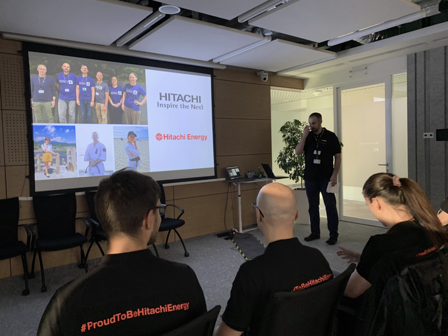
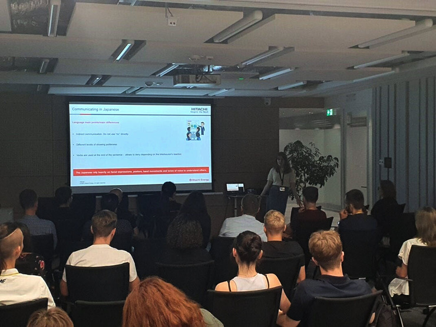
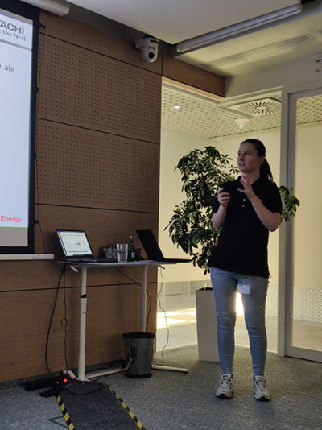
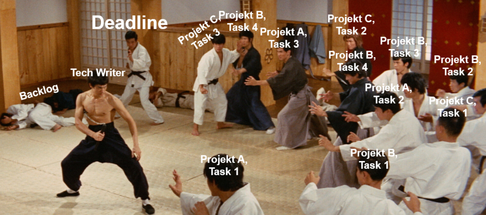
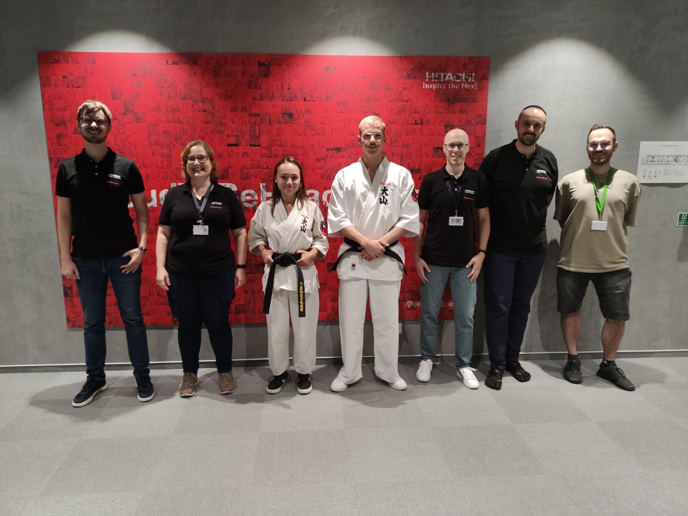
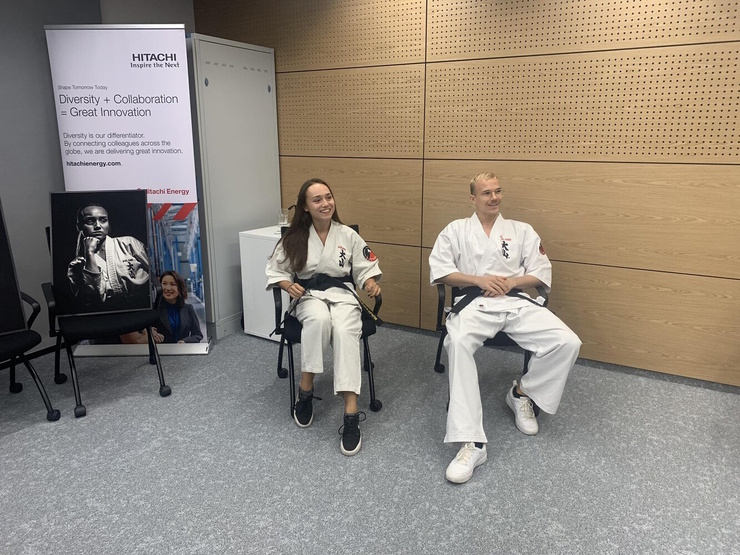
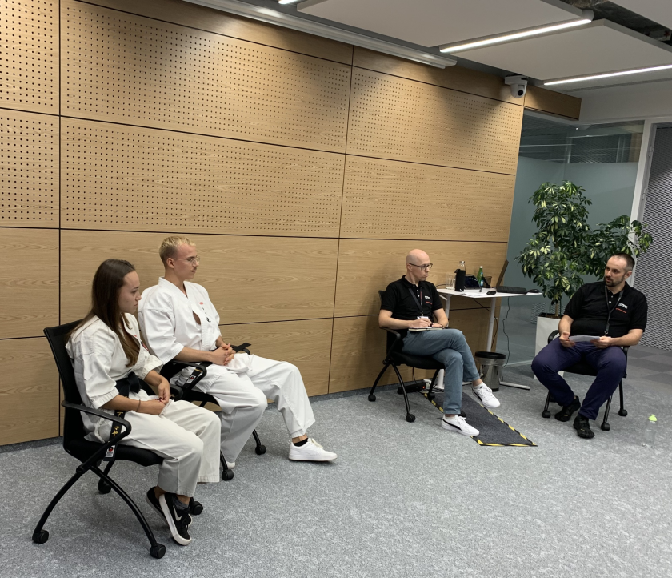

Jako ekipa techwriterów i techwriterek z [Hitachi Energy](https://www.linkedin.com/company/hitachienergy/mycompany/) w składzie: Julia Dąbrowska, Mateusz Barszcz, Piotr Sroka, Monika Dąbrowska, Andrzej Niewiarowski oraz członkini honorowa - Patrycja Pyrek - przeprowadziliśmy wyjątkowy meetup, którego spoiwem była kultura Japonii. 

<!--truncate-->

## Fusion Meetup o Technical Writingu i Karate
### Informacje o spotkaniu

12.09.2023 w siedzibie Hitachi Energy w Krakowie odbył się meetup dla pracowników firmy i gości spoza niej. Na spotkaniu stawiło się 40 osób. Piotr wziął na siebie dużą część obowiązków organizacyjnych, w czym ma już dużą wprawę, bo ma już na koncie przeprowadzenie writerskiego meetupu w 2019. Dla naszego zespołu ten fusion meetup to już drugie wspólne wydarzenie, bo w obecnym roku Anno Domini 2023 zorganizowaliśmy spotkanie z [Lance Cummings](https://www.linkedin.com/in/lance-cummings-phd/), który w krakowskiej siedzibie firmy opowiadał o tym, jak wykorzystywać *prompt engingeering* w arsenale pisarza technicznego.

### Dlaczego Japonia?

* Pracując w japońskiej firmie, jaką jest Hitachi Energy, mamy okazję obcować z kulturą japońską. 
* Wiele osób w zespole trenowało wschodnie sztuki walk i lubi oglądać filmy prezentujące mistrzów sztuk walk. 
* Japońska filozofia kaizen stanowi filar dla praktyk takich jak Lean Management, które stosowane są w Hitachi Energy. 
* W codziennej pracy technical writerów staramy się stale ulepszać metody pracy, co jest zgodne z japońską zasadą dążenia do doskonałości.
Niecodzienna fuzja tematów tego meetupu przypadła naszym gościom do gustu.

[Patrycja Pyrek](https://www.linkedin.com/in/patrycja-pyrek/), jako znawczyni tematu, wprowadziła nas we frapujące meandry kultury japońskiej, którą poznała z pierwszej ręki, kilkakrotnie odwiedzając Kraj Kwitnącej Wiśni i zgłębiając miejscowe zwyczaje. Słuchacze dowiedzieli się między innymi o tym, dlaczego nie należy wbijać pałeczek w ryż podczas posiłku oraz jak rozumieć szyld z godzinami otwarcia japońskiego sklepu od "23:00 - 25:00" :-)

Arigatō, Patrycja!

### Tech writer mistrzem wywierania wpływu

W trakcie Meetupu [Monika Dąbrowska](https://www.linkedin.com/in/monika-klimek1/) opowiedziała o tym, co profesor Cialdini - specjalista na skalę światową w dziedzinie wywierania wpływu - może doradzić pisarzom technicznym, którzy mają problem z uzyskaniem uwag ekspertów domenowych co do opracowanego dokumentu. W codziennych bojach, często zwracamy uwagę na narzędzia, problemy techniczne i organizację pracy, a nie należy zapominać również o budowaniu zdrowych relacji ze współpracownikami. Monika przedstawiła nam perspektywę na mechanizmy rządzące budowaniem relacji między ludźmi. Otrzymaliśmy kilka praktycznych wskazówek, które mogą pomóc podczas codziennej pracy dokumentalisty. 
Warto tu zaznaczyć, że choć tematyka prac Cialdiniego niektórym może przywodzić na myśl techniki makiawelicznej manipulacji, to znajomość uniwersalnych zasad, którymi rządzi się ludzka natura, pomaga nam lepiej rozumieć samych siebie i tę drugą osobę odgrywającą rolę *Subject Matter Expert*. Można spokojnie korzystać z tej wiedzy, mając krystalicznie czyste intencje i bez robienia kogokolwiek w bambuko :) 

### Wszystko ma swoje priorytety

Mimo opornego projektora, który przestał działać jak tylko do niego poszedłem (mam tę moc, mam tę moc!), udało mi się wyświetlić slajdy i opowiedzieć o zarządzaniu priorytetami projektów dokumentacyjnych. Podczas mojej blisko rocznej przygody w firmie Hitachi Energy miałem okazję przećwiczyć dostosowywanie priorytetów w dynamicznym środowisku, w którym tech writer ma więcej niż jeden projekt pod swoją pieczą. Cieszę się, że mogłem podzielić się obserwacjami, które mogą być pomocne również w kontekstach pozadokumentacyjnych, a także zaprezentowałem parę czerstwych memów własnego autorstwa.

Uczestnicy i uczestniczki zdarzenia okazywali zainteresowanie, zadali nawet pytania, a po zapaleniu świateł wszyscy byli obudzeni ;-) Dla mnie to definicja sukcesu.

### Wejście Smoków

Wisienką na torcie była rozmowa z sensei Mają Wójcik i sensei Jakubem Piaseckim, którzy opowiadali:
* o dążeniu do mistrzostwa w dziedzinie karate Oyama
* o pozytywnych wartościach sportowych jakie niesie ze sobą karate
* o tym jak znajdować w sobie wewnętrzną siłę, by systematycznie rozwijać swoje umiejętności
* o tym, jak przekonać siebie samego do pójścia na pierwszy trening

Mieliśmy przyjemność posłuchać opowieści młodych, ambitnych trenerów, a ich rozważania na temat samodoskonalenia i sposobów radzenia sobie z trudnościami mają również zastosowanie w kontekście technical writingu. Ważnym przesłaniem tamtego wieczora było to, że uprawianie sportu jest dobrą metodą na zagwarantowanie sobie właściwego stanu mentalnego. Aktywność fizyczna jest świetnym remedium na pracę umysłową w świecie IT: pozwala na zachowanie wewnętrznej równowagi i wydobycie pełni swojego potencjału.

Jakub wspomniał również o swojej drugiej pasji życiowej, którą jest fotografia. Karate było motywem przewodnim jego pracy dyplomowej, a przykłady jego prac mogliśmy podziwiać w trakcie spotkania.

Podziękowania dla [Piotra Sroki](https://www.linkedin.com/in/piotrsrokatechwriter/) i [Mateusza Barszcza](https://www.linkedin.com/in/mattbarszcz/), którzy przygotowali pytania i wcielili się role moderatorów spotkania.

### Po prezentacjach

Po długim i pełnym wrażeń wieczorze, gospodarze i goście mogli poczęstować się przekąskami, powymieniać się uwagami i poznać nowych ludzi. Każdy mógł zabrać do domu wybrany gadżet z logo Hitachi Energy. W tym miejscu podziękowania dla [Sandry Cieniawskiej](https://www.linkedin.com/in/sandracieniawska/) i [Klaudii Sucharzewskiej](https://www.linkedin.com/in/klaudia-sucharzewska-048ba721a/), która pomogły w zorganizowaniu kateringu i gadżetów.

Słyszałem, że uczestnicy chwalili sobie to wydarzenie i odbiło się ono w firmie pewnym echem :)

Jestem po dużym wrażeniem zespołu, który wybrał tak nieoczywisty pomysł i kreatywnie rozwinął go, dzięki czemu mogliśmy podzielić się doświadczeniami i poznać naprawdę zacną widownię.

Dziękujemy wszystkim serdecznie za przybycie i obiecujemy, że nie osiądziemy na laurach. 