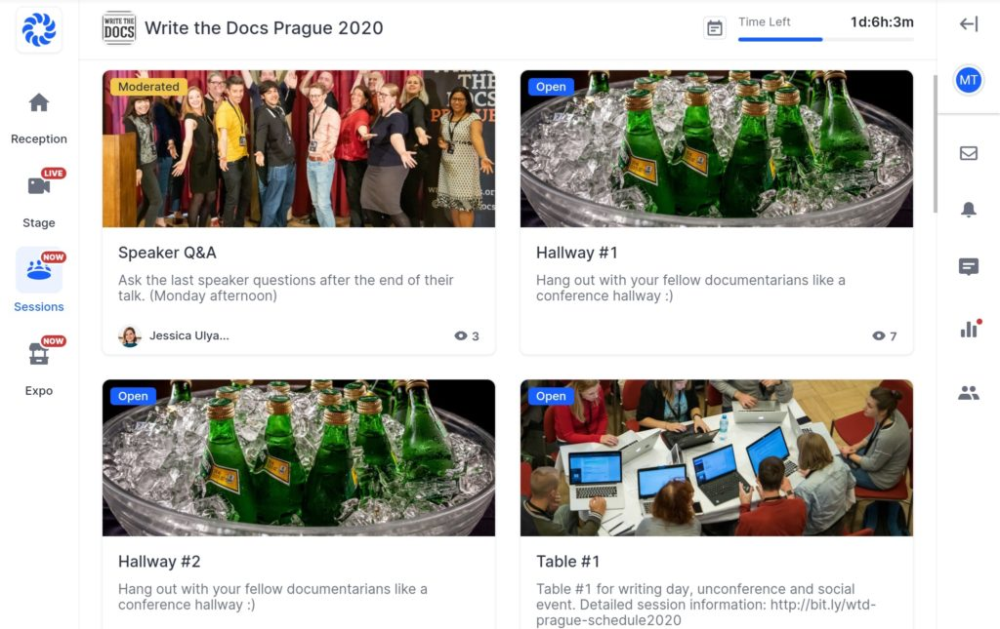
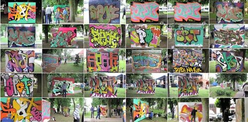
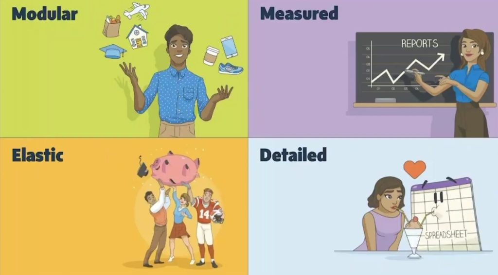

Stało się! 18-20 października odbyła się konferencja
[Write the Docs Prague](https://www.writethedocs.org/conf/prague/2020/).
Zapraszamy na naszą relację z tego wydarzenia!

<!--truncate-->

Ze względu na sytuację z korona wirusem, konferencja odbyła się całkowicie
online. Nowy charakter Write the Docs nie powstrzymał uczestników od spotkań
oraz aktywnego angażowania się w dyskusje oraz wystąpienia na wirtualnej scenie
i poza nią.

### O wirtualnej konferencji

W konferencji wzięło udział ponad 300 osób z całego świata. Dla niektórych
uczestników wiązało się to z niewielkim utrudnieniem - nocnym wstawaniem. Na
wirtualnej scenie wystąpiło 16 mówców oraz śmiałkowie, którzy postanowili
podzielić się swoją wiedzą i pomysłami w czasie Lighting Talks.

Spotkania odbywały się na [Hopin](https://hopin.to/). Dzięki wirtualnej
platformie można było w łatwy sposób oglądać wystąpienia prelegentów,
uczestniczyć w sesjach writing days i zadawać pytania. W międzyczasie uczestnicy
mogli się bliżej poznać i podzielić swoimi spostrzeżeniami oraz wiedzą z zacisza
swojego domu 😊.

### 

Organizatorzy zadbali o wszystkie aspekty konferencji. Na początek przygotowali
[Intro](https://youtu.be/aLtnc0ITzok) jak poruszać się po platformie. Uczestnicy
natomiast mogli wygodnie usiąść w swoich fotelach z kubkiem kawy lub herbaty i
skupić się na wydarzeniu.

### Atmosfera

Zaletą niewirtualnych konferencji są oczywiście bezpośrednie kontakty z
uczestnikami, możliwość dołączenia do spontanicznej dyskusji przy kawie, udział
w żywiołowych, panelowych dyskusjach. Będąc na widowni w trakcie wygłaszania
szczególnej prezentacji, udziela się entuzjazm pozostałych odbiorców. Podczas
tegorocznej edycji, z wiadomych względów, nie można było w ten sposób przeżywać
tego dokumentacyjnego święta. Organizatorzy dołożyli jednak wszelkich starań, by
w ramach zdalnej konferencji jak najwierniej odzwierciedlić klimat tego
wydarzenia. Oprócz słuchania prezentacji, można było również przyłączyć się do
dyskusji w ramach Unconference. Każdy uczestnik mógł zaproponować własny temat.
Wystarczyło dołączyć do wskazanego stolika o odpowiedniej porze, by posłuchać
innych tech writerów i również zabrać głos.

Spotkania w korytarzu Hallway były zupełnie swobodną formą. Wystarczyło zerknąć
na liczbę uczestników obecnych w jednym z dwóch "korytarzy" i można było
spróbować nawiązać kontakt. Czasami potrzebny był odważny wodzirej, który
włączał kamerę i proponował temat. Po kilku próbach zarzucenia wędki udawało się
trafić temat, który zainteresował większą liczbę osób - na przełamanie lodów
rozmowa często schodziła na koty ☺️. Korytarzowe pogawędki trwały do późnych
godzin wieczornych. Po pewnym czasie można było odpłynąć w rozmowie i zapomnieć,
że nie znajdujemy się w tym samym pokoju. Udział w tych spotkaniach dało się
łatwo pogodzić z potrzebami życia codziennego, dzięki czemu zyskaliśmy dużą
elastyczność. Po przestawieniu się w nowy tryb, można było wejść w wiele
interesujących interakcji, posłuchać o narzędziach, rozwiązaniach i dobrze się
przy tym pośmiać.

### Wystąpienia

Jak co roku, konferencję rozpoczęła
[Mikey Ariel](https://www.linkedin.com/in/thatdocslady/?originalSubdomain=cz),
która z entuzjazmem wprowadziła uczestników do tego nietypowego wydarzania.

Na tegorocznej konferencji było wiele ciekawych tematów. Każda prelekcja wniosła
coś nowego i wypełniła luki w mojej wiedzy, a także pozostawiła przestrzeń na
działanie.

W głowie najbardziej zapadło mi kilka wystąpień, którymi chciałabym (w imieniu
redakcji) się z Wami podzielić. Wszystkie wystąpienia znajdziecie
[(tutaj)](https://www.youtube.com/watch?v=Vf5f2wBdFXo&list=PLZAeFn6dfHpmRWZJaUwQzsdagW2TtRI2x).

### Czy osoba tworząca graffiti ma coś wspólnego z technical writerem?

[Kruno Golubić](https://onthegosystems.com/team/kruno-golubic/)  w swoim 
wystąpieniu *["From Graffiti Writer to Technical Writer"](https://youtu.be/HnK_DmUMo-M)*
opowiedział o tym jak został technical writerem. Wskazał podobieństwa i różnice
między graffiti writerem a technical writerem.  Na pewno mają wspólny cel,
którym jest produkt końcowy. Czasem drogi wcielenia projektu w życie mogą być
rożne, dlatego ważne jest aby umieć korzystać z dostępnych zasobów i
współpracować z innymi, aby móc wykonać zadnie 😊.

To dobra inspiracja zwłaszcza dla osób chcących rozpocząć swoja przygodę z
tworzeniem dokumentacji. Może w Was również drzemią nieodkryte talenty lub
posiadacie wiedzę, którą możecie podzielić się z innymi?

### Dlaczego analiza danych i komentarze od klienta są potrzebne?

Bardzo ciekawe wystąpienie
[Karissy Van Baulen](https://www.linkedin.com/in/karissavb/) -["The Importance of Using Analytics and Feedback for your Documentation"](https://youtu.be/EkPU2afWPDA)*.* Karissa
opowiedziała na jakie dane liczbowe należy zwrócić uwagę, aby dowiedzieć się czy
Wasza dokumentacja jest użyteczna. Poprzez użycie prostych narzędzi można
sprawdzić czy dokument jest czytelny albo gdzie poruszanie się po nim sprawia
trudność użytkownikowi. Użycie danych statystycznych i uzyskanie odpowiedzi od
klienta czy też użytkownika, pomoże w ulepszeniu dokumentacji, zaoszczędzi czas
i pieniądze.

Ma to sens? Może warto się nad tym zastanowić 🤔?

### Czy to co piszemy w dokumentacji jest zrozumiałe?

[Paul Brown](https://www.linkedin.com/in/paul-brown-120bb41) z swojej prelekcji
["_Baseline or Technical Writing for Not-Technical Readers"_](https://youtu.be/GVFsjcS6f3I)
mówił o znaczeniu baseline – ”linii odniesienia”. Kiedy zaczynacie pracę nad
dokumentacją, czy zastanawiacie się od czego zacząć i jak to o czym piszecie,
jest rozumiane lub nie przez Waszych odbiorców?

Należy pamiętać, że nie zawsze wiadomo kto jest odbiorcą dokumentacji. Może
okazać się, że ta osoba nie dysponuje takim poziomem wiedzy jak Wy. I tutaj
kilka podstawowych zasad, którymi warto się kierować:

- Wytłumacz specjalistyczne albo bardzo techniczne znaczenie wyrazów (żargon)
- Opisz znaczenie skrótowców (akronimów)
- Używaj przykładów, które w praktyczny sposób przybliża nam dane zagadnienie
- Unikaj metafor, które mogą zaprowadzić naszego czytelnika nie tam gdzie trzeba
  lub wprowadzić w błąd.

Ułatwi to Waszemu odbiorcy przejść przez dokumentację, a także pomoże mu
zrozumieć dlaczego i w jaki sposób może użyć produktu.

### Podać przykład? Tak czy nie?

Idąc tropem dobrych praktyk w dokumentacji,
[Joe Malin](https://www.linkedin.com/in/joemalin) w swoim wystąpieniu
["Need examples? Write your own!"](https://youtu.be/Cuyei0ZA-vQ)_,_ podsunął
kilka trafnych sposobów, jakich przykładów używać, aby usprawnić dokumentacje
API. Wyjaśnił również dlaczego jest to takie ważne, aby ich używać.

Jako technical writer, warto użyć swoich zdolności opisywania i wyjaśniania.
Usprawni to Waszą komunikację z klientem oraz produktywność poprzez
wyeliminowanie pomyłek lub błędów, pokaże także wartość produktu. Istotne jest,
aby nie były to przypadkowe przykłady!

Na co zwrócić uwagę?

- Słuchaj co mówi klient, z czym ma problem, co jest niezrozumiale, jakie ma
  potrzeby?
- Warto zebrać informacje od deweloperów i analityków, aby zrozumieć w jaki
  sposób klient używa produktu.
- Na tej podstawie możesz zebrać przykłady i przekształcić tę wiedzę w użyteczny
  dokument.
- Na koniec warto zweryfikować i przetestować to co Wam się udało stworzyć.

Co tu dużo pisać 😉

> ”Examples are worth 1000 words”

### Hmmm... a może użyć wideo lub screeshoty?

Pliki multimedialne, GIF-y czy screeshoty są często dodawane jako materiały
pomocnicze do dokumentacji. Pomagają klientom oraz użytkownikom zrozumieć
działanie produktu. Ale czy wiemy jak zarządzać taką dokumentacją? Co zrobić gdy
nasza dokumentacja wymaga szybkich zmian? Czy to się opłaca?

[Jen Weaver](https://www.linkedin.com/in/jen-weaver) w swoim wykładzie
["_Future-Proofing Your Support Visuals"_](https://youtu.be/fjXam26sUSE) w 4
krokach omówiła, w jaki sposób zaplanować proces tworzenia multimediów, aby
efektownie je dostarczyć i żeby było to opłacalne dla zespołu i klienta.

Podstawowe parametry procesu to:

- Modułowość *-* zapisywanie plików tak, aby można było je łatwo edytować. Ważne
  jest aby ocenić nad czym można już pracować przed _releasem_ oraz czy pliki i
  narzędzia są dostępne dla wszystkich osób zaangażowanych w prace nad danym
  wideo.
- Mierzalność *-* warto zwrócić uwagę ile i jakie multimedia można stworzyć lub
  zaktualizować. Ile zajmuje to czasu? Czy jest to konieczne? Zebrane dane
  pomogą Wam odpowiedzieć na te pytania i zaplanować zasoby i czas przeznaczony
  na wykonanie zadania.
- Elastyczność - pomoże zaplanować prace każdego członka zespołu w zależności od
  potrzeb projektu. Czasem oprócz prac nad multimediami członkowie zespołu mogą
  wykonywać inne zadania.
- Szczegółowość *-* stworzony _guideline_, który będzie prowadził i podpowiadał
  jakich czcionek, kolorów używać, jaki przybrać ton głosu. Może warto nagrać
  jak mają wyglądać i brzmieć multimedia i przygotować materiały pomocnicze dla
  zespołu.

### Czy ta strona budzi Twoją radość?

Czy zdarza Wam się przeszukiwać dziesiątki stron z dokumentacją, które
gromadziły się przez lata w intranecie Waszego firmy? Czy czujecie się czasem
jak Indiana Jones próbujący odkryć zaginiony artefakt, a droga do prawdy wiedzie
przez labirynt pełen pułapek i fałszywych tropów? Jeśli znacie to uczucie, to z
całą pewnością prezentacja
 [Abigail Sutherland](https://www.linkedin.com/in/abisutherland/) Was
zainteresuje. Abigail pełni rolę information architect w firmie TomTom. Opowiada
o swojej misji uporządkowania stron na Confluence dla dużego działu z bardzo
bogatą historią. Świetnie wyważyła swoją prezentację
["_Organizing a Confluence hoard, or, does this page spark joy?"_](https://youtu.be/DrGCWTxeA94).
Prelekcja jest lekka, zabawna, szczera i pełna praktycznych wskazówek, które
pomogą Wam, gdy trzeba będzie zmierzyć się z podobnym wyzwaniem. Podpowiada jak
ugryźć ten temat, począwszy od porad jak znaleźć sprzymierzeńców, po kwestie
koncepcyjne i techniczne. Nagrywając materiał na konferencje Abigail bardzo
zręcznie skorzystała z nagrania na tle zielonego ekranu, co dodatkowo dało
bardzo ciekawy efekt wizualny.

### Podsumowanie

Tegoroczna wirtualna konferencja Write The Docs Prague 2020 była wspaniałą
okazją na sprawdzenie nowych możliwości integrowana się społeczności w sieci.
Osobiście podobała mi się opcja konferencji online, więc mam nadzieję, że
organizatorzy zachowają niektóre funkcjonalności. To był bardzo intensywny i
dobrze zainwestowany czas.

Na oficjalnej stronie organizatora znajdziecie wiele ciekawych artykułów,
książek oraz rozmaitych informacji branżowych. Zachęcam do zajrzenia na
[writethedocs.org](http://writethedocs.org)
