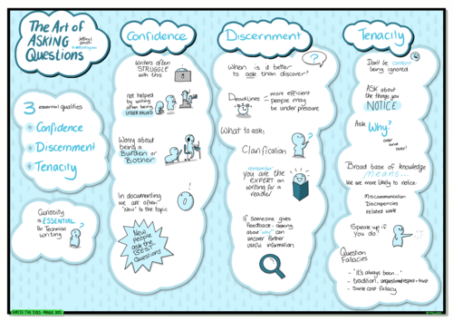
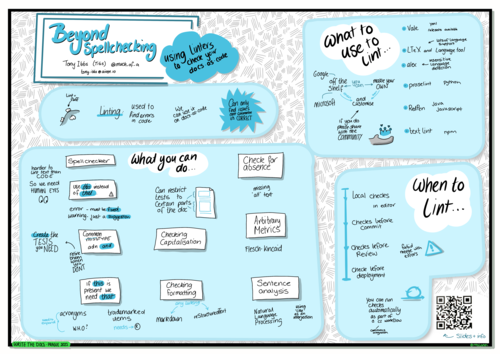

[Write the Docs Prague](https://www.writethedocs.org/conf/prague/2022/) już za
nami, najwyższa więc pora na naszą relację. Jak było w tym roku? Jakie były
tematy? O tym, i nie tylko, przeczytacie w dalszej części artykułu.

<!--truncate-->

### Program i przemówienia

Jak przez ostatnie dwa lata, organizatorzy Write the Docs Prague 2022
postanowili kontynuować konferencję w formie online. Tegoroczna edycja była
kolejną wirtualną konferencją, prowadzoną na Hopinie.

W tym roku wystąpiło 11 osób, które prezentowały się w ciągu dwóch dni trwania
konferencji. Poprzedził je, już dobrze wszystkim znany, dzień zarezerwowany na
projekty
[Writing Day](https://www.writethedocs.org/conf/prague/2022/writing-day/).

Pełną listę wystąpień i program
znajdziecie [tutaj](https://www.writethedocs.org/conf/prague/2022/schedule/).

Podczas konferencyjnych dni odbyło się również wiele ciekawych rozmów pomiędzy
uczestnikami,
[Job Fairs](https://www.writethedocs.org/conf/prague/2022/job-fair/), [Lightning Talks](https://www.writethedocs.org/conf/prague/2022/lightning-talks/) i
sesje [Unconference](https://www.writethedocs.org/conf/prague/2022/unconference/).

Organizatorzy postanowili nieco zmodyfikować sposób prezentacji sesji Q&A, które
odbywały się po zakończeniu każdej z dwóch prezentacji 😊

A co było najciekawsze na wirtualnej scenie? Ze wszystkich prelekcji wybraliśmy
kilka, którymi w imieniu redakcji chciałam się z Wami podzielić.

#### Nie wahaj się pytać!

Być może utknęliście z jakimś problemem i nie możecie rozgryźć, dlaczego dany
program działa tak a nie inaczej lub macie problem z implementacją algorytmu? A
może potrzebujecie więcej informacji lub jesteście po prostu ciekawi jak to
działa? Jak zadawać odpowiednie pytania i czy w ogóle je zadawać? Czy może
lepiej szukać odpowiedzi na własną rękę?

Zadawanie pytań jest czymś, co przychodziło nam bardzo łatwo w dzieciństwie, ale
stopniowo, wraz z wiekiem stało się nieco trudniejsze. Według Jeffrey'a Smitha,
który poprowadził prelekcję
_[The Art of Asking Questions](https://www.youtube.com/watch?v=v6mWnQ0KwHI&list=PLZAeFn6dfHpm1PRgp84X5jh9Jca_KTJSF&index=8),_
zadawanie pytań pomoże Wam nie tylko znaleźć właściwą odpowiedź, ale również
ułatwi przedstawienie wiedzy w logiczny sposób i pozwoli na dogłębne zrozumienie
tematu. Dlatego ważne jest, aby nie bać się zadawać pytań!

Co więc robić? W swoim  wystąpieniu Jeffrey podał kilka sposobów na rozwijanie
tych umiejętności oraz motywował do bycia proaktywnym.

Jakie cechy osobowości mogą Wam w tym pomóc?

- Pewnosc siebie - nie powinniście przepraszać za zadawanie pytań, to część
  Waszej pracy, żeby być ciekawym i poszerzać swoją wiedzę o produkcie.
  Pamiętajcie, że Wasza praca ma taką samą wartość, a Wasz wkład jest
  niezastąpiony!
- Rozeznanie - przygotujcie pytania, które chcecie zadać. Zastanówcie się nad
  nimi. Pytania, które są zadawane szybko, zazwyczaj otrzymują pospiesznie
  napisane odpowiedzi lub nie otrzymują ich wcale. Generalnie starajcie się, aby
  Wasze pytania były krótkie i zawierały jasny opis problemu, z którym się
  zmagacie.
- Wytrwałość - trzeba być proaktywnym! Pamiętajcie, że ludzie, którzy będą
  odpowiadać na Wasze pytania, też nie będą wiedzieć wszystkiego, a znalezienie
  odpowiedniej osoby do odpowiedzi może być trudne, ale nie jest to niemożliwe.
  Nie zadowalajcie się byciem ignorowanym, zauważajcie problemy i pytajcie
  nieustannie dlaczego?
- Ciekawość i dociekliwość - bycie technical writerem oznacza ciągłe uczenie
  się. Niezależnie od tego, czy jesteście początkujący, czy doświadczeni, na
  pewno znajdziecie się w sytuacji, w której będziecie potrzebować pomocy.
  Wyjaśnijcie więc, co próbowaliście zrobić, jakie były oczekiwania podczas tych
  prób i co faktycznie się stało.
- Obserwacja - spróbujcie zauważyć małe rozbieżności. Pamiętajcie, że jako
  autorzy jesteście bardziej skłonni zauważyć różnice, z którymi programiści lub
  SME nie mają do czynienia na co dzień, takie jak sposób, w jaki klient używa
  produktu i czy jest on poprawny.

Warte zapamiętania:

Zadawanie pytań, które poszerzają lub pogłębiają myślenie drugiej osoby i
rzucają wyzwanie jej przekonaniom, prawdopodobnie zostanie odwzajemnione
lojalnością i zaufaniem. Mogą również prowadzić do odkrycia dodatkowych
możliwości dla Was. Jeśli będziecie trzymać się tego, co klient już wie,
rozwiązanie znajdzie się w tej ograniczonej przestrzeni. Ale jeśli wprowadzicie
nowe sposoby myślenia, możecie po prostu otworzyć rozmowę i wywołać większe,
bardziej głębokie wyzwania, których realizacja będzie wymagała pracy z Waszej
strony 😊 Jedną z największych korzyści z poświęcenia czasu na zadawanie pytań
jest to, że od czasu do czasu będziecie samodzielnie w stanie rozwiązywać Wasze
problemy i jest to jeden z najlepszych wyników, jakie możecie osiągnąć!

> We get wise by asking questions, and even if these are not answered, we get
> wise, for a well-packed question carries its answer on its back as a snail
> carries its shell. - James Stephens

#### Przygotowanie dokumentacji dla odbiorców z Afryki

Jeśli interesuje Was jak obecnie rozwija się społeczność tech writerów i branża
IT w Afryce oraz jak zmienia się tamtejszy rynek, to warto zajrzeć do tej części
artykułu.

Firmy w Afryce są bardzo zróżnicowane pod względem zasobów, które wykorzystują
do tworzenia dokumentacji oraz sposobów komunikacji ze społecznościami. Aby
ułatwić zrozumienie całego procesu, Mustafa Rufai wraz z Benny Ifeanyi Iheagwara
zebrali kluczowe informacje i w swojej prezentacji
_[Creating documentation fort he African audience](https://www.youtube.com/watch?v=w2L3QoTnYbE&list=PLZAeFn6dfHpm1PRgp84X5jh9Jca_KTJSF&index=10)_,
przedstawili miedzy innymi, jak tworzona jest społeczność programistów w Afryce,
jak firmy w Afryce komunikują się ze swoimi odbiorcami, jak zbierane są i
wdrażane informacje zwrotne, jakie występują trudności i jaki jest poziom wiedzy
odbiorców dokumentacji technicznej.

A jakie narzędzia są wykorzystywane?

Dostępność narzędzi różni się w zależności od wymagań, dlatego na rynku
pojawiają się zarówno narzędzia open source, jak i produkty innych wytwórców.
Gdy nie jest możliwe wsparcie istniejących platform, firmy szukają
alternatywnych rozwiązań poprzez dodawanie różnego rodzaju wtyczek do
istniejących produktów.

Wśród narzędzi używanych przez społeczność pisarzy i programistów do tworzenia
dokumentacji można wymienić m.in.:

- CMS
- Wordpress
- ReachMe
- specyfikacje Open API  jak Swagger
- [Laravel](https://laravel.com/)
- [Symphony](https://symphony.com/)
- [RubyMine](https://www.jetbrains.com/ruby/promo/?source=google&medium=cpc&campaign=10105984010&term=ruby&gclid=Cj0KCQjw4omaBhDqARIsADXULuUNXWPRP8_TzqeDAYtCX-k21qQMXFZ1egCnMCtuaDusmC_X4RiztAwaAqcLEALw_wcB)
- Sinatra
- Django
- [node.js](https://nodejs.org/en/)
- [Vue.js](https://vuejs.org/)

I wiele innych, co pokazuje, że rynek jest rzeczywiście zróżnicowany 😉

Idąc dalej, jak tworzy się społeczność pisarzy w Afryce?

Wiele firm organizuje spotkania na uczelniach, meet-upy, konferencje, grupy na
Twitterze. Dzięki temu mogą dotrzeć do szerokiego grona odbiorców i wymienić się
wiedzą i doświadczeniem, udoskonalić produkty i zbadać potrzeby rynku. Również
na takich wydarzeniach prezentowane są wersje demo, gdzie społeczność może
przetestować produkt. Co może okazać się przydatne przed wprowadzeniem
ostatecznego produktu na rynek.

Co jest w tej chwil wyzwaniem?

Pisanie kodu według jednego standardu i fakt, że dokumentacja jest często
niekompletna a jej aktualizacja czasochłonna. Czasem nie ma odpowiedniego
zespołu, który by się tym zajął. Niektóre produkty muszą zostać wdrożone zanim
deweloper lub tech writer będzie w stanie zacząć przygotowywać dokumentację.
Takie rozwiązanie wymaga czasem od zespołu napisania kodu tak, aby dopasować go
do już istniejącej specyfikacji.

#### Sposoby na przekonanie szefa, by powiedział "tak" na zatrudnienie dodatkowych pracowników

Niezależnie od tego, czy kierujesz zespołem lub jesteś szefem działu, musisz
podjąć decyzję o zatrudnieniu większej liczby pracowników i uzyskać zielone
światło od swojego szefa, aby iść do przodu.

Jak zatem rozmawiać z szefem o tym, że potrzebujesz wsparcia? Kiedy jest dobry
czas na budowanie zespołu?  Karissa van Baulen w swoim wystąpieniu
[_How I convinced my boss to build our docs team_](https://www.youtube.com/watch?v=7OLiTPL0lGw&list=PLZAeFn6dfHpm1PRgp84X5jh9Jca_KTJSF&index=3)
podkreśliła kilka ważnych punktów, które mogą wpłynąć na decyzję Waszego szefa i
pokazać, że takie działanie przyniesie wymierne korzyści. Od czego zacząć?

Pierwszym krokiem do osiągnięcia tego celu jest zbudowanie silnego uzasadnienia
biznesowego. Dobrze zatem na spokojnie zastanowić się, które kwestie są
najważniejsze. Powinno to pozwolić na zbudowanie listy zadań, na której znajdą
się w pierwszej kolejności najpilniejsze rzeczy.

Jeśli potrzebujecie poprosić o dodatkową osobę lub osoby w Waszym zespole, warto
na początek rozważyć te kwestie:

- jakie macie dokumenty i ile ich jest, czy są aktualne, jaka jest ich jakość,
  jak czesto są weryfikowane;
- gdzie są Wasze mocne strony jako organizacja, a gdzie słabe;
- zidentyfikować kluczowe wskaźniki KPI i dane, których potrzebujecie, aby Wasi
  klienci byli zadowoleni;
- jaki jest cel tych dodatkowych zasobów, sprawdźcie, co macie i czego
  potrzebujecie;
- jakie zmiany można wprowadzić do obecnej dokumentacji  i jakie problemy można
  teraz rozwiązać;
- co jest istotne z punktu widzenia odbiorcy, a czego brakuje;
- zastanówcie się, czy ilość informacji w Waszej dokumentacji jest
  przytłaczająca i czy można znaleźć odpowiedzi na pytania klientów;
- jakich narzędzi używacie- jeśli wiecie ile kosztują zbierzcie dane, jakie
  procesy zachodzą od stworzenia dokumentu do jego publikacji, kto pisze
  dokumenty - jakie role osoby te pełnią w zespole, jakie zespoły są
  zaangażowane, ile czasu zajmuje pisanie, jak kategoryzowane są treści;
- znajdź pomocnika - upewnijcie się, że  to co mówicie jest jasne, a Wasze
  argumenty są przekonywujące, warto zaprosić innego członka zespołu lub osobę z
  zewnątrz do omówienia pojawiających się zagadnień.

Kiedy już znacie odpowiedzi na wszystkie pytania i zgromadzicie odpowiednie
dane, warto przeprowadzić audyt i zweryfikować informacje.

Zbieranie danych możecie podzielić na 3 kategorie:

- dane podstawowe - jakie informacje możesz zebrać o swoich dokumentach,
- dane analityczne - ile Wasi użytkownicy poświęcają na szukanie informacji, co
  działa, a co nie, możecie obserwować doświadczenia użytkowników,  np. porównać
  je z danymi wyjściowymi,
- informacje zwrotne - co użytkownik myśli o Waszej dokumentacji i jak się w
  niej porusza.

Ostatnim krokiem jest przygotowanie prezentacji, w której przedstawicie Wasze
argumenty. Pamiejtacie! Wszystko sprowadza się do tego, jak dobrze jesteście w
stanie odpowiedzieć na pytanie "dlaczego?" i pokazanie szefowi, w jaki sposób
firma może skorzystać z wiedzy, którą przyniesie dodanie nowych osób. Na
przykład, można powiedzieć, że dodatkowa siła robocza pozwoli pracownikom zrobić
więcej pracy i poświęcić niezbędne zasoby do projektów, które są wrażliwe.

Reasumując, zatrudnienie większej liczby pracowników może być bardzo korzystne
dla firmy. Może pomóc zwiększyć bazę klientów, przynieść większe dochody i
poprawić relacje z klientami. Jak się okazuje, nie powinno być tak trudno
skłonić szefa do powiedzenia "tak", jeśli przedstawcie Wasze argumenty w
przekonujący sposób. Zatem życzymy powodzenia!

#### Jak pomóc sobie w wyeliminowaniu błędów w dokumentacji jako kod

Czy zastanawialiście się, jak zabezpieczyć projekt przed przypadkowymi błędami?
Jak zautomatyzować pracę nad dokumentami?  Albo jakie narzędzia można do tego
wykorzystać?

Według Tibs, pisanie dokumentacji jest trudne, a znalezienie błędów może okazać
się jeszcze trudniejsze. W swojej prezentacji
[_Beyond spell checking - what else can we check automatically?_](https://www.youtube.com/watch?v=8NukYx5ggCM&list=PLZAeFn6dfHpm1PRgp84X5jh9Jca_KTJSF&index=5)
omówił zagadnienie lintingu i podał kilka dobrych przykładów, jak można osiągnąć
dobre wyniki i szybciej wychwycić błędy w dokumentacji.

No to zaczynamy! Co to jest **linting**?

To proces, który analizuje kod pod kątem potencjalnych błędów programowych i
stylistycznych. Jest pomocny w identyfikacji niektórych typowych i nietypowych
błędów, które są popełniane podczas kodowania.

Co można przetestować za pomocą lintingu? Pierwszym krokiem jest skonfigurowanie
lintera tak, aby mógł zidentyfikować błędy, a następnie dodać swoje reguły.

Do zasad, na podstawie których dobrze jest sprawdzić kod, należą:

- ilość znaków w każdej linii,
- długość nazw zmiennych,
- długość funkcji,
- długość nazw funkcji,
- wielkość znaków,
- odstępy między kolejnymi blokami kodu,
- ilość argumentów do funkcji.

Na co zwracać uwagę?

- Słownictwo - zastanówcie się, jakiego słownictwa używacie (wyrazów
  standartowych czy technicznych), dobrze jest też rozpoznawać cyfry w
  dokumencie, interpunkcję, przedrostki i przyrostki, wielkie litery.
- Autokorekta -  zazwyczaj ułatwia pracę, jednak ma ona też wady. Przede
  wszystkim, modyfikuje Wasz dokument. W sytuacji, gdy nie znacie wszystkich
  niuansów wprowadzania tych zmian, oddajemy kontrolę nad częścią naszej pracy
  programowi co czasami może zaprowadzić Was do lasu, więc ostateczna decyzja
  należy do autora, czy warto z niej skorzystać 😊
- Użyj "tego" wyrazu zamiast "tamtego" - ta korekta pomoże Wam wyeliminować
  błędy literowe lub możecie też ignorować tekst dosłowny. Możecie wybrać 
  sugestię, aby włączyć ją do Waszego dokumentu.
- Zakres dokumentu - ustalacie czy konieczne jest sprawdzenie całego dokumentu,
  czy też jego określonych części.
- Zarejestrowane znaki towarowe - możecie wprowadzić kontrole dotyczące tego,
  kiedy używane są zarejestrowane znaki towarowe i czy pojawiają się one dla
  danych produktów.
- Zrób weryfikację po czasie - pomoże Ci wyeliminować testy, które nie są już
  potrzebne lub zmodyfikować istniejącą konfigurację.
- Stosowanie wielkich liter - uwzględnianie wyjątków, które słowa lub zwroty
  powinny być pominięte.

Skoro już tyle wiemy, to jakich narzędzi powinniśmy używać? I czy trzeba je
budować samemu?  Według Tibs obecnie dostępnych jest sporo narzędzi, których
możesz użyć do sprawdzenia swojej dokumentacji, i oto kilka z nich:

- [Vale](https://vale.sh/) - wspomaga sprawdzanie miedzy innymi  w Marcdown,
  HTML, reStructuredText, AsciiDoc
- [LteX  i Language Tool](https://marketplace.visualstudio.com/items?itemName=valentjn.vscode-ltex) -
  umożliwia sprawdzanie gramatyki w trybie offline dla różnych języków
  znaczników przy użyciu Language Tool
- [alex](https://github.com/alex-lit/lint-kit) - konstrukcja pozwalająca na
  wychwycenie błędów w dokumentach Markdown i zaproponowanie alternatywnych
  rozwiązań
- [proselint](https://github.com/amperser/proselint) - sprawdza pliki w
  Markdown, ma własny zestaw kontrolny i jest wyposażony w dodatkowe wtyczki z
  wykorzystaniem Pythona
- [RedPen](https://github.com/redpen-cc/redpen) - sprawdza tekst w Markdown,
  Texttile, AScii Doc, reStructuredText, obsługuje wiele języków jak np.
  angielski, niemiecki, japoński czy chiński, dostępne są pluginy w Java lub
  Java Script
- [textlint](https://github.com/textlint/textlint) \- standardowo obsługuje
  Markdown i plain text, posiada plugin dla HTML, reStructureText, AsciDoc, nowe
  reguły są pisane za pomocą JavaScript

Podsumowując, sprawdzanie może obejmować więcej niż tylko pisownię, a
korzystanie z odpowiednich narzędzi może pomóc w szybszym sprawdzeniu dokumentu.
W zależności od preferencji, możesz użyć różnych zasad, aby sprawdzić styl
kodowania i wyeliminować błędy.

### Lighting talks

Dodatkowo chcielibyśmy zwrócić Waszą uwagę na 2 kilkuminutowe prezentacje,
wygłoszone podczas konferencji.

[_Speech acts - a thing we all do, without necessarily knowing_](https://www.youtube.com/watch?v=bLbpWyNnRZE)
poprowadzona przez Kat Stoica Ostenfeld i poruszająca ciekawe zagadnienie 
''aktu mowy''. W językoznawstwie akt mowy to wypowiedzenie skierowane przez
nadawcę do odbiorcy, którego celem jest przekazanie określonego komunikatu.
Można go podzielić na 3 elementy:

- [locutionary act](https://en.wikipedia.org/wiki/Locutionary_act)
   (lokucyjny) - wypowiadanie słów,
- [illocutionary act](https://en.wikipedia.org/wiki/Illocutionary_act)
  (illokucyjny) - zamierzony efekt, który chcemy osiągnąć wypowiadając słowa,
- [perlocationary act](https://en.wikipedia.org/wiki/Perlocutionary_act)
  (perlokucyjny) -  skutek jaki wywołuje.

Co warto zapamiętać? Do przekazywania informacji można używać języka, ale ważne
jest, aby tworzyć komunikaty, które są wzajemnie zrozumiałe. To znaczy, że kiedy
zadajemy pytanie, musimy spodziewać się określonej odpowiedzi. Natomiast jeśli
chcesz poznać przykłady użycia i interpretacji, to zapraszamy do obejrzenia
wideo!

Inny ciekawy temat,  poruszyła Emily Axel. W swoim krótkim wideo
_[Running an accessibility exercise with your team](https://www.youtube.com/watch?v=Fpr0Z0o3GXQ&list=PLZAeFn6dfHpm1PRgp84X5jh9Jca_KTJSF&index=17)_
przedstawiła rozwiązanie, pokazujące jak ulepszyć produkt lub aplikację pod
względem dostępności i zaangażować w to zespół.

Dlaczego dostępność ma znaczenie? Kiedy myślimy o dostępności, zwykle myślimy o
niepełnosprawności, co nie zawsze jest prawdą. Projektując pod kątem
dostępności, sprawiamy, że strony internetowe i aplikacje są łatwiejsze w użyciu
dla każdego i tak, by nikt nie czuł się wykluczony.

Co zatem zaproponowała Emily?

Stworzyła e-maile i potencjalne scenariusze z odpowiedziami, a następnie
przekazała to członkom swojego zespołu do przejrzenia i poprosiła ich o korektę,
opracowanie pod kątem dostępności i zapisanie swoich przemyśleń. Być może ten
temat będzie ważny dla Waszej organizacji.

Jeśli chcecie dowiedzieć się więcej na ten temat, kliknijcie
[tutaj](https://accens.pl/) i
[tutaj](http://techwriter.pl/dokumentacja-techniczna-dla-daltonistow/).

### Kilka słów na zakończenie

Jeśli macie czas i zasoby, wykorzystajcie okazję do wzięcia udziału w
wydarzeniach takich jak Write the Docs. Jest to zawsze ciekawe doświadczenie i
szansa na nawiązanie nowych znajomości, a także znalezienie rozwiązań problemów
w swojej organizacji lub wskazówek, jak poprawić Waszą dokumentację, a jeśli
macie inne zdanie podzielcie się w komentarzach. 😉

Nie pozostaje nam nic innego, jak życzyć Wam powodzenia w tworzeniu tekstów
technicznych!
