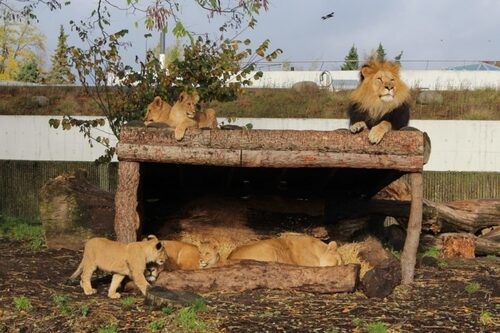
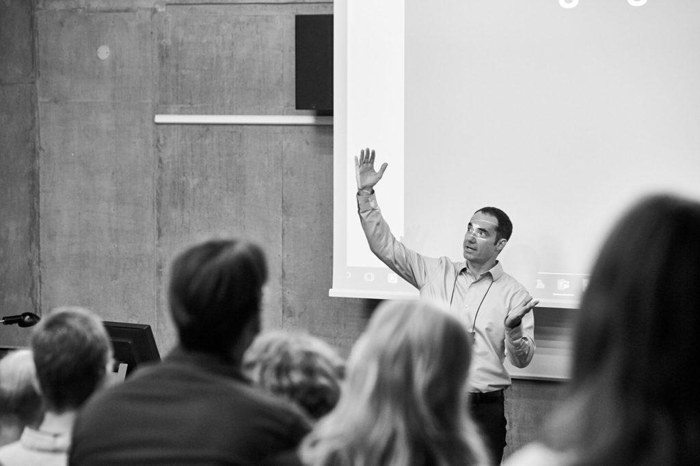
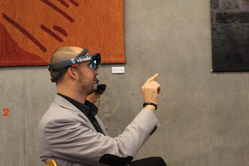
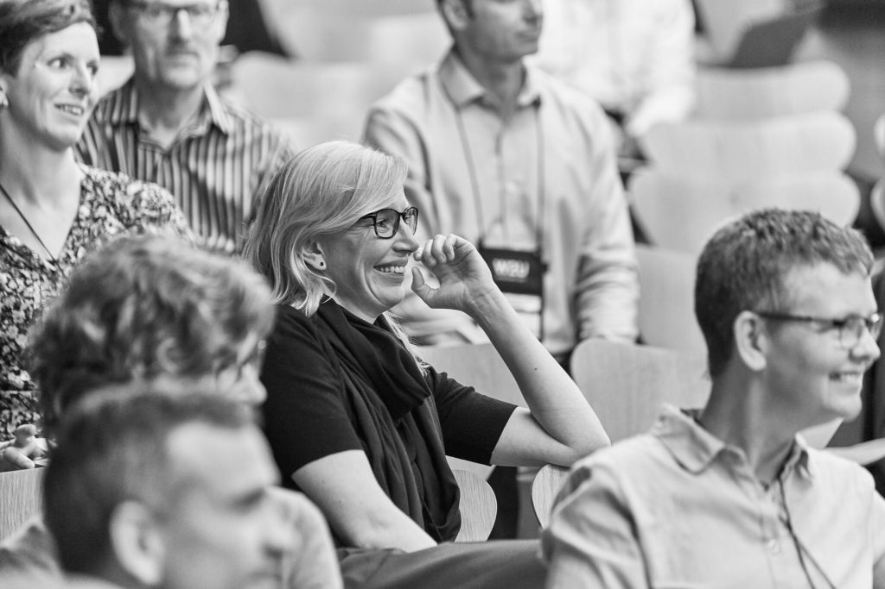
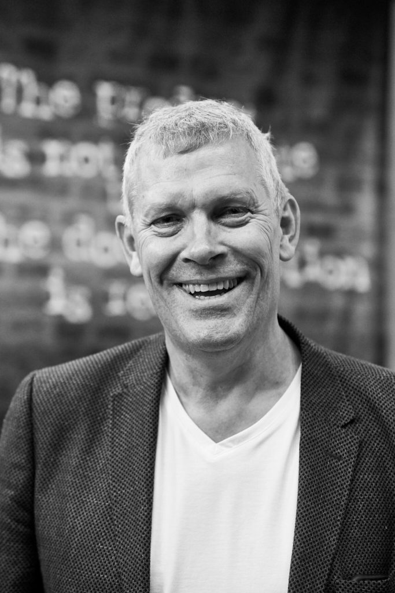

Piąta edycja
[Write2Users Conference](http://write2users.com/w2u-conference-2017/) okazała
się intensywną tech-commową ucztą, obfitującą w praktyczną i teoretyczną wiedzę,
nowości, pomysły, opinie i dyskusje. Zakres tematów był tak różnorodny, jak sami
uczestnicy, poczynając od technicznych aspektów pracy z MadCap Flare, a na
wirtualnej rzeczywistości i tłumaczeniu maszynowym kończąc.

<!--truncate-->

## Witajcie w tech-commowej dżungli!

Organizowanie tech-commowej konferencji w zoo może wydawać się pomysłem nie z
tej ziemi, okazało się jednak, że
[kopenhaski ogród zoologiczny](https://www.zoo.dk/en/) jest miejscem wprost
idealnym na wydarzenie tego typu i rozmiaru. Po kilku godzinach pochłaniania
wiedzy, nie ma chyba lepszego sposobu na intelektualny reset niż stanięcie oko w
oko z lwem, czy zrobienie sobie selfie z niedźwiedziem polarnym. Każdy uczestnik
otrzymał darmową, nielimitowaną wejściówkę do zoo na czas trwania konferencji.
Jednak żeby zobaczyć wielbłądy, wystarczyło spojrzeć za okno w trakcie
warsztatów.

Właściwie wszystkie drugoplanowe detale organizacyjne (królewski bufet,
atrakcyjne lunche, materiały promocyjne, czy nawet oficjalna oprawa
fotograficzna konferencji) zostały dopięte na ostatni guzik. Plan wystąpień i
warsztatów był intensywny, ale nie przytłaczający. Zawsze znalazła się chwila na
złapanie oddechu lub zrobienie zdjęcia szympansom, a decyzja o podzieleniu
konferencji na dwie części (dwudniowy MadWriters i jednodniowy Localization
Focus) okazała się trafiona, pomimo drobnych zmian w harmonogramie.

## Gmeranie we Flarze

Część „MadWriters” skierowana była przede wszystkim do użytkowników Flare’a.
Jednak nawet uczestnicy niezaznajomieni z tym narzędziem nie mogli narzekać na
nudę, nie brakowało bowiem prezentacji o bardziej ogólnej tematyce. Dodatkowo
specjaliści od Flare’a przy każdej okazji wyjaśniali podstawowe pojęcia i
terminy. Zatem nawet flare'owi nuworysze (a byli i tacy) nie mogli czuć się
zagubieni.

Jednym z programowych headlinerów tej części konferencji był Scott DeLoach z
[Clickstart](http://www.clickstart.net/), ekspert od Flare’a ze słonecznej
Florydy. Rozpoczął konferencję od motywującej i mocno intertekstualnej
prezentacji zatytułowanej _The DNA of Technical Communication_. Wystąpienie,
naładowane odniesieniami do Huntera S. Thompsona, Rainera Maria Rilkego czy C.S.
Lewisa, wskazywało na cechy wyróżniające zawód technical writera spośród innych
profesji z branży IT: umiejętności słuchania, uczenia się i organizacji. Cechy
te są bowiem znacznie rzadziej spotykane, a co za tym idzie, znacznie cenniejsze
niż zwykliśmy sądzić.

Scott to świetny wybór na energiczny początek konferencji.

Część _MadWriters_ zawierała również warsztaty z Flare’a, prowadzone przez
[Per Harbo Sorensena](https://twitter.com/perhsorensen), energetycznego
[Thomasa Bro-Rasmussena](https://www.madcapsoftware.com/conference/madworld-2018/speakers/thomas-bro-rasmussen/),
wspomnianego Scotta DeLoacha oraz jednego z organizatorów – Pera Frederiksena.
Nie były to wprawdzie warsztaty w klasycznym rozumieniu tego słowa (nie można
było „pobrudzić sobie rąk”), ale zawierały mnóstwo praktycznej wiedzy i
życiowych przykładów. Zajęcia dotyczyły kwestii, z którymi większość uczestników
spotyka się na co dzień, dlatego niektóre z nich wywoływały zażarte dyskusje,
dotyczące np. usprawniania pomocy online dzięki jQuery, współpracy ze
specjalistami od lokalizacji czy też licznych pomniejszych wad, zalet i ukrytych
cech Flare’a.

Mogliśmy też usłyszeć o Danish Flare User Group, czyli grupie zrzeszającej
użytkowników Flare’a w Danii (pozdrowienia od
[Polish Flare User Group](http://techwriter.pl/drugie-spotkanie-poland-madcap-flare-user-group-relacja/)!)
i zapoznać się z najnowszymi plotkami dotyczącymi kalifornijskiej firmy
(nadciągają zmiany!).

## Dokumenty kontra ludzie

Jednak nie samym Flare'em człowiek żyje, dlatego nawet pierwsze dwa dni
konferencji nie ograniczały się jedynie do tego narzędzia.

[Matthew Ellison](http://www.uaeurope.com/) uraczył nas świetną prezentacją na
temat testowania rzeczywistej, funkcjonującej już dokumentacji na... losowych
użytkownikach. W boleśnie szczery, ale szalenie zabawny sposób, rzucił rękawicę
typowej dla technical writerów tendencji do przedkładania teorii nad praktykę.
Mogliśmy na przykład przekonać się, jak bezlitośni bywają użytkownicy dla źle
działających wyszukiwarek.

Ellis Pratt z [Cherryleaf](https://www.cherryleaf.com/) zastanawiał się nad
wpływem metodologii Agile na poczciwe życie technical writera. Za przykład
podając praktyki firm takich jak eBay czy Salesforce, Ellis omówił główne
możliwości (i utrapienia) związane z tworzeniem dokumentacji na "agile'ową
modłę". Wspomniał też, że technical writerzy są naprawdę kiepscy w mierzeniu
wartości swojej własnej pracy (czy aby nie ma trochę racji?).

Pod nieobecność Mattiasa Sandersa, Ellis wystąpił również z inną prezentacją,
zatytułowaną _Documentation as self-service support_, w której mówił o starym
edytorze WordPerfect, chat botach, dokumentacji tworzonej _na czas_ (zamiast _na
wszelki wypadek_) i używaniu portali takich jak Quora czy Stack Exchange do
zapewniania użytkownikom wsparcia technicznego.

## VR, MT, ATR i inne typy magii

Trzecia część konferencji (Localization Focus) była najbardziej zróżnicowanym
dniem całego wydarzenia.

Zaczęło się od Michaela Harboe z [Virsabi](http://virsabi.com/), który
zaprezentował dynamiczną wizję branży IT zdominowanej przez rozszerzoną i
wirtualną rzeczywistość (AR i VR), wspominając o tym, jak nadciągające zmiany
wpłyną na nasze pojmowanie komunikacji technicznej. Mogliśmy też wypróbować
najnowsze zestawy do wirtualnej rzeczywistości na własnych głowach.

Potem mikrofon trafił w ręce [Andersa Sogaarda](http://cst.dk/anders/) z
Uniwersytetu Kopenhaskiego, który na co dzień zgłębia tajniki tłumaczenia
maszynowego (MT). Jako gorący i niezwykle aktualny temat, tłumaczenie
automatycznie rozwija się bardzo dynamicznie, ale do przebycia ma wciąż bardzo
daleką drogę. Anders wyjaśniał, na czym polegają wciąż nierozwiązane problemy w
MT, a także pokazał, dlaczego trenowanie sieci neuronowych nie jest tak proste,
jakie się wydaje.

Po prezentacjach przyszła pora na warsztaty, na przykład dotyczące Automatic
Terminology Extraction (ATR), czyli automatycznego wyciągania terminologii z
danego tekstu (lub korpusu). [Jakob Halskov](http://www.halskov.net/blog/),
duński naukowiec zafascynowany językiem koreańskim, wyjaśniał, na czym polegają
różne metody ATR, stosowane obecnie w medycynie i prawie. Mogliśmy zaznajomić
się z darmowym narzędziem
[Terminology-as-a-service](http://www.taas-project.eu/), posłuchać o ściąganiu
całej zawartości Wikipedii we wszystkich dostępnych językach i przedyskutować
praktyczne aspekty różnych narzędzi ATR.

Na wzmiankę z pewnością zasługuje też prezentacja Steena Schnacka z
[LanguageWire](https://www.languagewire.com/en), który podzielił się z nami
praktyczną wiedzą na temat związku SEO z lokalizacją. Steen wyjaśniał, w jaki
sposób z lokalizowanymi witrynami rozprawia się google'owski
[RankBrain](https://en.wikipedia.org/wiki/RankBrain). Wygląda na to, że
podstawowe zasady wciąż obowiązują: oryginalna, wartościowa treść i wysoka
jakość tłumaczenia niezmiennie mają największy wpływ na pozycję w wyszukiwarce.
Istnieje jednak mnóstwo aspektów technicznych, które również odgrywają ważne
role, dlatego warto dobrze przemyśleć strategię lokalizacji i detale takie jak
tłumaczenie adresów URL.

## Duńczycy nie próżnują!

Wygląda na to, że Write2Users Conference zasługuje na miano jednego z
najjaśniejszych punktów na tech-commowej mapie Europy. Świetnie zorganizowana,
zróżnicowana i dynamiczna, konferencja przyciągnęła nie tylko Duńczyków, ale
mnóstwo uczestników różnych narodowości i specjalizacji, co pozwoliło stworzyć
świetne miejsce do wymiany wiedzy i doświadczeń. Mieszkańcy zoo nie mieli nic
przeciwko technical writerom na swoim terytorium, a ci ostatni z pewnością byli
zadowoleni z obecności tygrysów i makaków, które zdają się mieć pozytywny wpływ
na moc obliczeniową mózgu.

[Tekom Danmark](http://www.technical-communication.org/dk/home-dk.html), Danish
Flare User Group i sama Write2Users Conference stanowią dowód, że duńska
społeczność tech comm nie tylko nie próżnuje, ale ma się bardzo dobrze!
