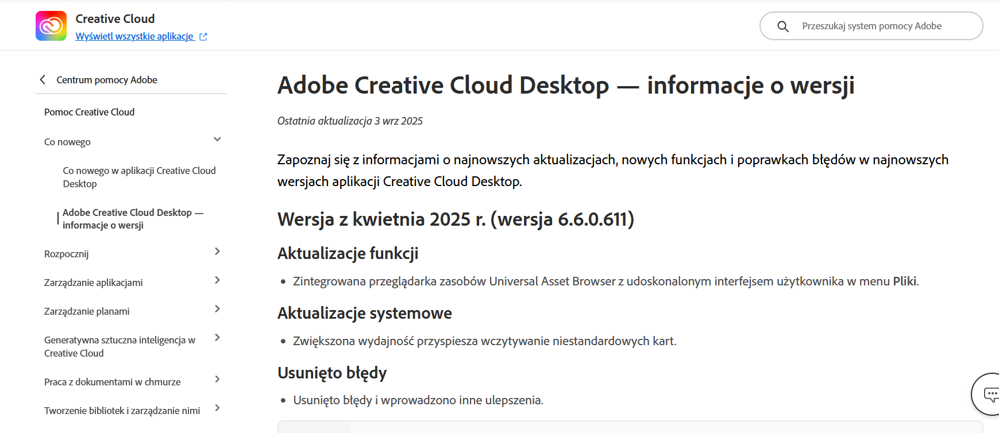
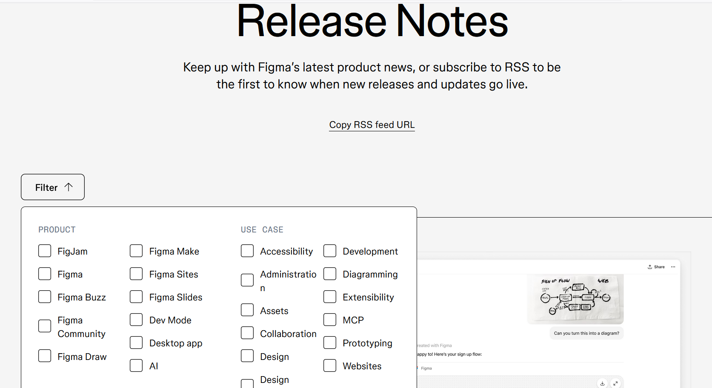
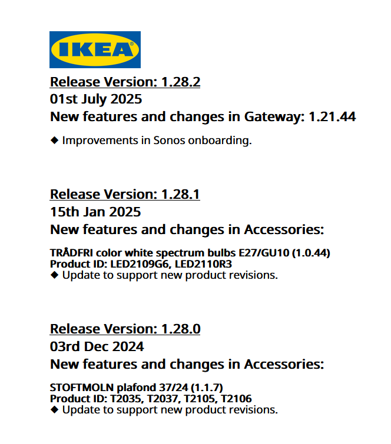
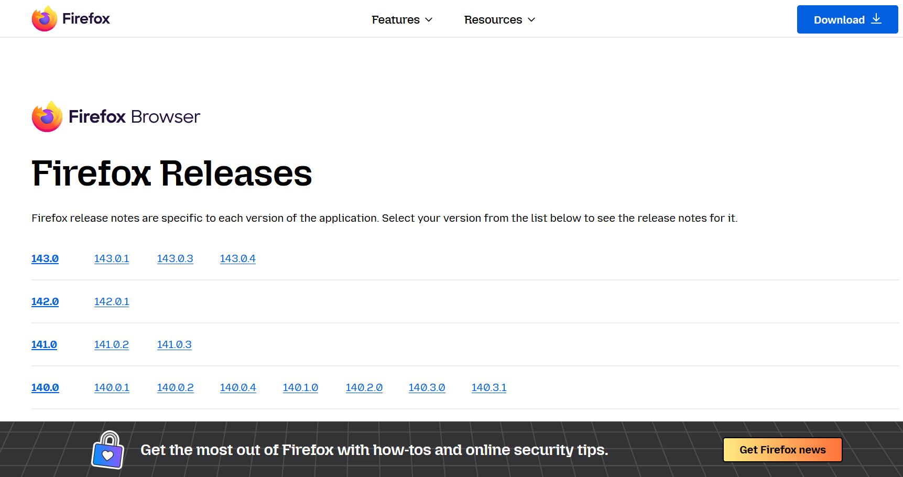
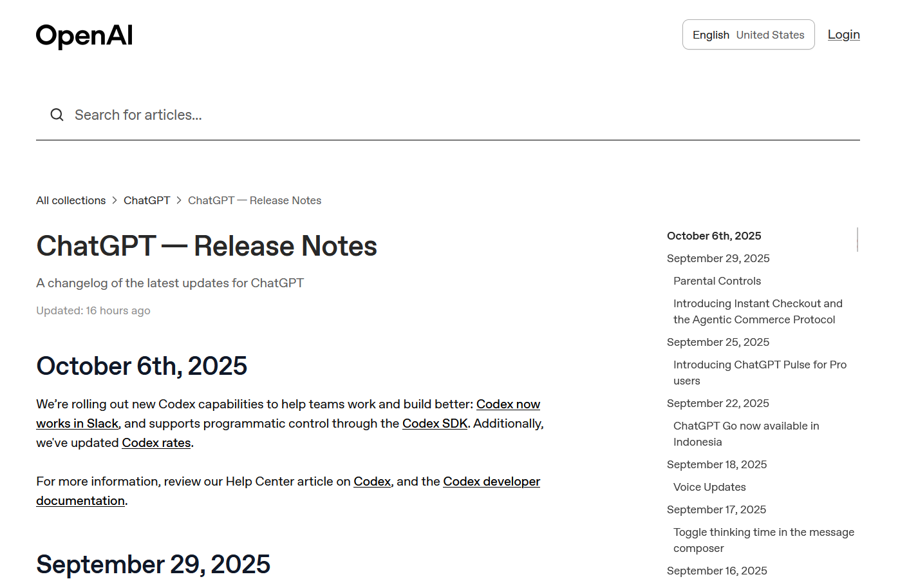
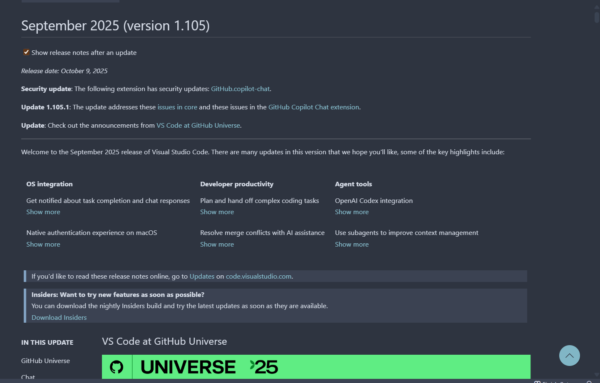
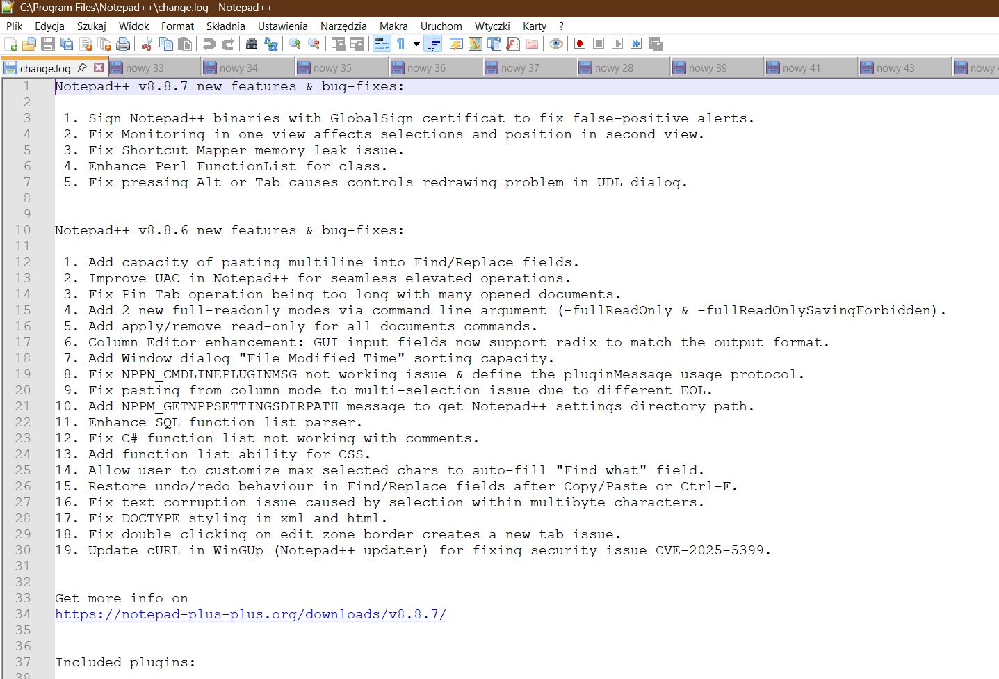

Dla doświadczonego pisarza technicznego stworzenie release notes (czyli -
spolszczając - not wydania) nie jest wielkim wyzwaniem. Tym bardziej, że jest to
jeden ze standardowych typów dokumentacji, wymienianych kiedyś przez syllabus
nieistniejącego już ITCQF®.

<!--truncate-->

O czym tu więc mówić, czego jeszcze nie powiedziano? Jest produkt, są poprawki,
łatki bezpieczeństwa, nowe wersje i funkcjonalności lub zmiany w istniejących
funkcjonalnościach. I są klienci (wewnętrzni lub zewnętrzni), których o tym
informujemy. W zależności od grupy docelowej opisujemy i pokazujemy zmiany mniej
lub bardziej szczegółowo, ale zawsze zgodnie z tradycyjnymi kanonami sztuki
techwriterskiej, czyli konkretnie, prosto, bez fajerwerków. Łatwe, oczywiste -
zwłaszcza jeśli robi się to po raz 1158 😉

A jednak w prostych zadaniach tkwi czasami potencjał - tym bardziej, że
rzeczywistość nie stoi w miejscu. Zmienia się zarówno podejście do tworzenia
oprogramowania, jak i podejście do tworzenia samej dokumentacji. Pojawia się
więc również potencjał do psucia 😉 Zobacz, jak wygląda proces tworzenia release
notes oraz w jakie pułapki możesz wpaść na etapach pisania i dystrybucji takiego
dokumentu. Dla ułatwienia uciekam się w tekście do analogii wprost z kuchni.

## Dorzucamy do garów

Każdy biznes jest inny i każdy produkt jest inny, co powoduje, że cykl rozwoju
tegoż produktu jest specyficzny dla danej organizacji. W firmach, w których
release notes są tworzone w określonych interwałach czasowych (np. w releasach
czy sprintach), zespoły programistyczne i/lub produktowe umieszczają opis zmian
w jednym lub kilku określonych miejscach. Częstym przykładem jest umieszczanie
krótkiego opisu na Confluence, podczas gdy szczegóły techniczne znajdują się w
tickecie na Jirze. Z tych źródeł pobiera je technical writer. Czasami robi to w
określonym procedurami momencie, a czasami na bieżąco zerka i jednocześnie
konsultuje nieoczywiste detale z SME (czyli subject matter expertami). Proces
jest rozłożony w czasie - ot, taki slow food. A ponieważ programiści rzadko
bywają mistrzami słowa, treści przez nich dostarczane wymagają upraszczania,
korekty, przełożenia z technicznego na ludzkie, dołączenia kilku zrzutów ekranu
dla lepszego zwizualizowania zmian itd.

Inaczej sytuacja wygląda w przypadku, kiedy oprogramowanie jest tworzone zgodnie
z metodyką DevOps. Jeśli zmiany w produkcie są wykonywane w trybie Continuous
Integration (CI) i Continuous Delivery (CD), release notes często są generowane
automatycznie. Bywa, że jest to po prostu rejestr zmian (changelog) bazujący na
opisach commitów do repozytorium. Technical writer często w ogóle nie ma dostępu
do tego kociołka - tym bardziej, że deployment w takich przypadkach ma miejsce
nawet kilka razy na dobę o różnych porach.

:::tip Podpowiedź

Po więcej szczegółów koniecznie zajrzyj do
[artykułu Magdy Żaczek](https://techwriter.pl/release-notes-to-nie-changelog) o
różnicach między release notes i changelogiem - te dwa dokumenty są blisko
spokrewnione, ale skierowane do różnych grup odbiorców.

:::

Warto jednak pamiętać, że duża część commitów to drobne zmiany techniczne, które
nie mają żadnego wpływu na to, co widzi końcowy użytkownik. O ile dokumentowanie
dużych “ficzerów” zawsze ma sens, o tyle poświęcanie czasu i uwagi notatkom typu
“Klasa została napisana od nowa w celu poprawy wydajności” jest już dyskusyjne.
Nie brnij w to i nie dziel włosa na czworo. Ewentualnie możesz w dokumencie
wydzielić specjalny podrozdział, w którym wspomnisz np. o aktualizacjach
bibliotek i innych technikaliach.

:::tip Podpowiedź

Jeśli użytkownicy, do których adresujesz opis, są bardzo “techniczni” i naprawdę
chcą wiedzieć o każdej najmniejszej zmianie, rozważ udostępnienie im historii
commitów (bezpośrednio lub skopiuj dziennik git do pliku tekstowego lub strony
internetowej).

:::

A jeśli nie dokumentujesz zmian w oprogramowaniu czy konfiguracji sprzętu, tylko
w API? Tu sytuacja wydaje się być podobna jak w przypadku rejestru zmian. Nie
zawsze jednak tak jest - wprawdzie opis zmian w API będzie dość techniczny i
operuje specjalistycznymi danymi, co oznacza tyle, że adresujemy go do innej
grupy docelowej. API nie modyfikuje się przecież często, dlatego jest to coś
wartego opisania.

### W garach bulgoce

Znając produkt i cykl jego powstawania, a także grupę lub grupy docelowe, wiemy,
jakie zmiany powinniśmy opisać i jak szczegółowo. Warto też pamiętać o
sprecyzowaniu, w jaki sposób wpływa ona na użytkownika końcowego (np. czy będzie
widoczna w interfejsie).

:::tip Podpowiedź

Bywa, że deweloperzy jako materiał wyjściowy do stworzenia release notes
dostarczają technical writerom user stories, znane z metodyk zwinnych (Given
When Then, czyli punkt wyjścia, zakres pracy, oczekiwany rezultat). Taki
materiał bywa pomocny w zrozumieniu opisywanej modyfikacji czy funkcjonalności,
ale nie może być jej bazą. W release notach kluczowa jest charakterystyka
zmiany, ale nie jej uzasadnienie biznesowe czy wytyczne dla zespołu
deweloperskiego.

:::

Jeśli jesteś juniorem i nie masz pewności, czy aby na pewno niczego nie
pominąłeś/pominęłaś podczas pisania, pamiętaj o:

- wymogach style guide, jeśli z takowego korzystasz
- peer review, które pomoże wyeliminować najgłupsze błędy, literówki, potknięcia
  gramatyczne (możesz się też posłużyć narzędziami AI)
- sprawdzeniu całości przez SME lub product ownera tuż przed publikacją
  (zwłaszcza, jeśli nie znasz dobrze dokumentowanego produktu)
- wersjonowaniu i datowaniu.

Jeśli grup odbiorców jest kilka, po stworzeniu dokumentu może nastąpić etap
“klonowania”, czyli dostosowywania wersji podstawowej do konkretnych wymogów, a
także produkcji treści w różnych formatach wynikowych (docx, html, pdf, md). Tu
znowu warto odpowiedzieć sobie na kilka pytań. Czy noty są czytane przez
użytkowników końcowych? Może są materiałem pomocniczym dla pracowników działu
sprzedaży lub marketingu w firmie? Może jest to rodzaj FYI dla wewnętrznych
interesariuszy? A może - zdarza się i tak - po prostu leżą w (wirtualnym) kącie
i zbierają kurz, a my dokopujemy się do nich raz na jakiś czas, śledząc cykl
rozwoju jakiejś funkcjonalności?

A sam proces dystrybucji? Czy umieszczasz release notes w intranecie, w chmurze,
rozsyłasz do interesariuszy mailem, dajesz znać użytkownikom powiadomieniem
push, wrzucasz informację, która otwiera się automatycznie po aktualizacji
oprogramowania? Czy wszystko działa w tym procesie jak trzeba? Czy wszystko się
wyśle, umieści, dotrze? To są drobiazgi - ale jeśli coś w tym dominie się
przewraca, potrafi nieźle zamieszać. Nie to, żeby ktoś na release notes
szczególnie czekał i czytał je z zapartym tchem. A może znacie taki przypadek?

### Z garów na stół

I poszłoooooo! Zmiany już na produkcji, a techwriterska kuchnia serwuje
świeżutkie noty wydania, mniej lub bardziej kreatywne. Słowo “kreatywne” pojawia
się tu nieprzypadkowo. Release notes bardzo często są zwyczajnie nudne i aby je
uatrakcyjnić, warto zdobyć się na coś więcej niż estetyczny, czytelny szablon.
Popatrz, jak wyglądają one w przypadku znanych marek:

Adobe Creative Cloud Desktop

Canva 

Figma 

Ikea - na szczęście nie musisz samodzielnie montować notek z załączonych części
😉 

Mozilla Firefox 

Open AI 

Visual Studio Code 

Notepad++ 

Ta lista mogłaby nigdy się nie kończyć. Dodaj do niej swoje ulubione release
notes i daj nam znać, czy znasz takie, które wyróżniają się na tle innych.

Proces, który opisałam powyżej, sprawia wrażenie ręcznego i dość pracochłonnego.
W rzeczywistości można go łatwo zautomatyzować, a fast food w tym przypadku nie
musi oznaczać niejadalnej papki. Istnieją dziesiątki wtyczek i aplikacji, które
wspierają tworzenie release notes i oszczędzają ci żmudnej roboty. Poznaj
przykłady:

- [wtyczka Atlassiana](https://marketplace.atlassian.com/apps/1223703/automated-release-notes)
- [Githubowe narzędzie](https://docs.github.com/en/repositories/releasing-projects-on-github/automatically-generated-release-notes)
  do automatycznego generowania release notes - bardzo podstawowe, po prostu
  “zasysa” listę kommitów i kompiluje do czegoś, co wygląda jak changelog.

### Mniam mniam - podsumowanie

Informacje o zmianach i releasach są często niekochanym dzieckiem procesu
tworzenia oprogramowania. Mam nadzieję, że po przeczytaniu powyższego tekstu
doceniasz ich wartość - oraz własną, jeśli na co dzień je piszesz 🙂

**Smacznego!**
