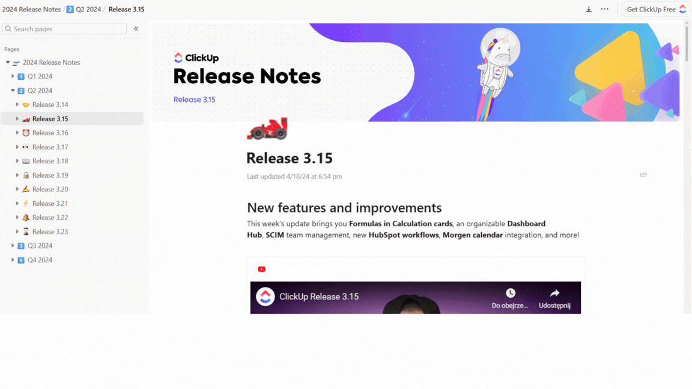
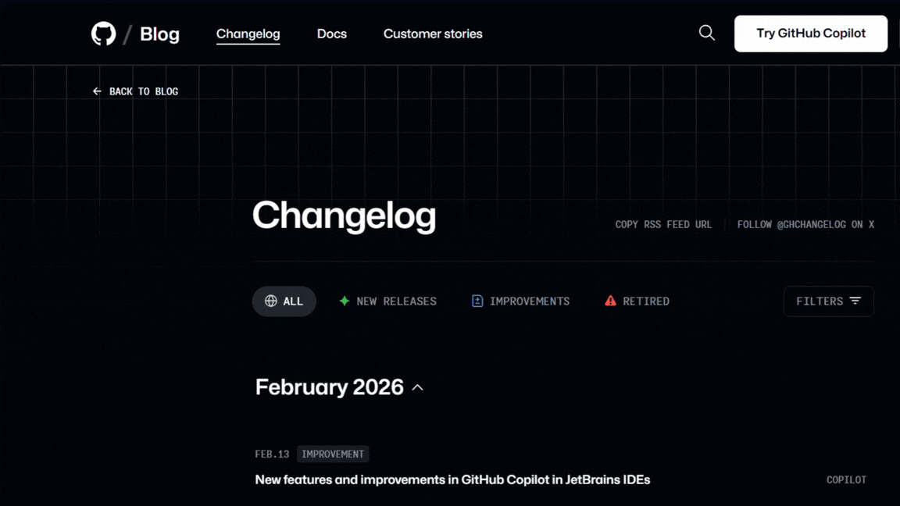

Release notes i changelog to nie to samo. Choć wielu myli te pojęcia, to dwa odrębne dokumenty, które spełniają oddzielne cele.

<!--truncate-->

Czytając dokumentację techniczną spotykamy się z różnymi terminami. 
Dwa z nich, release notes i changelog, często używane są zamiennie, mimo że w rzeczywistości powinny pełnić różne funkcje. 
Czym dokładnie są release notes i changelog? Do kogo są skierowane i czym się różnią? 
W tym artykule uporządkuję te pojęcia i pokażę Ci, czym naprawdę się różnią oraz kiedy warto stosować każde z nich. 

## Tłumaczyć czy nie?

Celowo nie tłumaczę tych terminów na język polski, choć w praktyce można spotkać ich odpowiedniki. O ile z release notes jest prościej, bo tłumaczone są po prostu jako _noty wydania_, o tyle z changelogiem jest nieco trudniej. Najczęściej spotykanymi tłumaczeniami są _historia zmian_ lub _lista zmian_. 

Decyzja o tłumaczeniu tych zwrotów nie powinna być przypadkowa. W środowisku międzynarodowym stosuje się zwroty anglojęzyczne. W dokumentacji technicznej pisanej po polsku można rozważyć użycie polskich tłumaczeń, ale należy pamiętać, aby stosować je konsekwentnie. Mieszanie terminów w obrębie jednego produktu lub organizacji może prowadzić do nieporozumień. Jeśli raz mówimy o <i>liście zmian</i>, a innym razem o <i>changelogu</i>, odbiorca może się pogubić. Z perspektywy technical writera najważniejsza jest więc nie sama decyzja o tłumaczeniu, lecz spójne nazewnictwo w całej dokumentacji.

W tym artykule pozostaję przy oryginalnych terminach, jako najbardziej neutralnych i znanych w środowisku technicznym.

## Kontekst użycia

Release notes i changelog są ściśle powiązane z zarządzaniem wersjami produktu. Za każdym razem, gdy wprowadzamy nowe funkcje, poprawiamy błędy lub modyfikujemy istniejące rozwiązania, chcemy zakomunikować te zmiany odbiorcom. 
Dokładnie w tym momencie pojawiają się zespoły produktowe i technical writerzy, którzy tworzą dokumentację opisującą zmiany, a więc changelog i release notes. Choć oba dokumenty informują o zmianach, robią to w odmienny sposób i z myślą o różnych grupach czytelników.

## Definicje

### Release notes

Release notes skierowane są do użytkowników końcowych, klientów biznesowych, działów marketingu i sprzedaży. Pisane są językiem mniej technicznym i skupiają się na przekazaniu biznesowej wartości prezentowanych zmian. Często odpowiadają na pytanie <i>Dlaczego ta zmiana jest istotna?</i> zamiast szczegółowo opisywać techniczne aspekty jej wdrożenia.
Często release notes są wzbogacone o elementy wizualne, takie jak zrzuty ekranu, animacje GIF czy krótkie filmiki. Wszystko po to, aby nie tylko poinformować o wprowadzonych zmianach, ale łatwo przedstawić w jaki sposób użytkownicy mogą z nich skorzystać.

Poniżej przykład [release notes](https://doc.clickup-stg.com/333/d/ad-1002505/2024-release-notes/ad-3526113/release-3-15?_gl=1*4ztj5o*_gcl_au*MjAzMzI3NDAwMC4xNzcwNDEyMzg5) od firmy ClickUp, która oferuje rozwiązania do zarządzania projektami. Z łatwością można zauważyć, że firma kieruje swoje release notes do klientów biznesowych. Strona jest opisowa i zawiera wizualne elementy takie jak filmik i zrzuty ekranu. 

### Changelog

Changelog to z kolei chronologiczny zapis zmian w produkcie. Jest pisany bardziej technicznym językiem niż release notes i skierowany do programistów, administratorów oraz zaawansowanych użytkowników, dla których techniczna terminologia nie stanowi problemu. Odbiorcy changeloga nie potrzebują znać biznesowych zastosowań przedstawianych zmian. Im zależy głównie na tym, aby sprawdzić czy i kiedy dana zmiana została wprowadzona w produkcie. Z tego też powodu, forma changeloga znacznie różni się od release notes. Najczęściej spotykamy się z formą zwięzłych wpisów przypisanych do konkretnych wersji i dat. 

Idealnym przykładem firmy, która tworzy [changeloga](https://github.blog/changelog/) w ten sposób jest GitHub. Od razu widać, że changelog jest kierowany do programistów i integratorów a nie do odbiorców biznesowych. 

## Kiedy używać release notes

Release notes sprawdzają się tam, gdzie kluczowe jest doświadczenie użytkownika (user experience). Odbiorca chce wiedzieć, w jaki sposób zmiany w produkcie wpłyną na jego codzienną pracę lub sposób korzystania z aplikacji.

Techniczne terminy mogą zniechęcać do lektury, dlatego release notes powinny być zrozumiałe dla odbiorcy i skoncentrowane na korzyściach. Coraz częściej obserwuje się również zainteresowanie wizualną formą komunikacji zmian, na przykład w formie krótkiego GIFa czy filmiku. Release notes są powszechnie stosowane w aplikacjach SaaS, aplikacjach mobilnych, grach wideo i oprogramowaniach e-commerce. 

## Kiedy używać changeloga

Changelog najczęściej stosowany jest w projektach open source, systemach operacyjnych, publicznych API, bibliotekach i frameworkach. Oczywiście nie jest to kompletna lista, ale wszędzie tam, gdzie odbiorcą jest specjalista (np. programista lub administrator), który musi dokładnie wiedzieć jakie zmiany zostały wprowadzone, aby jego integracje lub kod działały poprawnie. W changelogu liczy się kompletność i precyzja, a nie narracja czy kontekst biznesowy.

## Changelog i release notes razem

To, że release notes i changelog komunikują zmiany w różny sposób, nie oznacza, że nie można ich stosować wspólnie. 

W wielu produktach jest taka potrzeba, aby przygotowywać changelog, który traktuje się jako historię zmian w produkcie niezbędną dla zespołów technicznych, administratorów czy zaawansowanych użytkowników. Release notes będą natomiast służyć użytkownikom końcowym i klientom biznesowym. W release notes zazwyczaj dokonuje się selekcji zmian i opisuje te, które są najbardziej istotne z perspektywy użytkownika. Dzięki temu, prowadząc zarówno changelog, jak i release notes, zaspokajamy potrzeby różnych grup odbiorców i zapewniamy spójną, ale dostosowaną komunikację produktu.

## Co warto zapamiętać?

Choć release notes i changelog często są błędnie traktowane jak synonimy, w rzeczywistości nie są tym samym typem dokumentacji. Oba formaty służą do komunikowania zmian w produkcie, ale realizują ten cel w inny sposób i są przeznaczone dla różnych odbiorców. 

Changelog przedstawia wprowadzone zmiany w krótki i bardzo techniczny sposób. Jest niezbędny dla programistów, administratorów i zaawansowanych użytkowników, którzy chcą wiedzieć co i kiedy zostało zmodyfikowane.

Release notes pełnią rolę komunikacyjną i przedstawiają wybrane zmiany językiem biznesowym i zrozumiałym dla użytkownika końcowego, co pomoże w korzystaniu z nowych funkcji w codziennej pracy z produktem. 

