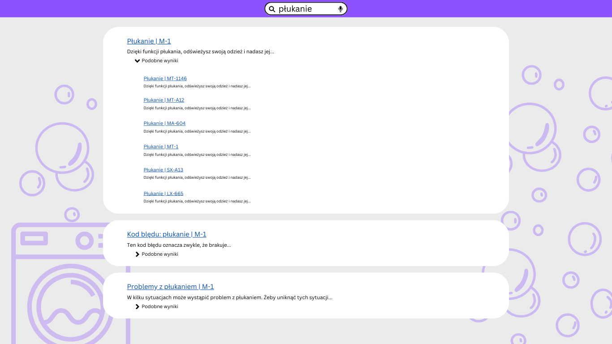

Reuse wydaje się być Świętym Graalem technical writingu, ale w tym artykule
chciałbym pokazać, że reuse może zepsuć wyniki wyszukiwania.

<!-- truncate -->

Zacznijmy od początku.

## Co to jest reuse?

Reuse, ponowne użycie, lub reużycie, to praktyka pisania raz i używania w wielu
miejscach. Stosuje się ją w programowaniu i tworzeniu treści, w tym treści
technicznych. Technical writerzy reusują bloki tekstu i całe topiki, artykuły,
bądź strony.

Na przykład, tworzymy dokumentację do pralek. Nasze pralki to 12 modeli, z
których każdy ma od 5 do 30 funkcji. Podstawowe 5 funkcji jest dostępne w każdej
pralce a pozostałe to misterna mozaika powtarzających się lub unikalnych funkcji
w różnych wariantach. Dla każdego z 12 modeli musimy wydrukować książeczkę z
instrukcjami. Używamy więc systemu, który pozwoli nam opisać każdą funkcję raz,
a potem poskładać książeczki z kawałków treści jak z klocków. Każdy reusowany
fragment to klocek tego samego typu.

Takie rozwiązanie świetnie się sprawdza kiedy przygotowujemy książeczki do
druku, bo każda z nich zawiera komplet informacji. Niczego w niej nie brakuje.
Jednocześnie nie ma w niej informacji o funkcjach, które są niedostępne w naszym
modelu pralki.

## Dlaczego psuje wyszukiwanie?

Wyobraźmy sobie, że instrukcje do pralek są teraz dostępne online. Zostały
wrzucone na portal z dokumentacją jako podstrony. Każda książeczka ma nawigację
po lewej i jest w pełni kompletnym mini portalem ze wszystkim, czego potrzebuje
użytkownik danego modelu.

Jeżeli jedną z podstawowych funkcji **każdej** pralki jest płukanie, to na
naszym portalu mamy stronkę o płukaniu powtórzoną 12 razy. Jeżeli użytkownik
wpisze w wyszukiwarkę "płukanie" to te 12 stron będzie konkurować o jego uwagę.

Być może oprócz strony o tytule "Płukanie" jest następna, na przykład "Problemy
z płukaniem" albo "Kod błędu: płukanie", ale użytkownik ich tak łatwo nie
znajdzie, bo będą dużo niżej albo nawet na drugiej czy trzeciej stronie z
wynikami. Poza tym każda będzie w dwunastu kopiach.

Więc w tym wypadku to co dobre dla drukowania jest niedobre dla wyświetlania w
internecie.

## Jakieś źródła?

Próbowałem znaleźć jakieś przykłady opisujące ten problem. Miałem nadzieję
znaleźć jakieś pomysły na jego rozwiązanie. Niestety, nie udało mi się. Być może
takie artykuły gdzieś istnieją, ale w moich wyszukiwaniach znajdowałem tylko
reklamy narzędzi, które pomagają organizować reuse.

## Publikować strony tylko raz

Najprostsze rozwiązanie to opublikować każdą stronę tylko raz. Wtedy pojawi się
ona w wynikach tylko jeden raz i będzie ją łatwiej spozycjonować. Poza tym
użytkownik będzie miał mniej problemów z przeglądaniem wyników wyszukiwania.

Ja osobiście widzę dwa sposoby na osiągnięcie tego celu. Przybliżę je na
przykładzie dokumentów w formacie DITA, ale to samo odnosi się do innych
generatorow stron statycznych.

Pierwszy to konstruować nasze dokumenty tak, żeby każda strona występowała w
nich tylko raz. Jeżeli mamy wiele map DITA, które tworzą nasze rozliczne
dokumenty, nie możemy powtarzać topików między mapami.

Drugi to użyć mechanizmu publikacji, który wykracza poza typowe generowanie
stron statycznych. Nie możemy polegać na prostym transformowaniu mapy DITA na
strony HTML. Zamiast tego musimy zbudować system, który w jakiś sposób posortuje
z zdeduplikuje nasze strony. Taki system to nie lada wyzwanie i nie sądzę, żeby
taki gdziekolwiek istniał. Przynajmniej ja takiego nie widziałem.

## Filtrowanie

Jeśli nie możemy publikować stron tylko raz, kolejną najlepszą opcją jest
filtrowanie. Dodajmy po lewej stronie panel z checkboxami i pozwólmy
użytkownikowi wybrać, o której wersji pralki chce poczytać. To nie jest idealne
rozwiązanie, bo o ile w wypadku pralki, użytkownik prawdopodobnie wie jaki model
posiada, o tyle w bardziej skomplikowanych systemach wybory filtrów stają się
trudniejsze. Może dojść do tego, że użytkownik nie będzie wiedział jaki
"produkt" wybrać, ani co mamy na myśli rozróżniając "wersję" od "wydania". Albo
czym się różni "komponent" od "części".

## Kolaps

Ostatnie rozwiązanie, które widziałem w akcji, to zgrupowanie podobnych wyników.
Czyli jeden wynik o tytule "Płukanie" a pod spodem zwijany akordeon z listą
innych wersji strony o płukaniu.

To rozwiązanie ma swoje słabe strony. na przykład to, że rozwijana sekcja może
stać się bardzo długo i przez to mało pomocna. Jeżeli spróbujemy ją wyposażyć w
jakieś kontrolki pozwalające wybrać model pralki, to znacznie zwiększymy jej
poziom skomplikowania.

Innym problemem jest to, że użytkownicy moga nie zrozumieć co daje ta sekcja i
jak jej powinni używać. Dla nas jest oczywiste, że są w niej wymienione
wszystkie inne instancje tej samej strony w innych modelach pralki. Ale to co
dla nas jest oczywiste wynika z tego, ze znamy strukturę własnej dokumentacji.

Generalnie to rozwiązanie nie jest absolutnie najgorsze. Warto go spróbować i
zebrać feedback od użytkowników.

## Nie ma złotego środka

Poradzenie sobie z tym problemem na pewno będzie wymagało głębokiej analizy i
dostosowania się do wymagań użytkownika. Nie będziemy w stanie znaleźć
uniwersalnego rozwiązania dla każdego zbioru dokumentacji. Więc jeżeli ktoś
twierdzi, że ma uniwersalne rozwiązanie, podejdźmy do niego z odrobiną rezerwy.
