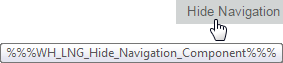
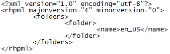

Jeśli spotkaliście się kiedyś z takim błędem podczas generowania dokumentów przy użyciu RoboHelpa 11, to bardzo możliwe, że poziom Waszej frustracji osiągnął absolutne maksimum. Dlatego tym bardziej mamy nadzieję, że opis problemu z jakim sami borykaliśmy się oraz rozwiązanie jakie udało nam się opracować pozwolą na ocalenie chociaż kilku dobrych ludzi przed utratą zmysłów ;)

## Opis problemu

Problem dotyczy RoboHelpa 11 HTML. W trakcie generowania projektów do formatu Webhelp za pomocą aplikacji konsolowej RoboHelpa (RHCL.exe) pojawiają się błędy szablonu **"Template Error: can not resolve macro: WH_LNG..."**. Dodatkowo, niektóre elementy w wygenerowanej dokumentacji mają niewłaściwą treść, np. podpowiedź (tooltip), która pojawia się po najechaniu kursorem na przycisk **Hide Navigation** zawiera tekst %%%WH_LNG_Hide_Navigation_Content%%%, zamiast Hide Navigation Content.

## Przyczyna

Problem jest spowodowany tym, że w trakcie generowania projektu, RoboHelp nie jest w stanie odnaleźć pliku **RoboHHRE.lng** dla tego projektu i języka, który jest ustawiony w projekcie. Plik LNG zawiera teksty, które pojawiają się w różnych miejscach w wygenerowanych dokumentach. W RoboHelpie 11, każdy projekt powinien posiadać swój plik LNG w takiej lokalizacji: `<folder projektu>\!Language!\<folder języka>`. Na przykład, jeśli język projektu jest ustawiony na English (US) będzie to `<folder projektu>\!Language!\en_US`.

**WAŻNE!** W folderze !Language! znajduje się plik **!Language!.fpj**, który zawiera informacje o strukturze katalogu !Language!. Trzeba sprawdzić czy są w nim wpisane wszystkie katalogi języków, np. en_US tak jak na przykładzie poniżej. Dodatkowo, należy upewnić się, że katalog z plikami dla danego języka posiada swój własny plik FPJ określający jego strukturę. Na przykład, dla języka English (US), katalog `!Language!\en_US` musi zawierać plik **en_US.fpj**.

Żeby RoboHelp mógł odnaleźć plik LNG, po pierwsze musi on znajdować się odpowiedniej lokalizaji, a po drugie w pliku PSS projektu musi znajdować się ścieżka do tego pliku. Plik PSS to tymczasowy plik tworzony automatycznie przez RoboHelpa w momencie otworzenia projektu. Po wykonaniu różnych akcji w programie są do tego pliku dopisywane nowe informacje. Na przykład, po otworzeniu layoutu Webhelp w projekcie, RoboHelp dopisuje do pliku PSS ścieżkę do pliku RoboHHRE.lng. Okazuje się, że nie dzieje się tak w przypadku generowania projektu do formatu Webhelp za pomocą aplikacji konsolowej RHCL.exe. Wtedy ta ścieżka nie jest dopisywana do pliku PSS i to właśnie powoduje powstawanie błędów Template Error.

## Rozwiązanie

Niestety na tą chwilę nie istnieje oficjalny sposób na rozwiązanie tego problemu. Forum Adobe RoboHelp oraz wsparcie techniczne nie są pomocne w tej kwestii. Można zastosować jedynie jakieś obejścia. Naszą propozycją jest stworzenie mechanizmu, jakiegoś prostego skryptu, który przed odpaleniem projektu w aplikacji konsolowej RHCL.exe będzie tworzył plik PSS dla tego projektu, w którym będzie znajdować się tylko nazwa odpowiedniej sekcji z ustawieniami oraz ścieżka do pliku RoboHHREE.lng. Poniżej zawartość takiego przykładowego pliku:

**WAŻNE!** Ścieżka do pliku RoboHHRE.lng musi być bezwzględna.

Z tego co udało nam się ustalić, po odpaleniu projektu przez aplikację konsolową, plik ten nie jest nadpisywany, tylko są do niego dopisywane kolejne linijki z ustawieniami. O dziwo, nawet sekcja \[PreSingleSource\] nie jest duplikowana, tylko dalsza część ustawień jest ładnie doklejana poniżej naszej ścieżki.

Obecnie znamy tylko takie rozwiązanie tego problemu. Pocieszające jest to, że działa i jest proste do zastosowania. Problem zgłosiliśmy do programistów RoboHelpa za pośrednictwem wsparcia technicznego. Otrzymaliśmy informację, że sprawa została zalogowana w ich systemie, jednak nie wiemy ile czasu minie zanim pojawi się jakieś rozwiązanie. Zapewne niemało ;)
