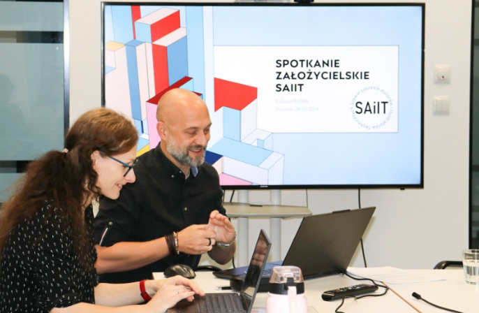
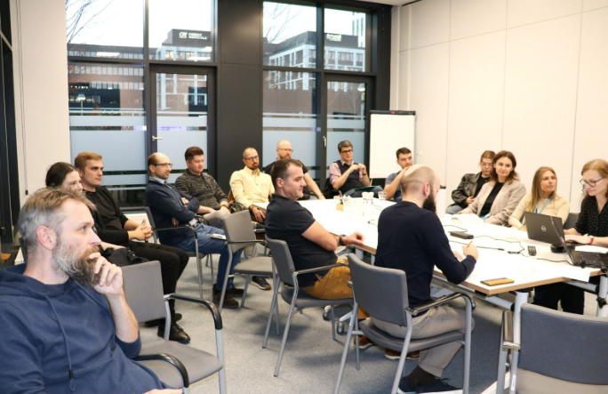
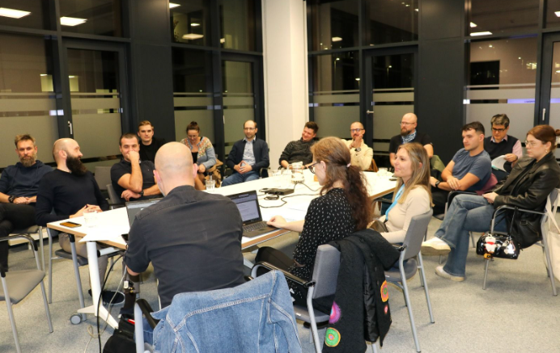

---
title:
  'Stowarzyszenie Autorów i Ilustratorów Technicznych (SAiIT) - Początki
  działalności'
authors: mrozek
date: '2024-12-20'
tags:
  - 'stowarzyszenie'
  - 'zrzeszenia-branżowe'
  - 'promocja-branży'
coverImage: 'saiit.png'
---

24 października odbyło się spotkanie założycielskie Stowarzyszenia Autorów i
Ilustratorów Technicznych (SAiIT). Artykuł z zapowiedzią tego wydarzenia możecie
przeczytać na naszych łamach:
[Stowarzyszenie Autorów i Ilustratorów Technicznych (SAiIT) - Spotkanie założycielskie](../saiit-spotkanie-zalozycielskie/index.md).
Teraz wracamy do Was z podsumowaniem pierwszych kroków podjętych przez
stowarzyszenie.

<!--truncate-->

SAiIT otrzymało pozytywną decyzję z KRS i od 20 listopada 2024 oficjalnie
rozpoczęło swoją działalność. Stowarzyszenie zarejestrowano pod numerem
KRS: 0001139342.

## Co dalej?

Formalności to dopiero początek działalności. W planach na najbliższy czas jest
między innymi:

- Organizacja struktur SAiIT
- Ustalenie regulaminów władz i poszczególnych komisji
- Uzgodnienie spraw związanych z prowadzeniem księgowości. Obecnie zbierane są
  informacje na temat potencjalnych wydatków przy współpracy ze Skarbnikiem
  [Piotrem Garbelą](https://www.linkedin.com/in/piotr-garbela-07bbb2b3/). Pomogą
  one w ustaleniu wysokości składki członkowskiej na przyszły rok
- Praca nad budżetem stowarzyszenia
- Opracowanie procedur przyjmowania kolejnych członków

## Praca w toku

A tymczasem następuje już pewien podział obowiązków. Jeden z
członków-założycieli SAiIT przejął opiekę nad social mediami stowarzyszenia.

Niestety okazuje się, że niektóre platformy, takie jak FB, nie pozwalają
organizacjom na utworzenie swojego profilu. W związku z tym założyciele będą
rozważać inne opcje, takie jak YouTube czy Instagram.

Za to działa już strona internetowa SAiIT. Znajdziecie ją pod adresem:
https://saiit.odoo.com. Jest to tymczasowe rozwiązanie, które organizatorzy będą
rozwijać i rozbudowywać. Docelowo strona ma posiadać własną domenę.

## Jak się zaangażować?

Na tę chwilę możecie wspomóc SAiIT na dwa sposoby:

- Zaangażować się w rozwijanie strony internetowej
- Dołączyć do stowarzyszenia

Więcej informacji, takich jak dane kontaktowe, statut i wniosek członkowski,
znajdziecie na [stronie stowarzyszenia](https://saiit.odoo.com/). Żeby dołączyć,
trzeba pobrać plik PDF z wnioskiem, wypełnić go i przesłać na adres mailowy
stowarzyszenia.

## Przyszła działalność

Jak donoszą organizatorzy, trwają rozmowy z Uniwersytetem Wrocławskim na temat
potencjalnej współpracy. Następnym krokiem będzie podjęcie podobnych rozmów z
Politechniką Wrocławską.

Redakcja techwriter.pl będzie śledzić postępy prac i informować Was na bieżąco.

A poniżej zdjęcia autorstwa
[Katarzyny Szkudlarskiej](https://www.linkedin.com/in/katarzyna-szkudlarska-b94a5913a/)
ze spotkania założycielskiego :

  
