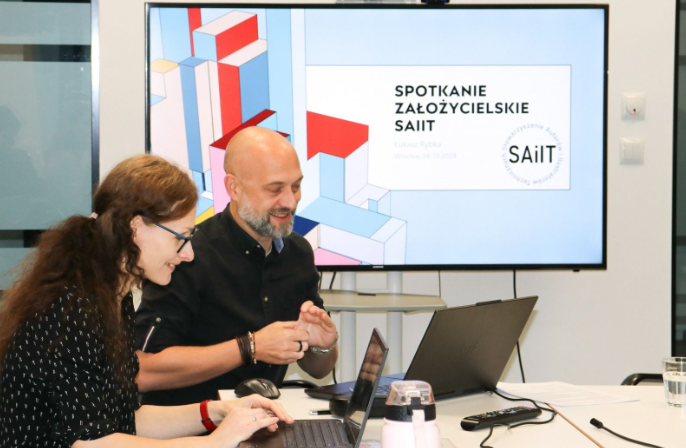
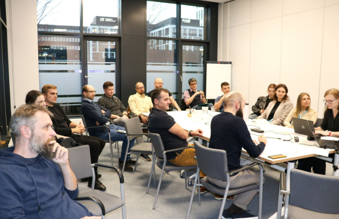
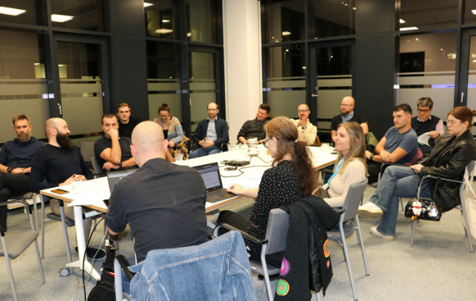

Jak być może już wiecie, 24 października odbyło się spotkanie założycielskie Stowarzyszenia Autorów i Ilustratorów Technicznych (SAiIT), zapowiedzi którego mogliście przeczytać na naszych łamach: [Stowarzyszenie Autorów i Ilustratorów Technicznych (SAiIT) - Spotkanie założycielskie](https://techwriter.pl/saiit-spotkanie-zalozycielskie/). Teraz wracamy do Was z podsumowaniem pierwszych kroków Stowarzyszenia. 

<!--truncate-->

SAiIT otrzymał pozytywną decyzję z KRS i od 20 listopada 2024 oficjalnie rozpoczęło działalność.
Stowarzyszenie zarejestrowano pod numerem KRS: 0001139342.

## Co dalej?

Formalności to dopiero początek działalności. W planach na najbliższy czas  jest między innymi:

* Proces organizacji struktur SAiIT
* Ustalanie regulaminów władz i poszczególnych komisji
* Uzgodnienie spraw związanych z prowadzeniem księgowości - zbierane są informacje na temat potencjalnych wydatków i wraz ze Skarbnikiem [Piotrem Garbelą](https://www.linkedin.com/in/piotr-garbela-07bbb2b3/) ustalona ma być wysokość składki członkowskiej na przyszły rok
* Praca nad budżetem stowarzyszenia
* Opracowanie procedur przyjmowania kolejnych członków

## Praca w toku

A tymczasem następuje już pewien podział obowiązków. Jeden z członków-założycieli SAiIT przejął opiekę nad social mediami stowarzyszenia. Niestety, okazuje się, że założenie strony na FB jest utrudnione dla organizacji i aktualne zasady FB wykluczają otwarcie takie profilu. Założyciele będą zastanawiać się więc, jak zaistnieć na innych portalach, na przykład na YouTubie czy Instagramie.

Za to działa już strona internetowa SAiIT. Możecie ją odwiedzić pod adresem: https://saiit.odoo.com. Jak na razie jest to tymczasowe rozwiązanie, które organizatorzy będą rozwijać i rozbudowywać we własnej, docelowej domenie. 

## Jak się zaangażować?

Założyciele zapraszają wszystkie osoby, które są zainteresowane tworzeniem strony SAiIT. 

Na stronie znajdziecie informacje kontaktowe, Statut SAiIT oraz wniosek członkowski. Wystarczy pobrać plik PDF, wypełnić i przesłać na adres mailowy stowarzyszenia. 

## Przyszła działalność

Jak donoszą organizatorzy, trwają rozmowy z Uniwersytetem Wrocławskim na temat potencjalnej współpracy. Następnym krokiem jest podjęcie podobnych rozmów z Politechniką Wrocławską.

Redakcja TechWriter.PL będzie śledzić postępy prac i informować Was na bieżąco. 

  