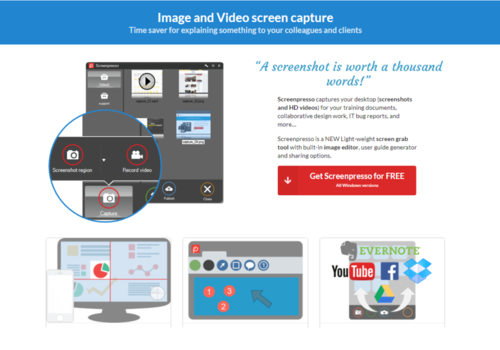
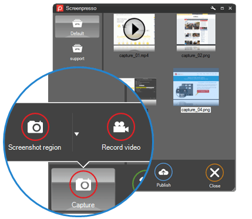

Czy przypadkiem nie szukacie narzędzia do tworzenia zrzutów ekranu, które usprawniłoby Waszą pracę? Czy chcielibyście zapisywać pliki w różnych formatach i mieć możliwość ich edycji? Czy zastanawialiście się jak zmniejszyć wagę Waszych plików nie tracąc na jakości?

Znaleźliśmy dla Was całkiem ciekawe rozwiązanie, dzięki któremu spędzicie mniej czasu na tworzeniu i edytowaniu obrazów w programach graficznych, a skupicie się na tworzeniu pozostałych dokumentów do projektu.

Ten artykuł przybliży Wam podstawowe zasady działania Screenpresso i jego zastosowanie. Resztę na jego temat znajdziecie [tutaj](https://www.screenpresso.com/). Dostępna jest też instrukcja obsługi [tutaj](https://www.screenpresso.com/docs/ScreenpressoHelp.pdf).

## Co to za narzędzie?

Screenpresso jest darmowym narzędziem do tworzenia zrzutów ekranu, GIF-ów i nagrań ekranu oraz prostych dokumentów do Waszych prac projektowych, raportów czy materiałów szkoleniowych. Po stworzeniu multimediów są one automatycznie zapisywane i uporządkowane w jednym miejscu.

Screenpresso ma wbudowany edytor, gdzie w szybki sposób można dopracować stworzone obrazy i generować krótkie instrukcje obsługi. Umożliwia również ich późniejsze udostępnianie na YouTube, Twitter, Facebook i innych.

## Jak go używać?

Screenpresso działa na wszystkich wersjach Windows. Możecie go zainstalować na komputerze lub rozpocząć pracę bez konieczności instalacji. Procedura jak to zrobić znajduje się [tutaj](https://www.screenpresso.com/support/how-to-install/).

Dla użytkowników chcących, na przykład, edytować stworzone obrazy lub skalować wideo, dostępna jest wersja Pro - z koniecznością wykupienia licencji. 

## Jak to działa?

Zastosowanie jest bardzo proste.

1. Z paska menu lub przez kliknięcie klawisza PrintScreen, wybierz co chcesz zrobić.
2. Rozciągnij ramkę wokół treści, którą chcesz przechwycić. Aplikacja umożliwia zrobienie zrzutu ekranu tylko z tej części ekranu, która Was interesuje.
3. Kliknij myszką aby uchwycić obraz.

.. i gotowe, Wasze obrazy przechowywane będą w bibliotece. Potem już tylko dopracowanie szczegółów.

##  Jakie są zalety?

Wybraliśmy dla Was kilka, które mogą być kluczowe przy podejmowaniu decyzji o użyteczności Screenpresso w Waszych projektach 😊.

Oto one...

- tworzy pliki o małej wadze
- automatycznie kopiuje adres URL Waszego obrazu, GIF-a lub wideo do biblioteki
- daje możliwość dodawania adnotacji do obrazów, edytowania zawartości obrazu, dodawanie odnośników
- można w łatwy sposób podglądać organizować, sortować zgromadzone obrazy
- można w łatwy sposób przygotować nagranie wideo czynności wykonywanych na ekranie

Naszym skromnym zdaniem używanie Screenpresso do tworzenia zrzutów ekranowych jest bezproblemowe nawet dla początkujących. Interfejs jest prosty i przyjazny, można w szybki sposób edytować obraz lub stworzyć instrukcję.

A Wy co myślicie? Czy macie swoje ulubione narzędzie tego typu? Czy takie rozwiazania sprawdzają się w Waszej pracy? Dajcie nam znać w komentarzach!
