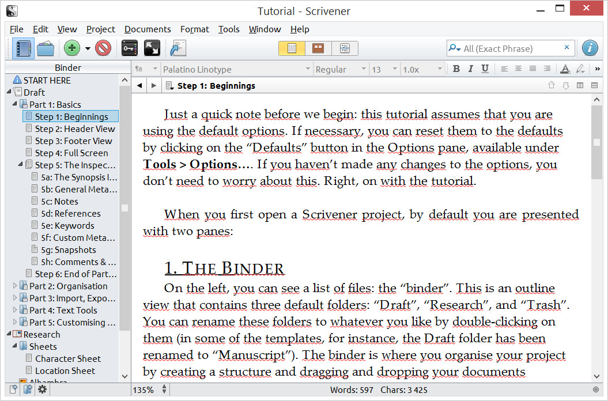
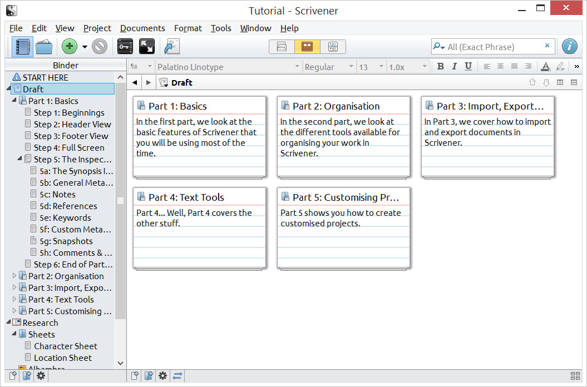
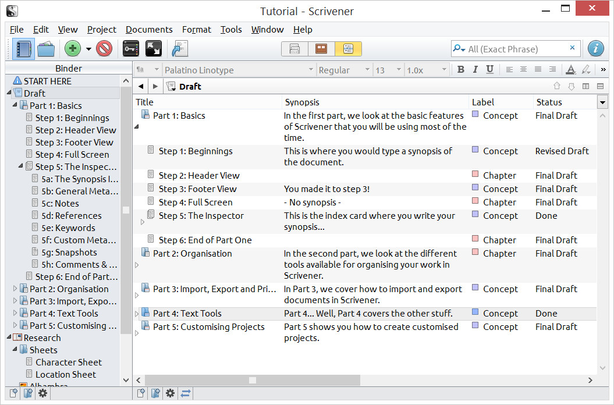

Nasz zespół redakcyjny niestrudzenie poszukuje nowych narzędzi, które mogłyby
ulżyć ciężkiej doli Technical Writerów. Dzisiaj proponujemy program, który może
być szczególnie przydatny twórcom długich, rozbudowanych dokumentów.

<!--truncate-->

### **Hello Word!**

**Chyba najbardziej podstawowym narzędziem w pracy Technical Writera jest
procesor tekstu, zaś wśród tego typu programów od lat niepodzielnie króluje Word
ze stajni Microsoftu. Rozwijany od ponad trzydziestu lat stał się przemysłowym
standardem, wykosił po drodze liczną konkurencję (Czy ktoś jeszcze dzisiaj
pamięta Lotus 123?), doczekał się darmowych zamienników (choćby w postaci
OpenOffice’a), a nawet zawitał do konkurencji - fani komputerów spod znaku
nadgryzionego jabłuszka również mają swoją wersję. Można z niego korzystać na
komórkach i tabletach, jest też dostępny w przeglądarce jako część pakietu
Office 365, zaś większość dużych firm ma jakiś swój produkt, próbujący odgryźć
kawałeczek tego tortu (przykładem jest choćby Google Docs albo Pages stworzony
przez Apple). Wyznacznikiem przydatności alternatywnych rozwiązań na rynku jest
ich kompatybilność z formatami plików od Microsoftu - nawet najwspanialszy
edytor przepadnie, jeśli nie potrafi zrozumieć poczciwego _doca_.**

**Poza formatami plików, Word na długie lata zdefiniował oczekiwania
użytkowników wobec tego typu narzędzi. Mamy więc tekst, który za pomocą
odpowiednich opcji dzielimy na rozdziały, podrozdziały itp. przypisując im
zdefiniowane style. Możemy w nim osadzić obrazy, wykresy, stworzyć spis treści,
edytować przypisy, nagłówki i stopki. Gdy ktoś nam podeśle swój dokument możemy
go skomentować lub poprawić tak, aby autor dokładnie wiedział jakie zmiany
nanieśliśmy. Wydruk będzie oddawał wiernie to co widzimy na ekranie.Długo by
wymieniać, ale faktem jest, że Word lub któryś z jego klonów to widok
powszechnie znany w naszym fachu, prawdopodobnie dlatego, że pozwala w miarę
łatwo stworzyć przyzwoicie wyglądającą dokumentację..**

**Niestety Word (jak i każdy jego naśladowca) ma swoje ograniczenia, które nie
wynikają z technologii, ale ze sposobu w jaki (i dla kogo) taka aplikacja
została zaprojektowana. Oto trzy, które nam wydają się najpoważniejsze.**

1. Brak zarządzania notatkami - każdy, kto kiedykolwiek musiał zmierzyć się z
   trudnym i skomplikowanym problemem, wie, że bez dobrych, uporządkowanych
   notatek można łatwo pogubić się i zmarnować mnóstwo czasu. Word jako taki nie
   posiada sprawnego mechanizmu, który pozwoliłby zgromadzić w jednym miejscu
   odnośniki, notki, artykuły, grafiki itp. Owszem, można je trzymać w osobnym
   pliku, ale jest to niewygodne i prowadzi dość często do bałaganu. Można też
   użyć jakiejś innej aplikacji (jak np. opisywany przez nas
   [WikidPad](http://techwriter.pl/wikidpad-opis-narzedzia/ 'WikidPad – opis narzędzia')),
   ale nie każdy lubi ciągle przełączać się pomiędzy dwoma programami, które
   posiadają różny interfejs i odmienną filozofię działania.
2. Praca z naprawdę dużym, skomplikowanym tekstem - kiedy mamy do czynienia z
   naprawdę sporym dokumentem, takim, którego ilość rozdziałów i podrozdziałów
   idzie w setki, stajemy przed poważnym problemem, gdy nagle trzeba zmienić
   jego układ. Czeka nas żmudne kopiowanie i wklejanie (nieśmiertelne Ctrl+C,
   Ctrl+V). Jednak przenosząc poszczególne rozdziały, podrozdziały lub
   paragrafy, łatwo możemy stracić orientację i spędzić długie minuty szukając
   właściwego miejsca (a i tak nie będziemy mieli pewności, że nic nie
   pomieszaliśmy dopóki chociażby pobieżnie nie sprawdzimy całości). Na
   rutynowo pojawiające się problemy z popsutymi linkami po zmianie struktury
   tekstu oraz problemy z formatowaniem litościwie spuszczamy tutaj zasłonę
   milczenia.
3. Zero-jedynkowy status dokumentu - typowy edytor tekstu nie posiada
   mechanizmu, który pozwoliłby śledzić status poszczególnych fragmentów. Wstęp
   i pierwszy rozdział są skończone i po korekcie, dwa kolejne rozdziały są
   napisane “na brudno”, zaś rozdział kolejny to dopiero wczesny szkic? Pracując
   w Wordzie musimy to zapamiętać albo jakoś zapisać. Można sobie dodać
   komentarz, tymczasowo ustawić inny styl, wreszcie dołączyć do dokumentu
   tabelkę, w której śledzimy status poszczególnych kawałków. Nie są to jednak
   rozwiązania zbyt wygodne, ani, co stanowi największy problem, nie są
   standardowe. Oznacza to, że gdy komuś wyślemy nasz tekst, nigdy nie mamy
   pewności, czy odbiorca w pełni zrozumie ile jeszcze pracy wymaga dokument.

### **Literatura i latte?**

Odkryliśmy ostatnio narzędzie, które według nas stanowi znakomity zamiennik
Worda dla ludzi, którzy borykają się z opisanymi wyżej problemami. Program
nazywa się [Scrivener](http://literatureandlatte.com/scrivener.php) i stworzony
został przez firmę o dość oryginalnej nazwie:
[Literature & Latte](http://literatureandlatte.com/). Nie jest darmowy, koszt
licencji to 45$ dla wersji na Mac Os X, 40$ dla Windows (ta wersja była
rozwijana nieco wolniej, ale różnice z każdą aktualizacją zmniejszają się),
ewentualnie można za niecałe 70$ kupić obie licencje w zestawie.

Cóż jest w nim takiego specjalnego?

Podkreślmy to jeszcze raz: tworzenie jakiegokolwiek dłuższego tekstu,
niezależnie czy jest to powieść, specyfikacja, scenariusz czy plik pomocy, to
nie tylko klepanie w klawisze. Większość edytorów tekstu jest przydatna dopiero
w momencie, gdy twórca odwalił już kawał roboty - uzbroił się w potrzebną
wiedzę, skatalogował ją, zaplanował strukturę dokumentu, zebrał potrzebne
grafiki itp. Dopiero wtedy jest sens uruchomić Worda i zacząć, paragraf po
paragrafie, realizować swój cel.

**Scrivener jest przydatny znacznie wcześniej, dzięki temu, że posiada wiele
cech, których próżno szukać u konkurencji, a które poza sprawną edycją samego
tekstu dają mu możliwość efektywnego zarządzania projektem pisania. Sprawiają
one, że Scrivener towarzyszy twórcy od pierwszego, niewyraźnego pomysłu do
gotowego dzieła.**

### **Dobry plan to elastyczny plan**

Scrivener pozwala zaplanować dokument, dzieląc go na dowolną ilość mniejszych
kawałków, a następnie dowolnie modyfikować jego strukturę. Kawałki mogą być
dowolnie małe, nie musimy ograniczać się do rozdziałów/podrozdziałów. Jeżeli
mamy taki kaprys lub potrzebę możemy nawet operować na poziomie pojedynczych
akapitów.

Podstawowym narzędziem jest znajdujący się po lewej stronie okienka skoroszyt
(ang. binder). Służy on do nawigacji pomiędzy fragmentami tekstu, notatkami,
materiałami, grafikami i wszystkim co uznaliśmy za potrzebne jako część
projektu.

\[caption id="attachment_3445" align="aligncenter"
width="300"\] Scrivener -
skoroszyt\[/caption\]

**Raz podzielony dokument możemy dowolnie modyfikować edytując poszczególny
fragment (w tym trybie każdy kawałek otwierany jako mały, osobny dokument), cały
dokument (wtedy wygląda to bardzo podobnie jak w Wordzie) lub zmieniając jego
układ przeciągając i upuszczając gotowe fragmenty.**

### **W tym szaleństwie jest metoda**

Klasyczny edytor (np. Word) zakłada, że długi dokument będziemy pisać tak samo
jakbyśmy pisali list albo notatkę. Zaczniemy od początku i klawisz za klawiszem
będziemy zdążali do końca. Tymczasem dokumentację często tworzy się wyrywkowo,
uzupełniając poszczególne rozdziały w miarę,
[jak kolejni SME znajdują czas](http://techwriter.pl/kim-jest-sme/ 'Kim jest Subject Matter Expert (SME) i jak z nim rozmawiać?'),
żeby nas oświecić. Tutaj w przypadku Worda szwankuje nawigacja. co prawda
pozwala nam wygodnie przenieść się do rozdziału lub podrozdziału, ale
odpowiednie paragrafy musimy znaleźć już sami. W Scrivenerze dla jednego
dokumentu mamy aż trzy różne widoki - klasyczny, tablica korkowa i zarys.

Widok klasyczny nie odbiega od tego, do czego przyzwyczaiły nas inne edytory.
Osoba, która lubi “wyrzucić” z siebie ciurkiem pierwszą wersję tekstu, a potem
ją szlifować i zmieniać zacznie zapewne od niego.

\[caption id="attachment_3447" align="alignnone"
width="1055"\]
Scrivener - widok klasyczny\[/caption\]

**Dla kogoś, kto lubi planować, bardziej przydatny będzie widok tablicy korkowej
(ang. corkboard). Możemy do niej poprzypinać wirtualne karteczki, na których w
jednym, dwóch zdaniach piszemy, co będzie zawarte w danej części dokumentu.
Przykładowo ten akapit mógłby na swojej “karteczce” mieć frazę “opis tablicy
korkowej z przykładem”. Tak poprzypinane karteczki możemy dowolnie przesuwać,
zamieniać miejscami, układać w drzewka rodzic-dziecko. Będziemy to robić tak
długo, aż uzyskamy porządaną strukturę całości. Potem pozostaje jeszcze wypełnić
fragmenty właściwą treścią i tekst gotowy.**

\[caption id="attachment_3450" align="alignnone"
width="1055"\]
Scrivener - widok tablicy korkowej\[/caption\]

**Ostatni widok, zarys (ang. outliner), to świetne narzędzie do kontrolowania
postępu. Mamy w nim listę naszych kawałków, każdemu możemy przypisać rolę w
dokumencie oraz status (taki jak “pierwszy szkic”, “do korekty”, “do redakcji”,
“gotowy” itp.).**

\[caption id="attachment_3451" align="alignnone"
width="1055"\]
Scrivener - widok zarysu\[/caption\]

**Widok możemy zmienić w każdej chwili, wystarczy jedno kliknięcie. Zmieniliśmy
strukturę korzystając z tablicy korkowej i chcemy zobaczyć jak będzie się
prezentował sam tekst? Nie ma sprawy - przechodzimy do widoku klasycznego i
przewijając w górę i w dół widzimy nowy układ. Dodaliśmy w edytorze kilkanaście
akapitów, które wcześniej nie były planowane i chcemy widzieć jak wpasowują się
w całość? Przechodzimy do widoku zarysu i widzimy ich umiejscowienie i aktualny
status.**

### Risercz!

Kolejne funkcjonalności, których nie sposób przecenić z punktu widzenia
Technical Writera to zbieranie i zarządzanie notatkami. Nic nie stoi na
przeszkodzie, żebyśmy obok samego tekstu umieścili dowolną ilość folderów
przeznaczonych na notatki i materiały. Będziemy je mieli zawsze pod ręką, można
je tagować, grupować, oznaczać kolorami, linkować, gromadzić w kolekcje. Możemy
osadzać pliki innych programów (a nawet filmy), które staną się integralną
częścią naszego projektu.

By z nich skorzystać nie trzeba się przełączać pomiędzy wieloma aplikacjami, ba,
nie trzeba nawet przełączać się pomiędzy dwoma oknami Scrivenera. Dzielimy ekran
i możemy wyświetlać notkę, równocześnie dłubiąc w odnoszącym się do niej
fragmencie tekstu. Jest to znakomite rozwiązanie np. dla tłumaczy.

### Scrivening? Co proszę?

Brzmi ciekawie? Nic dziwnego, gdyż program ten stworzony został przez pisarzy
specjalnie z myślą o twórcach długich, skomplikowanych tekstów. Pracownicy
Literature & Latte sami na co dzień używają Scrivenera, piszą go zresztą z myślą
o sobie. Mały, kameralny projekt, tworzony przez pasjonatów, który powstał z
myślą o rozwiązaniu pewnych konkretnych problemów może być ciekawym i użytecznym
uzupełnieniem arsenału Technical Writera.

Zresztą każdy może się przekonać o tym na własnej skórze (a właściwie na własnym
projekcie), bowiem twórcy udostępniają darmową, 30-dniową wersję próbną. Nie
jest ona ograniczona w żaden sposób i mamy pełen dostęp do wszystkich funkcji
programu.

**Osoby, które zdecydują się rzucić okiem na Scrivenera zapraszamy serdecznie do
podzielenia się wrażeniami w komentarzach.**
