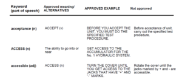

Jakiś czas temu pisaliśmy o
[podstawowych zasadach użycia kontrolowanego języka angielskiego (Simplified Technical English)](http://techwriter.pl/simplified-technical-english-wprowadzenie/).
W tym artykule dowiecie się więcej dlaczego i jak go używać.

Kontrolowany język ogranicza niejednoznaczność i złożoność tekstów. Zmniejsza to
ryzyko nieścisłości, które mogą wystąpić w wyniku niezrozumienia napisanego
dokumentu.

Poprzez minimalizacje liczby słów i złożoności zdań oraz przestrzeganie reguł
pisania, język kontrolowany jest lepiej „czytany” zarówno przez komputer jak i
przez istotę ludzką.

## Gdzie jest używany?

Język kontrolowany używany jest w określonych środowiskach w różnych typach
dokumentacji technicznej, jak na przykład instrukcje konserwacji i obsługi.

Może być używany jako wytyczne do pisania lub kontroluje tekst w celu
weryfikacji zgodności.

## Jak to się robi?

Do przygotowania dokumentacji pisanej kontrolowanym językiem, najczęściej
używana jest międzynarodowa specyfikacja ASD-STE100. Wspominaliśmy o tym w
naszym poprzednim artykule
[(tutaj)](http://techwriter.pl/simplified-technical-english-wprowadzenie/).

## Do czego potrzebna jest specyfikacja ASD-STE100?

Zawiera ona zastaw reguł pisania oraz kontrolowany słownik, posiada
wystarczającą ilość słów do wyrażenia każdego zdania technicznego. Słowa zostały
wybrane ze względu na ich prostotę i łatwość rozpoznawania.

Jak to działa? Żeby się nie rozpisywać, przejdziemy do konkretów 😊 i podamy
kilka przykładów.

### Reguły pisania

1. Używaj odpowiednich rodzajników (a, an, the) przed rzeczownikiem lub zaimków
   wskazujących (this, these).

| Oryginalny tekst                           | Tekst napisany w STE                           |
| ------------------------------------------ | ---------------------------------------------- |
| Remove, and safely discard cleaning cloth. | Remove, and safely discard the cleaning cloth. |

Komentarz: Tam gdzie jest to możliwe używaj rodzajników do nazw technicznych.

2. W jednym zdaniu powinna być napisana tylko jedna instrukcja.

| Oryginalny tekst                                                                                                                                           | Tekst napisany w STE                                                                                                                                          |
| ---------------------------------------------------------------------------------------------------------------------------------------------------------- | ------------------------------------------------------------------------------------------------------------------------------------------------------------- |
| Holding the overspeed governor, remove remaining three nuts and three washers, which attach overspeed governor to gearbox. Three nuts are to be discarded. | Hold the overspeed governor. Remove the remaining three nuts and the three washers that attach the overspeed governor to the gearbox. Discard the three nuts. |

Komentarz: Niektórzy autorzy tworzą długie zdania, ponieważ chcą powiedzieć
czytelnikom wszystko, co wiedzą. Jeśli Waszą wiedzę chcecie przekazać w jednym
lub dwóch zdaniach, możecie przytłoczyć czytelnika.

3. Instrukcje powinny być jak najbardziej szczegółowe.

| Oryginalny tekst                                  | Tekst napisany w STE                                |
| ------------------------------------------------- | --------------------------------------------------- |
| Different temperatures will change the cure time. | Increase the temperature to decrease the cure time. |

Komentarz: Tekst oryginalny nie opisuje co trzeba zrobić, obniżyć czy podwyższyć
temperaturę.

4. Nigdy nie używaj strony biernej w tekście, zawsze użyj strony czynnej.

| Oryginalny tekst               | Tekst napisany w STE               |
| ------------------------------ | ---------------------------------- |
| The screws should be replaced. | The mechanics replaces the screws. |

Komentarz: Tekst oryginalny nie mówi kto ma wykonać tę czynność.

5. Nie używaj więcej niż trzech rzeczowników po rząd.

| Oryginalny tekst                               | Tekst napisany w STE    |
| ---------------------------------------------- | ----------------------- |
| Runway light connection resistance calibration | Runway light connection |

Komentarz: W tekście oryginalnym rzeczownikiem głównym jest "calibration".
Ponieważ ciężko jest znaleźć zależność pierwszego rzeczownika z ostatnim, to
zdanie może być zbyt trudne do odczytania dla osoby nie posługującej się biegle
językiem angielskim. W tekście napisanym w STE rzeczownikiem głównym jest
"connection", rzeczowniki są bliżej siebie a zatem łatwiejsze do odczytania i
zrozumienia.

### Słownik

Słownik w języku kontrolowanym określa słowa, przy pomocy których należy budować
tekst.

W języku angielskim niektóre słowa (np. "set", "run", "go" czy "take") mają
różne znaczenia. Dlatego słownik ogranicza dopuszczone słownictwo do słów, które
mają bezpośrednie i wyraźne znaczenie.

Poniżej wycinek tabeli i wyjaśnienie.

Co jest ważne? ...Dwa przykazania 😉.

Po pierwsze trzeba zapamiętać, że zatwierdzone słowa kluczowe i zatwierdzone
przykłady są pisane wielkimi literami!

Po drugie niezatwierdzone słowa, niezatwierdzone przykłady oraz przypisane
znaczenie są zapisywane małymi literami!

A poniżej interpretacja poszczególnych kolumn:

**Pierwsza kolumna** - słowo kluczowe (część mowy): każde dozwolone słowo w STE
jest dozwolone tylko jako określona część mowy.

Słowo  ACCESS (n) jest dozwolone tylko jako rzeczownik, ale nie jako czasownik.

Nawet jeśli słowo acceptance (n) jest oznaczone jako niedozwolone, może być
używane w STE, gdy jest częścią konkretnej terminologii firmowej, np. jako
"kryteria akceptacji".

**Druga kolumna** - zawiera definicję dozwolonego słowa, w tym przypadku -
ACCESS lub podane są słowa, które są dozwolone w STE  i mogą zastąpić słowa
niezatwierdzone jak acceptance (n).

**Trzecia kolumna** - tekst napisany wielkimi literami, podaje przykładowe
zdania użycia dla slow zatwierdzonych. Jeżeli słowo kluczowe przedstawione w
kolumnie pierwszej, nie jest dozwolone w STE (małe litery), to w kolumnie tej
znajdują się przykładowe zdania z alternatywami przedstawionymi w kolumnie
drugiej (duże litery).

**Czwarta kolumna** - tekst napisany małymi literami, wskazuje zdania nie zgodne
z STE. Kolumna ta jest wypełniana tylko w przypadku słów, które nie są dozwolone
(pozostaje pusta w przypadku słów zgodnych z STE).

Oprócz ogólnych wyrazów zatwierdzonych w specyfikacji ASD-STE100 potrzebny jest
też wykaz zatwierdzonych wyrazów dla danego biznesu 😊, a to już oddzielny
temat, żeby Was nie zamęczyć.

## Czy warto go używać?

Warto wspomnieć, jakie mogą być zalety używania STE. Wbrew pozorom może okazać
się, że w Waszej firmie lub w biznesie, dla którego pracujecie zastosowanie
kontrolowanego języka przeniesie określone korzyści.

Użycie STE pomaga zmniejszyć koszty tłumaczeń poprzez eliminacje zbędnych słów.
Autor używa tylko słów zgodnych ze słownikiem. Może zwiększyć Waszą
produktywność i wydajność poprzez dostarczenie kompletnych i dokładnych
informacji w dokumencie.

Pisanie zgodnie z STE narzuca dyscyplinę na język, którego używacie, ważne aby
jedno słowo miało tylko jedno znaczenie, to ogranicza Wasz wybór 😉 .

## ..i już na koniec

Mamy nadzieje, że ten artykuł pomoże Wam zdecydować, czy warto zainwestować
trochę czasu i nauczyć się tych zasad oraz pracy ze słownikiem.

Jeśli będziecie chcieli zgłębić temat języka kontrolowanego lub mieliście już
doświadczenie z tworzeniem dokumentacji z użyciem STE, zachęcamy do kontaktu i
komentarzy!
