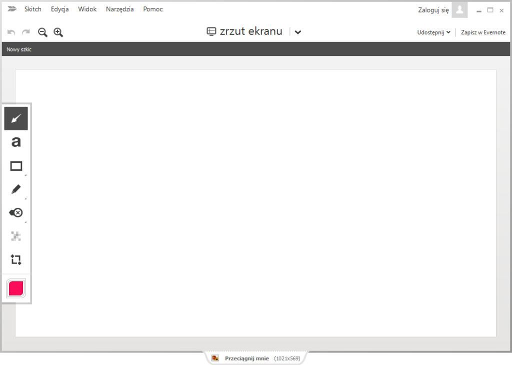
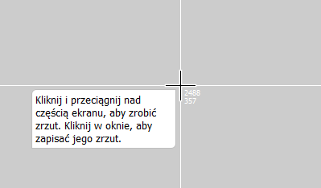
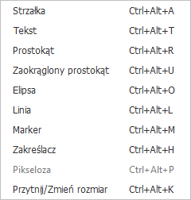
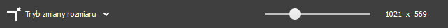
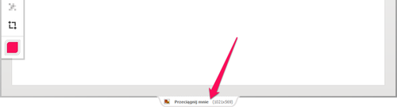
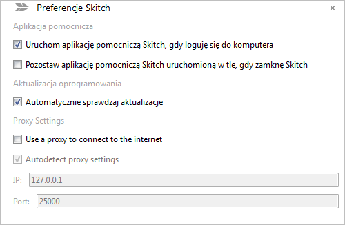

Kolejne narzędzie do robienia zrzutów ekranu. Tym razem bierzemy pod lupę
aplikację [Skitch](https://evernote.com/skitch/) od autorów programu
[Evernote](https://evernote.com/). Czy jest to propozycja warta rozważenia pod
kątem tworzenia dokumentacji?

<!--truncate-->

W momencie pisania artykułu najnowszą dostępną wersją była **2.3.2.173**.
Program można zainstalować na systemach operacyjnych takich jak **Windows**,
**Mac OS**, **iOS** i **Android**.
[Strona aplikacji](https://evernote.com/skitch/) rozpoznaje system operacyjny
urządzenia, z którego ją otwieramy i automatycznie daje nam link do ściągnięcia
odpowiedniej wersji. Plik instalacyjny dla Windowsa ma rozmiar 34 MB. Właśnie na
tej wersji skupimy się w dalszej części artykułu.

### Pierwsze wrażenie

Po uruchomieniu programu naszym oczom ukazuje się całkiem przyjemny dla oka i
przejrzysty interfejs. W górnej części okna znajdziemy menu z opcjami, w prawej
górnej części okna link umożliwiający zalogowanie się do konta Evernote, a po
lewej stronie narzędzia przydatne do obróbki zrzutów ekranu. Opcja zrobienia
zrzutu ekranu jest dobrze wyróżniona, więc nie ma problemu z jej znalezieniem.
Poruszanie się po aplikacji jest intuicyjne i nie powoduje frustracji u nowego
użytkownika.

### Zrzucanie ekranu

Do dyspozycji mamy dwa tryby wykonywania zrzutów ekranu. W pierwszym trybie
możemy przechwycić albo wycinek ekranu (w tym celu musimy przytrzymać lewy
klawisz myszy i zaznaczyć część ekranu, którą chcemy przechwycić) albo całe okno
(w tym celu musimy kliknąć wewnątrz wybranego okna). Jest to dość wygodne
rozwiązanie. W drugim trybie możemy wykonać zrzut całego ekranu. Niestety w
trybie przechwytywania wycinka ekranu nie mamy okienka z powiększeniem, które
ułatwia trafienie we właściwy fragment ekranu. Jest to zaskakujące, ponieważ
taka opcja wydaje się być standardem nawet w darmowych aplikacjach tego typu.
Jedynym ułatwieniem jest pozycja kursora w pionie i poziomie.

Ponadto zrobienie nowego zrzutu ekranu powoduje zamknięcie obecnie otwartego
obrazu. Przez to nie ma możliwości zrobienia zrzutu i dołożenia go od razu do
obecnie otwartego obrazu. Może być to spore utrudnienie w sytuacji kiedy chcemy
zrobić zrzut całego okna "na raty" przechwytując jego pojedyncze elementy w
osobnych krokach.

### Edycja zrzutów

Do przechwyconych elementów ekranu można dodawać elementy takie jak tekst,
strzałki, kształty, zakreślenie, wyróżnienie, różne emblematy graficzne czy...
pikselozę 😊 Tak właśnie w programie została przetłumaczona na polski opcja
pozwalająca na rozmycie części obrazu.

Podstawowa paleta daje nam do wyboru kilka dobrze wyróżniających się kolorów. W
trybie zaawansowanym możemy wybrać już dowolny kolor. Obrazki można łatwo
przycinać i skalować. Jednak sama opcja zmiany rozmiaru obrazka jest uboga.
Można tylko użyć suwaka, który skaluje obraz z zachowaniem proporcji. Nie można
zmienić niezależnie wysokości i szerokości ani wybrać jednostek.

### Zapisywanie i udostępnianie

Aplikacja pozwala zachować wykonane zrzuty ekranu do formatów PNG, BMP, JPG,
TIFF i PDF. Jeśli posiadamy konto w Evernote, to możemy też zachowywać nasze
obrazki bezpośrednio do tego programu. Wygodną funkcją jest zakładka
**"Przeciągnij mnie"** w dolnej części okna, dzięki której można od razu
przeciągnąć obrazek w żądane miejsce. Na przykład można go przeciągnąć na pulpit
co spowoduje zachowanie go do pliku w formacie JPG lub do programu pocztowego
dzięki czemu zostanie on wstawiony od razu do e-maila.

Nasze obrazki możemy też udostępniać na Facebooku, Twitterze czy LinkedIn.
Niestety aplikacja nie oferuje możliwości zachowywania warstw, co według nas
jest dużym brakiem. Oznacza to, że wszystkie obiekty są "spłaszczane" i nie ma
możliwości późniejszej edycji pojedynczych elementów.

### Ustawienia aplikacji

Zestaw dostępnych ustawień jest bardzo skromny. Jedyne opcje jakie mamy do
dyspozycji to automatyczne uruchamianie aplikacji w trakcie startu systemu,
minimalizowanie okna aplikacji do paska zadań po jej zamknięciu, automatyczne
sprawdzanie aktualizacji oraz łączenie się do internetu za pomocą proxy. Próżno
szukać ustawień dotyczących łapania kursora czy skrótów klawiszowych.

### Spolszczenie interfejsu

Wiadomo już, że wyboru języka interfejsu nie dokonamy z poziomu ustawień
aplikacji. Jednak nie oznacza to, że polska wersja językowa nie jest dostępna.
Po prostu język aplikacji jest ustawiany automatycznie na podstawie wybranych
ustawień językowych w systemie operacyjnym. Dla jednych może to być ułatwienie,
a dla innych ograniczenie.

### Werdykt

Skitch bardziej sprawdzi się jako aplikacja do szybkiego dzielenia się obrazkami
ze znajomymi (np. w celu pokazania gdzie na mapie znajduje się restauracja, o
której wspominaliśmy podczas ostatniego spotkania) niż jako konkretne narzędzie
do tworzenia zrzutów ekranu na potrzeby dokumentacji. Według nas istnieją lepsze
i też darmowe narzędzia, chociażby opisywany przez nas
[Greenshot](../zrzucanie-ekranu-opis-narzedzi/index.md), które oferują
zdecydowanie więcej możliwości. Poza nowoczesnym interfejsem nie dostrzegamy
żadnego aspektu, w którym Skitch miałby przewagę nad innymi tego typu
aplikacjami. Chyba, że nie rozstajecie się z aplikacją Evernote, to wtedy Skitch
wydaje się być oczywistym wyborem 😊
