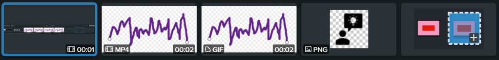
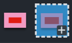
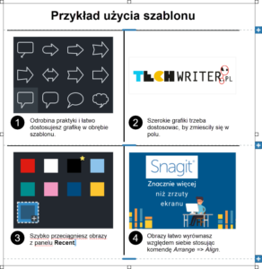

Przed Wami kolejny artykuł na temat
[Snagita](https://www.techsmith.com/screen-capture.html?utm_source=influencer&utm_medium=partner&utm_campaign=brandexp&utm_content=techwriterpl).
Tym razem test najnowszej wersji.

### Wstęp

Miałem szczęście uzyskać wczesny dostęp do nowego Snagita 2021 i wypróbować jego
[nowe ulepszenia](https://www.techsmith.com/snagit-features.html). Wyglądają one
ciekawie. Zakres zmian interfejsu nie jest gigantyczny, jest to wciąż w dużej
mierze to samo użyteczne narzędzie, jakim jest Snagit 2020. Nie musisz się
martwić o to, że nie połapiesz się w nowej wersji. Powiedziałbym, że są to
zmiany z gatunku: małe kroki w dobrym kierunku. Tym razem nie ma tu
rewolucyjnych nowych narzędzi, ale otrzymaliśmy parę niezwykle pomocnych
ulepszeń. Są to detale, które mają duży wpływ na użyteczność wcześniej
wprowadzonych rozwiązań, plus parę mniejszych szlifów.

Tyle, jeśli chodzi o ulepszenia widoczne gołym okiem. Zmiany zaszły także pod
maską, osiągi zostały podkręcone.

Zgodnie z zasadą Alfreda Hitchcocka, wedle której należy zacząć od trzęsienia
ziemi, a potem napięcie powinno rosnąć, sekcje ze szczegółami zmian też są
ułożone w takiej kolejności, a ostatnia stanowi kulminację zmian.

### Recent Captures Tray i inne ulepszenia interfejsu

Panel z ostatnio wykonanymi screenami wygląda jeszcze lepiej i jest bardziej
praktyczny. Przeciąganie miniatur i zamienianie ich miejscami stało się
wizualnie bardziej klarowne. Dobrze widać co, dokąd przeciągasz. Po
przeciągnięciu widać mikro-animację, żeby nie było wątpliwości co do efektu
końcowego.

Same miniatury wyglądają estetyczniej i jasno pokazują dodatkowe informacje,
takie jak rodzaj i format pliku, długość filmu czy gifu.

Po kliknięciu prawym na miniaturę doszła nowa komenda _Close Other Captures._

## 

Znajdziesz też małe usprawnienia w innych obszarach. W **Select** suwak do
przeciągania czułości „Snap to Object” nie jest stale widoczny, a tylko wtedy,
gdy opcja jest aktywna.

Dla narzędzia **Pen** doszła opcja „Smooth”, która wygładza ręcznie narysowaną
kreskę. Jeśli użyjesz opcji „Create as vector” możesz włączać i wyłączać
wygładzanie dla utworzonej linii.

### Jeszcze lepsza wydajność

Choć nie narzekałem na prędkość mojego Snagita 2020, z którego korzystałem pod
Windows 10, to według producenta, wersja 2021 jest jeszcze szybsza. Faktycznie,
testowałem ją i śmiga. Snagit odpala się błyskawicznie. Czas reakcji na
wciśnięcie przycisku PRINT SCREEN, przejście od zrobienia screena do edycji, czy
czas sklejania zdjęcia panoramicznego są naprawdę imponujące.

Opcja „Smart Move” dla **Move** dostała turbodoładowanie. **Simplify** działa
szybciej i lepiej.

Poprawiło się też wyświetlanie linii w **Edytorze**.

Podsumowując, nowy Snagit działa szybciej, tworzone screeny wyglądają lepiej w
**Edytorze**, a oprócz tego, zapisywane animowane gify będą mieć mniejszy
rozmiar na dysku.

### Magnify 2.0

Podrasowane narzędzia będę określał jako **2.0**, a ich wcześniejszy stan przed
Snagit 2021 oznaczał będę jako **1.0**.

Z narzędzia **Magnify 1.0** (nie mylić ze **Spotlight and Magnify**) korzystałem
niezbyt często, między innymi dlatego, że moje ilustracje nie wymagają
powiększania fragmentów obrazu, żeby pokazać detale. Myślę jednak, że po obecnym
uaktualnieniu, nie przepuszczę okazji, by z niego korzystać.

Po pierwsze, doszła możliwość wybrania innych kształtów niż koło. Teraz dostępny
jest zwykły prostokąt i prostokąt z zaokrąglonymi rogami.

Poziom zaokrąglenia można dostosować przeciągając żółty punkt, aż do uzyskania
owalu. Z okręgu też uzyskasz owal, co wcześniej nie było możliwe.

**Magnify 1.0** pokazywał tylko to, co było pod spodem obszaru „lupy”.
Powiększenie zawsze przykrywało obszar oryginalnej wielkości razem z dodatkowym
buforem zależnym od wielkości lupy. **Spotlight and Magnify** miał tę przewagę,
że można było przesunąć powiększony obraz, by uwidocznić okolicę powiększonego
fragmentu.

W **Magnify 2.0** wystarczy kliknąć na krzyżyk na środku lupy, by przeciągnąć
powiększenie z dala od tego, co pod spodem.

## 

Wtedy powiększenie nie zasłania oryginalnego fragmentu z jego otoczeniem, a
czytelnik nie traci kontekstu.

### Themes 2.0

Tutaj mamy kolejne kroki w dobrym kierunku. **Themes 1.0** pozwalają na
definiowanie podstawowych kolorów dla tworzonych obiektów.

## 

Dla każdego unikalnego stylu obiektu można kliknąć „+” i w ten sposób dodaje się
on do obecnie wybranego theme. Po wyeksportowaniu, możesz podzielić się tym
theme, razem ze wszystkimi szczególnymi stylami obiektów.

W **Themes 2.0** obiekty tworzone dla **Callout** czy **Text** mogą mieć z góry
ustaloną czcionkę. Do tego, można łatwo zdefiniować, czy chcesz domyślny cień
dla obiektów czy nie. W pewnych sytuacjach cienie są przydatne, gdy chcemy
podkreślić to, że narysowana strzałka jest czymś odrębnym od tła, na którym
leży.

Kiedy rysuję schematy, zawsze wyłączam cienie. Teraz, specjalnie w tym celu,
mogę stworzyć theme, który będzie bez cieni. Dzięki, TechSmith!

Doszła też funkcja podglądu: wybierając kolory i czcionki zobaczysz na bieżąco
jak wyglądają obiekty po wprowadzonej zmianie.

## 

### Simplify 2.0

Każdy, kto robi wiele screen shotów przedstawiających interfejsy, powinien się
przyjrzeć temu narzędziu. Już wcześniej był to potężny kombajn do ułatwiania
pracy. Teraz ten kombajn działa jeszcze szybciej, sprytniej i ma dodatkowe
funkcje.

**Simplify 1.0** tworzył uproszczone grafiki na bazie wskazanego zdjęcia. Można
było też dostosować wybrane kolory. Jednak począwszy od **2.0** będzie można
zapisać zestaw kolorów i użyć je przy kolejnych upraszczanych obrazach, co
pozwoli na wizualną spójność i zaoszczędzenie czasu. Co ciekawe, jeśli zmieni
się paleta barw używanych przez Twoją firmę, wystarczy, że dostosujesz daną
„Color Palette” i zmiana nastąpi w każdym otworzonym obrazie, który korzysta z
**Simplify** i tej palety. W ten sposób można szybko wprowadzić zmianę na
szeroką skalę. Oprócz tego, w **Tool Properties** doszła też opcja „Move” do
przesuwania obiektów automatycznie stworzonych przez **Simplify** lub tych
narysowanych ręcznie. Choć „Draw” też pozwala przesuwać, to dzięki „Move”
skupisz się na samym przesuwaniu, bez ryzyka, że przypadkiem zaczniesz rysować
kształty.

### Template 2.0

Myślę, że tutaj nastąpił największy przełom. Wcześniej mniej korzystałem z
szablonów, głównie dlatego, że nie tworzę instrukcji „krok po kroku”. Szkoda, że
nie mogę się cofnąć z tym narzędziem do czasów, gdy tworzyłem takie materiały
tuzinami. W każdym razie, z ciekawości zacząłem eksperymentować z szablonami, by
zobaczyć co zmieniło się od wersji 2020 i widzę tu wiele rzeczy godnych uwagi.

Zarówno w **Template 1.0** i **2.0** są dwa sposoby na użycie szablonu.

Możesz zaznaczyć interesujące Cię obrazy i użyć komendy _Combine in Template_,
po czym wybierasz szablon, kolejność ułożenia obrazów, nadajesz tytuł i podpisy.

Ewentualnie możesz kliknąć umieszczony na górze ekranu **Create => Image from
Template**. Wtedy otrzymujesz pusty szablon z napisami do dodania i obrazami do
przeciągnięcia z **Recent Captures Tray**.

## 

Nowością w **2.0** jest to, że po przejściu wszystkich kroków _Combine in
Template_ możesz dostosowywać i rozwijać sekwencję obrazów bezpośrednio w
obszarze roboczym **Edytora**.

Nie musisz na nowo wybierać tego samego szablonu dla zmienionego zestawu
obrazów, nie ustalasz ich kolejności po raz drugi, nie wpisujesz jeszcze raz
tytułu i podpisów.

Klikając prawym przyciskiem w obszarze roboczym możesz usunąć część nagłówkową i
podpis (_Remove Section_). Tak samo łatwo wykasujesz nadmiarowe kroki.

Żeby zmienić kolejność kroków, po prostu przeciągnij odpowiadające im zdjęcia.
Zostało to wykonane bardzo intuicyjnie. Możesz dostosować odstępy między
sekcjami, przeciągając niebieską linię. Klikając na niebieski plus, z łatwością
dodasz nowy, pusty krok, nagłówek czy podpis. Dla nowego, pustego kroku
wystarczy przeciągnąć obrazek z **Recent Capture Tray** i przeedytować podpis.

Teraz, nawet jeśli na początku wybierzesz złą kolejność kroków, nie musisz
rozpoczynać tej procedury od nowa – możesz poprzeciągać kroki bezpośrednio na
gotowym obrazie z ich całą sekwencją. Dzięki tym możliwościom, możesz przerabiać
to, co już zostało stworzone.

Łatwiej też jest usunąć lub zmodyfikować elementy, które zawiera szablon, takie
jak linie horyzontalne, automatyczna data czy logo TechSmith. Nie podoba Ci się
fragment szablonu? Dostosuj go lub usuń.

Snagit 2021 dostarczany jest z listą darmowych szablonów z możliwością
dokupienia ich większej liczby w ramach usługi
[TechSmith Assets for Snagit](https://www.techsmith.com/tutorial-snagit.html?utm_source=influencer&utm_medium=partner&utm_campaign=brandexp&utm_content=techwriterpl).

Możliwe, że wcześniej nie stosowałem tego narzędzia, bo nie miałem dobrego
pomysłu na jego wykorzystanie.

Ostatnio w mojej firmie użyłem szablonów po sesji z udostępnianiem ekranu.
Kolega inżynier rysował na moich oczach pomocniczą ilustrację (sesję bez
rysowania na wirtualnej tablicy uważam za straconą). Zrobiłem kilka screen
shotów na różnych etapach tworzenia i komplikowania rysunku 😊. Następnie,
zaznaczyłem potrzebne obrazy i z pomocą komendy _Combine in Template_ stworzyłem
sekwencję kroków, do której dodałem opisy. Voila! Efekt cieszy oko i mogłem to
szybko wrzucić do mojej notatki po spotkaniu. Dobra rzecz.

Innym ciekawym sposobem na wykorzystanie szablonu jest zrobienie notatki o
bieżących zadaniach. Wybierasz szablon z obrazami ustawionymi w osi pionowej, z
numerowanymi krokami. Wpisujesz tam hasłowe opisy Twoich głównych zadań oraz
grafikę ilustrującą zadanie - może być to fragment maila, screen z prezentacji,
powiększenie obrazu notatki, itp. Następnie ustawiasz zadania zgodnie z ich
ważnością. Po wykonaniu zadania opisywanego w danym kroku, usuwasz sekcję.
Dochodzi nowe zadanie – dodajesz nowy krok. Zmieniły się priorytety – zamieniasz
kroki miejscami.

W dowolnym momencie możesz udostępnić taki obraz osobie, z którą pracujesz, co
daje pogląd na to, czym obecnie się zajmujesz i jakie masz priorytety.

### Koniec

To już jest koniec mojego podsumowania. Wybór tego, co najważniejsze w Snagit
2021 jest oczywiście subiektywny. Wciąż uważam, że zmiany w **Template 2.0**
wprowadzają nową jakość i komfort pracy z narzędziem.

Każdy, zależnie od branży, specjalności i projektu korzysta ze Snagita inaczej.
Być może nie planujesz stosować szablonów.

Korzyścią, którą odczują wszyscy użytkownicy nowej wersji to zwiększona
wydajność aplikacji.

Osoby chcące rozwijać swój warsztat w dziedzinie pracy z multimediami, powinny
zapoznać się z biblioteką kursów
[TechSmith Academy](https://academy.techsmith.com/). Każdy znajdzie tam coś dla
siebie. Przekrój filmów jest tam naprawdę szeroki, od zupełnych podstaw jak
nagrywać ekran, po robienie nagrań wideo z użyciem zewnętrznego mikrofonu.
Początkującym użytkownikom polecamy natomiast zapoznanie się z tutorialami:
[Snagit tutorials](https://www.techsmith.com/tutorial-snagit.html?utm_source=influencer&utm_medium=partner&utm_campaign=brandexp&utm_content=techwriterpl).

Cenę nowego narzędzia znajdziecie na stronie:
[Snagit pricing page](https://www.techsmith.com/snagit-pricing.html?utm_source=influencer&utm_medium=partner&utm_campaign=brandexp&utm_content=techwriterpl).
Kwota jaką trzeba wydać zależy od zastosowania – indywidualnego, biznesowego,
edukacyjnego lub non-profit.
