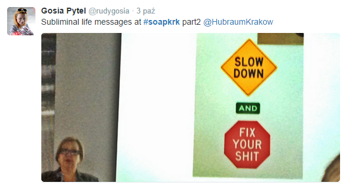
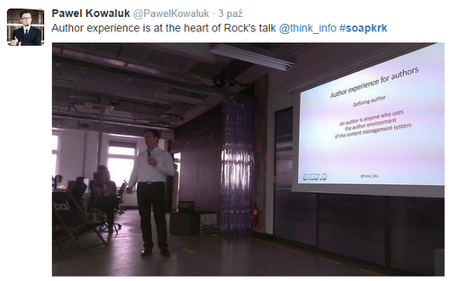
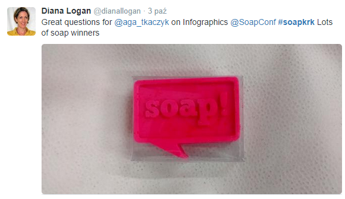

Drugi dzień konferencji [soap!](http://soapconf.com/) przyniósł jeszcze więcej
prezentacji, które podzielone zostały na dwie ścieżki. Każdy mógł wybierać i
przebierać w tematach. Niestety nie byliśmy w stanie uczestniczyć we wszystkich
prezentacjach, dlatego przedstawiamy skrótowo tylko niektóre z nich.

<!--truncate-->

### Zaufanie przede wszystkim

I to nie tylko w związku. [Rahel Ann Bailie](http://soapconf.com/speakers/)
mówiła o tym jak ważne jest budowanie zaufania użytkowników. Jest to przede
wszystkim proces ciągły. Raz zbudowane zaufanie nie trwa wiecznie, dlatego
musimy cały czas je utrzymywać. Otoczenie generuje więcej bodźców niż jesteśmy w
stanie przetworzyć. Otrzymujemy za dużo treści, dlatego podchodzimy do niej
bardzo selektywnie i wybieramy to na czym chcemy się skupić. Jest to "efekt
spotkania towarzyskiego"
([cocktail party effect](http://en.wikipedia.org/wiki/Cocktail_party_effect)).
Skupiamy się tylko na wybranym bodźcu, a resztę filtrujemy, przez co stają się
one szumem w tle. Jest to sytuacja podobna do tej w jakiej znajduje się osoba
biorąca udział w spotkaniu towarzyskim, podczas którego jest w stanie skupić się
na pojedynczej rozmowie w gwarnym pomieszczeniu. Taka osoba wybiera sobie
podświadomie rozmowę, na której się skupi zanim do niej dołączy. Poziom
zaangażowania w rozmowę zależy od poziomu zaufania. Rahel wspomniała również o
tym, że nasze reakcje w życiu codziennym, czyli wtedy kiedy funkcjonujemy
"offline" nie różnią się od naszych reakcji podczas funkcjonowania "w sieci". W
obydwu sytuacjach mamy takie same odczucia dotyczące akceptacji i odrzucenia.
Obecna generacja szuka
[społecznego dowodu słuszności](http://pl.wikipedia.org/wiki/Spo%C5%82eczny_dow%C3%B3d_s%C5%82uszno%C5%9Bci).
Dlatego nie możemy mieć podejścia, że media społecznościowe są po prostu
kolejnym kanałem dostarczania treści, ponieważ przy takim założeniu realizują
komunikację jednostronną, co nie jest w żaden sposób społecznościowe. Potrzebna
jest odpowiedź ze strony użytkowników. Nie chodzi tylko o liczbę polubień i osób
obserwujących dany wpis czy profil. Jest to bardziej skomplikowane, tak samo jak
ludzie. Rahel przytoczyła
[The Cluetrain Manifesto](http://en.wikipedia.org/wiki/The_Cluetrain_Manifesto).
Wrzucanie nowych treści nie jest wystarczające, trzeba rozmawiać z
użytkownikami. Tylko w taki sposób zdobędziemy ich zaufanie.

### Źle napisana instrukcja może zabić

Taką drastyczną wizję zaserwował swoim słuchaczom
[Ray Gallon](http://soapconf.com/speakers/). Swoją prezentację rozpoczął od
przedstawienia sytuacji, jaka miała miejsce we francuskim mieście Epinal. Grupa
24 pacjentów, którzy zostali poddani naświetlaniu promieniowaniem jonizującym z
powodu raka prostaty, otrzymało nadmierną dawkę. W związku z tym 5 z nich
zmarło. Okazało się, że przyczynami tej tragedii były ludzki błąd, słabo
zaprojektowany interfejs maszyny oraz brak instrukcji obsługi w języku
francuskim. Treść powinna być zaprojektowana w taki sposób, żeby pomagać
użytkownikom podejmować lepsze decyzje. Użytkownicy chcą się dowiedzieć z
dokumentacji do czego nasz produkt służy, jak wykonać określone czynności i
jakie mają możliwości wyboru. Chcą też zrozumieć po co muszą wykonać daną
czynność i co jest istotne. Dlatego pokażmy im najprostszą drogę do wykonania
zadania, a pozostałe możliwości opiszmy w takim miejscu, żeby użytkownik mógł je
łatwo znaleźć jeśli będzie tego chciał. Ray zwrócił uwagę na fakt, że tak
naprawdę głównym kanałem komunikacji klientów z firmą jest jej produkt, ponieważ
z nim spędzają najwięcej czasu. Użytkownicy denerwują się kiedy marnują czas,
dlatego treść, która zawarta jest w interfejsie naszego oprogrogramowania musi
być dobrze zaprojektowana, ponieważ to bezpośrednio przekłada się na
doświadczenie użytkownika. Klientów nie interesują silosy. Oni komunikują się z
firmą, a nie z poszczególnymi działami. Dlatego musimy tworzyć zintegrowane
społeczności wewnątrz i na zewnątrz firmy, w których każdy jest udziałowcem.
Słuchajmy tego co mają do powiedzenia użytkownicy. Nie zawsze usłyszymy to co
byśmy chcieli, nie zawsze musimy akceptować ich uwagi, ale naszym obowiązkiem
jest ich wysłuchać. Takie społeczności potrzebują animacji, która stymuluje,
bardziej niż moderacji, która tłumi. W jaki sposób można wcielić opinie
użytkowników w produkt? Tradycyjny model zakłada, że po jednej stronie jest
firma a po drugiej społeczność użytkowników. Pośrodku jest komunikacja
techniczna, która następnie wpływa na produkt. W nowoczesnym podejściu firma i
użytkownicy to jedna społeczność, w której użytkownicy komunikują się z firmą za
pomocą produktu i mają realny wpływ na jego kształt. Włączając użytkowników w
decyzje dotyczące produktu budujemy ich lojalność. Podziękujmy im za każdym
razem kiedy byli pomocni.

### Autor też człowiek

Informacja to droga dwukierunkowa, dlatego nie możemy się skupiać wyłącznie na
użytkowniku końcowym. Musimy również pamiętać o autorze i jego doświadczeniu
(author experience, AX) o czym mówił w swojej prezentacji
[Rick Yagodich](http://soapconf.com/speakers). Rick starał się pokazać nam
bolączki
[systemów zarządzania treścią (CMS)](http://pl.wikipedia.org/wiki/System_zarz%C4%85dzania_tre%C5%9Bci%C4%85).
Większość platform CMS nie jest zbudowana po to, żeby łatwiej prowadziło się
biznes, ale po to, żeby oferować super funkcje. Występuje sporo rozbieżności nie
tylko pomiędzy różnymi programami, ale nawet wewnątrz jednego programu.
Terminologia i sposób wykonywania zadań nie są spójne co powoduje, że
użytkownicy są zagubieni. Kiepsko zorganizowane systemy są frustrujące, a
sfrustrowani użytkownicy nie potrafią się dostatecznie skupić i popełniają
więcej błędów. Dlatego powinniśmy pamiętać o spójności i ponownym
wykorzystywaniu treści. Ta sama wiadomość powinna być dostarczana wszystkimi
kanałami komunikacji w taki sam sposób. Nasze treści powinny dostosywać się do
danego kanału. Nie możemy karać użytkownika za to, że używa takiej a nie innej
platformy, np. telefonu komórkowego, do przeglądania dostarczanych przez nas
treści. Systemy powinny być całościowe, wszystkie komponenty powinny się ze sobą
komunikować, tak jak np. w przypadku [Amazona](http://www.amazon.com/), gdzie
system do obsługi magazynu współpracuje bezpośrednio ze stroną internetową do
zamawiania towaru. Pamiętajmy, że zarządzanie treścią nie dotyczy technologii,
tylko biznesu, dlatego trzeba ułatwiać ludzki proces zarządzania treścią.

### Zamiast opowiadać narysuj

A dokładniej przedstaw co masz na myśli za pomocą infografiki.
[Agnieszka Tkaczyk](http://soapconf.com/speakers) opowiadała o swojej przygodzie
z tworzeniem infografik.
[Krzywa zapominania](http://pl.wikipedia.org/wiki/Krzywa_zapominania) pokazuje,
że po 24 godzinach zapominamy 50% tego co przeczytaliśmy, a po roku praktycznie
wszystko. Oczywiście jest to uzależnione od wielu czynników, natomiast wyraźnie
widać ogólny trend ilości informacji jaką jesteśmy w stanie zachować w pamięci.
Po trzech dniach, pamiętamy tylko 10% tekstu, ale jeśli jest to tekst z
obrazkami, wtedy ta wartość wzrasta do 65%. Dlatego warto pomyśleć o zastąpieniu
części dokumentacji infografiką. Infografika składa się z wizualizacji danych
(np. wykresu) obrazków i tekstu. Ważne jest to, żeby obrazki były jak
najbardziej związane z tematem, bo wtedy wzmacniają przekaz i powodują, że
użytkownik bardziej zwraca uwagę na treść infografiki. Agnieszka przedstawiła
nam jak powinna być zbudowana infografika. Okazuje się, że tak samo jak stara
dobra [rozprawka](http://pl.wikipedia.org/wiki/Rozprawka), o której uczyli nas w
szkole, czyli ze wstępu, rozwinięcia i zakończenia. Wstęp powinien przykuć uwagę
użytkownika i przybliżyć temat infografiki. W rozwinięciu przechodzimy do
meritum za pomocą kombinacji tekstu, obrazków i danych. W zakończeniu
przedstawiamy podsumowanie przedstawionych informacji. Agnieszka przedstawiła
nam kilka wskazówek co do tworzenia infografik. Jedna infografika powinna
przedstawiać jedną większą historię, a nie kilka małych. Ponadto powinna być
jasna, przejrzysta i zawierać dane, które są istotne. Musimy też pamiętać, o
tym, żeby ograniczyć ilość tekstu do minimum i skupić się przede wszystkim na
stronie wizualnej. Bardzo istotna jest też dokładność naszych infografik.
Wizualizacje muszą zgadzać się z tym co przedstawiają liczby i tekst. Powinniśmy
też podawać źródła swoich danych oraz informować odbiorców jeśli przedstawione
dane mogą ulec zmianie. Każda niedokładność w inforgrafice powoduje, że jest ona
mniej wiarygodna. Prowadząca przedstawiła również za i przeciw, które należy
wziąć pod uwagę decydując się na tworzenie infografik. Przede wszystkim szybciej
się je czyta i lepiej zapamiętuje, a do tego ich tworzenie to niezła zabawa. Nie
zmienia to jednak faktu, że nie wszystkie dokumenty można zamienić na
infografikę. Dodatkowo, niektórzy mogą traktować taki sposób przedstawiania
informacji jako niezbyt poważny. Ponadto tworzenie infografik jest czasochłonne,
wymaga dodatkowego oprogramowania oraz odpowiedniej platformy do publikacji. Na
koniec swojej prezentacji Agnieszka przytoczyła kilka przykładów pokazujących
jak można ograniczyć ilość dokumentacji stosująć infografiki. Jeden z przykładów
pokazywał infografikę dotyczącą instalacji, która miała raptem siedem kroków.
Dokument, który opisywał ten sam proces zawierał 329 słów. Innym przykładem była
infografika z kodowaniem kolorami, która przedstawiała infrastrukturę sieci.
Dokument, który opisywał tą infrastrukturę liczył 457 słów.

### Znajdź wspólny język

Kadra kierownicza niekoniecznie widzi taką samą wartość w dobrze zaprojektowanej
treści jak osoby, które ją tworzą. [Noz Urbina](http://soapconf.com/speakers)
starał się nam pokazać jakich sposobów i argumentów możemy użyć, żeby zmienić
punkt widzenia naszych przełożonych. Spójrzmy z perspektywy kierownika,
zastanówmy się jakie problemy spędzają mu sen z powiek. Rozmawiajmy ze
współpracownikami, zorientujmy się co się dzieje wokół nas. Dzięki temu dowiemy
się jakie problemy może potencjalnie rozwiązać nasza strategia zarządzania
treścią. Pokażmy w jaki sposób strategia zarządzania treścią wpływa na strategię
firmy. Jest to część jej kapitału. Łatwy dostęp do informacji dla użytkownów,
pomoc zintegrowana z produktem, spójność przekazywanych informacji powodują, że
użytkownicy postrzegają firmę jako całość, a nie zbiór poszczególnych działów.
Dobra strategia zarządzania treścią jest potrzebna również dlatego, że świat
przechodzi na dystrybucję wielokanałową. Poszczególne kanały to elementy
układanki. Użytkownicy korzystają z wielu kanałów (np. Twitter, Facebook,
YouTube) w wielu formatach (komputer, tablet, komórka) na różne sposoby. Może to
być korzystanie sekwencyjne, czyli rozpoczynanie czynności na jednym urządzeniu
i kontynuowanie na innym, lub jednoczesne, które z kolei może polegać na
równoczesnym wykonywaniu kilku czynności na kilku urządzeniach albo wykonywaniu
jednej czynności na kilku urządzeniach. Dlatego musimy tworzyć spójną treść,
która jest taka sama bez względu na platformę, z której korzystamy. Prowadzący
wieścił nadejście ery [metadanych](http://pl.wikipedia.org/wiki/Metadane), które
sukcesywnie stają się tak samo ważne jak treść. Stosowanie metadanych jest dość
czasochłonne, ale powoduje, że maszyny lepiej rozumieją treści i dzięki temu
potrafią ją wykorzystywać bardziej efektywnie. Przykładem może być wyszukiwarka
[Google](https://www.google.com). Sposób podejścia do wyników zmienił się. Kilka
lat temu wpisując pytanie "O której zamyka się sklep ASDA?" wynikiem
wyszukiwania był link. Obecnie wynikiem wyszukiwania jest konkretna odpowiedź.
Noz poruszył też kwestię nadążania za zmianami. Okazuje się, że strategia gdzie
staramy się nadążyć za trendami to strategia skazana na porażkę. Zamiast tego
powinniśmy wprowadzić strategię przewidywania. Zamiast obserwować konkurencję,
bądźmy wizjonerami. Treść wpływa na doświadczenie użytkownika. Jej wartość to
nie ilość stworzonych instrukcji, ale stopień w jakim odpowiada na potrzeby
użytkownika. Treść wpływa w bardzo dużym stopniu na postrzeganie marki przez
klientów, dlatego jej jakość jest tak ważna.

