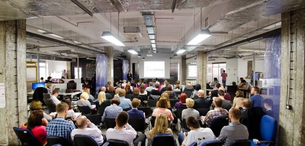
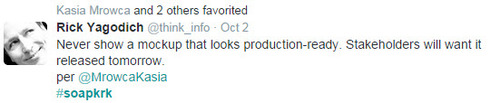
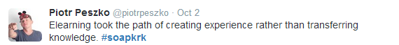

Our soapy friends were kind enough to prepare an English version of
[the day 1 summary](http://techwriter.pl/soap-2014-relacja-z-pierwszego-dnia/)
that we published some time ago. Enjoy!

<!--truncate-->

After our general summary, it’s time to get down to the nitty-gritty. Today we
are providing you with a short overview of the presentations that were delivered
during the first day of [the soap! 2014 conference](http://soapconf.com/).

### Games not only for kids

The honour of warming up the audience fell to
[Monika Konieczny](http://soapconf.com/speakers/). She started her presentation
with a story about a cat called Teodor who wanted to help its owner and do the
laundry. For a moment we were wondering where the story was going. The finale
was quite drastic because Teodor almost died buried under a voluminous and
badly-written manual. Monika tried to show how to avoid such tragedies. As we’ve
already heard more than once, manuals are too long, too boring, and
incomprehensible. What’s more, it’s difficult to find a common denominator for
the readers of the manual because each of us pays attention to different
details, and the way we use a particular product often depends on how much
experience we have with it. Additionally, there are problems of linguistic
nuances and a high context culture, like the Polish one. The first step to
solving these issues is creating the user profile and narrowing down the
characteristics of the target audience. You also have to put yourself in the
user’s shoes, try to create potential stress situations to understand how the
user might feel in such moments and what information he or she will need. Monika
also tried to convince us that technical documentation does not have to be
boring. It’s enough to give it characteristics of a novel and write it so that
we would want to read it ourselves. Everyone wants to feel like a superhero.
According to Monika, we should use this fact to our advantage and create
documentation that makes users feel that each thing they learn from that
documentation gives them new superpowers. Apart from the novel aspect, we also
heard about introducing elements of a game into documents, a.k.a. gamification.
The mere addition of ranks and badges is no longer sufficient as the users get
bored quickly. It’s possible to introduce microgames - smaller challenges that
the user can undertake - or exploration of the interface where a particular
action triggers a response from the system and allows for discovering new
functions. Monika’s examples of increasing the attractiveness of documentation
by introducing elements of novels and games included a comic book for Ruby
programmers, [Ribbon Hero 2](http://www.ribbonhero.com/) – the great return of
the well-known Clippy from MS Office, and the
[Stack Overflow portal](http://stackoverflow.com/).

### Plenty is sometimes a plague

As we were told by [Kasia Mrowca](http://soapconf.com/speakers/), the same is
the case for a surplus of functions in an application. Clients always want to
add many new functionalities to their app. Before we satisfy their needs, we
should stop for a moment and think where their requirements come from. Sometimes
the problem lies in the process and adding a new option to the interface doesn’t
change anything. It’s the process that needs to be modified. Sometimes new
functions are requested out of habit. Someone has always had one switch or the
other in the previous software and wants to have the same one in the new
application even though it’s completely unnecessary. Kasia mentioned the pareto
rule according to which 80% of users use only 20% of functions, Microsoft Word
can be an example here. Each new function makes the application more complex. It
translates into its usability and the level of complexity of the accompanying
documentation. One has to know the limit just like with eating chocolate. After
a certain amount, it’s no longer a pleasure.  
So, how do we stay sane? All departments in the company have to cooperate on a
friendly basis. Instead of interfering with one another, let’s exchange ideas.
Let’s not focus only on our field, but keep the common goal in mind at all
times. At the end, a warning from the presentation: never show a model of an
application that is too similar to the final version because the clients will
want to have the application immediately.

### Learning by entertaining

E-learning, like life, is all about choices. Not to waste words,
[Sabina Misiarz-Filipek](http://soapconf.com/speakers/) started her presentation
with a video that was divided into parts. After each part we had to choose what
should happen next thus deciding how the story developed. Unfortunately, we
killed the main hero. However, this wasn’t the most important thing. What really
mattered was that we could learn without feeling bored. Before we start creating
a training we need to specify the target audience and the level of their
computer literacy as it impacts how they will feel during the course. Sabina
referred to, among others,
[the ARCS didactic model](http://www.learning-theories.com/kellers-arcs-model-of-motivational-design.html).
The main factor which keeps the users’ attention during the training is their
motivation. It’s also important how relevant to them are the skills that they
are going to gain during the training. We can build user confidence by informing
them how long the training will last, what form it will have, and what hardware
will be required. The level of satisfaction can be increased by adding funny
elements, interesting images and elements of a game. In the past, the strategy
of creating e-learnings assumed a smaller number of long courses. Currently, the
trend is to create a bigger number of shorter courses, games, videos, or
infographics. During the presentation, Sabina provided many interesting
examples. One of them was an introductory course for new employees in the form
of a game. Another example was [Lifesaver](https://life-saver.org.uk) – a game
in the form of a movie that teaches how to make proper choices in emergency
situations that we can encounter in everyday life.

### The power of the diagram

It has long been known that “a picture is worth a thousand words.” This old
truth was demonstrated by [Kevin Duncan](http://soapconf.com/speakers/), who
showed how to skilfully use diagrams to make stories we tell more interesting
and concise. One such method is the “whittling wedge”. We start from a wide
range of options, approximately 10, then narrow the choice down to around 3
options. In the end we recommend one of them. Another method is the “bow tie”.
We start our story from a few options, recommend one of them and then move on to
a broader discussion expanding the details. A diagram that shows the
"motivational dip" is also an interesting example. At the beginning, when we
take on something new, we experience a rapid increase in motivation, which lasts
up to a point. Then comes the decline in motivation and the stabilization phase
during which we learn. This phase may end with either success or failure. In
order to streamline our activities we can use the “priority matrix”. With the
help of four criteria - urgent, not urgent, important and unimportant – we
divide the area into four sections. The first one includes matters which are
urgent and unimportant and can be delegated or performed straightaway. The
second section contains urgent and important matters that we need to address
immediately. The third section covers matters which are not urgent and not
important. They can be ignored. The last section contains issues that are not
urgent but important. They must be considered and planned. During his
presentation, Kevin gave many other examples that came from his book
[“The Diagrams Book”](http://www.thediagramsbook.com). In addition to the use of
diagrams, we’ve also learned one more important thing. Using the word s\*\*t
isn't out of place during a presentation 😉

### Valuable experience

Unfortunately, the last presentation wasn’t utterly clear, at least for us.
[Rajeev Kumar Tiwari and Rajesh Khurana](http://soapconf.com/speakers/) couldn’t
come to Krakow and so they presented remotely. It considerably affected the
level of understanding the speakers who talked about user experience. They
started with explaining that UX is a very broad term that can’t be defined in a
few words. It's a cross-discipline into which companies need to invest to be
able to develop. It isn’t a layer or a component of a product but its integral
part that isn’t limited to a particular technology. Then, the speakers presented
the process of creating user experience and showed how the role of a technical
writer changed in that process.

Translated: Agnieszka Tkaczyk Proofread: Paweł Kowaluk
