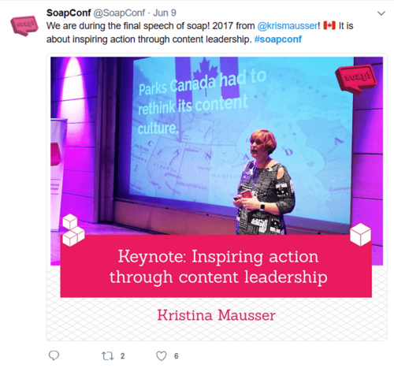
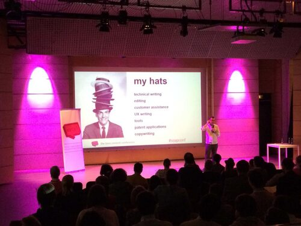
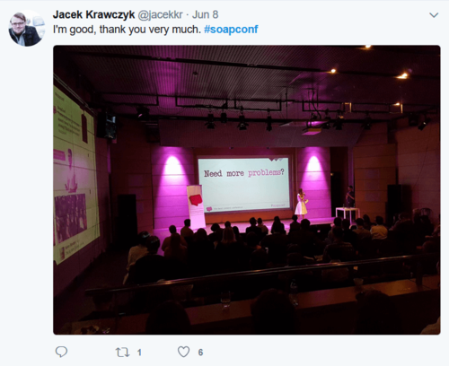
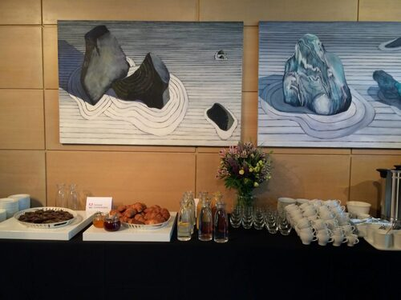

Piąta edycja polskiego święta tech commu minęła w błyskawicznym tempie. Za nami
dwa, a właściwie trzy intensywne dni wypełnione spotkaniami, wystąpieniami,
prezentacjami, warsztatami, imprezami i rozmowami – wszystko w międzynarodowym
towarzystwie, pod tegorocznym hasłem rozwiązywania problemów związanych z
treścią. Tych, którzy byli i tych, którzy być nie mogli - zapraszamy na relację
z perspektywy Techwriter.pl.

## Gdzie się działo?

Soap! już po raz drugi gościł w
[Muzeum Sztuki i Techniki Japońskiej Manggha](http://manggha.pl/), w samym
centrum Krakowa. Widok na Wawel, klimatyczny ogród, dobrze nagłośniona sala
główna, nowoczesna architektura - właściwie trudno o lepsze miejsce dla tego
typu konferencji. Kwestie organizacyjne zostały dopięte na ostatni guzik,
poczynając od świetnego kateringu i konferencyjnego Wi-Fi, a kończąc na
"twitterowej" ścianie, na której na bieżąco można było śledzić reakcje
uczestników.

Konferencji towarzyszyła cała masa konkursów zorganizowanych przez partnerów i
organizatorów. Techwriter.pl rozdawał firmowe kubki, sponsorzy przyznawali
licencje na swoje flagowe oprogramowanie, a pewien szczęśliwiec wygrał markowy
leżak soap!. Sporą popularnością cieszył się konkurs selfie, w którym stawką był
designerski budzik. Można było nie tylko obłowić się w firmowe gadżety, ale
przede wszystkim porozmawiać, zarówno z przedstawicielami lokalnych firm, jak i
software'owych gigantów zza oceanu.

Nie zabrakło dobrego frizzante, ton ciastek z sosem waniliowym, przeróżnych
wariantów obiadowych, a nawet koncertu na żywo. Aktualne ekspozycje muzealne
były dosłownie na wyciągnięcie ręki, bo soapowcy mogli zwiedzać je za darmo.

Jedynym minusem świetnej pogody był czynnik rozleniwiający. Po kilku minutach
spędzonych w ogrodzie aż nie chciało się wracać do klimatyzowanej sali. Ale
zdecydowanie warto było się przemóc.

## Co się działo?

Co do uczestników - było naprawdę międzynarodowo, co bardzo nas cieszy.
Dominowały kraje środkowoeuropejskie, ale nie zabrakło przedstawicieli Irlandii,
Szwajcarii, USA, Kanady i wielu innych części świata. Bez większego trudu można
było natknąć się na uczestników z Litwy, Ukrainy, Niemiec czy Słowacji, a jedna
z prelegentek pochodziła z Filipin.

Po krótkim wstępie i przedstawieniu tegorocznych sponsorów, konferencję
rozpoczęło energetyczne wystąpienie brytyjsko-szwajcarskiego duetu, Dirka
Göhmanna i Cate Mackenzie, którzy w zawrotnym tempie opowiadali o różnicy między
"user documentation" i "loser documentation". Podkreślali, że dobra dokumentacja
musi być łatwa do odnalezienia w sieci. Przypominali, jak bardzo istotne są
informacje zwrotne od użytkowników. Wspomnieli również o pomyśle na "docathon",
czyli odpowiednik "hackathonu" dla twórców dokumentacji.

Nie było to jedyne grupowe wystąpienie na soap!, bo chwilę później scenę
przejęła trójka prezenterów: Barbara Szwarc, Justyna Adamczyk i Mateusz Wiktor.
Opowiadali o przeprowadzce z wiki do dity, posługując się bardzo rozbudowaną
metaforą historii miłosnej. Ich romans z Confluence zakończył się nieszczęśliwie
z powodu praktycznego – produkt, nad którym pracowali, „przerósł” możliwości tej
platformy. Popularne narzędzie zostało przedstawione jako dobre narzędzie do
współpracy, ale kiepski pomysł na trzymanie dokumentacji (pogląd ten został
zresztą powtórzony kilkukrotnie przez innych prezenterów). Migracja odbyła się
przy pomocy skryptu, co jednak nie pozwoliło uniknąć dwóch miesięcy pracy przy
„ręcznym sprzątaniu” treści.

Samo hasło „move to DITA” przewijało się przez całą konferencję i wygląda na to,
że z problemami związanymi z migracją treści boryka się naprawdę sporo osób, co
zresztą idealnie wpisało się w tegoroczną tematykę soap!.

Nie sposób opisać wszystkich prezentacji, bo każdego dnia było ich aż
jedenaście, każda wypełniona treścią i przedstawiona w innym stylu. Z pewnością
na wzmiankę zasługuje wystąpienie Jarka Orłowskiego, który najpierw opowiadał o
przeróżnych "kapeluszach" noszonych przez Technical Writerów, potem przedstawił
cztery historie, w których łatwo było się odnaleźć każdemu autorowi
technicznemu, a na koniec sprezentował publiczności kopię książki-albumu
własnego autorstwa.

Bardzo profesjonalnie wypadło wystąpienie Patricka Boseka, który zachwalał ditę
nie tylko przy pomocy metafor i argumentacji słownej, ale również konkretnych
danych liczbowych, na przykładzie dwóch różnych firm. Bez ogródek wypowiadał się
również na temat przyszłości dokumentacji technicznej, przepowiadając, że z
powodu nieustannej pogoni za efektywnością, pewna część Technical Writerów
będzie musiała zmienić kiedyś zawód.

Profesjonalizmem z pewnością dorównywał mu Stefan Gentz, który podczas zabawnej
i dynamicznej prezentacji poruszył tematy takie jak kurczący się "attention
span" użytkownika, czy też związek treści marketingowej z dokumentacją
techniczną.

Łukasz Górnicki opowiadał o zacieśniającej się współpracy Technical Writerów i
programistów, którzy mogą działać w jednym zespole. Szymon Serwatka i Gosia
Pytel (znana m.in. z
[MeetContent](http://techwriter.pl/relacja-z-kolejnej-edycji-krakowskiego-meetcontent/))
mówili o ewolucji szkoleń, przedstawiając skomplikowany proces porzucania
drukowanych materiałów treningowych i przenoszenia ich do sieci. Prześmieszne
wystąpienie Paddy'ego McShane'a z powodzeniem można było odebrać jako irlandzki
stand-up, czego jednak nie sposób mieć mu za złe.

Mówiąc krótko, było bardzo intensywnie i różnorodnie. Wystąpienia różniły się
tematyką, atmosferą i charakterem prezenterów. Różniły się również poziomem
(choćby językowym), co oczywiście było nie do uniknięcia. Jako Technical
Writerzy (stanowiący lwią część publiczności), lubimy sobie ponarzekać, dlatego
można było spotkać się z opinią, że zabrakło wystąpień przekazujących konkretną
wiedzę, którą dałoby się zastosować w codziennej pracy.

W porządku, ale właśnie od tego były konferencyjne warsztaty! Przeczytacie o
nich poniżej.

## Co jeszcze się działo?

Konferencję poprzedził dzień wypełniony praktycznymi warsztatami – Edu Summit. 7
czerwca tegoroczni soapowcy przybyli do [hub:raum](https://www.hubraum.com/),
strefy co-workingowej mieszczącej się na dynamicznie rosnącym krakowskim
Zabłociu, by uczyć się dity, myślenia projektowego, programowania prezentacji,
prowadzenia narracji UX i wielu innych.

Zdecydowanie było w czym wybierać. Warsztaty różniły się zarówno tematyką, jak i
czasem trwania, a nam udało się wziąć udział w dwóch z nich.

Daniel Barrio Fierro, podczas zajęć *The Joy of Coding Slides*, wprowadzał nas w
tajniki przygotowywania prezentacji na modłę deweloperską. Najpierw
zaprezentował praktyczne i estetyczne walory tego typu slajdów, kusząc efektami,
o których zwykli użytkownicy Power Pointa mogą jedynie pomarzyć. Następnie, krok
po kroku, przeprowadził nas przez wszystkie niezbędne kroki, jakie należy
podjąć, by zacząć realizować swoją wizję idealnej prezentacji. Podczas
kilkugodzinnej, drobiazgowo zaplanowanej sesji, uczestnicy mieli okazję przejść
od kroków podstawowych, takich jak zakładanie własnego repozytorium na
[GitHubie](https://github.com/) lub konfigurowanie arcyprzydatnego edytora
[Atom](https://atom.io/), po tworzenie własnych prezentacji za pomocą kapitalnej
opensourcowej biblioteki [reveal.js](http://lab.hakim.se/reveal-js/). Efekt?
Schludne, szybkie, niezawodne slajdy, które kontrolujesz w 100%, przechowujesz
na GitHubie, odpalasz w przeglądarce i sterujesz... smartfonem.

## 

Tymczasem warsztat o "UX narrative", prowadzony przez znanego nam już z
MeetContent
[Wojciecha Aleksandra](http://techwriter.pl/soap-meetcontent-po-raz-drugi-relacja/),
był zgoła odmienny. Było mnóstwo dyskusji, pomysłów, kreatywności, eksperymentów
myślowych i odgrywania ról. Mogły się przydać nawet umiejętności aktorskie.
Dlaczego? Bo próbowaliśmy spojrzeć na design jak na dialog z użytkownikiem,
narrację, którą należy przeprowadzić w jak najlepszy sposób. Okazuje się, że
interfejs można zaprojektować za pomocą słów (lub przynajmniej zacząć go
projektować). I nie jest to tak szalone, jak brzmi. To interaktywne spotkanie
rzuciło nowe światło na kilka elementów, które bardzo łatwo umykają nam podczas
projektowania jakichkolwiek rozwiązań dla użytkownika.

## Soap! rośnie

Soap! zdecydowanie się rozwija. Konferencja, która rozpoczynała jako lokalne
wydarzenie, na naszych oczach przeradza się w istotny, międzynarodowy punkt na
tech commowej mapie Europy, jednocześnie nie zatracając atmosfery wydarzenia
organizowanego przez paczkę przyjaciół. Przyjemnie na to patrzeć i przyjemnie
brać w tym udział, dlatego z pewnością wrócimy tu za rok!
