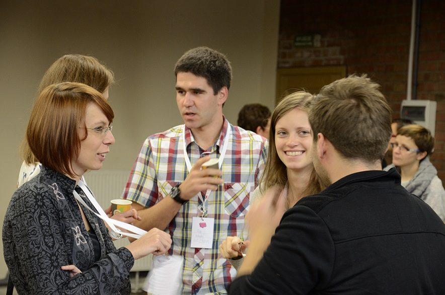
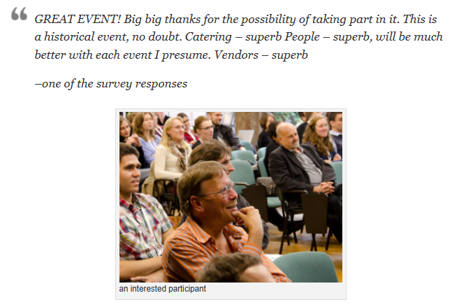
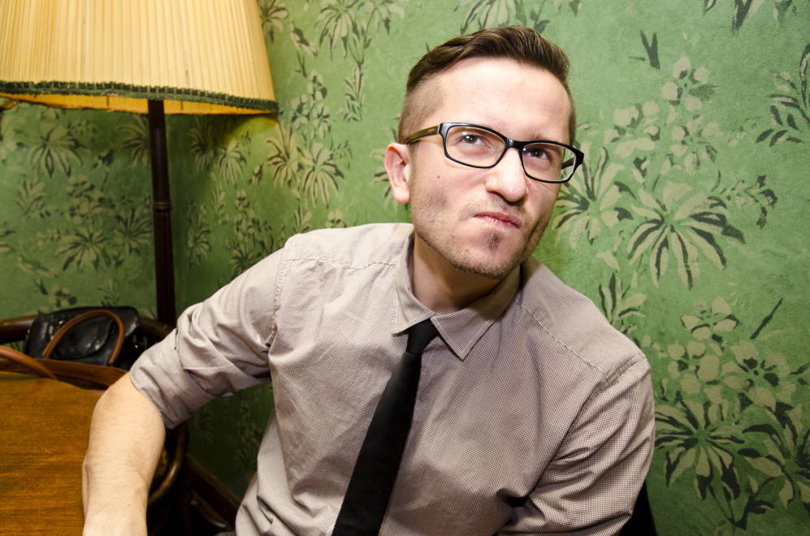
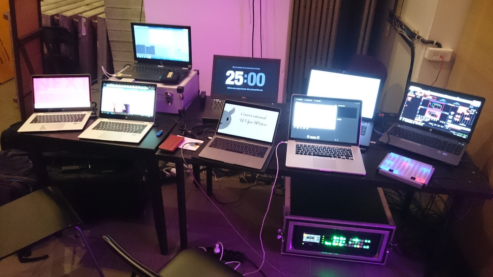
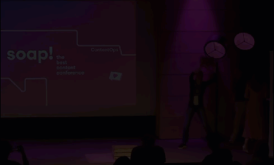
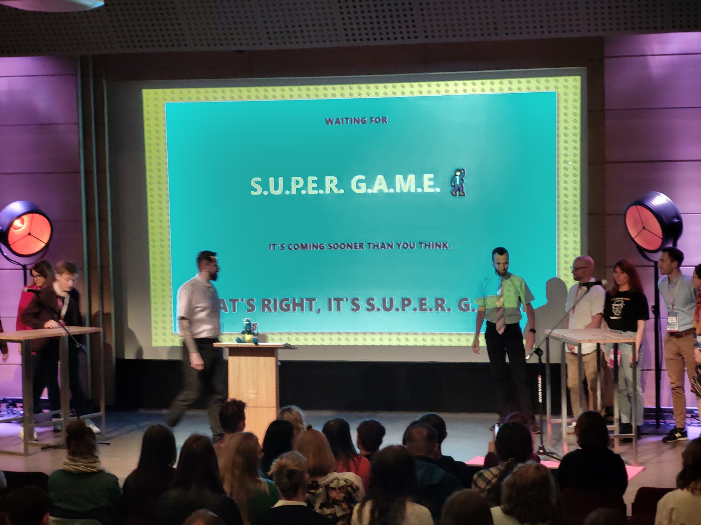

Konferencje soap! zajmują szczególne miejsce w sercach osób żyjących komunikacją
techniczną. Na łamach techwriter.pl z dumą zamieściliśmy relacji z każdej
edycji. Wydarzenia te miały duży wpływ na zawiązanie się społeczności technical
writingowej i przyczyniły się do przyspieszenia jej rozwoju. Z jubileuszowego
artykułu dowiesz się:

- Skąd wział się pomysł na tę konferencję?
- O co chodzi z tym różowym mydłem?
- Co kryje się za literami S-O-A-P?
- Jak przebiegał rozwój tej inicjatywy i co z niej wynikło?

<!--truncate-->

## Od autora

Uczestniczyłem trzy razy w konferencjach soap! w 2018, 2022 i 2023. Za każdym
razem ubawiłem się przednio, poznałem wiele ciekawych tematów i miałem
przyjemność porozmawiać z bardzo kontaktowymi ludźmi. soap! słynie z niezwykle
przyjaznej atmosfery i charakterystycznego klimatu, który tworzą organizatorzy
wraz z uczestnikami.

## Pomysł

W 2013, Paulina Dygoń, Gosia Radymiak i Paweł Kowaluk pracowali w tej samej
firmie. W obrębie ich zespołu dokumentacyjnego zapadła decyzja o przejściu z
DocBook do innego narzędzia. Gosia miała wtedy niespełna rok doświadczenia w IBM
gdzie poznawała standard DITA. W związku z przejściem na inne rozwiązanie,
członkowie zespołu mieli dużo pytań. Razem doszli do wniosku:

> Nie ma szans, że tylko my spotkalismy sie z tymi problemami, ktoś już
> wcześniej musiał to rozgryźć.

Dlatego też pojechali w trójkę do Londynu na trzydniową konferencję :
[Congility](https://www.ditawriter.com/interview-with-noz-urbina-about-the-upcoming-congility-conference/)
na której prelegentem był [Noz Urbina](https://www.linkedin.com/in/nozurbina/).

Konferencja było bardzo udana, wypełniały ją spotkania, nawiązywanie kontaktów,
przekazywanie wiedzy.

Po powrocie, trójka bohaterów przedstawiła pomysł żeby firma wysłała ich do
Wielkiej Brytanii na delegację ale koszt był niebanalny. Był wtedy czerwiec 2013
roku. Postanowili w październiku tamtego roku zrobić własną konferencję w
Polsce.

## Stan branży w 2013

Jak wyglądała wtedy scena technical writingu? Nie wiadomo ilu technical writerów
było wtedy w Polsce. Osoby wykonujące ten zawód narzekały na izolujące
doświadczenie zawodowe i ograniczony feedback od ekspertów, z którymi pracowali.
Nasi bohaterowie czuli potrzebę zwiększenia świadomości o branży. Brakowało
wtedy takich kierunków na studiach, które oferowałby taką wiedzę.

## Pierwszy soap!

### Przygotowania

> Robimy długi research?

> Nieee, nauczymy się robiąc.

Miał to być świeży start dla technical writingu. Młodość, dynamiczna społeczność
dla technical writerów i specjalizacji powiązanych, takich jak tworzenie grafik
i tłumaczenia.

Czemu "soap!"? Mydło miało symbolizować świeżość. Wzięło się ono z koncepcji
baniek zamieszkiwanych przez różnych specjalistów od treści, którzy nie mieli
świadomości siebie nawzajem. Więcej szczegółów poznacie w
[relacji](https://techwriter.pl/namydleni-po-raz-trzeci/#o-co-chodzi-z-tym-r%C3%B3%C5%BCowym-myd%C5%82em)
z 2015 roku.

Po wybraniu głównego symbolu, postanowili rozpisac skrót:

- _Strategy_
- _Opportunity_
- _Advancity_
- _Professionalism_

Słowa brzmią ambitnie, profesjonalnie i nieco tajemniczo.

Śmiałkowie musieli ustalić:

- Nazwę
- Stronę
- Odbiorcę
- Speakerów

### Speakerzy

Organizatorzy rozpatrywali zgłoszenia potencjalnych speakerów. Czasem potrzebne
były rozmowy nakierowujące na publikę, która miała inne zainteresowania od
publik z dojrzałą tradycją techwritingową. Bardzo istotne było zaufanie dla
doświadczonych speakerów.

### Sponsorzy

Udawało się dobrze dogadywać ze sponsorami, których obecność na konferencji była
nienachalna, nie robili wielkie wielkiego demo swojego produktu.

### Wyścig z czasem

W cztery miesiące zorganizowali międzynarodowe wydarzenie.

### soap! odbywa się po raz pierwszy: 3 październik 2013

W konferencji wzięło udział 120 osób, odbyła się ono na uczelni na Wyższej
Szkoły Europejskiej im. ks. Józefa Tischnera, której Gosia była absolwentką.
Organizatorzy soap! znaleźli kilku sponsorów. Agnieszka Tkaczyk pełniła rolę
konferansjerki i świetnie sobie poradziła mimo opornego projektora.

Noz Urbina, którego organizatorzy słuchali podczas Congility, na soap! również
wystąpił jako speaker.

Organizując takie spotkanie można dowiedzieć się o innych i o sobie.

### Odczucia uczestników

### Listopadowe spotkanie w Massolit Books and Cafe (Kraków)

Widać było spory apetyt na dzielenie się wiedzą, skoro w listopadzie tamtego
roku doszło do spotkania z całkiem rozbudowaną agendą.

Cytując oryginalny podpis z wpisu na ówczesnej stronie soap!:

> You can tell when a man is serious.

### Po pierwszym soap!

Paulina i Paweł czuli się zmeczeni przez planowanie po pracy i czas wolny
wypełniony organizacją konferencji.

## Obecny zespół od czasu drugiej edycji

Gosia chciała pociągnąć ten wysiłek dalej. Powstała ekipa o takim składzie:

| Osoba                         | Background                                                                                                      | Rola                                                                                      |
| ----------------------------- | --------------------------------------------------------------------------------------------------------------- | ----------------------------------------------------------------------------------------- |
| Gosia Radymiak                |                                                                                                                 | Project Manager, który spina wszystko w całość, "_driver_" projektu.                      |
| Karolina Karbarz              |                                                                                                                 | Trzyma pieczę nad witryną, grafikami, szatą graficzną                                     |
| Piotr Milewski a.k.a. "Piter" | Absolwent Wyższej Szkoły Europejskiej                                                                           | Odpowiada za speakerów i trenerów. Magik od laptopów, ekranów, współpracuje z Manggha.    |
| Agnieszka Tkaczyk             |                                                                                                                 | Odpowiada za sponsorów i partnerów                                                        |
| Iga Koprowska                 | Odbyła kurs technical writingowy dla studentów Uniwersytetu Jagielońskiego wraz z Gosia, kiedy była w Motoroli. | Specjalistka od mediów społecznościowych, komunikatów, copywritingu na stronę, brandingu. |

Piter i jego technologiczne królestwo/centrum kontroli wszechświata:

> Don't be too proud of the technological terror, you have constructed!

Link do źródła na
[platformie X](https://x.com/em_piter/status/999946418587684864?t=fvLzHHgbrzLc-Zd1MZyWKQ&s=07).

## Po raz drugi: 2-3 października 2014

Ekipa postanowiła zmienić miejsce z powodu ograniczeń wcześniejszej lokalizacji.
Wybrali klimatyczny budynek dawnej fabryki kabli, który został zaadaptowany na
przestrzenie biurowe. Po raz pierwszy zrobili warsztaty.

Paweł pełnił rolę konferansjera.

Pierwszy, darmowy dzień konferencji przyciągnął 170 uczestników, drugi płatny
dzień 80.

## Po raz trzeci: 8-9 października 2015

Plaża Krakow jakieś lokum, które należy przemilczeć.

Jak to czasem bywa, nie z winy organizatorów, pojawiły się trudności.
Wynajmujący zapomniał wspomnieć o dziurze w dachu. Było tak zimno, że uczestnicy
musieli siedzieć w kurtkach i szalikach, było bardzo zimno (październik).

Mimo takich trudności, morale i poziom merytoryczny wydarzenia były nader
wysokie.

## Po raz czwarty: 1-3 czerwca 2016

Po raz pierwszy konferencja odbyła się w Mangha - dobra chemia i perspektywy na
przyszłość. Od tamtego czasu, wszystkie kolejne edycje odbywały się w Muzeum
Mangha.

### Miejsce relaksu i dobrych rozmów

Wspomnieć o strefie chillout i dodać zdjęcia.

Wolontariusze - 31 LO - uczniowie pomagają w szatni, rozdają mydła z logo
konferencji osobom z publiczności zadającym, odpowiadają na pytania, na skuterze
załatwiają potrzebne rzeczy, wydrukują co trzeba. Maja mnóstwo pomysłów. 31 LO
charakteryzuje się tym, że jest tam dużo aktywności dla uczniów.

Temat przewodni: "My" zamiast "Oni".

## Po raz piąty: 7-9 czerwca 2017

Temat przewodni: Rozwiązywanie problemów.

## Po raz szósty: 23-25 maja 2018

Temat przewodni: Innowacja kontra prostota.

## Po raz siódmy: 5-7 czerwca 2019

Temat przewodni: _Content as Code_.

## Przerwa z powodu pandemii 2020-2021

Jak w wielu obszarach życia, pandemia wszystko zmieniła i sporo namieszała.

W edycji z czerwca 2019 odnotowano najwyższą liczbę uczestników. Ludzie stali
się mniej skłonni do podróży.

Trudniej było znaleźć sponsorów.

## Po raz ósmy: 1-3 czerwca 2022

Powrót po przerwie należał do trudnych. Ekipie zależało na tym, by zrewidować
dobre i złe praktyki, które zdążyły się akumulować przez lata. Stale są
wyczuleni na uwagi odwiedzających.

Temat wiodący: przyszłość technical writingu.

### Soapuszka

Soapuszka z soap! 2022 przekazana przez Roberta Pawlickiego do Soapuszka Crew w
składzie: Magda Elias, Martyna Gatner-Siemieniuch, Joanna Sosnowska, Ekaterina
Pervezentseva, Marcin Broda.

W 2023 roku poduszka trafiła do Lanca Cummingsa.

Soapuszka zwiedziła kawał świata, żyła intensywnie i na krawędzi, co przypłaciła
tym, że popruła się i rozpadła na kawałki.

### Teleturniej S.U.P.E.R G.A.M.E

Wyjątkową nowością, jaką tylko uświadczyliśmy na konferencji w 2022, był
teleturniej. Oto
[kultowy zwiastun](https://www.linkedin.com/posts/soap-techcomm_excitingnewsalert-supergame-soapconf-activity-6920791703234699264-6mUf).
W czasie konkursu było dużo śmiechu. Każdy miał szansę wykazania się wiedzą o
technical writingu. Emocje sięgnęły zenitu, a sztuczna inteligencja stworzona na
potrzeby teleturnieju przez Pawła zaczęła żyć własnym życiem i co i rusz
zaznaczała swoją niezależność.

Dzięki tej grze poznałem Mateusza Boryckiego, który dobrzy wywiązywał się z
bycia głową rodziny w tej dokumentacyjnej "Familiadzie".

## Po raz dziewiąty: 1-3 czerwca 2023

Ostatnia edycja konferencji jaka dotychczas miała miejsce.

Podkreślić warto jest to, że w tej edycji Paulina Dygoń, która należy do
założycieli pierwszej/pierwszych edycji, tym razem po raz pierwszy wzięła do
ręki mikrofon i przedstawiła temat "Why a PM is like a DJ".

Temat przewodni: _Content Operations_.

### soap! box

Podczas konferencji w 2023 organizatorzy wprowadzili soap! box, czyli drewnianą
skrzynkę po jabłkach, na którą każdy mogł wskoczyć i opowiedzieć pokrótce o tym,
co mu aktualnie w duszy gra. Miałem przyjemność na tę skrzynkę wskoczyć, gdzie
razem z Lancem Cummingsem opowiadałem o wspólnych projekcie. Był to dobry ukłon
w stronę spontaniczności. Było to dobrym urozmaiceniem w wydarzeniu pełnym
starannie przygotowanych warsztatów i prezentacji. Zarówno organizatorzy jak i
publiczność byli bardzo otwarci na to, co do powiedzenia mieli speakerzy stojący
na skrzynce 😀.

## Przerwa 2024-2025

Po konferencji 2023 przyszedł wtedy czas przerwę i refleksję na zmianą formuły i
upewnieniem się, że różne konkurujące nurty technical writingowe są dobrze
zbalansowane. W uwagach uczestników często padały prośby o więcej praktycznych
zajęć i tematów. Wykłady nie muszą być tylko wysokopoziomowe.

## Podsumowanie faktów i liczb

Tutaj coś dla miłośników suchych danych. Tabelka pomaga prześledzić jak
rozwijały się te wydarzenia. Treści jest sporo, więc możliwe, że potrzebować
będziesz przewijać tabelę w poziomie paskiem u dołu.

| Rok  | Miejsce                                           | Temat wiodący                 | Liczba dni | Warsztaty                | Speakerzy | Liczba uczestników | Mistrz(yni) ceremonii | Opcja wirtualna? |
| ---- | ------------------------------------------------- | ----------------------------- | ---------- | ------------------------ | --------- | ------------------ | --------------------- | ---------------- |
| 2013 | Wyższa Szkoła Europejska im. ks. Józefa Tischnera |                               | 1          | Nie                      |           | 120                |                       | Nie              |
| 2014 | hub:raum                                          | a clean; start;               | 2          | Tak                      |           | 140, 100           | Paweł                 | Nie              |
| 2015 | Do przemilczenia                                  | Wieloraki                     | 3          | Tak                      | 17        | 170, 80            |                       |                  |
| 2016 | Mangha                                            | "My" zamiast "Oni"            | 3          | 5 sesji                  | 17        | 220, 125           |                       |                  |
| 2017 | Mangha                                            | Rozwiązywanie problemów       | 3          | Tak                      |           |                    |                       |                  |
| 2018 | Mangha                                            | Innowacja kontra prostota     | 3          | Tak                      | 23        |                    | Gosia                 | Nie              |
| 2019 | Mangha                                            | _Content as Code_             | 3          | 6 warsztatów dla 60 osób |           | Rekord?            | Gosia                 | Nie              |
| 2022 | Mangha                                            | Przyszłość technical writingu | 3          | Tak                      |           |                    | Aga                   | Tak              |
| 2023 | Mangha                                            | _Content Operations_          | 3          | Tak                      |           |                    | Gosia                 | Tak              |

## Wpływ soap! na środowisko skupione wokół komunikacji technicznej

Gosia Radymiak:

> soap! dał ożywienie. Nie wiadomo czy zbieżność w czasie, z pewnością
> konferencja odegrała rolę. Zaczęły się inicjatywy takie jak ITCQF, Techwriter
> Koduje. Niektóre osoby ośmielają się coś robić. Ludzie zaczęli działać. Soap
> przyczyniła się do tego.

> Zmieniła się świadomość osoby dbającej o dokumentację. Ta osoba poczuła się
> ważniejsza w projekcie, odezwie się, napisze artykuł.

> soap! to tylko miejsce, gdzie ludzie się zbierają. Poza soap! ludzie w
> społeczności cały czas coś robią. soap! to katalizator i platforma do spotkań.
> Reszta zależy od ludzi.

Grupa [soap! technical communication](https://www.facebook.com/soapconf) na
Facebooku liczy 1300 osób.

## Inicjatywa powiązana - Meet Content

Stało się jasne, że soap! raz w roku to było za mało, a apetyt na wiedzę i
spotkania stale rósł. Zaczęło się rozkręcanie meetupów. W Brnie odbyły trzy
meetupy.

Meet Content i Content Bytes. Meet Content nadal działa we Wrocławiu. Oddział
krakowski przestał być aktywny. W Krakowie powstała nowa marka Content Bytes
założona przez Barbarę Czyż i Edytę Rakowską.

## Rocznica

Pierwsza edycja soap! odbyła się w październiku 2013. W 2023 roku całej
inicjatywie stuknęło 10 lat.

W październiku 2025 soap! skończył 12 lat! Gratulacje dla ekipy organizującej te
cudowne wydarzenia i dla wszystkich jej uczestników. Warto było dzielić te
doświadczenia.

## Zwrócenie się do publiki

## Dalsza lektura

### Relacje z soap!

Tag z listą relacji z [soap!](https://techwriter.pl/tags/soap)

[TechWhirl - Conference Review: soap! Offers a Clean Start in Poland 2014?](https://techwhirl.com/conference-review-soap-offers-clean-start-poland/)

[Cynthia Peter's Review of 2023 soap!](https://medium.com/postcards-by-fancy-nomads/attending-soap-conference-in-krakow-poland-ac7e4c98eb13)

- 2013: soap! 1
  [soap! technical communication conference - relacja](../soap-technical-communication-conference-relacja/index.md)
- 2014: soap! 2 [Mydło lubi zabawę](../mydlo-lubi-zabawe/index.md)
  - 2014: soap! 2
    [soap! Just Wants to Have Fun](../soap-just-wants-to-have-fun/index.md)
  - 2014: soap! 2
    [soap! 2014 - summary of day 1](../soap-2014-summary-of-day-1/index.md)
  - 2014: soap! 2
    [soap! 2014 - summary of day 2](../soap-2014-summary-of-day-2/index.md)
- 2015: soap! 3 [Namydleni po raz trzeci](../namydleni-po-raz-trzeci/index.md)
- 2016: soap! 4
  [Konferencja soap! 2016 - podsumowanie](../konferencja-soap-2016-podsumowanie/index.md)
- 2017: soap! 5
  [soap! 2017 już za nami - relacja](../soap-2017-juz-za-nami-relacja/index.md)
- 2018: soap! 6
  [Konferencja soap! 2018 - relacja](../konferencja-soap-2018-relacja/index.md)
- 2019: soap! 7
  [Konferencja soap! 2019 - (wideo)relacja](../konferencja-soap-2019-wideorelacja/index.md)
- 2022: soap! 8
  [Doniesienia z tegorocznej konferencji soap! 2022!](../doniesienia-z-tegoroczenj-konferencji-soap-2022/index.md)
- 2023: soap! 9
  [Relacja z tegorocznej konferencji soap 2023!](../relacja-z-tegorocznej-konferencji-soap-2023/index.md)
