Konferencje soap! zajmują szczególne miejsce w sercach osób żyjących komunikacją
techniczną. Na Techwriterze z dumą zamieściliśmy relacje z każdej z nich. Były
to wydarzenia, które wpłynęły na zawiązanie się społeczności i przyczyniły się
do przyspieszenia jej rozwoju. Z jubileuszowego artykułu dowiesz się:

- Skąd wział się pomysł na tę konferencję?
- O co chodzi z tym różowym mydłem?
- Co kryje się za literami s-o-a-p?
- Jak przebiegał rozwój tej inicjatywy i co z niej wynikło?

<!--truncate-->

## Od autora

Uczestniczyłem trzy razy w konferencjach soap! w 2018, 2022 i 2023. Za każdym
razem ubawiłem się przednio, miałem przyjemność porozmawiać z bardzo
kontaktowymi ludźmi, za każdym razem wyniosłem wiele przydatnych informacji i
przemyśleń. soap! wyróżniała też niezwykle przyjazna atmosfera tworzona przez
organizatorów i uczestników.

W tym miejscu chciałem podziękować Gosi za rozmowę, podczas której streściła mi
historię soap! Wiele zdań w tym artykule to wierne cytaty lub parafraza słów.
Stwierdzenia były tak celne, że po prostu nie mogłem ich nie wykorzystać. Swoją
drogą, trudno się temu dziwić, skoro Gosia i wszystkie osoby powiązane z soap!
to wytrawni specjaliści od komunikacji.

## Stan branży w 2013

Jak wyglądała wtedy polska scena technical writingu? Nie wiadomo ilu technical
writerów było wtedy w Polsce. Osoby wykonujące ten zawód narzekały na izolujące
doświadczenie zawodowe i ograniczony feedback od ekspertów, z którymi pracowali.
Nasi bohaterowie czuli potrzebę zwiększenia świadomości o branży. Brakowało
wtedy takich kierunków na studiach, które oferowały taką wiedzę.

## Pomysł i silna grupa założycielska

W 2013,
[Paulina Dygoń](https://www.linkedin.com/in/paulina-dygo%C5%84-5b158624/),
[Gosia Radymiak](https://www.linkedin.com/in/malgorzata-gosia-radymiak/) i
[Paweł Kowaluk](https://www.linkedin.com/in/pawel-kowaluk/) pracowali w tej
samej firmie. W obrębie ich zespołu dokumentacyjnego zapadła decyzja o przejściu
do nowego, zaawansowanego narzędzia do tworzenia dokumentacji.

Gosia miała wtedy niespełna rok doświadczenia w IBM, gdzie poznawała standard
DITA.

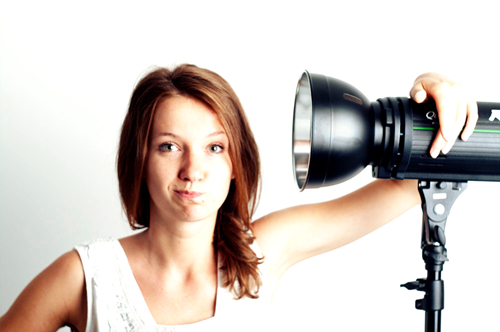

Paweł był wtedy tech writingowym narzędziowym geekiem. (I wciąż nim jest!)

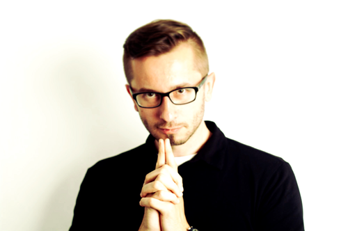

Paulina w tamtym czasie była technical writerką, ewangelistką DITY i liderką
jakości.

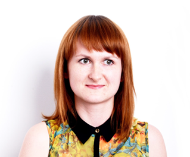

Członkowie zespołu mieli dużo pytań na temat nowego narzędzia, migracji do niego
i wyzwań technicznych. Razem doszli do wniosku:

> Niemożliwe, żebyśmy jako jedyni spotkalismy sie z tymi problemami, ktoś już
> wcześniej musiał to rozgryźć.

Z tego powodu właśnie pojechali w trójkę do Londynu na trzydniową konferencję
[Congility](https://www.ditawriter.com/interview-with-noz-urbina-about-the-upcoming-congility-conference/),
na której prelegentem był [Noz Urbina](https://www.linkedin.com/in/nozurbina/).

Konferencja było bardzo udana, wypełniały ją spotkania, nawiązywanie kontaktów i
przekazywanie wiedzy.

Był wtedy czerwiec 2013 roku. Postanowili w październiku tamtego roku zrobić
własną konferencję w Polsce. Taka dynamika i rozmach robią wrażenie!

Napędzały ich ambicja i młodzieńczy entuzjazm. Przyjrzyjmy się temu, jak
podeszli do nowego wyzwania.

## Przygotowania do pierwszego soap!

> Robimy długi research 🤔?

> Nieee, nauczymy się robiąc 💪!

### Nazwa

Skąd wzięła się nazwa "soap!"? 🧼 Mydło nawiązywało do świeżości. Podczas rozmów
o branży narodziła się metafora baniek 🫧 zamieszkiwanych przez różnych
specjalistów od treści, którzy nie mieli świadomości siebie nawzajem. Historia
nazwy została nieco szczegółowiej opisana w
[relacji z soap! z 2015 roku](https://techwriter.pl/namydleni-po-raz-trzeci/#o-co-chodzi-z-tym-r%C3%B3%C5%BCowym-myd%C5%82em).

Po wybraniu głównego symbolu, pozostało rozpisac skrót:

- Strategy
- Opportunity
- Advancity (tak, jest takie słowo!)
- Professionalism

Słowa te brzmią ambitnie, profesjonalnie i nieco tajemniczo.

Śmiałkowie mieli jeszcze do rozpracowania detale dotyczące strony internetowej,
zdefiniowanie tego, kto dokładnie ma być odbiorcą tej konferencji i zaproszenie
speakerów, którzy podejmą się przeprowadzenia prezentacji.

### Odbiorcy

Miał to być świeży start dla technical writingu. Chodziło o stworzenie
wydarzenia dla młodej, dynamicznej społeczności technical writerów i
specjalizacji powiązanych, takich jak projektowanie graficzne, e-learning i
tłumaczenia (lokalizacja).

### Prelegenci

Organizatorzy rozpatrywali zgłoszenia potencjalnych prelegentów. W czasie rozmów
ze speakerami starali się przybliżyć zainteresowania publiki, które różniły się
od zainteresowań publik z dojrzałą tradycją tech writingową. Dla tej młodej
konferencji bardzo istotne było zaufanie dla doświadczonych mówców.

### Sponsorzy

Jedną z rzeczy wyjątkowych dla soap! było to, że udawało się dobrze rozumieć ze
sponsorami. Ich obecność na konferencji była dyskretna. Uczestnicy mogli skupić
się na temacie konferencji, nie było męczącej czy natrętnej promocji firm i ich
produktów. W tych kwestiach zachowana była perfekcyjna równowaga.

### Wyścig z czasem

Nasi pionierzy dokonali niemożliwego. W cztery miesiące zorganizowali
międzynarodowe wydarzenie.

## Pierwsza odsłona: 3 październik 2013

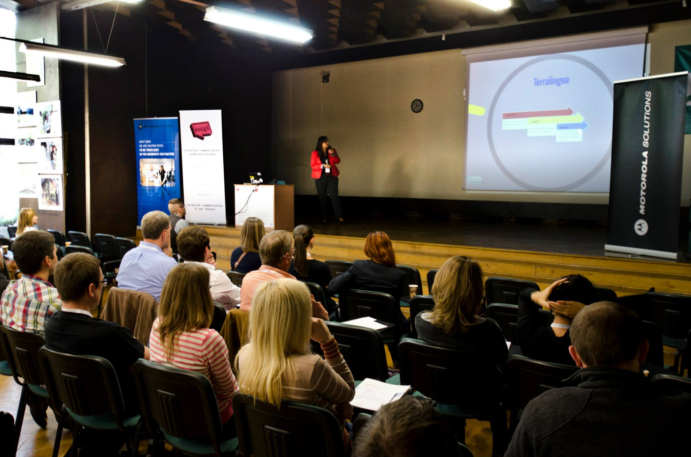 W wydarzeniu promowanym metodą poczty pantoflowej
wzięło udział 120 osób.

Konferencja odbyła się na uczelni na Wyższej Szkoły Europejskiej im. ks. Józefa
Tischnera, której Gosia była absolwentką.

Udało się nawiązać współpracę z kilkoma sponsorami.

Agnieszka Tkaczyk pełniła rolę konferansjerki i świetnie sobie poradziła mimo
opornego projektora.

Noz Urbina, którego organizatorzy słuchali podczas Congility, na soap! również
wystąpił jako prelegent.

Gosia podzieliła się taką myślą, że organizując takie spotkanie można poznać
lepiej sobie i innych. Z pewnością nie była to bułka z masłem. W takich
wymagających momentach można zobaczyć hart ducha, pomysłowość i zdolność do
poświęceń.

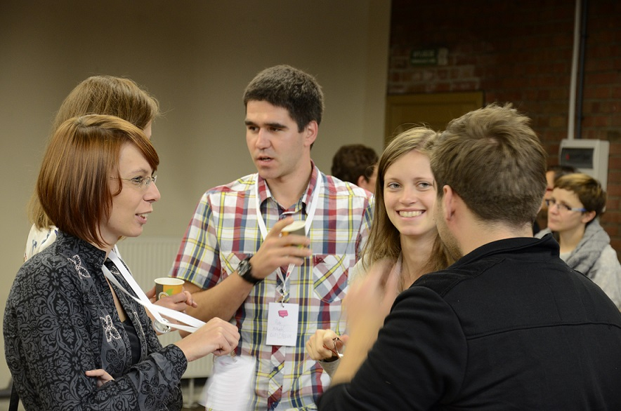

## Po pierwszym soap!

Społeczność przyjęła soap! z entuzjazmem i pewnym zdziwieniem:

> O kurczę, mamy polską konferencję tech writingową!!!

### Odczucia uczestników

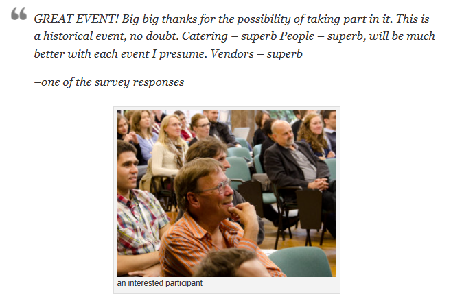

### Listopadowe spotkanie w Massolit Books and Cafe (Kraków)

Widać było spory apetyt na dzielenie się wiedzą, skoro w jeszcze w listopadzie
tamtego roku doszło do spotkania z całkiem rozbudowaną agendą.

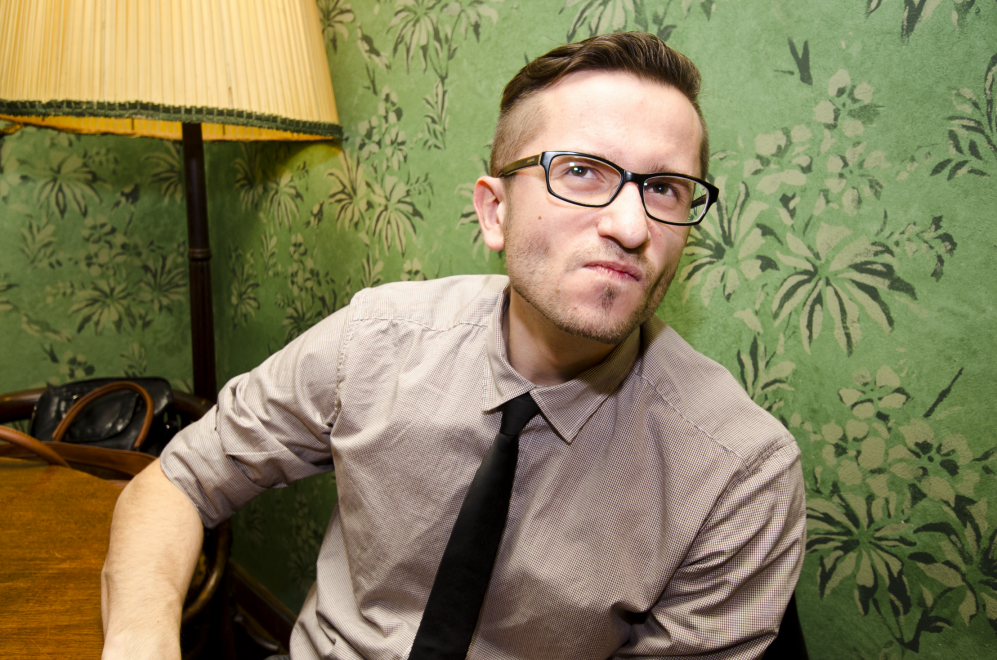

Oryginalny podpis z ówczesnej strony soap!:

> You can tell when a man is serious.

### Ważne decyzje

Planowanie po pracy i czas wolny wypełniony organizacją konferencji to duże
poświęcenie. Paulina i Paweł czuli się tym zmeczeni i postanowili zrezygnować.

Gosia wybrała kontynuować tę inicjatywę.

### Zespół od czasu drugiej edycji

Zawiązała się ekipa o takim składzie:

| Osoba                                                                                | Parę słów o                                                                                                                                                                                    | Rola/obszar                                                                                  |
| ------------------------------------------------------------------------------------ | ---------------------------------------------------------------------------------------------------------------------------------------------------------------------------------------------- | -------------------------------------------------------------------------------------------- |
| [Gosia Radymiak](https://www.linkedin.com/in/malgorzata-gosia-radymiak/)             | W tamtym czasie była technical writerką i specjalistką od jakości. Interesowały ją nurkowanie, wędrówki po górach, zapiekanki i DITA.                                                          | - Project Manager, który spina wszystko w całość  - "Driver" projektu                   |
| [Karolina Karbarz](https://www.linkedin.com/in/karolina-karbarz)                     | Specjalistka od projektowania graficznego, lubiąca ciasta czekoladowe, koreańskie filmy i spacery z czworonogiem.                                                                              | - Strona Internetowa   - Szata graficzna  - Grafiki                                |
| [Piotr Milewski](https://www.linkedin.com/in/piotrmilewski) zwany Piterem            | Absolwent Wyższej Szkoły  Europejskiej. Technical writer z zamiłowaniem do wspinaczki górskiej, [skitouringu](https://skitourschool.pl/co-to-jest-skitouring/) i paralotniarstwa.         | - Speakerzy i trenerzy  - Laptopy i ekrany  - Współpraca z Manggha                 |
| [Agnieszka Tkaczyk](https://www.linkedin.com/in/agnieszka-tkaczyk-walczak-93508570/) | W tamtym czasie Agnieszka była Information Developerem, jako tłumaczka współpracowała z krakowskimi Uniwersytetami. Oprócz dokumentacji interesowało ją projektowanie interfejsów użytkownika. | - Sponsorzy i partnerzy                                                                      |
| [Iga Koprowska](https://www.linkedin.com/in/iga-koprowska)                           | Filolożka angielska i tłumaczka. Odbyła kurs technical writingowy dla studentów Uniwersytetu Jagielońskiego razem z Gosia. Wciąż pozostaje w nurcie komuniacji technicznej.                    | - Media społecznościowe   - Komunikaty   - Copywriting na stronę   - Branding |

Piter i jego technologiczne centrum kontroli wszechświata:

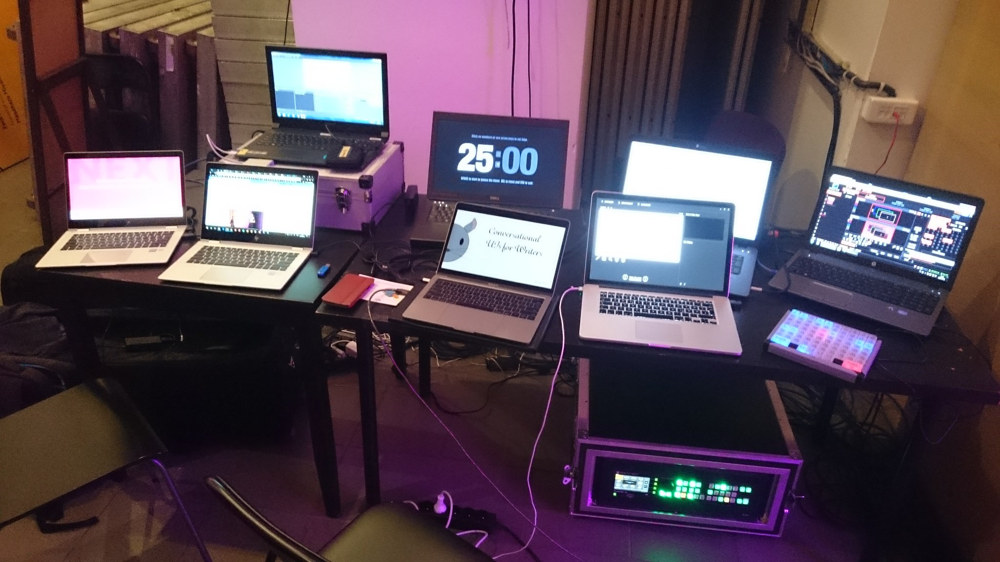

> Don't be too proud of the technological terror, you have constructed!

> **Lord Vader**

Źródło:
[Twitter](https://x.com/em_piter/status/999946418587684864?t=fvLzHHgbrzLc-Zd1MZyWKQ&s=07).

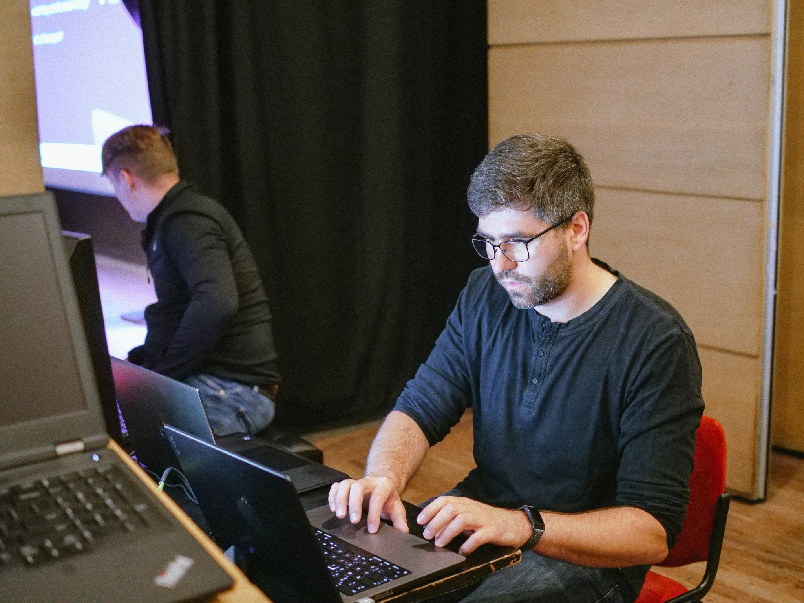

**Piter działa podczas soap! 2022.**

Grupa znana pod pseudonimem scenicznym: "Soapy Crew".

## Po raz drugi: 2-3 października 2014

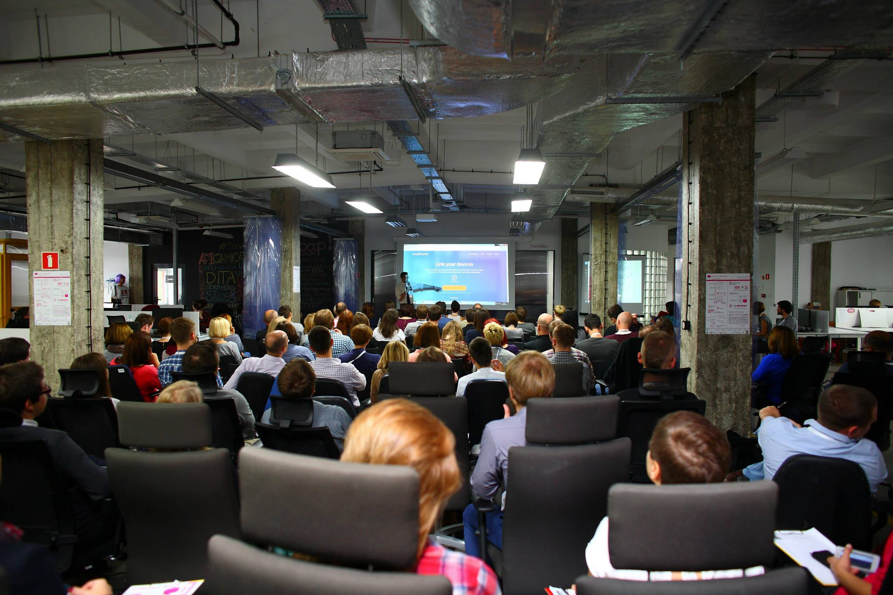

- Temat przewodni: _a clean; start;_

Ekipa postanowiła zmienić miejsce z powodu ograniczeń wcześniejszej lokalizacji.
Wybrali klimatyczny budynek dawnej fabryki kabli, który został zaadaptowany na
przestrzenie biurowe.

Po raz pierwszy uczestnicy mogli wziąć udział w warsztatach.

Paweł pełnił rolę konferansjera. Całe wydarzenie rozpoczęło się od jego mowy
otwierającej, której zarys możecie przeczytać w
[relacji](https://techwriter.pl/mydlo-lubi-zabawe/#zacz%C4%99%C5%82o-si%C4%99).

Pierwszy, darmowy dzień konferencji przyciągnął 142 uczestników, a drugi płatny
dzień - 98.

Noz Urbina powrócił z prezentacją, której zarysy również znajdziecie
[tutaj](https://techwriter.pl/soap-2014-summary-of-day-2/#find-a-common-language).

## Po raz trzeci: 8-9 października 2015

**Patryk Olczak mówi, a
[Jadźka Rysuje](https://jadzkarysuje.pl/?v=288404204e3d)**.

Tym razem soap! odbył się w lokalizacji przy Plaży Kraków.

Jak to czasem bywa, nie z winy organizatorów, pojawiły się trudności.
Wynajmujący zapomniał wspomnieć o dziurze w dachu. Było tak zimno, że uczestnicy
musieli siedzieć w kurtkach i szalikach, był to w końcu październik.

Mimo takich trudności, morale i poziom merytoryczny wydarzenia były nader
wysokie.

Podczas wydarzenia rysowała (dostarczała graphic recording) Jadźka Rysuje o czym
przeczytać możecie w
[relacji](https://techwriter.pl/namydleni-po-raz-trzeci/#my-tu-gadu-gadu-a-jad%C5%BAka-rysuje)

Pierwszy (darmowy) dzień konferencji przyciągnął 170 uczestników, drugi (płatny)
dzień - 80.

## Po raz czwarty: 1-3 czerwca 2016

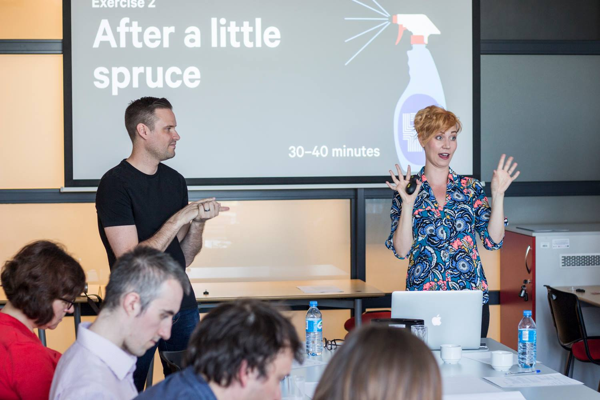 Nauczeni poprzednimi doświadczeniami, organizatorzy
wybrali cieplejszy miesiąc na to wydarzenie.

- Temat przewodni brzmiał: _"My" zamiast "Oni"_. Temat dotyczący pozycji technical
  writera w zespole i podejścia do współpracy nadal nie traci na aktualności.

Konferencję poprzedzało 5 warsztatów w ramach Content Edu Summit.

### Nowa lokalizacja: Manggha

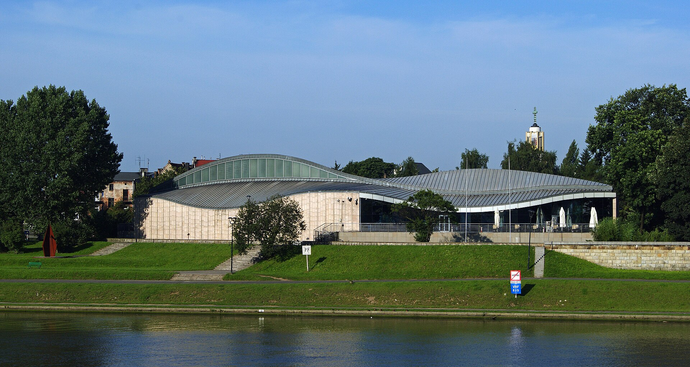

**Źródło:
[Wikipedia](https://pl.wikipedia.org/wiki/Muzeum_Sztuki_i_Techniki_Japo%C5%84skiej_%E2%80%9EManggha%E2%80%9D).**

Po raz pierwszy konferencja odbyła się w powołanym do życia przez Andrzeja Wajdę
[Muzeum Sztuki i Techniki Japońskiej Manggha](https://manggha.pl/).
Organizatorzy szybko znaleźli wspólny język z właścicielami. Współpraca okazała
się perspektywiczna, bo soap! powrócił do Manggha jeszcze pięć razy. Uczestnicy
konferencji otrzymali możliwość zwiedzania muzeum.

### Wolontariusze z 31 LO w Krakowie

Uczniowie licealni wspierali wiele edycji soap! na wiele sposobów:

- Pomagali w szatni
- Drukowali co było potrzebne
- Rozdawali mydła z logo konferencji osobom z publiki zadającym pytania
- Sami odpowiedzieli na milion pytań
- Na skuterze załatwiali potrzebne rzeczy

Uczniowie zawsze mieli mnóstwo pomysłów i świetnie rozwiązywali problemy.

31 LO charakteryzuje się tym, że jest tam dużo aktywności dla uczniów i pomoc
przy konferencji była jedną z nich.

## Po raz piąty: 7-9 czerwca 2017

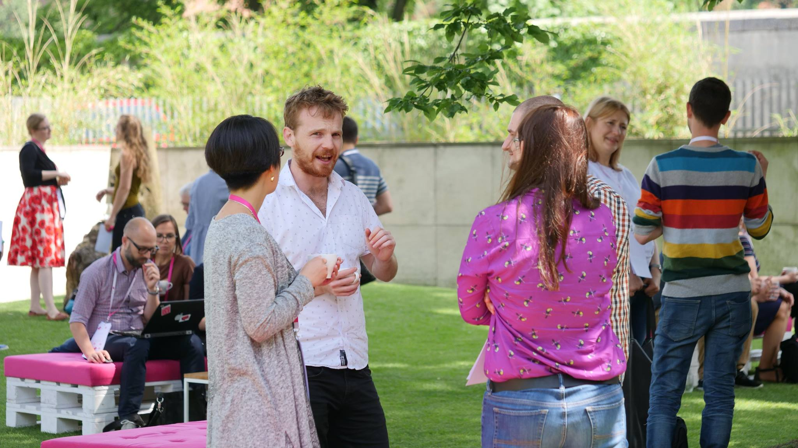

- Temat przewodni: _Rozwiązywanie problemów_.

Kolejną atrakcją soap! na którą zwrócę uwagę są gadżety organizatorów i
partnerów, jakie w tej edycji można było wygrać w konkursach. Szczęśliwcy mogli
otrzymać kubek Techwritera, leżak soap!, a sponsorzy ofiarowali jako nagrody
licencje na oprogramowanie. W późniejszych edycjach organizowane były loterie w
których można było otrzymać miłe upominki.

[Jakub Wiśniewski](https://www.linkedin.com/in/jakubmwisniewski/) relacjonując
tę edycję celnie podsumowuje atrakcyjność tej konferencji w tamtym czasie:

> soap! zdecydowanie się rozwija. Konferencja, która rozpoczynała jako lokalne
> wydarzenie, na naszych oczach przeradza się w istotny, międzynarodowy punkt na
> tech commowej mapie Europy, jednocześnie nie zatracając atmosfery wydarzenia
> organizowanego przez paczkę przyjaciół.

## Po raz szósty: 23-25 maja 2018

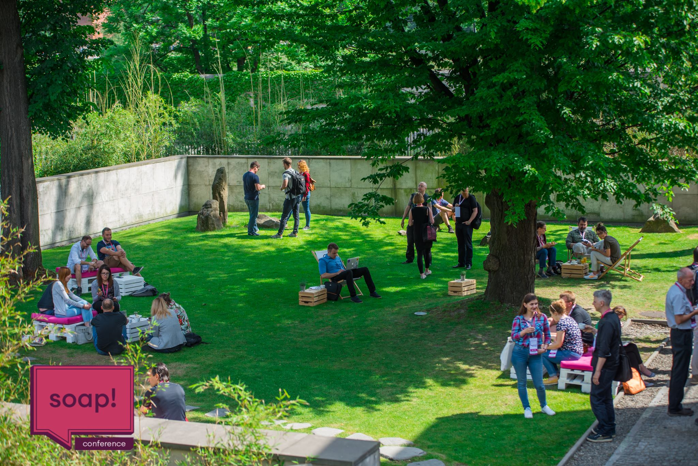

- Temat przewodni: _Innowacja kontra prostota_.

Wiele rzeczy, które napisałem wcześniej o wysokim poziomie prezentacji,
przydatnych warsztatach i świetnej atmosferze, również odnoszą się do tej
edycji.

Nie mogę nie wspomnieć o klimatycznej strefie chillout w ogródku na tyłach
Manggha, miejscu relaksu i dobrych rozmów. Po intensywnych prezentacjach dobrze
było tam się przejść i odetchnąć świeżym powietrzem.

Podkreślę jeden aspekt nieoficjalnej części konferencji, co Michał Skowron
trafnie podsumował w swojej relacji z tamtej edycji:

> Konferencja to nie tylko mnóstwo wiedzy, to także sporo dobrej zabawy. Po
> każdym dniu wykładów mieliśmy okazję rozluźnić się i spędzić miło czas na
> rozmowach, nie tylko o sprawach branżowych. Można było spotkać starych
> znajomych, nawiązać nowe kontakty, posłuchać muzyki na żywo i napić się
> dobrego piwa. Podczas nieoficjalnej części jak zwykle panowała luźna atmosfera
> i widać było, że wszyscy dobrze się bawili.

## Po raz siódmy: 5-7 czerwca 2019

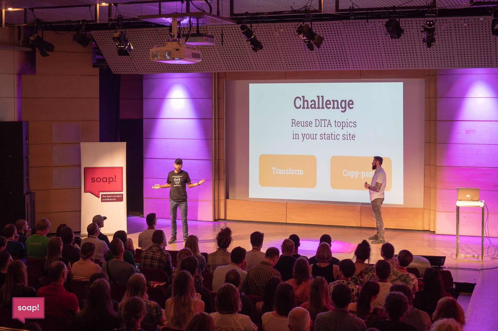

- Temat przewodni: _Content as Code_.

Jak w ostatnich 10 latach zmieniło się podejście do treści, czy jest traktowana
tak jak kod?

Jakie są zalety i wady takiego podejścia i co ono oznacza dla różnych osób?

Te i inne zagadnienia przyciągnęły wtedy rekordową liczbę uczestników. Było to
grubo ponad 200 osób. Jak bardzo grubo? Tego nie wiem, nie udało mi się
dokładnie ustalić.

Przy tej okazji też podkreślę międzynarodowy charakter imprezy. W roku 20**19**
konferencję odwiedziły osoby z **19** krajów.

Rok wcześniej konferencji odwiedzili uczestnicy z 22 krajów, takich jak Polska,
Australia, Czechy, Niemcy, Finlandia, Francja, Węgry, Izrael, Malta, Malezja,
Ukraina, USA i Wielka Brytania, którzy reprezentowali ponad 100 firm. Podobnie
się sytuacja miała w wielu wcześniejszych edycjach.

Ciekawą pamiątką po tym odcinku jest
[podsumowanie video](https://www.youtube.com/watch?v=teA3well1ek&list=PLUY0lajb-kiaIbF6clQaxTp2lwqmrDDC5).
Zapraszam do obejrzenia.

## Przerwa z powodu pandemii 2020-2021

Podobnie jak w wielu innych obszarach życia, pandemia wszystko zmieniła i sporo
namieszała.

W edycji z czerwca 2019 odnotowano najwyższą liczbę uczestników. Po pandemii,
sytuacja wyglądała inaczej. Ludzie stali się mniej skłonni do podróży. Trudniej
też było znaleźć sponsorów.

## Po raz ósmy: 1-3 czerwca 2022

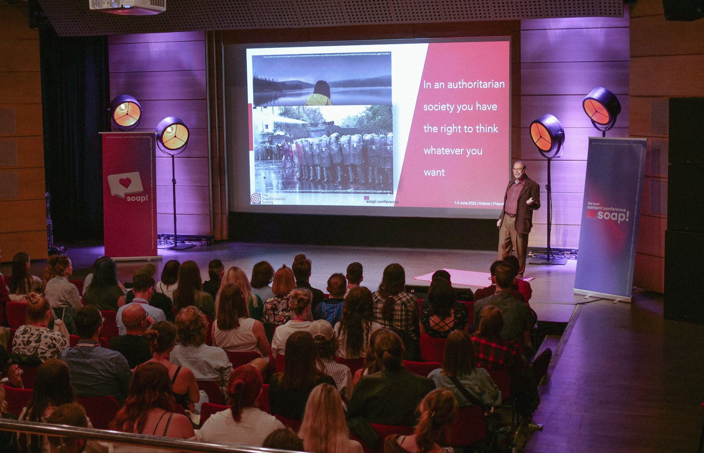

Przyszedł czas na wznowienie soap!. Powrót po przerwie należał do trudnych.
Ekipie zależało na tym, by zrewidować dobre i złe praktyki, które zdążyły się
wytworzyć przez lata. Stale byli wyczuleni na uwagi odwiedzających.

- Tematem wiodącym była _przyszłość technical writingu_. Temat AI cieszył się gorącym
  zainteresowaniem.

Była to pierwsza edycja, którą można było oglądać w ramach transmisji online.

### Ile masła może kupić tech writer z Litwy?

Jednym z ciekawych wystąpień była prezentacja statystyk dotyczących zarobków
technical writerów, zwłaszcza tych z Europy środkowej i wschodniej.

### Soapuszka: początek

Podczas prezentacji o AI,
[Rafał Pawlicki](https://www.linkedin.com/in/rafa%C5%82-pawlicki) przekazał
Soapuszkę, czyli różowa poduszkę z nazwą konferencji, tajemniczej grupie o
nazwie Soapuszka Crew. Przy okazji warto podkreślić, że Rafał jako jedyny ze
speakerów odbył podróż w przyszłość i wrócił by o niej opowiedzieć podczas
swojej prezentacji.

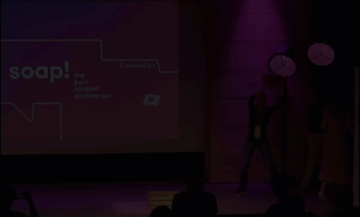

Jakie były zaś dalsze losy tej różowej poduszki? Przeczytaj późniejszy akapit o
soap! 2023!

### Teleturniej S.U.P.E.R G.A.M.E

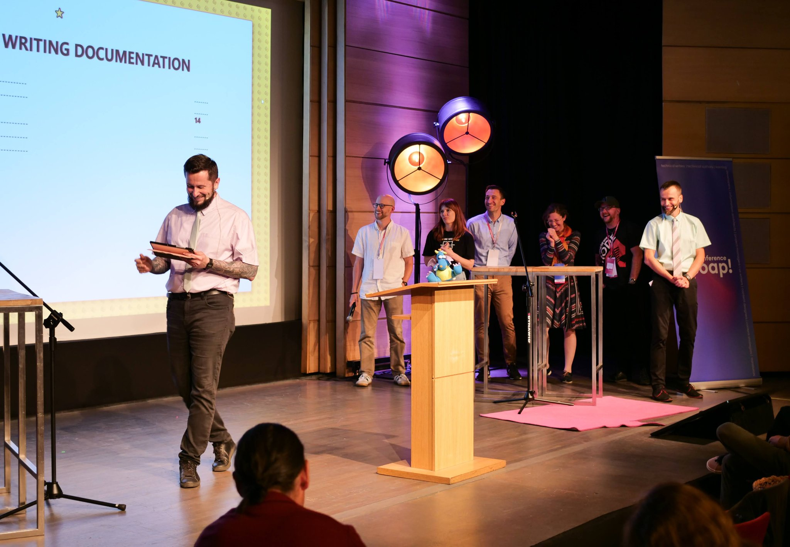

Wyjątkową nowością, jaką tylko uświadczyliśmy na konferencji w 2022, był
teleturniej. Oto jego
[kultowy zwiastun](https://www.linkedin.com/posts/soap-techcomm_excitingnewsalert-supergame-soapconf-activity-6920791703234699264-6mUf).
W czasie konkursu było dużo śmiechu. Każdy miał szansę wykazania się wiedzą o
technical writingu. Emocje sięgnęły zenitu, a sztuczna inteligencja stworzona na
potrzeby teleturnieju przez Pawła zaczęła żyć własnym życiem i co i rusz
zaznaczała swoją niezależność.

Dzięki tej grze poznałem
[Mateusza Boryckiego](https://www.linkedin.com/in/mateusz-borycki-2817a6186/),
który dobrzy wywiązywał się obowiązków wynikających z bycia głową rodziny w tej
dokumentacyjnej "Familiadzie".

## Po raz dziewiąty: 1-3 czerwca 2023

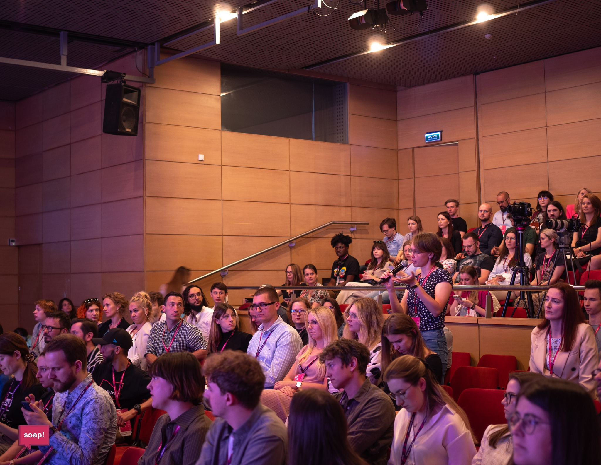

- Temat przewodni: _Content Operations_.

Była to ostatnia odsłona konferencji jaka dotychczas miała miejsce.

W tej edycji Paulina Dygoń, współzałożycielka i inicjatorka pierwszej edycji, po
raz pierwszy w historii soap! wzięła do ręki mikrofon i przedstawiła temat "Why
a PM is like a DJ".

### Soapuszka: ciąg dalszy

Podczas soap! poduszka trafiła do
[Lanca Cummingsa](https://www.linkedin.com/in/lance-cummings-phd/).

Soapuszka zwiedziła kawał świata, żyła intensywnie i na krawędzi, co przypłaciła
tym, że popruła się i rozpadła na kawałki. Ale było warto! Lepiej spalać się i
żyć w pełnym blasku i glorii!

### soap! box

Podczas tamtej edycji organizatorzy wprowadzili soap! box, czyli drewnianą
skrzynkę po jabłkach, na którą każdy mogł wskoczyć i opowiedzieć pokrótce o tym,
co mu aktualnie w duszy gra. Miałem przyjemność na tę skrzynkę wskoczyć, gdzie
razem z Lancem Cummingsem i
[Quinn Williams](https://www.linkedin.com/in/quinn-williams-/) opowiadałem o
wspólnych projekcie.

Ten pomysł stanowił ukłon w stronę spontaniczności. Było to dobre urozmaicenie w
wydarzeniu pełnym starannie przygotowanych warsztatów i prezentacji. Zarówno
organizatorzy jak i publiczność byli bardzo otwarci na to, co do powiedzenia
mieli speakerzy stojący na skrzynce 😀. Doceniam to, że kiedy przemawiałem na
skrzynce, nie leciały w moim kierunku jabłka. Publiczność była tamtego dnia dla
mnie życzliwa.

### Panel dyskusyjny

Konferencje wymagają improwizacji. Ponieważ jeden z wykładów został odwołany,
szybko zebrało się kilka osób do panelu dyskusyjnego. Wśród tematów rozmów, były
rekrutacje dla technical writerów, trendy w branży no i oczywiście sztuczna
inteligencja ☺️.

## Fakty i liczby

Tutaj gratka dla miłośników tabelek z danymi. Te liczby też opowiadają historię!
Pomagają prześledzić jak rozwijały się te wydarzenia.

To szeroka tabela, więc możliwe, że zrobisz użytek z poziomego paska do
przewijania u dołu.

| Rok  | Miejsce                                           | Temat                         | Ile dni? | Warsztaty                | Speakerzy | Ilu słuchaczy? | Konferansjerka | Online? |
| ---- | ------------------------------------------------- | ----------------------------- | -------- | ------------------------ | --------- | -------------- | -------------- | ------- |
| 2013 | Wyższa Szkoła Europejska im. ks. Józefa Tischnera |                               | 1        | Nie                      |           | 120            |                | Nie     |
| 2014 | hub:raum                                          | a clean; start;               | 2        | 3 warsztaty              | 25        | 142, 98        | Paweł          | Nie     |
| 2015 | Wiem, ale nie powiem!                             |                               | 3        | Nie                      | 17        | 170, 80        |                |         |
| 2016 | Manggha                                           | "My" zamiast "Oni"            | 3        | 5 warsztatów             | 17        | 220, 125       |                |         |
| 2017 | Manggha                                           | Rozwiązywanie problemów       | 3        | Tak                      |           |                |                |         |
| 2018 | Manggha                                           | Innowacja kontra prostota     | 3        | 10 warsztatów            | 23        |                | Gosia          | Nie     |
| 2019 | Manggha                                           | Content as Code               | 3        | 6 warsztatów dla 60 osób |           | 200+           | Gosia          | Nie     |
| 2022 | Manggha                                           | Przyszłość technical writingu | 3        | Tak                      | 21        |                | Aga            | Tak     |
| 2023 | Manggha                                           | Content Operations            | 3        | Tak                      |           |                | Gosia          | Tak     |

## Wpływ soap! na środowisko skupione wokół komunikacji technicznej

Słowami Gosi:

> soap! dał ożywienie. Nie wiadomo czy to zbieżność w czasie, z pewnością
> konferencja odegrała rolę. Zaczęły się inicjatywy takie jak ITCQF, Techwriter
> Koduje. Niektóre osoby ośmielili się coś robić. Ludzie zaczęli działać. soap!
> przyczyniła się do tego.

> Zmieniła się świadomość osoby dbającej o dokumentację. Ta osoba poczuła się
> ważniejsza w projekcie, odezwie się, napisze artykuł.

> soap! to tylko miejsce, gdzie ludzie się zbierają. Poza soap! ludzie w
> społeczności cały czas coś robią. Ta konferencja to katalizator i platforma do
> spotkań. Reszta zależy od ludzi.

Grupa [soap! technical communication](https://www.facebook.com/soapconf) na
Facebooku liczy 1300 osób.

## Inicjatywy powiązane

Stało się jasne, że soap! raz w roku to było za mało, a apetyt na wiedzę i
spotkania stale rósł. Zaczęło się rozkręcanie meetupów o nazwie Meet Content. W
Brnie w Czechach odbyły się trzy meetupy.

Meet Content nadal działa we Wrocławiu. Oddział Meet Content krakowski przestał
być aktywny.

W Krakowie powstała nowa marka: Content Bytes założona przez
[Barbarę Czyż](https://www.linkedin.com/in/barbara-szwarc/?locale=en) i
[Edytę Rakowską](https://www.linkedin.com/in/edyta-rakowska/).

## Soapy Crew i inicjatorzy obecnie

Wszystkie z wymienionych osób mają wyrobioną renomę w dziedzinach swojej
specjalizacji: technical writingu, copywritingu i graphic designie.

Każda z osób, która na początku maczała palce w komunikacji technicznej wciąż
realizuje się w tym nurcie. Zmiana ścieżki kariery to nie grzech, ale tu widać
głębokie, wieloletnie zaangażowanie w tę działkę, co pokazuje, że można się w
niej rozwijać i warto w niej zostać długoterminowo, jeśli taka droga Ci
odpowiada.

## Rocznica

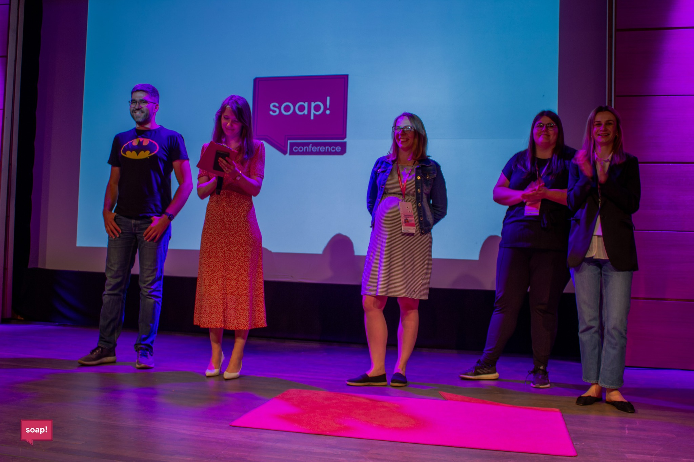 Pierwsza edycja soap! odbyła się w
październiku 2013. W 2023 roku całej inicjatywie stuknęło 10 lat.

W październiku 2026 soap! skończy 13 lat! Gratulacje dla ekipy organizującej te
cudowne wydarzenia i dla wszystkich jej uczestników. Warto było dzielić te
doświadczenia, za które jesteśmy Wam niezmiernie wdzięczni.

Jak to kiedyś określił Michał Skowron:

> I came for the talks.

> I stayed for the people!

Jakkolwiek patetycznie to może zabrzmieć, soap! był wyjątkowy dzięki ludziom
którzy go tworzyli i w nim uczestniczyli. Była to przestrzeń na spotkania ludzi
rozumiejących bolączki dokumentacji, mających ochotę nauczyć się czegoś i
jednocześnie gotowych przekazać swoją wiedzę i doświadczenia innym.

Jeśli ktoś zauważy w artykule jakiś fakt do poprawki, uzupełnienia albo chciałby opowiedzieć
swoją historię związaną z soap!, zapraszamy do kontaktu.

## Materiały dodatkowe

### Albumy zdjęć

Większość zdjęć w artykule pochodzi ze strony Facebook
[soap technical communication](https://www.facebook.com/soapconf/photos_albums).
Zapraszam do obejrzenia tej "wizualnej dokumentacji".

### Relacje na Techwriterze

[Tag](https://techwriter.pl/tags/soap) z listą wszystkich relacji z
[soap!](https://techwriter.pl/tags/soap), gdzie możecie zapoznać się z relacjami
pisanymi szczegółowo i ze swadą.

### soap! oczami innych uczestników

- [TechWhirl - Conference Review: soap! Offers a Clean Start in Poland 2014?](https://techwhirl.com/conference-review-soap-offers-clean-start-poland/)
- [Cynthia Peter's Review of 2023 soap!](https://medium.com/postcards-by-fancy-nomads/attending-soap-conference-in-krakow-poland-ac7e4c98eb13)

### Nagrane prezentacje

Na kanale YouTube znajdziecie
[nagrania](https://www.youtube.com/@SoapconfPage/playlists) z niektórych edycji.
Mimo upływu lat, warto do nich wrócić, w dokumentacji sporo tematów nie traci na
aktualności.
