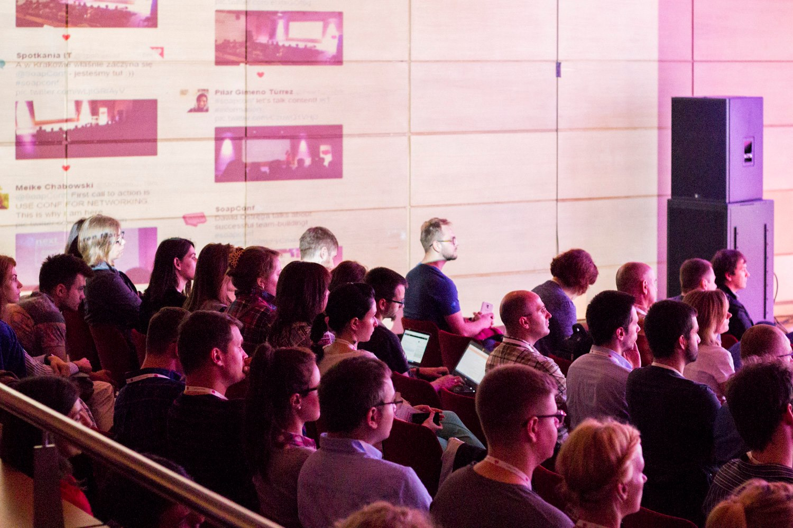

Konferencje soap! zajmują szczególne miejsce w sercach osób żyjących komunikacją
techniczną. Na Techwriterze z dumą zamieściliśmy relacje z każdej z nich. Były
to wydarzenia, które wpłynęły na zawiązanie się społeczności i przyczyniły się
do przyspieszenia jej rozwoju. Z jubileuszowego artykułu dowiesz się:

- Skąd wział się pomysł na tę konferencję?
- O co chodzi z tym różowym mydłem?
- Co kryje się za literami s-o-a-p?
- Jak przebiegał rozwój tej inicjatywy i co z niej wynikło?

<!--truncate-->

## Od autora

Uczestniczyłem trzy razy w konferencjach soap! w 2018, 2022 i 2023. Za każdym
razem ubawiłem się przednio, miałem przyjemność porozmawiać z bardzo
kontaktowymi ludźmi, za każdym razem wyniosłem wiele przydatnych informacji i
przemyśleń. soap! wyróżniała też niezwykle przyjazna atmosfera tworzona przez
organizatorów i uczestników.

## Pomysł

W 2013,
[Paulina Dygoń](https://www.linkedin.com/in/paulina-dygo%C5%84-5b158624/),
[Gosia Radymiak](https://www.linkedin.com/in/malgorzata-gosia-radymiak/)
[Paweł Kowaluk](https://www.linkedin.com/in/pawel-kowaluk/) pracowali w tej
samej firmie. W obrębie ich zespołu dokumentacyjnego zapadła decyzja o przejściu
do nowego zaawansowanego narzędzia do tworzenia dokumentacji. Gosia miała wtedy
niespełna rok doświadczenia w IBM, gdzie poznawała standard DITA. Członkowie
zespołu mieli dużo pytań na temat nowego narzędzia, migracji do niego i wyzwań
technicznych. Razem doszli do wniosku:

> Niemożliwe, żebyśmy jako jedyni spotkalismy sie z tymi problemami, ktoś już
> wcześniej musiał to rozgryźć.

Z tego powodu właśnie pojechali w trójkę do Londynu na trzydniową konferencję
[Congility](https://www.ditawriter.com/interview-with-noz-urbina-about-the-upcoming-congility-conference/),
na której prelegentem był [Noz Urbina](https://www.linkedin.com/in/nozurbina/).

Konferencja było bardzo udana, wypełniały ją spotkania, nawiązywanie kontaktów i
przekazywanie wiedzy.

Był wtedy czerwiec 2013 roku. Postanowili w październiku tamtego roku zrobić
własną konferencję w Polsce.

## Stan branży w 2013

Jak wyglądała wtedy polska scena technical writingu? Nie wiadomo ilu technical
writerów było wtedy w Polsce. Osoby wykonujące ten zawód narzekały na izolujące
doświadczenie zawodowe i ograniczony feedback od ekspertów, z którymi pracowali.
Nasi bohaterowie czuli potrzebę zwiększenia świadomości o branży. Brakowało
wtedy takich kierunków na studiach, które oferowały taką wiedzę.

## Przygotowania do pierwszego soap!

> Robimy długi research?

> Nieee, nauczymy się robiąc.

Miał to być świeży start dla technical writingu. Młoda, dynamiczna społeczność
dla technical writerów i specjalizacji powiązanych, takich jak tworzenie grafik
i tłumaczenia.

### Nazwa

Skąd wzięła się nazwa "soap!"? Mydło nawiązywało do świeżości. Podczas rozmów o
branży narodziła się metafora baniek zamieszkiwanych przez różnych specjalistów
od treści, którzy nie mieli świadomości siebie nawzajem. Historia nazwy została
też nieco szczegółowiej opisana w
[relacji](https://techwriter.pl/namydleni-po-raz-trzeci/#o-co-chodzi-z-tym-r%C3%B3%C5%BCowym-myd%C5%82em)
z 2015 roku.

Po wybraniu głównego symbolu, pozostało rozpisac skrót:

- Strategy
- Opportunity
- Advancity
- Professionalism

Słowa te brzmią ambitnie, profesjonalnie i nieco tajemniczo.

Śmiałkowie mieli jeszcze do rozpracowania detale dotyczące strony internetowej,
zdefiniowanie tego, kto dokładnie ma być odbiorcą tej konferencji i zaproszenie
speakerów, którzy podejmą się przeprowadzenia prezentacji.

### Speakerzy

Organizatorzy rozpatrywali zgłoszenia potencjalnych speakerów. W czasie rozmów
ze speakerami starali się przybliżyć zainteresowania publiki, które różniły się
od zainteresowań publik z dojrzałą tradycją techwritingową. Dla tej młodej
konferencji bardzo istotne było zaufanie dla doświadczonych speakerów.

### Sponsorzy

Jedną z rzeczy wyjątkowych dla soap! było to, że udawało się dobrze rozumieć ze
sponsorami. Ich obecność na konferencji była dyskretna. Uczestnicy mogli skupić
się na temacie konferencji, nie było męczącej promocji sponsorów i ich
produktów. W tych kwestiach zachowana była perfekcyjna równowaga.

### Wyścig z czasem

Nasi pionierzy dokonali niemożliwego. W cztery miesiące zorganizowali
międzynarodowe wydarzenie.

## Pierwsza odsłona: 3 październik 2013

W konferencji wzięło udział 120 osób, odbyła się ona na uczelni na Wyższej
Szkoły Europejskiej im. ks. Józefa Tischnera, której Gosia była absolwentką.
Organizatorzy soap! znaleźli kilku sponsorów. Agnieszka Tkaczyk pełniła rolę
konferansjerki i świetnie sobie poradziła mimo opornego projektora.

Noz Urbina, którego organizatorzy słuchali podczas Congility, na soap! również
wystąpił jako speaker.

Gosia podzieliła się taką myślą, że organizując takie spotkanie można poznać
lepiej sobie i innych. Nie była to bułka z masłem.

## Po pierwszym soap!

### Odczucia uczestników

### Listopadowe spotkanie w Massolit Books and Cafe (Kraków)

Widać było spory apetyt na dzielenie się wiedzą, skoro w jeszcze w listopadzie
tamtego roku doszło do spotkania z całkiem rozbudowaną agendą.

Oryginalny podpis z ówczesnej strony soap!:

> You can tell when a man is serious.

### Ważne decyzje

Planowanie po pracy i czas wolny poświęcony organizacji konferencji to duże
poświęcenie. Paulina i Paweł czuli się tym zmeczeni i postanowili zrezygnować.

Gosia wybrała kontynuować tę inicjatywę.

### Zespół od czasu drugiej edycji

Powstała ekipa o takim składzie:

| Osoba                                                                                | Parę słów o                                                                                                      | Rola/obszar                                                                                  |
| ------------------------------------------------------------------------------------ | ---------------------------------------------------------------------------------------------------------------- | -------------------------------------------------------------------------------------------- |
| [Gosia Radymiak](https://www.linkedin.com/in/malgorzata-gosia-radymiak/)             |                                                                                                                  | - Project Manager, który spina wszystko w całość  - "Driver" projektu                   |
| [Karolina Karbarz](https://www.linkedin.com/in/karolina-karbarz)                     |                                                                                                                  | - Strona Internetowa   - Szata graficzna  - Grafiki                                |
| [Piotr Milewski](https://www.linkedin.com/in/piotrmilewski) zwany Piterem            | Absolwent Wyższej Szkoły  Europejskiej                                                                      | - Speakerzy i trenerzy  - Laptopy i ekrany  - Współpraca z Manggha                 |
| [Agnieszka Tkaczyk](https://www.linkedin.com/in/agnieszka-tkaczyk-walczak-93508570/) |                                                                                                                  | - Sponsorzy i partnerzy                                                                      |
| [Iga Koprowska](https://www.linkedin.com/in/iga-koprowska)                           | Odbyła kurs technical writingowy dla studentów Uniwersytetu Jagielońskiego razem z Gosia, kiedy była w Motoroli. | - Media społecznościowe   - Komunikaty   - Copywriting na stronę   - Branding |

Piter i jego technologiczne centrum kontroli wszechświata:

> Don't be too proud of the technological terror, you have constructed!

> **Lord Vader**

Link do źródła na
[Twitterze](https://x.com/em_piter/status/999946418587684864?t=fvLzHHgbrzLc-Zd1MZyWKQ&s=07).

**Piter działa podczas soap! 2022.**

## Po raz drugi: 2-3 października 2014

- Temat przewodni: a clean; start;

Ekipa postanowiła zmienić miejsce z powodu ograniczeń wcześniejszej lokalizacji.
Wybrali klimatyczny budynek dawnej fabryki kabli, który został zaadaptowany na
przestrzenie biurowe. Po raz pierwszy zrobili warsztaty.

Paweł pełnił rolę konferansjera. Całe wydarzenie rozpoczęło się od jego mowy
otwierającej, której zarys możecie przeczytać w
[relacji](https://scaling-broccoli-6x4ggrp476wh7r7-3000.app.github.dev/mydlo-lubi-zabawe#zacz%C4%99%C5%82o-si%C4%99)

Pierwszy, darmowy dzień konferencji przyciągnął 142 uczestników, a drugi płatny
dzień - 98.

Noz Urbina znów prezentował:
[relacja](https://scaling-broccoli-6x4ggrp476wh7r7-3000.app.github.dev/soap-2014-summary-of-day-2#find-a-common-language)

## Po raz trzeci: 8-9 października 2015

Tym razem soap! odbył się w lokalizacji przy Plaży Kraków.

Jak to czasem bywa, nie z winy organizatorów, pojawiły się trudności.
Wynajmujący zapomniał wspomnieć o dziurze w dachu. Było tak zimno, że uczestnicy
musieli siedzieć w kurtkach i szalikach, był to w końcu październik.

Mimo takich trudności, morale i poziom merytoryczny wydarzenia były nader
wysokie.

Podczas wydarzenia rysowała (dostarczała graphic recording) Jadźka Rysuje
[wiecej w relacji](https://scaling-broccoli-6x4ggrp476wh7r7-3000.app.github.dev/namydleni-po-raz-trzeci#my-tu-gadu-gadu-a-jad%C5%BAka-rysuje)

Pierwszy (darmowy) dzień konferencji przyciągnął 170 uczestników, drugi (płatny)
dzień 80.

## Po raz czwarty: 1-3 czerwca 2016

- Temat przewodni brzmiał: "My" zamiast "Oni". Nie traci on na aktualności.

Konferencje poprzedzało 5 warsztatów w ramach Content Edu Summit.

### Manggha

Po raz pierwszy konferencja odbyła się w
[Muzeum Sztuki i Techniki Japońskiej Manggha](https://manggha.pl/).
Organizatorzy szybko znaleźli wspólny język z właścicielami. Współpraca okazała
się perspektywiczna, bo soap! powrócił do Manggha jeszcze pięć razy. Uczestnicy
konferencji mieli możliwość zwiedzania muzeum podczas trwania konferencji.

### Wolontariusze z 31 LO w Krakowie

Wolontariusze - 31 LO - uczniowie wspierali wydarzenie na wiele sposobów:

- Pomagali w szatni
- Rozdawali mydła z logo konferencji osobom z publiki zadającym pytania
- Sami odpowiedzieli na milion pytań
- Na skuterze załatwiają potrzebne rzeczy
- Drukowali co trzeba.

Uczniowie zawsze mieli mnóstwo pomysłów i świetnie rozwiązywali problemy.

31 LO charakteryzuje się tym, że jest tam dużo aktywności dla uczniów i pomoc
przy konferencji była jedną z nich.

## Po raz piąty: 7-9 czerwca 2017

- Temat przewodni: Rozwiązywanie problemów.

Nie mogę nie wspomnieć klimatycznej strefy chillout, miejsca relaksu i dobrych
rozmów.

## Po raz szósty: 23-25 maja 2018

- Temat przewodni: Innowacja kontra prostota.

## Po raz siódmy: 5-7 czerwca 2019

- Temat przewodni: Content as Code.

Najwyższa liczba uczestników.

[Podsumowanie video](https://www.youtube.com/watch?v=teA3well1ek&list=PLUY0lajb-kiaIbF6clQaxTp2lwqmrDDC5)

## Przerwa z powodu pandemii 2020-2021

Jak w wielu obszarach życia, pandemia wszystko zmieniła i sporo namieszała.

W edycji z czerwca 2019 odnotowano najwyższą liczbę uczestników. Ludzie stali
się mniej skłonni do podróży. Trudniej było znaleźć sponsorów.

## Po raz ósmy: 1-3 czerwca 2022

Powrót po przerwie należał do trudnych. Ekipie zależało na tym, by zrewidować
dobre i złe praktyki, które zdążyły się zgromadzić przez lata. Stale byli
wyczuleni na uwagi odwiedzających.

Temat wiodący: przyszłość technical writingu.

### Ile masła może kupić tech writer z Litwy?

Jednym z ciekawych wystąpień była prezentacja statystyk dotyczących zarobków
technical writerów, zwłaszcza tych z Europy środkowej i wschodniej.

### Soapuszka

Soapuszka z soap! 2022 przekazana przez Roberta Pawlickiego dla Soapuszka Crew
podczas jego prezentacji o AI. Co warte jest podkreślenia, jako jedyny ze
speakerów odbył podróż w przyszłość i wrócił by o niej opowiedzieć.

Jakie były zaś dalsze losy tej różowej poduszki? Przeczytaj późniejszy akapit o
soap! 2023!

### Teleturniej S.U.P.E.R G.A.M.E

Wyjątkową nowością, jaką tylko uświadczyliśmy na konferencji w 2022, był
teleturniej. Oto
[kultowy zwiastun](https://www.linkedin.com/posts/soap-techcomm_excitingnewsalert-supergame-soapconf-activity-6920791703234699264-6mUf).
W czasie konkursu było dużo śmiechu. Każdy miał szansę wykazania się wiedzą o
technical writingu. Emocje sięgnęły zenitu, a sztuczna inteligencja stworzona na
potrzeby teleturnieju przez Pawła zaczęła żyć własnym życiem i co i rusz
zaznaczała swoją niezależność.

Dzięki tej grze poznałem Mateusza Boryckiego, który dobrzy wywiązywał się z
bycia głową rodziny w tej dokumentacyjnej "Familiadzie".

## Po raz dziewiąty: 1-3 czerwca 2023

- Temat przewodni: Content Operations.
- Ostatnia edycja konferencji jaka dotychczas miała miejsce.

W tej edycji Paulina Dygoń, współzałożycielka i inicjatorka pierwszej edycji,
tym razem po raz pierwszy w historii soap! wzięła do ręki mikrofon i
przedstawiła temat "Why a PM is like a DJ".

### Soapuszka: ciąg dalszy

W 2023 roku poduszka trafiła do Lanca Cummingsa.

Soapuszka zwiedziła kawał świata, żyła intensywnie i na krawędzi, co przypłaciła
tym, że popruła się i rozpadła na kawałki. Ale było warto! Lepiej spalać się i
żyć w pełnym blasku i glorii!

### soap! box

Podczas konferencji w 2023 organizatorzy wprowadzili soap! box, czyli drewnianą
skrzynkę po jabłkach, na którą każdy mogł wskoczyć i opowiedzieć pokrótce o tym,
co mu aktualnie w duszy gra. Miałem przyjemność na tę skrzynkę wskoczyć, gdzie
razem z Lancem Cummingsem opowiadałem o wspólnych projekcie. Był to dobry ukłon
w stronę spontaniczności. Było to dobrym urozmaiceniem w wydarzeniu pełnym
starannie przygotowanych warsztatów i prezentacji. Zarówno organizatorzy jak i
publiczność byli bardzo otwarci na to, co do powiedzenia mieli speakerzy stojący
na skrzynce 😀.

### Panel dyskusyjny

## Przerwa po 2023

Po konferencji 2023 przyszedł czas przerwę i refleksję na zmianą formuły i
upewnieniem się, że różne konkurujące nurty technical writingowe są dobrze
zbalansowane. W uwagach uczestników często padały prośby o więcej praktycznych
zajęć i tematów. Wykłady nie muszą być tylko wysokopoziomowe.

## Fakty i liczby

Tutaj coś dla miłośników tabelek z danymi. Tabelka pomaga prześledzić jak
rozwijały się te wydarzenia. Te liczby też opowiadają historię! Treści jest
sporo, więc możliwe, że zrobisz użytek z poziomego paska u dołu.

| Rok  | Miejsce                                           | Temat                         | Ile dni? | Warsztaty                | Speakerzy | Ilu słuchaczy? | Konferansjerka | Online? |
| ---- | ------------------------------------------------- | ----------------------------- | -------- | ------------------------ | --------- | -------------- | -------------- | ------- |
| 2013 | Wyższa Szkoła Europejska im. ks. Józefa Tischnera |                               | 1        | Nie                      |           | 120            |                | Nie     |
| 2014 | hub:raum                                          | a clean; start;               | 2        | 3 warsztaty              | 25        | 142, 98        | Paweł          | Nie     |
| 2015 | Wiem, ale nie powiem!                             |                               | 3        | Nie                      | 17        | 170, 80        |                |         |
| 2016 | Manggha                                           | "My" zamiast "Oni"            | 3        | 5 warsztatów             | 17        | 220, 125       |                |         |
| 2017 | Manggha                                           | Rozwiązywanie problemów       | 3        | Tak                      |           |                |                |         |
| 2018 | Manggha                                           | Innowacja kontra prostota     | 3        | 10 warsztatów            | 23        |                | Gosia          | Nie     |
| 2019 | Manggha                                           | Content as Code               | 3        | 6 warsztatów dla 60 osób |           | 200+           | Gosia          | Nie     |
| 2022 | Manggha                                           | Przyszłość technical writingu | 3        | Tak                      | 21        |                | Aga            | Tak     |
| 2023 | Manggha                                           | Content Operations            | 3        | Tak                      |           |                | Gosia          | Tak     |

## Wpływ soap! na środowisko skupione wokół komunikacji technicznej

Słowami Gosi:

> soap! dał ożywienie. Nie wiadomo czy to zbieżność w czasie, z pewnością
> konferencja odegrała rolę. Zaczęły się inicjatywy takie jak ITCQF, Techwriter
> Koduje. Niektóre osoby ośmielili się coś robić. Ludzie zaczęli działać. soap!
> przyczyniła się do tego.

> Zmieniła się świadomość osoby dbającej o dokumentację. Ta osoba poczuła się
> ważniejsza w projekcie, odezwie się, napisze artykuł.

> soap! to tylko miejsce, gdzie ludzie się zbierają. Poza soap! ludzie w
> społeczności cały czas coś robią. Ta konferencja to katalizator i platforma do
> spotkań. Reszta zależy od ludzi.

Grupa [soap! technical communication](https://www.facebook.com/soapconf) na
Facebooku liczy 1300 osób.

## Inicjatywa powiązana - Meet Content

Stało się jasne, że soap! raz w roku to było za mało, a apetyt na wiedzę i
spotkania stale rósł. Zaczęło się rozkręcanie meetupów. W Brnie odbyły trzy
meetupy.

Meet Content i Content Bytes. Meet Content nadal działa we Wrocławiu. Oddział
krakowski przestał być aktywny. W Krakowie powstała nowa marka: Content Bytes
założona przez Barbarę Czyż i Edytę Rakowską.

## Soapy Crew i inicjatorzy obecnie

Wszystkie z wymienionych osób

## Rocznica

 Pierwsza edycja soap! odbyła się w
październiku 2013. W 2023 roku całej inicjatywie stuknęło 10 lat.

W październiku 2026 soap! skończy 13 lat! Gratulacje dla ekipy organizującej te
cudowne wydarzenia i dla wszystkich jej uczestników. Warto było dzielić te
doświadczenia, za które jesteśmy Wam niezmiernie wdzięczni.

Jak to kiedyś Michał Skowron określił:

> I came for the talks.

> I stayed for the people!

Jakkolwiek patetycznie to może zabrzmieć, soap! był wyjątkowy dzięki ludziom
którzy go tworzyli i w nim uczestniczyli. Była to przestrzeń na spotkania ludzi
rozumiejących bolączki dokumentacji, mających ochotę nauczyć się czegoś i
jednocześnie gotowych innym wiedzę przekazać. Jeśli ktoś zauważył jakiś fakt do
poprawki albo chciałby opowiedzieć swoją historię, zapraszamy do kontaktu.

## Dalsza lektura

Tag z listą wszystkich relacji z [soap!](https://techwriter.pl/tags/soap), gdzie
możecie zapoznać się z relacjami pisanymi szczegółowo i ze swadą.

Większość zdjęć w artykule pochodzi ze strony FB
[soap technical communication](https://www.facebook.com/soapconf/photos_albums).

soap! oczami innych uczestników:
* [TechWhirl - Conference Review: soap! Offers a Clean Start in Poland 2014?](https://techwhirl.com/conference-review-soap-offers-clean-start-poland/)
* [Cynthia Peter's Review of 2023 soap!](https://medium.com/postcards-by-fancy-nomads/attending-soap-conference-in-krakow-poland-ac7e4c98eb13)

- 2013: soap! 1
  [soap! technical communication conference - relacja](../soap-technical-communication-conference-relacja/index.md)
- 2014: soap! 2 [Mydło lubi zabawę](../mydlo-lubi-zabawe/index.md)
  - 2014: soap! 2
    [soap! Just Wants to Have Fun](../soap-just-wants-to-have-fun/index.md)
  - 2014: soap! 2
    [soap! 2014 - summary of day 1](../soap-2014-summary-of-day-1/index.md)
  - 2014: soap! 2
    [soap! 2014 - summary of day 2](../soap-2014-summary-of-day-2/index.md)
- 2015: soap! 3 [Namydleni po raz trzeci](../namydleni-po-raz-trzeci/index.md)
- 2016: soap! 4
  [Konferencja soap! 2016 - podsumowanie](../konferencja-soap-2016-podsumowanie/index.md)
- 2017: soap! 5
  [soap! 2017 już za nami - relacja](../soap-2017-juz-za-nami-relacja/index.md)
- 2018: soap! 6
  [Konferencja soap! 2018 - relacja](../konferencja-soap-2018-relacja/index.md)
- 2019: soap! 7
  [Konferencja soap! 2019 - (wideo)relacja](../konferencja-soap-2019-wideorelacja/index.md)
- 2022: soap! 8
  [Doniesienia z tegorocznej konferencji soap! 2022!](../doniesienia-z-tegoroczenj-konferencji-soap-2022/index.md)
- 2023: soap! 9
  [Relacja z tegorocznej konferencji soap 2023!](../relacja-z-tegorocznej-konferencji-soap-2023/index.md)
