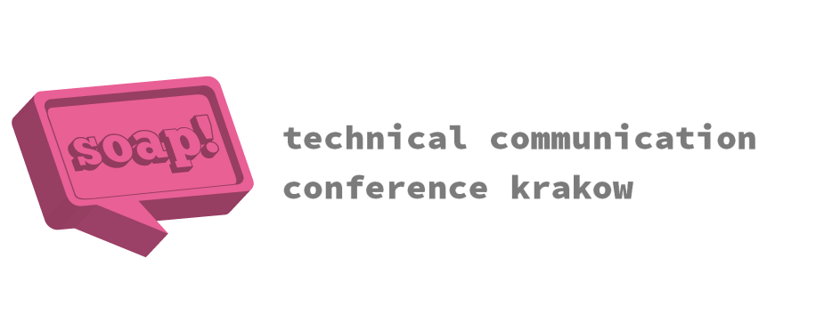
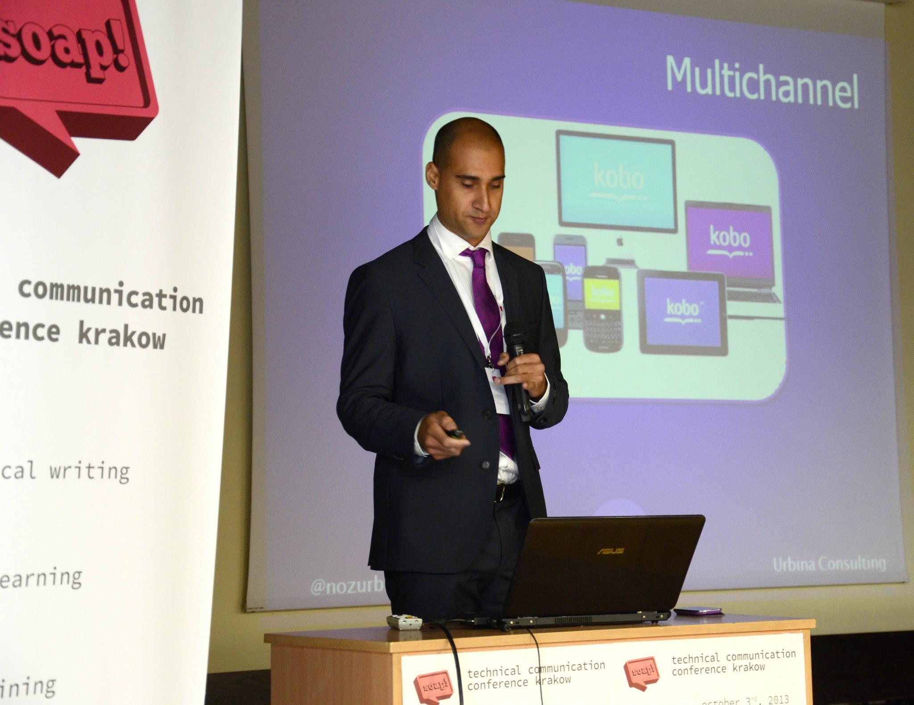
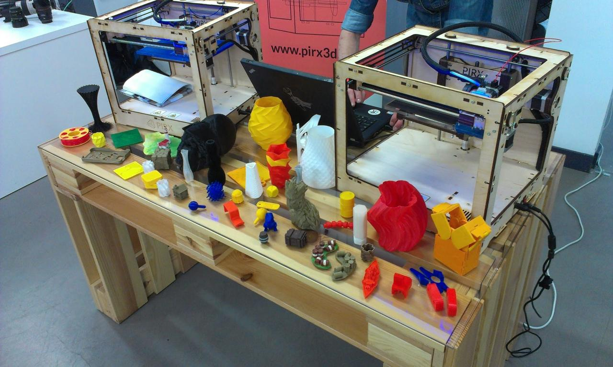
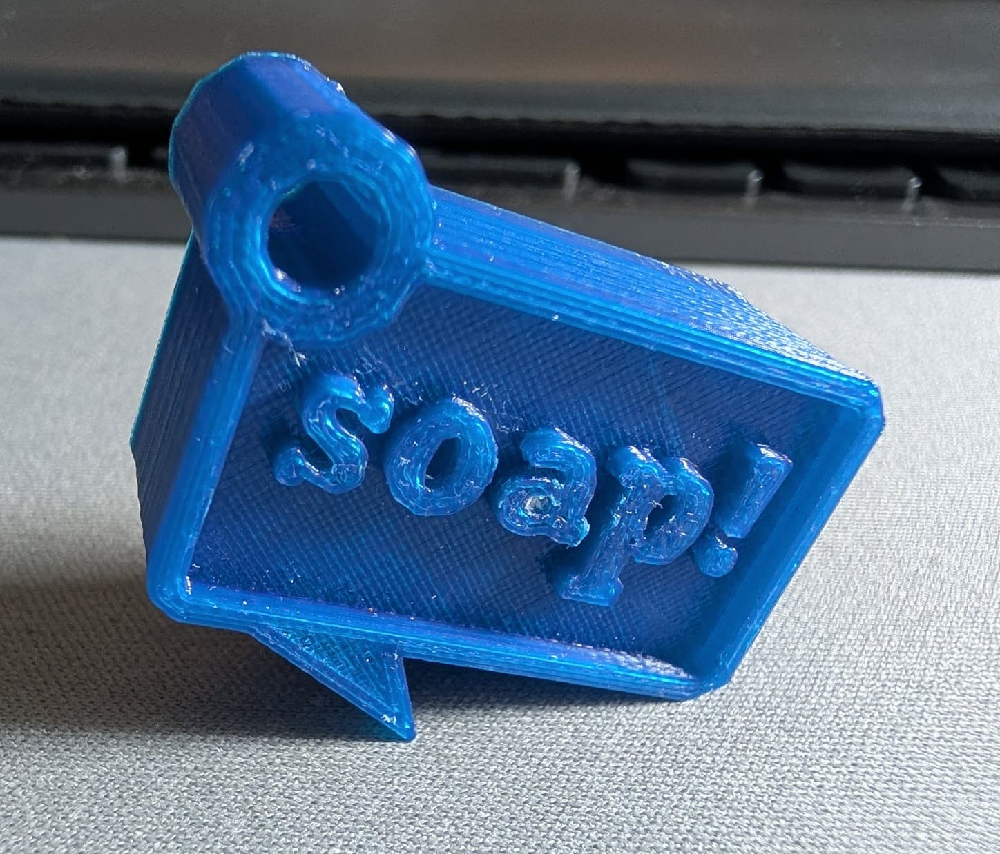
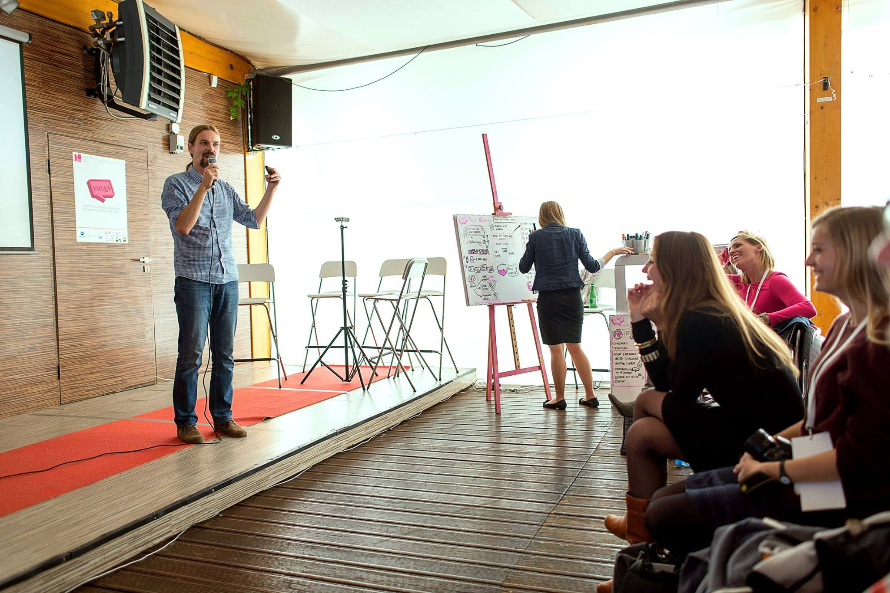
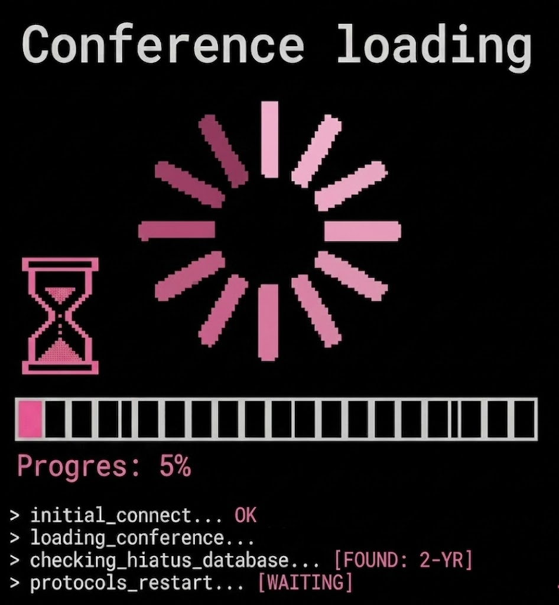

Konferencje soap! zajmują szczególne miejsce w sercach osób żyjących komunikacją
techniczną. Na Techwriterze z dumą zamieściliśmy relacje ze wszystkich 9 edycji.
Były to wydarzenia, które wpłynęły na zawiązanie się społeczności i przyczyniły
się do przyspieszenia jej rozwoju w Polsce. Z artykułu dowiesz się:

- Skąd wziął się pomysł na te konferencje?
- O co chodzi z różowym mydłem?
- Co kryje się za literami **s**, **o**, **a**, **p**?
- Jak przebiegał rozwój inicjatywy i co z niej wynikło?

<!--truncate-->

## Od autora

W konferencji wziąłem udział trzy razy: w 2018, 2022 i 2023. Za każdym razem
bawiłem się wyśmienicie i miałem przyjemność porozmawiać z bardzo otwartymi
ludźmi. Sporo się dowiedziałem i zostałem zainspirowany do wielu cennych
przemyśleń. Konferencję wyróżniała niezwykle przyjazna atmosfera tworzona przez
organizatorów i uczestników.

W tym miejscu chciałem podziękować Gosi za rozmowę, podczas której streściła mi
historię soap!. Wiele zdań w tym artykule to wierne cytaty lub parafraza jej
słów. Stwierdzenia były tak celne, że po prostu nie mogłem ich nie wykorzystać.
Swoją drogą, trudno się temu dziwić, skoro Gosia i wszystkie osoby powiązane z
soap! to wytrawni specjaliści od komunikacji, od których należy spodziewać się
trafnych opisów.

## Stan branży w 2013

Jak wyglądała wtedy polska scena technical writingu? Nie wiadomo ilu technical
writerów było wtedy w Polsce. Osoby wykonujące ten zawód narzekały na poczucie
izolacji zawodowej i ograniczony feedback od ekspertów z którymi pracowali. W
tamtym okresie nie było kierunków na studiach w ramach których można było
zgłębiać komunikację techniczną, nie było nawet pojedynczych tematów zajęć,
których byłby prezentowane podstawowe informacje.

## Pomysł i silna grupa założycielska

W 2013,
[Paulina Dygoń](https://www.linkedin.com/in/paulina-dygo%C5%84-5b158624/),
[Gosia Radymiak](https://www.linkedin.com/in/malgorzata-gosia-radymiak/) i
[Paweł Kowaluk](https://www.linkedin.com/in/pawel-kowaluk/) pracowali w tej
samej firmie. W obrębie ich zespołu dokumentacyjnego zapadła decyzja o przejściu
na nowe, zaawansowane narzędzie do tworzenia dokumentacji.

Gosia miała wtedy niespełna rok doświadczenia jako technical writerka  
i dopiero poznawała standard DITA.

Paweł był wtedy tech writingowym narzędziowym geekiem. (I wciąż nim jest! Tu bez
zmian!)

Paulina w tamtym czasie była technical writerką, ewangelistką DITY i liderką
jakości.

Członkowie zespołu mieli dużo pytań na temat nowego narzędzia, migracji do niego
i wyzwań technicznych. Razem doszli do wniosku:

> Niemożliwe, żebyśmy jako jedyni spotkali się z tymi problemami. Ktoś już
> wcześniej musiał to rozgryźć.

Z tego właśnie powodu pojechali do Londynu na trzydniową konferencję
[Congility](https://www.ditawriter.com/interview-with-noz-urbina-about-the-upcoming-congility-conference/),
na której prelegentem był [Noz Urbina](https://www.linkedin.com/in/nozurbina/).

Wydarzenie było bardzo udane, wypełnione spotkaniami, nawiązywaniem kontaktów i
przekazywaniem wiedzy.

To był czerwiec 2013 roku. A już w październiku postanowili zrobić własną
konferencję w Polsce. Taka dynamika i rozmach robią wrażenie!

Napędzały ich ambicja i młodzieńczy entuzjazm. Przyjrzyjmy się temu, jak
podeszli do nowego wyzwania.

## Przygotowania do pierwszego soap!

> Robimy długi research 🤔?

> Nieee, nauczymy się robiąc 💪!

### Nazwa

Skąd wzięła się nazwa "soap!"? 🧼 Mydło nawiązywało do świeżości. Podczas rozmów
o branży narodziła się metafora baniek 🫧, w których funkcjonowali różni  
specjaliści od treści, nie mając świadomości siebie nawzajem. Historia nazwy
została nieco szerzej opisana w
[relacji z soap! z 2015 roku](https://techwriter.pl/namydleni-po-raz-trzeci/#o-co-chodzi-z-tym-r%C3%B3%C5%BCowym-myd%C5%82em).

Po wybraniu głównego symbolu, pozostało rozpisać skrót:

- Strategy
- Opportunity
- Advancity (tak, jest takie słowo!)
- Professionalism

Słowa te brzmią ambitnie, profesjonalnie i nieco tajemniczo.

Śmiałkowie mieli jeszcze do rozpracowania detale dotyczące strony internetowej,
zdefiniowanie tego, kto dokładnie ma być odbiorcą tej konferencji i zaproszenie
speakerów, którzy podejmą się przeprowadzenia prezentacji.

### Odbiorcy

Miał to być świeży start dla technical writingu. Chodziło o stworzenie
wydarzenia dla młodej, dynamicznej społeczności technical writerów i
specjalizacji powiązanych, takich jak projektowanie graficzne, e-learning i
tłumaczenia (lokalizacja).

### Prelegenci

Organizatorzy rozpatrywali zgłoszenia potencjalnych prelegentów. W czasie rozmów
ze speakerami starali się przybliżyć zainteresowania publiki, które różniły się
od zainteresowań publik z dojrzałą tradycją tech writingową. Dla tej młodej
konferencji bardzo istotne było zaufanie do doświadczonych mówców.

### Sponsorzy

Jedną z rzeczy wyjątkowych dla soap! była udana współpraca ze sponsorami. Ich
obecność na konferencji była dyskretna. Uczestnicy mogli skupić się na tematach
wystąpień, nie było męczącej czy natrętnej promocji firm i ich produktów. W tych
kwestiach zachowana była perfekcyjna równowaga.

### Wyścig z czasem

Nasi pionierzy dokonali niemożliwego. W cztery miesiące zorganizowali
międzynarodowe wydarzenie.

## Pierwsza odsłona: 3 października 2013

**Noz Urbina - dobry duch soap!. Wystąpił podczas edycji 1 i 2.**

W wydarzeniu promowanym metodą poczty pantoflowej wzięło udział 120 osób.

Konferencja odbyła się w siedzibie Wyższej Szkoły Europejskiej im. ks. Józefa
Tischnera, której Gosia była absolwentką.

Udało się nawiązać współpracę z kilkoma sponsorami.

Wodzirejem wydarzenia był Paweł Kowaluk.

Tematyka była przekrojowa i nie było ustalonego tematu przewodniego, który by
wszystkie wystąpienia spinał razem.

Agnieszce Tkaczyk oporny projektor nie przeszkodził zaprezentować swojego tematu
na należytym poziomie. Wrażenie jakie wywarła na słuchaczach zapewniło jej
najwyższe noty w głosowaniu na najlepsze wystąpienie. (W tej edycji Agnieszka
prezentowała, a w następnych jeszcze mocniej wpisała się w historię soap!, o
czym przeczytacie za chwilę).

Noz Urbina, którego organizatorzy słuchali podczas Congility, ponownie wcielił
się w rolę prelegenta na soap!.

Wielkim wsparciem dla pierwszego soap! okazał się
[Piotr Peszko](https://www.linkedin.com/in/piotr-peszko-elearning/)
specjalizujący się w materiałach e-learningowych. Piotr dzielił się z
organizatorami swoim doświadczeniem w prezentowaniu, zachęcał ich do działania,
przekonując ich, że ze wszystkim sobie poradzą. Prezentował nastawienie, wedle
którego człowiek uczy się robiąc, trzeba tylko zacząć i wszystko staje się
możliwe. Na soap! 2013, Piotr z powodzeniem przedstawił swój temat "How the tin
can API will revolutionize the learning world". Kilkakrotnie powrócił jeszcze
jako prelegent podczas kolejnych edycji.

Gosia podzieliła się myślą, że organizując takie spotkanie można poznać lepiej
siebie i innych. Z pewnością nie była to bułka z masłem. W takich wymagających
momentach można zobaczyć hart ducha, pomysłowość i gotowość do poświęceń.

**Agnieszka, Piter i uczestnicy.**

## Po pierwszym soap!

Społeczność przyjęła soap! z entuzjazmem i pewnym zdziwieniem:

> O kurczę, mamy polską konferencję tech writingową!!!

### Odczucia uczestników

### Listopadowe spotkanie

Widać było spory apetyt na dzielenie się wiedzą, skoro jeszcze w listopadzie
tego samego roku doszło do spotkania z całkiem rozbudowaną agendą w Massolit
Books and Cafe w Krakowie.

Oryginalny podpis z ówczesnej strony soap!:

> You can tell when a man is serious.

### Ważne decyzje

Planowanie po pracy i czas wolny wypełniony organizacją konferencji to duże
poświęcenie. Paulina i Paweł czuli się tym zmęczeni i postanowili zrezygnować.

Gosia kontynuowała tę inicjatywę.

(W późniejszych edycjach Paweł udzielał się jako prelegent i trener, a Paulina
wystąpiła podczas ostatniego soap!).

### Zespół od czasu drugiej edycji

Zawiązała się ekipa o takim składzie:

| Kto                                                                                  | Parę słów o                                                                                                                                                                                              | Rola/obszar                                                                                  |
| ------------------------------------------------------------------------------------ | -------------------------------------------------------------------------------------------------------------------------------------------------------------------------------------------------------- | -------------------------------------------------------------------------------------------- |
| [Gosia Radymiak](https://www.linkedin.com/in/malgorzata-gosia-radymiak/)             | W tamtym czasie była technical writerką i specjalistką od jakości. Interesowały ją nurkowanie, wędrówki po górach, zapiekanki i DITA.                                                                    | - Project Manager, który spina wszystko w całość  - "Driver" projektu                   |
| [Karolina Karbarz](https://www.linkedin.com/in/karolina-karbarz)                     | Specjalistka od projektowania graficznego, fanka ciast czekoladowych, koreańskich filmów i spacerów z czworonogiem.                                                                                      | - Strona Internetowa   - Szata graficzna  - Grafiki                                |
| [Piotr Milewski](https://www.linkedin.com/in/piotrmilewski) zwany Piterem            | Absolwent Wyższej Szkoły Europejskiej (Lingwistyka Stosowana). Technical writer z zamiłowaniem do wspinaczki górskiej, [skitouringu](https://skitourschool.pl/co-to-jest-skitouring/) i paralotniarstwa. | - Speakerzy i trenerzy  - Laptopy i ekrany  - Współpraca z Manggha                 |
| [Agnieszka Tkaczyk](https://www.linkedin.com/in/agnieszka-tkaczyk-walczak-93508570/) | W tamtym czasie Agnieszka była Information Developerem, jako tłumaczka współpracowała z krakowskimi uniwersytetami. Oprócz dokumentacji interesowało ją projektowanie interfejsów użytkownika.           | - Sponsorzy i partnerzy                                                                      |
| [Iga Koprowska](https://www.linkedin.com/in/iga-koprowska)                           | Filolożka angielska i tłumaczka. Wciąż pozostaje w nurcie komunikacji technicznej.                                                                                                                       | - Media społecznościowe   - Komunikaty   - Copywriting na stronę   - Branding |

Piter i jego technologiczne centrum kontroli wszechświata:

> Don't be too proud of this technological terror you've constructed!

> **Lord Vader, na widok tego setupu.**

Źródło powyższego zdjęcia:
[Twitter](https://x.com/em_piter/status/999946418587684864?t=fvLzHHgbrzLc-Zd1MZyWKQ&s=07).

**Piter działa podczas soap! 2022.**

Grupa jest znana pod pseudonimem scenicznym: "Soapy Crew".

## Po raz drugi: 2-3 października 2014

- Temat przewodni: _a clean; start;_

Poruszane tematy wiązały się z różnymi aspektami rozwijania produktów
przyciągając specjalistów z wielu dziedzin, takich jak: UX, UI, marketing,
biznes, programowanie, technical writing. Wszystkim tym osobom zależy na dobrym
contencie i tworzeniu wspaniałych produktów. Każda z tych osób wyniosła świeże,
szersze spojrzenie na uczestniczenie we własnych projektach.

Ekipa postanowiła zmienić miejsce z powodu ograniczeń wcześniejszej lokalizacji.
Wybrali klimatyczny budynek dawnej fabryki kabli, który został zaadaptowany na
przestrzenie biurowe.

Rolę konferansjera pełnił Paweł. Całe wydarzenie rozpoczęło się od jego mowy
otwierającej, której zarys możecie przeczytać w
[relacji](https://techwriter.pl/mydlo-lubi-zabawe/#zacz%C4%99%C5%82o-si%C4%99).

Pierwszy, darmowy dzień konferencji przyciągnął 142 uczestników, a drugi płatny
dzień - 98.

Po raz pierwszy uczestnicy mogli wziąć udział w warsztatach.

Była to jedyna odsłona, podczas której można było wybierać między dwiema
ścieżkami prezentacji odbywającymi się w tym samym czasie. Ścieżka 1 nazywała
się "sponge" 🧽, a ścieżka 2 - "bubbles" 🫧 😀.

Noz Urbina powrócił z prezentacją, której zarys znajdziecie
[tutaj](https://techwriter.pl/soap-2014-summary-of-day-2/#find-a-common-language).

Agnieszka Tkaczyk przedstawiła publice użyteczne informacje o stosowaniu
infografik.

Unikatową atrakcją było stanowisko z dwiema drukarkami 3D. Był to w tamtych
czasach nowoczesny i innowacyjny sprzęt.

Zrobiono z tych drukarek właściwy użytek:

Kto chce, może zobaczyć podsumowanie w formie
[klipu wideo](https://youtu.be/4nY_kCnYwH0?si=aE2jsBwp63RUTkOo).

## Po raz trzeci: 8-9 października 2015

**[Piotr Nabielec](https://www.linkedin.com/in/piotrnabielec/) mówi, a
[Natalia Mikołajek](https://jadzkarysuje.pl/?v=288404204e3d) wykonuje graphic
recording.**

Tym razem soap! odbył się w lokalizacji przy Plaży Kraków.

Jak to czasem bywa, nie z winy organizatorów, pojawiły się trudności.
Wynajmujący zapomniał wspomnieć o dziurze w dachu. Były problemy z ogrzewaniem
budynku. Z powodu zimna, większą część czasu uczestnicy siedzieli w kurtkach i
szalikach, był to w końcu październik. Kto był, ten wie!

Mimo takich przeciwności, morale i poziom merytoryczny wydarzenia były nader
wysokie. Piotr Peszko po raz kolejny stanął na scenie, przedstawiając "Key
challenges with global content development".

Podczas wydarzenia graphic recording dostarczyła Natalia Mikołajek, znana pod
pseudonimem artystycznym "Jadźka Rysuje", który jest też nazwą jej działalności.
Więcej o jej obecności na soap! przeczytać możecie w
[relacji](https://techwriter.pl/namydleni-po-raz-trzeci/#my-tu-gadu-gadu-a-jad%C5%BAka-rysuje).

Pierwszy, darmowy dzień konferencji przyciągnął 170 uczestników, a drugi płatny
dzień - 80.

## Po raz czwarty: 1-3 czerwca 2016

**Rachel Ody prowadzi szkolenie.**

Nauczeni poprzednimi doświadczeniami, organizatorzy wybrali cieplejszy miesiąc
na to wydarzenie.

- Temat przewodni brzmiał: _"My" zamiast "Oni"_. Pozycja technical writera w
  zespole i podejście do współpracy to kwestie, które nadal nie tracą na
  aktualności.

Do poruszanych motywów, oprócz rozwiązań technicznych i nowych technologii,
należały również zagadnienia UI, UX, zarządzanie projektem i rola dokumentacji
dla wdrażania produktu i zapewnienia tego, że użytkownicy wykorzystują jego
pełen potencjał.

Konferencję poprzedzało pięć warsztatów w ramach Content Edu Summit.

Zobacz podsumowanie w formie
[klipu wideo](https://youtu.be/rc-MeNW2U6M?si=A9asKSsAUxfLGDf2).

### Nowa lokalizacja: Manggha

**Źródło:
[Wikipedia](https://pl.wikipedia.org/wiki/Muzeum_Sztuki_i_Techniki_Japo%C5%84skiej_%E2%80%9EManggha%E2%80%9D).**

W 2016 po raz pierwszy konferencja odbyła się w powołanym do życia przez
Andrzeja Wajdę
[Muzeum Sztuki i Techniki Japońskiej Manggha](https://manggha.pl/).
Organizatorzy szybko znaleźli wspólny język z właścicielami. Współpraca okazała
się perspektywiczna, bo soap! powrócił do Manggha jeszcze pięć razy. Uczestnicy
konferencji otrzymali możliwość zwiedzania muzeum.

### Wolontariusze z 31 LO w Krakowie

Uczniowie licealni wsparli wiele edycji soap! na wiele sposobów:

- Pomagali w szatni
- Drukowali co było potrzebne
- Rozdawali mydła z logo konferencji osobom z publiki zadającym pytania
- Sami odpowiedzieli na milion pytań
- Na skuterze załatwiali potrzebne rzeczy

Uczniowie zawsze mieli mnóstwo pomysłów i świetnie rozwiązywali problemy.

Takie zaangażowanie nie było wyjątkiem od reguły a raczej regułą, bo 31 LO
charakteryzuje się tym, że jest tam dużo aktywności dla uczniów, a pomoc przy
konferencji była jedną z nich.

## Po raz piąty: 7-9 czerwca 2017

- Temat przewodni: _Rozwiązywanie problemów_.

Kolejną atrakcją soap! na którą zwrócę uwagę były gadżety organizatorów i  
partnerów, jakie w tej edycji można było wygrać w konkursach. Szczęśliwcy mogli
otrzymać kubek Techwritera, leżak soap!, a sponsorzy ofiarowali jako nagrody
licencje na oprogramowanie. W późniejszych edycjach organizowane były loterie w
których można było otrzymać miłe upominki.

Jeśli zaś chodzi o stan samego soap!, to przywołam tu opinię
[Jakuba Wiśniewskiego](https://www.linkedin.com/in/jakubmwisniewski/), który w
swojej [relacji](../soap-2017-juz-za-nami-relacja/index.md) celnie podsumowuje
atrakcyjność tej konferencji w tamtym czasie:

> soap! zdecydowanie się rozwija. Konferencja, która rozpoczynała jako lokalne
> wydarzenie, na naszych oczach przeradza się w istotny, międzynarodowy punkt na
> tech commowej mapie Europy, jednocześnie nie zatracając atmosfery wydarzenia
> organizowanego przez paczkę przyjaciół.

Zobacz podsumowanie [wideo](https://youtu.be/Zi_PfEf7tQE?si=WgExPK711W8lW9nJ).

## Po raz szósty: 23-25 maja 2018

- Temat przewodni: _Innowacja kontra prostota_.

Piotr Peszko powrócił z brawurową prezentacją, którą do dziś wspominam z
uśmiechem. Była kozacka!

Podobnie jak w wielu poprzednich odsłonach, poziom prezentacji by wysoki pozom
prezentacji, warsztaty przydatne, a atmosfera świetna.

Nie mogę nie wspomnieć o klimatycznej strefie chillout w ogródku na tyłach
Manggha, miejscu relaksu i dobrych rozmów. Po intensywnych prezentacjach dobrze
było tam się przejść i odetchnąć świeżym powietrzem.

Podkreślę jeden aspekt nieoficjalnej części konferencji, który
[Michał Skowron](https://www.linkedin.com/in/michalskowron/), stały bywalec
soap! jako uczestnik, prelegent i trener, podsumował w swojej
[relacji](../konferencja-soap-2018-relacja/) z tamtej edycji:

> Konferencja to nie tylko mnóstwo wiedzy, to także sporo dobrej zabawy. Po
> każdym dniu wykładów mieliśmy okazję rozluźnić się i spędzić miło czas na
> rozmowach, nie tylko o sprawach branżowych. Można było spotkać starych
> znajomych, nawiązać nowe kontakty, posłuchać muzyki na żywo i napić się
> dobrego piwa. Podczas nieoficjalnej części jak zwykle panowała luźna atmosfera
> i widać było, że wszyscy dobrze się bawili.

Zobacz podsumowanie [wideo](https://youtu.be/FCZpPW1vlaw?si=6gy2B5uDfK4dm4d2).

## Po raz siódmy: 5-7 czerwca 2019

- Temat przewodni: _Content as Code_.

Jak w ostatnich latach zmieniło się podejście do treści, czy jest traktowana tak
jak kod?

Jakie są zalety i wady takiego podejścia i co ono oznacza dla różnych osób?

Te i inne zagadnienia przyciągnęły wtedy rekordową liczbę uczestników.
Frekwencja wyniosła ponad 210 osób, co stanowiło znakomity wynik.

Przy tej okazji też podkreślę międzynarodowy charakter imprezy. W roku 20**19**
konferencję odwiedziły osoby z **19** krajów.

Rok wcześniej konferencję odwiedzili uczestnicy z 22 krajów, takich jak Polska,
Australia, Czechy, Niemcy, Finlandia, Francja, Węgry, Izrael, Malta, Malezja,
Ukraina, USA i Wielka Brytania, którzy reprezentowali ponad 100 firm. Podobnie
sytuacja się miała w wielu wcześniejszych edycjach.

Zobacz podsumowanie
[wideo](https://www.youtube.com/watch?v=teA3well1ek&list=PLUY0lajb-kiaIbF6clQaxTp2lwqmrDDC5).

## Przerwa z powodu pandemii 2020-2021

**Stworzone w Gemini**.

W edycji z czerwca 2019 odnotowano bardzo wysoką liczbę uczestników.

W 2020 nastała pandemia, która, podobnie jak w wielu innych obszarach życia,
wszystko zmieniła i sporo namieszała.

Przez dwa lata soap! się nie odbywał i wszystko stało pod znakiem wielkiego
wyczekiwania.

Tuż po zakończeniu się pandemii, krajobraz konferencyjny wyglądał inaczej.
Ludzie stali się mniej skłonni do podróży. Trudniej też było znaleźć sponsorów.
Mimo tych przeciwności, ekipa zdecydowała się na reaktywację imprezy.

## Po raz ósmy: 1-3 czerwca 2022

**Agnieszka Tkaczyk jako master of ceremony.**

Przyszedł czas na wznowienie soap!. Powrót po przerwie należał do trudnych.
Ekipie zależało na tym, by zrewidować dobre i złe praktyki, które zdążyły się
wytworzyć przez lata. Stale byli wyczuleni na uwagi odwiedzających.

- Tematem wiodącym była _przyszłość technical writingu_. Temat AI cieszył się
  dużym zainteresowaniem.

Znakiem czasu było to, że była to pierwsza edycja dostępna w ramach transmisji
online.

### Ile masła może kupić tech writer z Litwy?

Jednym z ciekawych wystąpień była prezentacja statystyk dotyczących zarobków
technical writerów, zwłaszcza tych z Europy Środkowej i Wschodniej.

### Soapuszka: początek

Podczas prezentacji o AI,
[Rafał Pawlicki](https://www.linkedin.com/in/rafa%C5%82-pawlicki) przekazał
Soapuszkę, czyli różową poduszkę z nazwą konferencji, tajemniczej grupie o
nazwie Soapuszka Crew. Przy okazji warto podkreślić, że Rafał jako jedyny ze
speakerów odbył podróż w przyszłość i wrócił by o niej opowiedzieć podczas
swojego wykładu. Doceniamy takie poświęcenie!

Jakie były zaś dalsze losy tej różowej poduszki? Przeczytaj późniejszy akapit o
soap! 2023!

### Teleturniej S.U.P.E.R G.A.M.E

Wyjątkową nowością, której uświadczyliśmy tylko podczas konferencji w 2022, był
teleturniej. Oto jego
[kultowy zwiastun](https://www.linkedin.com/posts/soap-techcomm_excitingnewsalert-supergame-soapconf-activity-6920791703234699264-6mUf).
W czasie konkursu było dużo śmiechu. Każdy miał szansę wykazania się wiedzą o
technical writingu. Emocje sięgnęły zenitu, a sztuczna inteligencja stworzona na
potrzeby teleturnieju przez Pawła zaczęła żyć własnym życiem i co rusz
zaznaczała swoją niezależność.

Dzięki tej grze poznałem
[Mateusza Boryckiego](https://www.linkedin.com/in/mateusz-borycki-2817a6186/),
który dobrze wywiązywał się z obowiązków wynikających z bycia głową rodziny w
tej dokumentacyjnej "Familiadzie".

## Po raz dziewiąty: 1-3 czerwca 2023

- Temat przewodni: _Content Operations_.

Była to ostatnia odsłona konferencji jaka dotychczas miała miejsce.

Tym razem Paulina Dygoń, współzałożycielka i inicjatorka pierwszej edycji, po
raz pierwszy w historii soap! wzięła do ręki mikrofon i przedstawiła swój temat
"Why a PM is like a DJ".

Iga Koprowska z Soapy Crew wystąpiła z tematem "Happy ever after: can you marry
DocOps with DevOps?".

### soap! box

Podczas tamtej edycji organizatorzy wprowadzili soap! box, czyli drewnianą
skrzynkę po jabłkach, na którą każdy mógł wskoczyć i opowiedzieć pokrótce o tym,
co mu aktualnie w duszy gra. Miałem przyjemność na tę skrzynkę wskoczyć. Razem z
[Lancem Cummingsem](https://www.linkedin.com/in/lance-cummings-phd/) i
[Quinn Williams](https://www.linkedin.com/in/quinn-williams-/) opowiadałem o
wspólnym projekcie.

Ten pomysł był ukłonem w stronę spontaniczności i dobrym urozmaiceniem w
wydarzeniu pełnym starannie przygotowanych warsztatów i prezentacji. Zarówno
organizatorzy jak i publiczność byli bardzo otwarci na to, co do powiedzenia
mieli speakerzy stojący na skrzynce 😀. Doceniam to, że kiedy przemawiałem, w
moim kierunku nie leciały jabłka. Publiczność była tamtego dnia dla mnie
życzliwa.

### Panel dyskusyjny

Konferencje wymagają improwizacji. Ponieważ jeden z wykładów został odwołany,
szybko zebrało się kilku ochotników do uczestniczenia w panelu dyskusyjnym.
Wśród tematów rozmów były rekrutacje dla technical writerów, trendy w branży no
i oczywiście sztuczna inteligencja ☺️ (jakże mogłoby być inaczej?).

### Soapuszka: ciąg dalszy

Podczas tej konferencji poduszka trafiła do Lanca Cummingsa.

Śledziliśmy jej późniejsze losy i możemy je w tym miejscu ujawnić.

Soapuszka zwiedziła kawał świata, żyła intensywnie i na krawędzi, co przypłaciła
tym, że popruła się i rozpadła na kawałki. Ale było warto! Lepiej spalać się
szybko i żyć w pełnym blasku i chwale!

## Fakty i liczby

Tutaj gratka dla miłośników tabelek z danymi. Te liczby też opowiadają historię!
Pomagają prześledzić jak rozwijały się te wydarzenia.

To szeroka tabela, u jej dołu znajdziesz pasek do przewijania na boki.

| Rok  | Miejsce                  | Temat   główny           | Ile dni? | Warsztaty                  | Mówcy                 | Ilu słuchaczy? | W roli hosta         | Opcja online? |
| ---- | ------------------------ | ----------------------------- | -------- | -------------------------- | --------------------- | -------------- | -------------------- | ------------- |
| 2013 | Wyższa Szkoła Europejska |                               | 1        | Nie                        | 8                     | 120            | Paweł                | Nie           |
| 2014 | hub:raum                 | a clean; start;               | 2        | 3 warsztaty                | 25 osób (18 wykładów) | 160, 100       | Paweł                | Nie           |
| 2015 | Plaża Kraków             |                               | 3        | Nie                        | 17                    | 170, 80        | Gabriela Guarana Maj | Nie           |
| 2016 | Manggha                  | "My" zamiast "Oni"            | 3        | 5 warsztatów               | 17                    | 220, 125       | Gosia                | Nie           |
| 2017 | Manggha                  | Rozwiązywanie problemów       | 3        | 6 warsztatów dla 42 osób   | 27 osób (22 wykłady)  | 160            | Gosia                | Nie           |
| 2018 | Manggha                  | Innowacja kontra prostota     | 3        | 10 warsztatów dla 60+ osób | 23                    | 170            | Gosia                | Nie           |
| 2019 | Manggha                  | Content as Code               | 3        | 6 warsztatów dla 60 osób   | 25 osób (21 wykładów) | 210+           | Gosia                | Nie           |
| 2022 | Manggha                  | Przyszłość technical writingu | 3        | 5 warsztatów               | 21                    |                | Agnieszka            | Tak           |
| 2023 | Manggha                  | Content Operations            | 3        | 3 warsztaty                | 25                    |                | Gosia                | Tak           |

## Wpływ soap! na środowisko skupione wokół komunikacji technicznej

Słowami Gosi:

> soap! dał ożywienie. Nie wiadomo czy to zbieżność w czasie, z pewnością
> konferencja odegrała rolę. Zaczęły się inicjatywy takie jak ITCQF, Tech Writer
> Koduje. Niektóre osoby ośmieliły się coś robić. Ludzie zaczęli działać.

> Poprawiła się świadomość i pewność siebie osoby dbającej o dokumentację.
> Zwiększyła się jej widoczność w projekcie, chętniej zabiera głos, ma
> inicjatywę. Ma też impuls, by wyjść poza zespół i zrobić coś wartościowego dla
> innych, np. weźmie udział w meetupie, napisze artykuł, albo zdecyduje się
> kogoś mentorować.

> soap! to tylko miejsce, gdzie ludzie się zbierają. Poza soap! ludzie w
> społeczności cały czas coś robią. Ta konferencja to katalizator i platforma do
> spotkań. Reszta zależy od ludzi.

Grupa [soap! technical communication](https://www.facebook.com/soapconf) na
Facebooku liczy 1300 osób.

## Powiązane inicjatywy

Stało się jasne, że soap! raz w roku to było za mało, a apetyt na wiedzę i
spotkania stale rósł. Przy tak rozbudzonym zainteresowaniu, potrzebny był
sposób, by zagospodarować tę energię.

W 2017 Gosia Radymiak zaczęła rozkręcać meetupy pod nazwą
[MeetContent](https://meetcontent.github.io/).

Gosia razem z koleżankami z Soapy Crew opracowały koncepcję spotkania, jego
nazwę, identyfikację wizualną i oficjalną witrynę. Cały ten "pakiet", został
przekazany kolegom z Wrocławia:
[Tomasz Prus](https://www.linkedin.com/in/tomasz-prus-4b09b01a/),
[Wojciech Baranowski](https://www.linkedin.com/in/wojciech-baranowski-84984bab/)
i
[Daniel Barrio Fierro](https://www.linkedin.com/in/daniel-barrio-fierro-a95053110/),
którzy z dużym powodzeniem zaczęli organizować te meetupy w swoim mieście.

(Dodać należy, że Tomasz i Daniel byli aktywnie zaangażowani w soap!, wiele razy
wcielali się w rolę prelegentów i trenerów).

W późniejszym etapie stery MeetContent WRO zostały przekazane innym osobom. Cała
historia zasługuje na osobny artykuł.

Dzięki Danielowi MeetContent dotarł do Hiszpanii (Barcelona).

Przez wiele lat odbywały się spotkania w Krakowie i Wrocławiu.

Wrocławski MeetContent jest nadal aktywny, a krakowski zakończył już swoją
działalność.

W 2024 w Krakowie powstała nowa marka meetupowa: Content Bytes założona przez
[Barbarę Czyż](https://www.linkedin.com/in/barbara-szwarc/?locale=en),
[Edytę Rakowską](https://www.linkedin.com/in/edyta-rakowska/) i
[Michała Olendra](https://www.linkedin.com/in/michal-olender/).

## Soapy Crew i inicjatorzy obecnie

Wszystkie z wymienionych osób mają wyrobioną renomę w dziedzinach swoich
specjalizacji, którymi są technical writing, copywriting i graphic design.

Każda z osób, która na początku maczała palce w komunikacji technicznej wciąż
realizuje się w tym nurcie. Zmiana ścieżki kariery to nie grzech, ale tu widać
głębokie, wieloletnie zaangażowanie w tę działkę, co pokazuje, że można się w
niej rozwijać i warto w niej zostać długoterminowo, jeśli taka droga Ci
odpowiada.

## Rocznica

**Soapy Crew w 2023.**

Pierwsza edycja soap! odbyła się w październiku 2013. W 2023 roku od pierwszej
edycji minęło 10 lat, a momencie pisania tego artykułu - 12.

Są to lata wielkiego wysiłku i dynamicznego rozwoju całej społeczności.

Serdecznie dziękujemy ekipie organizującej te cudowne wydarzenia i wszystkim jej
uczestnikom. Warto było dzielić te doświadczenia, za które jesteśmy niezmiernie
wdzięczni.

Jak to kiedyś określił Michał Skowron:

> I came for the talks.

> I stayed for the people!

Jakkolwiek patetycznie może to zabrzmieć, soap! był wyjątkowy dzięki ludziom,
którzy go tworzyli i w nim uczestniczyli. Była to przestrzeń na spotkania ludzi
rozumiejących bolączki dokumentacji, mających ochotę nauczyć się czegoś i
jednocześnie gotowych przekazać swoją wiedzę i doświadczenia innym. Zachowujemy
w pamięci naprawdę niezapomniane chwile radości, a czasem olśnienia. soap!
zawsze kojarzyć mi się będzie z entuzjazmem, zaangażowaniem i niecierpliwym
pałaszowaniem olbrzymich dawek wiedzy.

Jeśli ktoś zauważy w artykule coś do skorygowania czy uzupełnienia albo chciałby
podzielic się swoją historię związaną z soap! to zapraszamy do kontaktu.

# **SOAPERS ROCK!!!**

## Materiały dodatkowe

### Relacje na Techwriterze

[Tag](https://techwriter.pl/tags/soap) z listą wszystkich relacji z
[soap!](https://techwriter.pl/tags/soap), gdzie możecie zapoznać się z relacjami
pisanymi szczegółowo i ze swadą.

### Zdjęcia z konferencji

Większość zdjęć w artykule pochodzi ze strony Facebook
[soap technical communication](https://www.facebook.com/soapconf/photos_albums).
Zapraszam do obejrzenia tej "wizualnej dokumentacji".

Część zdjęć pochodzi z archiwum Soapy Crew.

### Nagrane prezentacje

Na kanale YouTube znajdziecie
[nagrania](https://www.youtube.com/@SoapconfPage/playlists) z niektórych edycji.
Mimo upływu lat, warto do nich wrócić, w dokumentacji sporo tematów nie traci na
aktualności.

### Wywiad Piotra Peszko z Gosią Radymiak

- [2EDU - Jak budować społeczność technical writingu w Krakowie](https://blog.2edu.pl/2015/09/jak-budowac-spolecznosc-technical-writing-w-krakowie-wywiad-z-malgorzata-radymiak.html)

### soap! oczami innych uczestników

- [TechWhirl - Conference Review: soap! Offers a Clean Start in Poland 2014?](https://techwhirl.com/conference-review-soap-offers-clean-start-poland/)
- [Cynthia Peter's Review of 2023 soap!](https://medium.com/postcards-by-fancy-nomads/attending-soap-conference-in-krakow-poland-ac7e4c98eb13)
