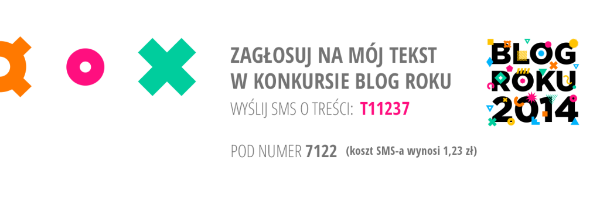

Ponieważ nie ma jeszcze konkursu na blagę roku, a my kochamy rywalizację -
postanowiliśmy zgłosić naszą stronę do konkursu "Blog roku". Chcemy poprawić
wynik z zeszłego roku, kiedy to nawet my sami na siebie nie zagłosowaliśmy.

<!--truncate-->

[Konkurs na blog roku](http://www.blogroku.pl/) ma już całkiem długą,
dziesięcioletnią historię. Nasza strona, technicznie rzecz biorąc, jest blogiem.
Przy tym cały czas próbujemy dotrzeć do nowych czytelników, stwierdziliśmy
więc - czemu nie? Również za pośrednictwem tego konkursu możemy
spróbować pokazać techwriting szerszej publiczności. Szanse na zwycięstwo
szacujemy na 1%, ale jeśli dzięki temu konkursowi dowie się o nas (i o Was)
jeszcze kilku techwriterów w Polsce - to już będzie warto.

Nawiasem mówiąc - czy wiecie, że na naszą stronę zagląda już około 1000 osób
miesięcznie?

[Wystartowaliśmy w kategorii "Specjalistyczne i firmowe"](http://www.blogroku.pl/2014/kategorie/-b-techwriter-b-b-pl-b-,8sh,blog.html).
Skąd ten wybór? - za nic nie mogliśmy się zdecydować czy wybrać kategorię "blogi
nastolatków" czy "blogi parentingowe" - postawiliśmy więc na coś pomiędzy 😉

Dodatkowo zgłosiliśmy
[jeden tekst w kategorii "Tekst roku"](http://www.blogroku.pl/2014/kategorie/-b-langlydz-b-part-ten,98i,tekst.html) -
padło akurat na artykuł z serii langłydż.

Teraz będzie nam bardzo miło, jeżeli otrzymamy choć jeden głos w którejkolwiek
kategorii.

Głosuje się sms-em, który kosztuje aż 1,23 zł, ale te pieniądze nie napełniają
kieszeni wstrętnych kapitalistów, ani nawet naszych kieszeni. Dochód zostanie
przeznaczony na rzecz fundacji "Dzieci niczyje".

Jeżeli więc możecie zagłosować, komunikacja techniczna jest bliższa Waszemu
sercu niż gotowanie czy finanse, a do tego chcielibyście nam pomóc dotrzeć do
innych koleżanek i kolegów - będziemy wdzięczni za każdy głos!

Numery i treść sms-ów dla głosujących na nas - na obrazkach powyżej. Głosowanie
kończy się 10 lutego w południe.
