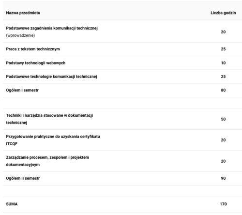

Mamy interesujące wieści. Studia podyplomowe z technical writingu startują już 7 listopada. 100% online!

W aktualnych okolicznościach przyrody rozpoczynanie jakichkolwiek studiów w formie tradycyjnej ma raczej średni sens. Do takich wniosków doszli również twórcy pierwszych studiów podyplomowych dotyczących naszej profesji. Wszystko wskazuje na to, że wyczekiwany przez wiele osób od kilku lat, kierunek w końcu wystartuje. Cieszymy się, szczególnie, że objęliśmy go swoim patronatem :)

Plan zajęć wygląda następująco:

Można powiedzieć, że semestr pierwszy pokazuje "co", a semestr drugi koncentruje się na tym "jak". Duży plus za wbudowanie w program zakresu certyfikacji [ITCQF](http://itcqf.org/) - koszt szkolenia na [wolnym rynku](http://techwriter.pl/szkolenia/) to właściwie połowa kosztu całych studiów. Naszym skromnym zdaniem stosunek jakości do ceny przedstawia się bardzo korzystnie.

Wśród wykładowców znajdziecie tylko i wyłącznie praktyków, postaci rozpoznawalne nie tylko na polskiej scenie techcommowej - to również rokuje optymistycznie.

Wszystkie potrzebne informacje znajdziecie na stronie kierunku: [https://www.vistula.edu.pl/kierunki-studiow/kontynuacja-edukacji/studia-podyplomowe/informatyka/komunikacja-techniczna](https://www.vistula.edu.pl/kierunki-studiow/kontynuacja-edukacji/studia-podyplomowe/informatyka/komunikacja-techniczna)

Koniecznie dajcie znać, czy ktoś z Was zdecydował się na tego typu kształcenie i jakie są Wasze wrażenia.

Trzymamy kciuki za ciekawe, praktyczne zajęcia!
