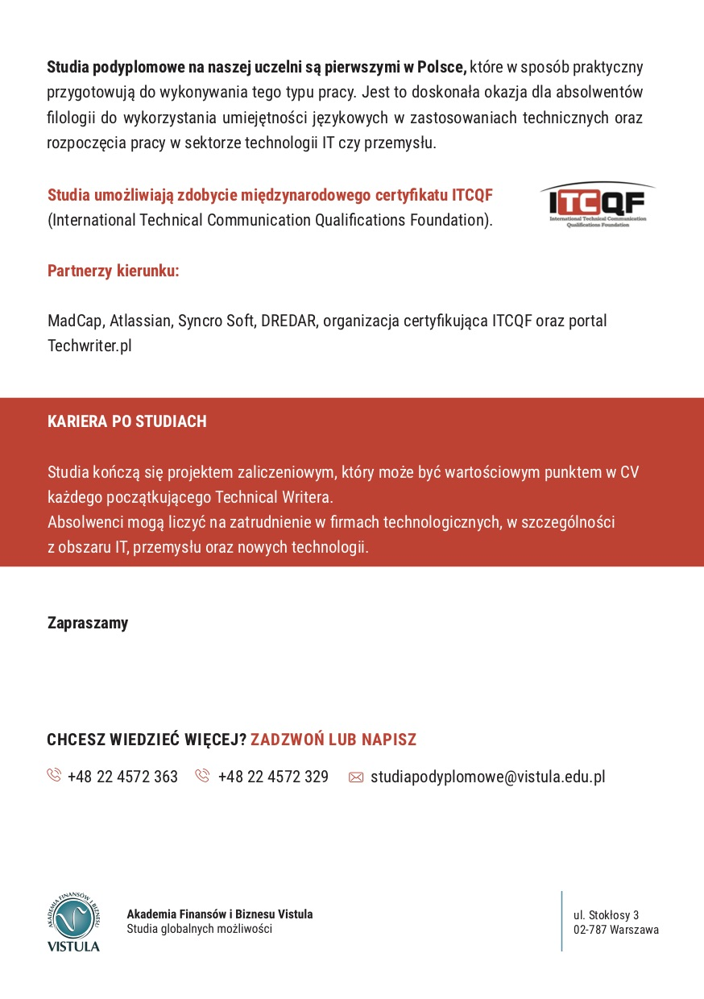

Zmieniły się nieco plany uczelni Vistula odnośnie startu naszego kierunku - oficjalne rozpoczęcie przesunęło się z października na listopad.

Aktualny plan przewiduje rozpoczęcie zajęć w weekend 16-17 listopada. Oczywiście o ile zbierze się wystarczająca ilość chętnych. Więcej o tej inicjatywie pisaliśmy jakiś czas temu - [tu znajdziecie wszystkie potrzebne szczegóły](http://techwriter.pl/studia-podyplomowe-w-warszawie-ruszaja-w-pazdzierniku/). A poniżej ulotka promocyjna :)

