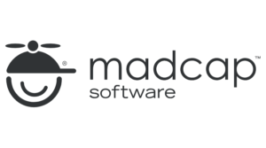
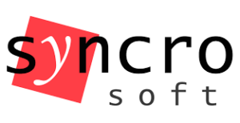

Zainteresowanie jest spore, wśród wykładowców praktycy rozpoznawalni w branży,
organizatorom udało się uzyskać wsparcie firm dostarczających popularne
narzędzia. Trzymamy kciuki!

Nie jest to pierwsze podejście do tematu, o studiach w Warszawie pisaliśmy już
kilkukrotnie,
[ostatnio we wrześniu](http://techwriter.pl/studia-dla-techwriterow-aktualizacja/).
Tym razem jednak wydaje się, że studia rzeczywiście wystartują - z informacji
jakie uzyskaliśmy na uczelni wynika, że na liście chętnych jest już kilkanaście
osób (!). Akademia Finansów i Biznesu Vistula bardzo mocno liczy na to że już w
październiku pierwsze tego typu studia w Polsce będzie można uważać za otwarte.

[Oficjalną stronę kierunku znajdziecie tutaj.](https://www.vistula.edu.pl/kierunki-studiow/kontynuacja-edukacji/studia-podyplomowe/informatyka/komunikacja-techniczna)

Wśród wykładowców znane nam (i Wam pewnie też) nazwiska: Tomasz Prus, Daniel
Barrio Fierro, Marta Bartnicka. Są to osoby z wieloletnim, praktycznym stażem w
komunikacji technicznej. Co ważne, w swoich firmach często odpowiadają za
rekrutację nowych osób i jako liderzy swoich zespołów najlepiej wiedzą jakie są
potrzeby rynku i jakich umiejętności potrzebują pracodawcy. A
[ofert pracy](http://techwriter.pl/category/news/oferty-pracy/) wciąż jest
więcej niż wykwalifikowanych chętnych.

Na liście technologicznych i merytorycznych partnerów kierunku znajdziecie
m.in.:

<table class="basic" style="width: 100%; height: 320px;"><tbody><tr style="height: 65px;"><td style="width: 12.9616%; height: 65px;"></td><td style="width: 8.90659%; height: 65px;"><strong>MadCap</strong></td><td style="width: 77.4077%; height: 65px;">W ramach swojego programu wspierania uczelni <a href="https://www.madcapsoftware.com/education/" target="_blank" rel="noopener noreferrer">MadCap Scholar</a> udostępnia wiodące na rynku oprogramowanie <strong>MadCap Flare</strong> dla wszystkich uczestników.</td></tr><tr style="height: 62px;"><td style="width: 12.9616%; height: 62px;"></td><td style="width: 8.90659%; height: 62px;"><strong>Atlassian</strong></td><td style="width: 77.4077%; height: 62px;">Udostępnia oprogramowanie <strong>Confluence</strong> oraz <strong>JIRA</strong> przy okazji wraz z Vistulą budując Atlassian Classroom Community.</td></tr><tr style="height: 61px;"><td style="width: 12.9616%; height: 61px;"></td><td style="width: 8.90659%; height: 61px;"><strong>Syncro Soft</strong></td><td style="width: 77.4077%; height: 61px;">Producent <strong>oXygen XML Editor</strong> daje słuchaczom studiów możliwość wykorzystania swojego narzędzia w ramach licencji Academic Classroom.</td></tr><tr style="height: 54px;"><td style="width: 12.9616%; height: 54px;"></td><td style="width: 8.90659%; height: 54px;"><strong>ITCQF</strong></td><td style="width: 77.4077%; height: 54px;">W ramach studiów odbywają się zajęcia przygotowujące do <strong>egzaminu certyfikacyjnego ITCQF</strong>. Sam egzamin jest dodatkowo płatny.</td></tr><tr style="height: 78px;"><td style="width: 12.9616%; height: 78px;"></td><td style="width: 8.90659%; height: 78px;"><strong>Techwriter.pl</strong></td><td style="width: 77.4077%; height: 78px;">Jak zwykle będziemy trzymać rękę na pulsie, starać się pomagać i doradzać prowadzącym oraz studentom a Was informować o postępach :)</td></tr></tbody></table>

Studia kosztują 5500 zł za dwa semestry (170 godzin), jeśli jesteście
zainteresowani udziałem warto poszukać możliwości dofinansowania w swojej firmie
lub zewnętrznych organizacjach!
