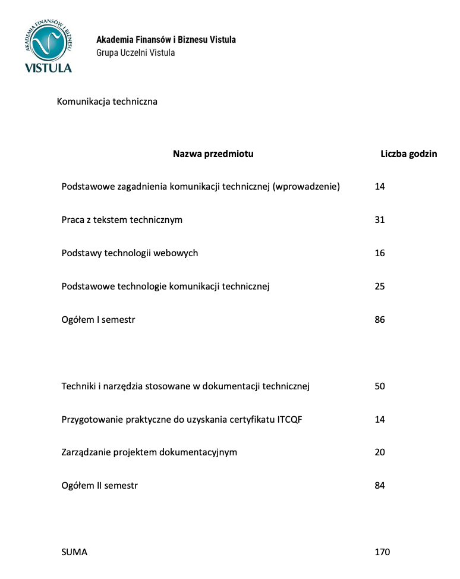

Już w październiku startuje druga edycja studiów podyplomowych na kierunku
Komunikacja Techniczna. Cieszymy się i chętnie podzielimy się z Wami
szczegółami.

<!--truncate-->

Jak wiecie rok temu objęliśmy ten kierunek studiów swoim patronatem. Dlatego
bardzo nas raduje, że pierwsza edycja okazała się sukcesem i przedsięwzięcie
będzie miało kontynuację. Przeczytajcie wpisy naszej koleżanki Magdy, która jest
już absolwentką tego kierunku i dzieli się swoimi wrażeniami:

- [po pierwszym semestrze](../komunikacja-techniczna-jak-sie-studiuje/index.md),
- [p](../komunikacja-techniczna-drugi-semestr/index.md)[o drugim semestrze](../komunikacja-techniczna-drugi-semestr/index.md).

#### Najważniejsze informacje

Studia są w 100% zdalne, mogą w nich brać udział osoby z dowolnego miejsca w
Polsce i na świecie. Pierwsze spotkanie drugiej edycji zaplanowano na **23
października**.

Studia trwają dwa semestry i kosztują 6000 zł. Poniżej szczegółowy program
zajęć:

Po pierwszej edycji prowadzący zdecydowali się na niewielkie, ale znaczące
zmiany w programie, wszystko po to, aby lepiej przygotować studentów na wyzwania
czekające ich na rynku pracy. Duży plus za wbudowanie w program zakresu
certyfikacji ITCQF – koszt szkolenia na [wolnym rynku](/szkolenia/) to właściwie
połowa kosztu całych studiów. Naszym zdaniem stosunek jakości do ceny
przedstawia się bardzo korzystnie.

Bardzo dobre wrażenie robi też długa lista partnerów kierunku - dzięki
współpracy z firmami memoQ, MadCap, Atlassian, Syncro Soft, czy TechSmith
studenci mają możliwość poznania najpopularniejszych, często bardzo drogich
narzędzi wykorzystywanych przez profesjonalnych techwriterów.

Dodatkowo, w 2021 r. rozpoczęto współpracę z University of North Carolina
Wilmington. Studenci kierunku Komunikacja Techniczna wraz z kolegami i
koleżankami z USA mogą współpracować przy projektach prowadzonych w ramach
kierunku „Writing in Intercultural and Global Contexts”. To doskonała okazja, by
zdobyć nowe doświadczenie, szersze perspektywy, nowe znajomości i cenny wpis do
CV. Szczegóły [tutaj](https://www.craft.do/s/VOd7B47ytH4bhA).

Również kadra wzbudza zaufanie, biorąc pod uwagę posiadaną wiedzę oraz
doświadczenie. Wśród wykładowców znajdziecie tylko i wyłącznie praktyków, którzy
są rozpoznawalni na międzynarodowej scenie techcommowej.

Wszystkie potrzebne informacje znajdziecie na stronie kierunku:
[https://www.vistula.edu.pl/kierunki-studiow/kontynuacja-edukacji/studia-podyplomowe/informatyka/komunikacja-techniczna](https://www.vistula.edu.pl/kierunki-studiow/kontynuacja-edukacji/studia-podyplomowe/informatyka/komunikacja-techniczna)

Koniecznie dajcie znać, czy ktoś z Was zdecydował się na tego typu kształcenie i
jakie są Wasze wrażenia.

Trzymamy kciuki za ciekawe, praktyczne zajęcia!
