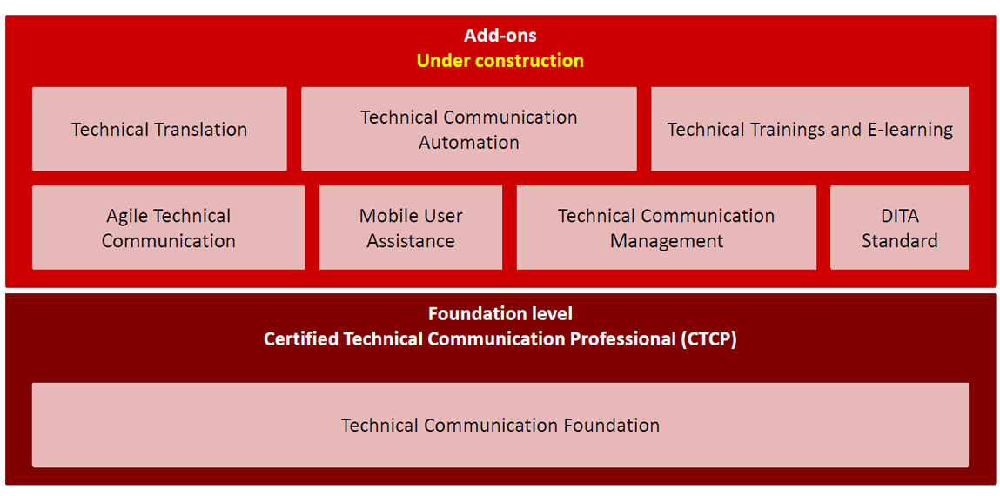

Chciałoby się powiedzieć: NARESZCIE! Przez wieeeele lat Technical Writerzy w Polsce nie mieli dostępu do żadnych specjalistycznych szkoleń, certyfikatów czy konferencji. Od kilku lat mamy już swoją konferencję - [soap!](http://soapconf.com/) A teraz, w końcu, przyszedł czas na przygotowane specjalnie dla nas szkolenia.

Jest nam niezmiernie miło poinformować, że firma [ITtraining](http://ittraining.pl/) zorganizuje pierwsze szkolenia i egzaminy z certyfikacji International Technical Communication Qualifications Foundation (ITCQF®), dedykowanej specjalistom od dokumentacji technicznej.

Pierwsze szkolenia przygotowujące do egzaminu _Certified Technical Communication Professional_ zaplanowane są na **10-11 września** oraz **24-25 września**, ale od organizatorów wiemy, że miejsca pozostały już tylko na drugi termin.

[Tutaj znajdziecie dokładne informacje na temat samego szkolenia.](http://ittraining.pl/szkolenia/wytworzyc_system/komunikacja_techniczna_i_tworzenie_dokumentacji_oprogramowania)

Czym jest ITCQF? Według organizatorów szkoleń i egzaminów:

> _International Technical Communication Qualifications Foundation_ (ITCQF®) to kompleksowy program certyfikacji z zakresu komunikacji technicznej, opracowany we współpracy z uznanymi ekspertami techcomm oraz w oparciu o istniejące normy międzynarodowe. Program ma na celu ułatwienie procesu uczenia się dla początkujących, jak również uzupełnienie i organizację wiedzy już doświadczonych specjalistów techcomm. ITCQF® zapewnia możliwość ujednolicenia terminologii, procesów i najlepszych praktyk stosowanych przez profesjonalistów na całym świecie w różnych organizacjach.

Ale ponieważ najlepiej sprawdzić u źródła, skontaktowaliśmy się z twórcami tej organizacji, odwiedziliśmy też stronę internetową [itcqf.org](http://itcqf.org/),  i... musimy przyznać, że przypadła nam do gustu. Nie jest to może najbardziej rozpoznawalny certyfikat na świecie, ale w naszych warunkach praktycznie jedyny możliwy do zdobycia. Dodatkowo, widać, że twórcy nie zamierzają poprzestać na poziomie Foundation i już teraz planują kolejne, bardziej wyspecjalizowane szkolenia dla Technical Writerów, skupione już na konkretnych częściach naszej profesji, np. zarządzanie, tłumaczenia, Agile, automatyzacja, DITA...

Redakcja techwriter.pl już zarezerwowała sobie miejsca na pierwszych sesjach szkoleniowych. Na pewno zdamy Wam szczegółową relację!

A dla tych, którzy doczytali do końca - prezent:

Wszyscy którzy zdecydują się na udział w szkoleniu organizowanym przez ITTraining i podczas rejestracji powołają się na nasz portal otrzymają **20% zniżki**.

Ale później muszą podzielić się z nami wrażeniami - w komentarzach, mailem lub na FB :).

Pamiętajcie też, że zawsze możecie poprosić swojego pracodawcę o sfinansowanie takiego szkolenia, w całości lub części - po co przepłacać ;)
