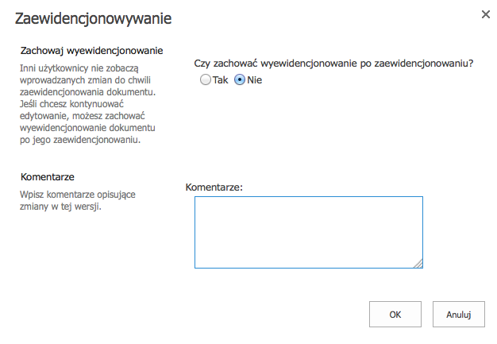

Nie tak dawno pisaliśmy o [dobrych i złych przykładach komunikacji technicznej](http://techwriter.pl/dokumentacja-uzytkownika-przyklady-dobre-i-zle/). Nie przypuszczaliśmy wtedy, że to dopiero początek całej serii ;)

Spójrzcie na screenshot poniżej - flagowa aplikacja wiodącej firmy uraczyła jednego z czytelników takim oto komunikatem:

Czy wiecie skąd pochodzi ten przykład? A może znacie inne - dobre i złe? Czekamy na Wasze komentarze i maile.

A na dokładkę i zachętę, głównie dla piszących po angielsku - [Common English Mistakes Posters](http://thetecnica.com/2014/06/most-common-english-language-mistakes-portrayed-by-hilarious-posters).
