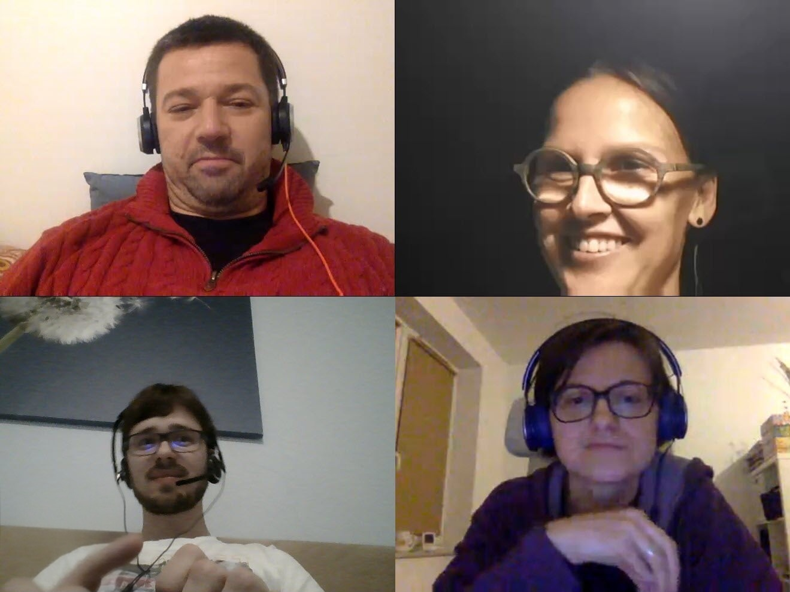
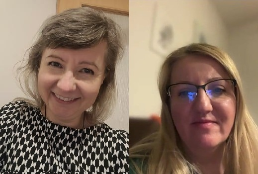
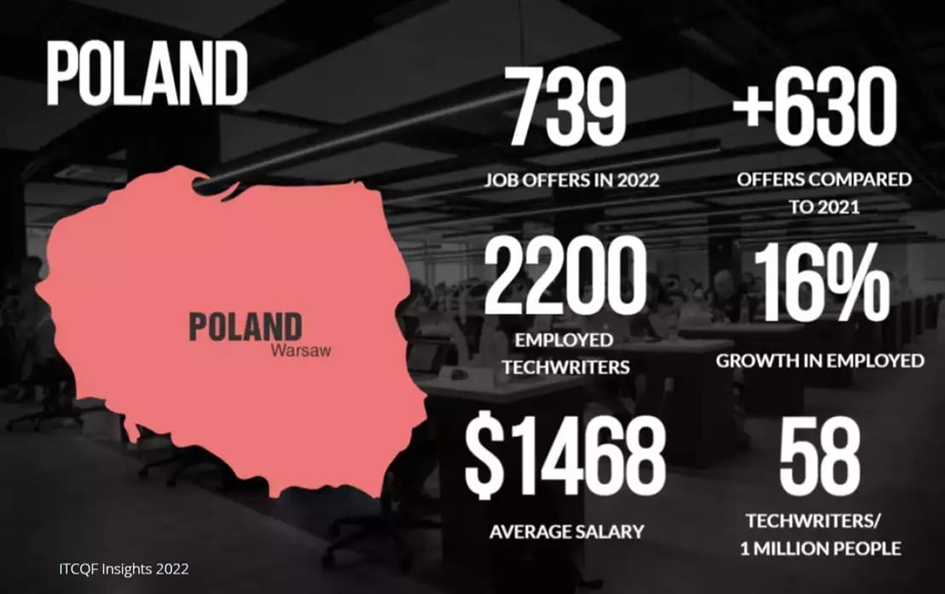
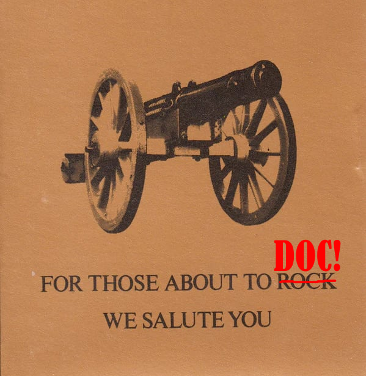

— Czy mamy to udokumentowane???

— Nie.

— No to opiszmy!

Tym razem prezentujemy nietypowy artykuł, a raczej meta-artykuł: techwriter.pl
pisze o techwriter.pl 🙂. Znajdziecie tu zebrane relacje grupy osób, dzięki
którym powstała ta formacja i opowieść o jej dziejach. Temat jest tak rozległy,
że czasem będziemy skakać z tematu na temat, ale obiecujemy krzepiącą konkluzję!

<!--truncate-->

Techwriter.pl — portal, inicjatywa i grupa ludzi, którym bliska jest komunikacja
techniczna — istnieje już od ponad dekady. W tym artykule przybliżamy:

- Początki
- Rozwój inicjatywy
- Cykle artykułów
- Wpływ na branżę komunikacji technicznej
- Perspektywę założycieli
- Jak techwriter.pl prezentuje się obecnie

Dziękujemy wszystkim osobom, które angażowały się, zarówno tym, które pisały
artykuły jak i tym, które te je czytały. Cieszymy się, że od 12 lat, wspólnie
odciskamy ślad na polskiej komunikacji technicznej. Jeśli ktoś zna historię,
której tu nie poruszyliśmy i chciałby podzielić się nią z szerszym gronem,
zapraszamy do kontaktu.

## Pomysł na artykuł

Swego czasu autor artykułu trafił na badanie płac opublikowane na portalu i ze
zdziwieniem odkrył, że niszowa branża tech writingowa ma swoją społeczność
dzielącą się wiedzą. W 2020 roku poznał Darka Drezno przez LinkedIn i dołączył
do redakcji.

Jak wiadomo, najciemniej bywa pod latarnią: w grupie dokumentalistów o wielu
faktach krążyły ustne przekazy i nie wszystko było udokumentowane 😀. Dlatego
postanowił porozmawiać z osobami, które tworzyły techwriter.pl na długo przed
moim dołączeniem. Czy jesteście gotowi poznać nieznane wcześniej fakty?
Zaczynamy!

## Początki

### Ówczesny rynek tech writingu i nowy pomysł

Portal powstał z inicjatywy
[Darka Drezno](https://www.linkedin.com/in/dariusz-drezno/) związanego z branżą
testerską. W 2012, Darek zauważył, że nie było polskojęzycznej strony branżowej
i brakowało też kursów podnoszących kwalifikacje specjalistów od dokumentacji.

O tym, jak w 2012 wyglądał rynek technical writingu opowiada też Michał Skowron,
który odegrał dużą rolę w tworzeniu i rozwijaniu portalu:

> Było wtedy zdecydowanie mniej ofert pracy. Świadomość tego zawodu w Polsce
> była niska. Ja sam na początku nie miałem pojęcia, że tech comm to działka,
> która ma swoje zasady, dobre praktyki, szkolenia, itp. Początkowo znajdywałem
> tylko zagraniczne materiały.

> Po paru miesiącach, wróciłem do szukania materiałów w języku polskim i wtedy
> trafiłem na techwriter.pl. Byłem tak podekscytowany tym, że pojawił się taki
> portal w języku polskim, że dość szybko zdecydowałem się dołączyć.

> Konferencja Soap stawiała wtedy pierwsze kroki, nie było jeszcze meetupów tech
> commowych.

Michał, podobnie jak inne osoby z którymi rozmawiałem, podkreśla, że w tamtym
czasie "unosił się pionierski duch" i było dużo przestrzeni do zagospodarowania.
Z związku z tym Darek, zainspirowany inicjatywą
[Radosława Smiglina](https://www.linkedin.com/in/smilgin/) i społecznością
[testerzy.pl](https://www.linkedin.com/company/testerzy/), postanowił stworzyć
coś podobnego, ale dla technical writerów.

### Pierwsze wpisy i wiek portalu

Darek dodał [powitalny wpis](../witaj-swiecie/index.md) 18 września 2013. I tak
to się wszystko zaczęło! Następnie opublikował pierwszy merytoryczny artykuł,
którym była
[relacja z pierwszej odsłony Soap](../soap-technical-communication-conference-relacja/index.md).
Wynika z tego, że w 2023 portal skończył 10 lat, a we wrześniu 2025 skończył 12
👍🥳🎉.

### Pierwsi współpracownicy

Pierwszymi osobami, które dołączyły do portalu były:
[Marcin Górski](https://www.linkedin.com/in/gorskimarcin/),
[Sabina Szablowska](https://www.linkedin.com/in/sabina-sz/) i
[Michał Skowron](https://www.linkedin.com/in/michalskowron/).

Sabina była jedną z pierwszych osób, które zaczęły pisać artykuły. Jak do tego
doszło? Przekazuję mikrofon Sabinie:

> W 2011 Darek zrekrutował mnie do swojego zespołu jako technical writerkę. Był
> on wtedy szefem działu Zapewnienia Jakości. Dołączyłam do firmy i dopiero
> poznawałam na czym komunikacja techniczna polega. Po wdrożeniu się i odkryciu,
> że dobrze się odnajduję w tej roli, w 2013 rozpoczęłam pracę nad portalem. W
> styczniu 2014 opublikowałam pierwszą relację z konferencji.

> Bardzo dobrze wspominam pisanie, lubiłam to robić i dawało mi to powody do
> dumy. Działalność w redakcji dobrze punktowała w późniejszych rozmowach
> rekrutacyjnych. Dodam tutaj, że w mojej dalszej karierze zebrałam
> doświadczenie w kilku kolejnych firmach, najpierw jako jedyna technical
> writera w zespole, następnie jako liderka zespołu dokumentacji. Sporą
> satysfakcję sprawia mi wprowadzanie nowych osób w świat komunikacji
> technicznej. Wciąż świadomość tego zawodu poza kręgami technical writerów nie
> jest wysoka i z przyjemnością pomagam nowym osobom stawiać pierwsze kroki.

> Wracając do samego techwriter.pl, to po przygotowaniu serii artykułow zrobiłam
> pauzę w tej działalności. Kto wie, może za jakiś czas skontaktuję się z
> redakcją z nowym materiałem do wydania 🙂.

> Bardzo cieszy mnie, że portal wciąż funkcjonuje, znam Michała i Pawła, którzy
> zawsze mają dużo pomysłów i energii do różnych inicjatyw. Ciekawostką jest to,
> że był moment mojej karierze, że Paweł był moim szefem. Pozdrawiam Was i całą
> redakcję serdecznie!

Kolejnym uczestnikiem projektu jest Michał, który we wczesnych fazach rozwoju
techwriter.pl był bardzo aktywny. Posłuchajcie jaki przepełniał go entuzjazm:

> Włożyłem dużo serducha w techwriter.pl, szczególnie w pierwszych latach jego
> istnienia, bo po prostu cieszyłem się jak dziecko, które dostało worek
> słodyczy, że powstał polski portal dla tech writerów 😄.

Po kilku latach aktywnego działania zrobił sobie dłuższą przerwę, podczas której
razem z [Pawłem Kowalukiem](https://www.linkedin.com/in/pawel-kowaluk/) założył
i rozwinął podcast "Tech Writer Koduje". W 2023 Darek odszedł na zasłużoną
emeryturę jako głównodowodzący techwriter.pl i przekazał stery Michałowi
Skowronowi, Pawłowi Kowalukowi i Tomkowi Prusowi. (Tomek po kilku miesiącach
wycofał się z tej działalności).

Ważną postacią w historii portalu jest
[Agnieszka Gaworska](https://www.linkedin.com/in/agnieszka-gaworska-9b77591a4/),
która odegrała znaczącą rolę w jego tworzeniu i utrzymywaniu. Oto jak Agnieszka
wspomina tę inicjatywę i swoją ścieżkę rozwoju w IT:

> Moja współpraca z techwriter.pl zaczęła się w 2015 roku. Darek,
> współzałożyciel portalu, zaproponował mi drobny udział edytorski, na co
> chętnie przystałam. Z czasem zaczęłam pisać samodzielne teksty i zajmować się
> szeroko rozumianą promocją oraz organizacją wpisów. Gdy zaczynałam, byłam
> zielona, jeśli chodzi o dokumentację techniczną, ale z czasem na tyle się
> wdrożyłam, że nawet uzyskałam certyfikat ITCQF.

> Przez te dziesięć lat portal zmieniał skład, a także ewoluował pod względem
> wyglądu oraz sposobu publikowanych treści. I choć moja droga nie jest już
> związana z technical writingiem, to właśnie dzięki tej współpracy wkroczyłam w
> szeroki świat IT (testowanie dostępności), nawet nie zdając sobie sprawy, że
> mam ku temu predyspozycje.

> A jak to było przez te lata? Przede wszystkim ciekawie, wesoło i
> profesjonalnie. Najmilej wspominam czasy, kiedy redakcja nieco się powiększyła
> i zaczęliśmy zdzwaniać się raz w miesiącu, by zaplanować kolejne publikacje.
> Planowanie było szybkie i konkretne, a rozmowy nie raz zeszły na inne tory, z
> czego czasem mieliśmy sporo powodów do śmiechu. Cieszę się, że portal
> utrzymuje się tak długo i nadal są chętni, by go rozwijać. Trzymam kciuki za
> kolejne lata pełne ciekawych tekstów.

Na przestrzeni lat, około 20 osób znajdowało wenę i chęć by dzielić się swoimi
doświadczeniami na łamach portalu. Oprócz tego, zamieściliśmy wiele artykułów
gościnnych, także w języku angielskim.

## Jak wygląda działalność redakcji od kuchni?

Jak już wspomniała Agnieszka, spotykamy się na wideokonferencjach, żeby
porozmawiać i dzielić się pomysłami. Dość sprawnie komunikujemy się zdalnie i
ustalamy plany na najbliższy czas. Każdy pisze dla przyjemności po godzinach,
dlatego zrozumiałe jest, że zobowiązania prywatne i zawodowe mają priorytet, a
na publikację artykułu czasem trzeba zaczekać. Każdy tekst sprawdzany jest przez
co najmniej jedną parę oczu.

W tym miejscu ponownie przywołujemy Agnieszkę, która od 2015 pełni rolę
administratorki i korektorki. Przez jej ręce przeszły dziesiątki artykułów i
wychwyciła setki literówek. Bywały okresy, gdy to Agnieszka najczęściej
publikowała nowe treści na stronie. To ona również odpowiadała za publikacje na
mediach społecznościowych. Dziękujemy jej za zaangażowanie 🤝!

A jak wyglądała współpraca z Darkiem? W redakcji, Darek dał się poznać jako
sprawny organizator, talent manager i po prostu dobry kolega wnoszący dużo
energii i entuzjazmu 🙂.

**Zdjęcie z wirtualnego spotkania redakcyjnego. Od góry i od lewej: Darek
Drezno, Martyna Toporek, Andrzej Niewiarowski, Agnieszka Gaworska.**

Po zmianie kierownictwa, Michał i Paweł angażują się w życie redakcji, chętnie
dzielą się opiniami i pomysłami na dalszą działalność. Współpraca przebiega w
przyjaznej i konstruktywnej atmosferze. Czasem brudzą sobie ręce przy pisaniu
lub recenzowaniu artykułów 😉.

## Kolejne kroki w rozwoju

Przyjrzyjmy się rozwojowi portalu.

### Oferty pracy

W początkowej fazie największą popularnością cieszyły się zamieszczane oferty
pracy. Społeczność techwriter.pl sprzyja też networkingowi.

Najlepszym tego przykładem jest Michał Skowron, który dzięki uczestniczeniu w
życiu portalu i poznaniu Sabiny Szablowskiej oraz Marcina Górskiego dostał
pierwszą pracę po przeprowadzce do Krakowa.

Tak temat networkingu podsumowuje sam Michał:

> Dzięki techwriter.pl poznałem masę ludzi, co otworzyło sporo furtek i
> doprowadziło w późniejszym czasie do wielu sytuacji zawodowych, współpracy i
> projektów.

> Przykładem może być historia jednego kolegi redakcyjnego. Kilka lat temu,
> dołączył on na krótko do redakcji i w tamtym czasie chciał po dłuższej
> przerwie powrócić do zawodu tech writera. Podrzuciłem namiar na niego mojemu
> znajomemu, który miał firmę otwartą na zatrudnienie osoby z niewielkim
> doświadczeniem w komunikacji technicznej. Z tego co wiem, nasz były kolega
> redakcyjny nadal tam pracuje jako tech writer 😄.

### Konferencje - relacje i współpraca

Następnym ważnym aspektem były relacje z konferencji i współpraca partnerska z
organizatorami.

Oto kilka dat istotnych dla tego tematu:

- W 2013 opublikowaliśmy relację z pierwszej konferencji Soap.

- W 2016 pojawiła się pierwsza relacja z Write the Docs.

- W 2017 nasz specjalny korespondent Michał Skowron odwiedził San Diego, by
  później
  [opisać wrażenia z konferencji MadWorld](../madworld-2017-relacja/index.md),
  zorganizowanej przez firmę MadCap. Wziął też udział w warsztatach i zdał
  certyfikat MadCpa Flare.

Relacje pozostają dla nas ważnym nurtem bo:

- Podsumowują najświeższe trendy branżowe.
- Służą pomocą uczestnikom, którzy chcą odświeżyć sobie kluczowe fakty.
- Dają pojęcie o konferencji tym, którzy nie mogli w niej wziąć udziału.

Znajdziecie też relacje z Konferencji Tłumaczy czy UA Europe.

Techwriter.pl patronował konferencjom i wydarzeniom takim jak MadWorld, Soap,
Write the Docs, Meet Content czy Content Bytes.

Kilka Michała o patronatach:

> Jednym z ważniejszych momentów w historii portalu było nawiązanie współpracy z
> konferencjami w Polsce i za granicą. Zacząłem wysyłać maile do organizatorów
> oferując im “wymianę barterową” - logo na stronie i promocję konferencji w
> zamian za wejściówkę. Odzew był pozytywny i ten model wciąż się sprawdza.

### Wywiady

Następną żelazną pozycją stanowią wywiady z technical writerami. Zapoczątkowany
w 2015 cykl jest formą prezentowania sylwetek osób aktywnych na scenie tech
commu. To dobry sposób na przedstawienie swojej unikalnej perspektywy,
zainteresowania i doświadczenia.

### Ankieta płac

Kolejnym cyklem budzącym spore zainteresowanie jest rozpoczęta w w 2017 ankieta
płac. Choć liczba respondentów nie przekroczyła 133 osób, ankieta przedstawia
ewolucję płac osób związanych z technical writingiem. Dokładamy starań, by
rozwijać ankietę i dostosowywać ją do zmieniającego się krajobrazu rynku pracy.

### Artykuły o narzędziach

Poradniki z wiedzą o narzędziach i podejściach są jednymi z najbardziej
wartościowych pozycji na blogu. Jeśli szukasz informacji na jakiś temat, wpisz
słowo kluczowe do wyszukiwarki strony albo zobacz strony zgrupowane tagami. Jest
duża szansa, że znajdziesz pomocny materiał.

### Langłydż - z humorem o języku

Techwriter.pl to nie tylko poważne artykuły branżowe. Dużym powodzeniem cieszy
się seria [Langłydż](https://techwriter.pl/tags/langłydż), w której obserwujemy
co śmieszniejsze i kreatywniejsze zapożyczenia z angielskiego.

## Inicjatywy, które narodziły się z pomocą techwriter.pl

Dzięki zaangażowaniu założycieli i współpracowników techwriter.pl doszło do
wielu wartościowych i inspirujących inicjatyw. Jeśli kogoś przypadkiem
pominęliśmy w opowieściach, dajcie znać, uzupełnimy.

### ITCQF

Twórcami tego projektu byli Darek Drezno, Radosław Smiglin i Marcin Górski.
Dzięki ITCQF, społeczność otrzymała sylabus porządkujący wiedzę na temat praktyk
w branży, o którym przeczytać możecie we wpisie o
[perłach z sylabusa](../perly-z-sylabusa-itcqf/index.md).

Dziesiątki osób wzięły udział w kursach przygotowawczych i otrzymały
certyfikaty. O wrażeniach uczestników dowiecie się z
[relacji ze szkolenia ITCQF](../szkolenie-itcqf-relacja/index.md).

W 2025 fundacja ITCQF zakończyła działalność, o czym więcej możecie przeczytać
[tutaj](../koniec-itcqf/index.md). Zapraszamy też do poznania szerszej
perspektywy z [wywiadu o ITCQF z Darkiem](../nostaligcznie-o-itcqf/index.md).

### Studia podyplomowe na Akademii Vistula

Założyciel techwriter.pl maczał palce w wielu inicjatywach. Razem z
[Radosławem Smiglinem](https://www.linkedin.com/in/smilgin/),
[Martą Bartnicką](https://www.linkedin.com/in/marta-bartnicka-713969/),
[Tomaszem Prusem](https://www.linkedin.com/in/tomasz-prus-4b09b01a/) i
[Danielem Barrio Fierro](https://www.linkedin.com/in/daniel-barrio-fierro-a95053110/)
stworzył kurs podyplomowy dla specjalistów od komunikacji. Wymagało to sporo
czasu, wysiłku i cierpliwości, ale było warto. Dotychczas odbyło się pięć edycji
kursu.

Darek podkreśla to, że studia podyplomowe zmieniły życie zawodowe sporej grupy
osób.

Doszło też do zatoczenia intrygującego koła, kiedy absolwentki kursu na Akademii
Vistula, zasiliły szeregi redakcji:
[Justyna Kula](https://www.linkedin.com/in/justyna-kula-5778a391/) i
[Magda Niedźwiecka-Pruszkowska](https://www.linkedin.com/in/magdaniedzwiecka/).

**Zdjęcie z spotkania redakcyjnego: Magda Niedźwiecka-Pruszkowska i Justyna
Kula.**

Pokazuje to, jak połączone potrafią być różne inicjatywy i jak poszczególne
grupy się przenikają i wpływają na siebie.

### Inspiracje

Domyślamy się, że artykuły z techwriter.pl docierały również do odbiorców z poza
Polski. Wiemy, że artykuły tłumaczone były na język czeski.

Portal okazał się inspiracją dla Ivana Chebana, który założył anglojęzyczny blog
rozwijany przez ukraińskich pisarzy technicznych (obecnie z różnych przyczyn
blog nie funkcjonuje).

### Grupa na Facebooku i strona na LinkedIn

Społeczność techwriter.pl założyła grupy w mediach społecznościowych:

- Grupa
  [Tworzenie Dokumentacji](https://www.facebook.com/groups/342747819400007) na
  Facebooku liczy ponad 1000 osób.
- 800 osób śledzi aktualizacje publikowane przez
  [techwriter.pl](https://www.linkedin.com/company/techwriter-pl/posts/?feedView=all)
  na LinkedIn.

### Przyjaźnie

Praca nad portalem zaowocowała dziesiątkami znajomości i przyjaźni w ramach
szeroko pojętej społeczności technical writerów w kraju i za granicą.

Darek też podkreśla, że dzięki tej techwriterowi wiele osób poznało się i
zaprzyjaźniło.

Michał podzielił się własnym przykładem:

> Pamiętam, jak napisałem artykuł o Jenkinsie, a Paweł Kowaluk zostawił pod nim
> pozytywny komentarz. Cieszyłem się niesamowicie. Ja wtedy zaczynałem przygodę
> z dokumentacją, nie znaliśmy się, a Paweł był już wtedy rozpoznawalny w
> branży.

Obaj panowie wciąż przyjaźnią się i kontynuują tę fantastyczną inicjatywę,
dbając nie tylko o rozwój samego portalu, ale także o aktywność społeczności.
Regularnie dzielą się nowinkami ze świata tech writingu i pomagają specjalistom
trzymać rękę na pulsie branżowych trendów.

## Cele, powody i o dzieleniu się wiedzą

Przyjrzyjmy się temu, co napędza redakcję. Michał w mini-wywiadzie podzielił się
swoimi przemyśleniami.

**Jakie są nasze cele i na czym nam zależy?**

- _Dzielenie się wiedzą._
- _Budowanie przestrzeni, społeczności dla specjalistów od tworzenia treści, w
  której będą dobrze się czuć i z którą będą się identyfikować._
- _Gotowość do bezinteresownej pomocy._

**Dlaczego to robimy?**

_Robimy to po to, żeby poznawać nowych ludzi, podtrzymać motywację i ciągle
uczyć się czegoś nowego. Nie ma lepszego sposobu na naukę niż wyjaśnianie rzeczy
innym._

_Współtworzenie takiego portalu internetowego daje:_

- _Satysfakcję_
- _Poczucie dodawania wartości do społeczności_
- _Mnóstwo możliwości_
- _Świetną zabawę_

_W efekcie dochodzi do zbliżenia do siebie ludzi z branży tech comm._

**Jakie kryteria spełniać muszą osoby chcące dzielić się wiedzą?**

_Chcemy przekazać wszystkim związanym z komunikacją techniczną, że dokładanie
cegiełek do budowania społeczności nie jest trudne i że każdy ma coś ciekawego
do powiedzenia. Pisanie artykułów na bloga czy nagrywanie podcastów nie jest
zarezerwowane tylko dla wąskiej grupy wybrańców. Twoja wiedza, umiejętności i
perspektywa mogą być bardzo pomocne dla kogoś, nawet jeśli jesteś na początku
swojej kariery w komunikacji technicznej._

**Dlaczego piszemy głównie po polsku?**

_Na świecie istnieje wiele świetnie zorganizowanych, prężnych i profesjonalnych
konferencji poświęconych komunikacji technicznej. Jest też bez liku blogów i
stron internetowych — jednak większość z nich jest w języku angielskim. To
oczywiście fantastyczne, ale założeniem techwriter.pl było budowanie
społeczności komunikacji technicznej na poziomie lokalnym, właśnie w języku
polskim._

_Celem nie było stworzenie odrębnego źródła ezoterycznej wiedzy technicznej,
zaszyfrowanej w jednym z najtrudniejszych języków świata. Chcieliśmy stworzyć
lokalną bramę, która skieruje nowych i doświadczonych polskich twórców
technicznych do innych wspaniałych źródeł wiedzy i połączy ich z
międzynarodowymi społecznościami. Jak dotąd, wydaje się, że to działa!_

**Co jest w tym wyjątkowego?**

_Techwriter.pl pozwala nam opowiadać o tech commie przez pryzmat naszej
rzeczywistości, która ma swoje smaczki i jest inna niż ta, którą obserwujemy w
krajach, gdzie tech comm ma długoletnią tradycję._

_Wyjątkowe jest też to, że portal jest prowadzony przez pasjonatów, którzy na
tym nie zarabiają i nie mają określonej agendy biznesowej._

_Każda osoba, która publikuje na naszym portalu buduje w ten sposób swoją markę
osobistą i zwiększa swoją widoczność w branży, ale głównym celem działalności
jest dzielenie się wiedzą, a nie promowanie jakiegoś logo czy firmy._

**Z jakimi przeciwnościami musimy się mierzyć?**

_Podstawowymi wyzwaniami zawsze są brak czasu i ludzi. Ciężko jest prowadzić
portal i regularnie dostarczać bogate merytorycznie artykuły. Szybkie wpisy o
 wydarzeniach nie są problemem, jednak porządny artykuł wymaga
czasu i nakładu pracy._

_Niełatwo znaleźć grupę chętną do udzielania się. Portal nie jest nastawiony na
zysk finansowy, artykuły są pisane w wolnym czasie i pro bono. Naturalne jest,
że po okresie aktywności osoby mogą chcieć zacząć inaczej spędzać swój czas
wolny albo potrzebują zrezygnować z innych powodów._

## Opinia czytelnika

[Mateusz Borycki](https://www.linkedin.com/in/mateusz-borycki-2817a6186/)
podzielił się z nami swoją perspektywą:

> Czytelnikiem portalu techwriter.pl jestem już od ponad 5 lat. Wtedy jako
> student 4 roku, nieco przypadkiem, stałem się odpowiedzialny za komunikację
> techniczną w firmie, w której odbywałem staż. To było pierwsze zetknięcie się
> ze światem techcommu w mych dziejach. Techwriter.pl był dla mnie jednym z
> niewielu miejsc w polskim internecie, gdzie mogłem dowiedzieć się cokolwiek o
> branży jak i o samej roli technical writera.

> Moim ulubionym działem stały się rozmowy z innymi technical writerami, czyli
> seria “Kilka pytań do”. Czytanie i czerpanie inspiracji z dzielenia się
> doświadczeniami było niesamowicie cenne dla żółtodzioba, którym byłem wtedy.

> Do dziś chętnie czytam, aby wiedzieć co się dzieje w polskim techcommie oraz z
> zachłannością i wdzięcznością zarazem przyswajam każdą wiedzę, którą dzielą
> się starsi (i nie tylko) koledzy i koleżanki z branży 🙂.

## Rynek contentu obecnie

Techwriter.pl był odpowiedzią na potrzeby technical writerów i samego rynku
pracy. Jak wygląda ten rynek w 2025 roku?

Tak postrzega go Michał:

> Wszystko zmieniło się na lepsze — liczba ofert pracy, świadomość zawodu, itp.
> Widać to nawet po tym jak prężnie działają teraz grupy MeetContent (Wrocław) i
> Content Bytes (Kraków), udowadniając, że jest potrzeba spotkań, wymiany wiedzy
> i poczucia przynależności do społeczności.

Dane z raportu ITCQF dla Polski z 2022 były następujące:

W porównaniu z sytuacją z 2013, liczba osób identyfikująca się zawodowo jako
"technical writer" znacznie się wzrosła. Warto zwrócić uwagę, że w raporcie nie
uwzględniono innych określeń stanowiska, co oznacza, że w tym zawodzie było
więcej niż te 2200 osób.

## Techwriter.pl — kluczowe wydarzenia

Podsumujmy, co działo się w ostatnim czasie.

W 2023 Darek przekazał stery w zakresie prowadzenia portalu. Obecnie portalem
zarządzają Michał i Paweł.

Pożegnaliśmy Wordpress jako narzędzie do tworzenia artykułów i przywitaliśmy
podejście "Docs-as-Code" w oparciu o Docusaurusa i Github Codespaces. Praca nad
blogiem stała się dynamiczna i przyjemna.

Pojawiło się więcej artykułów po angielsku.

Powstały sekcje z linkami do przydatnych materiałów i odświeżyliśmy sposób
prezentacji listy nadchodzących konferencji.

Wciąż wspieramy różne wydarzenia i inicjatywy, dla których jesteśmy
partnerami medialnymi. Chcemy aktywnie działać i rozwijać społeczność.

Staramy się na bieżąco informować społeczność o aktualnych trendach w obszarze
tech writingu w Polsce, a także o dostępnych narzędziach i nowościach
branżowych.

Zależy nam na regularnych publikacjach, dzieleniu się wiedzą oraz monitorowaniu
zmian w narzędziach i metodach dokumentacyjnych. Dzięki temu writerzy mogą
szybciej adaptować się do zmian i rozwijać swoje kompetencje.

Przykład: nagłaśniamy działania stowarzyszenia
[SAiIT](https://saiit.odoo.com/infol) zrzeszającego technical writerów i
ilustratorów technicznych.

## Zakończenie od autora

W techwriter.pl autor otrzymał dużo swobody twórczej. Sprawia mu ogromną frajdę,
że może dzielić się spostrzeżeniami, wiedzą i specyficznym poczuciem humoru.

Dostał możliwość uczestniczenia w ciekawych wydarzeniach. W redakcji poznał
sympatycznych, kreatywnych i pomocnych ludzi.

Uważa, że należy docenić to, co w komunikacji technicznej wszyscy razem
osiągnęliśmy. Z optymizmem patrzy na dalszy rozwój naszej branży i życzy Wam w
niej samych sukcesów.

Parafrazując tytuł ósmego albumu AD/DC:

[Źródło](https://www.discogs.com/release/2055214-ACDC-For-Those-About-To-Rock-We-Salute-You)
obrazka.

## Źródła

- Wpis Darka na
  [LinkedIn](https://www.linkedin.com/feed/update/urn:li:activity:7109489713899593728/?updateEntityUrn=urn%3Ali%3Afs_feedUpdate%3A%28V2%2Curn%3Ali%3Aactivity%3A7109489713899593728%29)
  na rocznicę techwriter.pl w 2024
- Wywiad na [Youtube](https://www.youtube.com/watch?v=QTdlv6KQiEo) z Darkiem po
  angielsku dla Write The Docs z 2021
- Artykuł Michała Skowrona i
  [Jakuba Wiśniewskiego](https://www.linkedin.com/in/jakubmwisniewski/) na
  [blogu Toma Johnsona](https://idratherbewriting.com/2017/10/31/untold-story-of-techwriter-pl-poland/)
  z 2017

## Dalsza lektura

- Tag z artykułami [rocznicowymi](https://techwriter.pl/tags/rocznice)
- Tag z [wywiadami](https://techwriter.pl/tags/wywiady)
- Tag z [wynikami badania płac](https://techwriter.pl/tags/badanie-płac)
- Tag z relacjami z [Soap](https://techwriter.pl/tags/soap)
- Tag z relacjami z [Write the Docs](https://techwriter.pl/tags/write-the-docs)
- Tag z serią [Langłydż](https://techwriter.pl/tags/langłydż)
