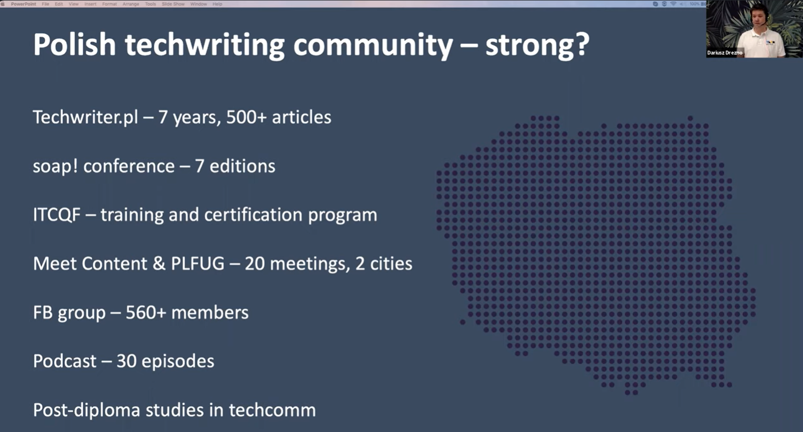

Techwriter.pl - portal, inicjatywa i grupa ludzi, którym bliska jest komunikacja
techniczna - istnieje już od ponad dekady. Dowiesz się:

- Początki
- Rozwój inicjatywy
- Cykle artykułów
- Wpływ na branżę komunikacji technicznej
- Rzut oka na Techwriter.pl dziś i dokąd zmierza

<!--truncate-->

W tym artykule, chcę celebrować wysiłek osób, które udzielały się na przestrzeni
lat i docenić całą społeczność jaka wokół Techwriter.pl się wytworzyła.

Dziękuję wszystkim, którzy poświęcili swój czas i uwagę, by czytać dostępne tu
artykuły.

Zdaję sobie sprawę, że nie uda mi się wymienić wszystkich, który przyczynili się
do rozwoju portalu i mieli szeroki wpływ na resztę społeczności. Zapraszam do
kontaktu, jeśli ktoś chciałby podzielić się swoją opowieścią w tym temacie.

## Wstęp od autora

W tym miejscu przedstawie perspektywę, z której widzę i poznaję dzieje
Techwriter.pl. Swego czasu trafiłem na ankietę płacową opublikowaną na portalu i
odkryłem, że moja niszowa branża tech writingowa posiada własną społeczność
dzielącą się wiedzą. W 2020 roku poznałem się z Darkiem Drezno przez LinkedIn,
po tym jak opisałem wrażenia po egzaminie z ITCQF.

Niedługo później dołączyłem do redakcji. Byłem pod wrażeniem pokaźnej bazy
wiedzy i rozległej wcześniejszej historii pełnej współpracy z rozmaitymi
osobami. Jak wiadomo, najciemniej jest pod latarnią: w grupie dokumentalistów
fakty o historii portalu przekazywane były głównie ustnie i nie były
udokumentowane 😀. Wobec tego, postanowiłem porozmawiać z osobami, które
działały w Techwriter.pl długo przed moim dołączeniem.

Przejdźmy zatem do faktów, które udało mi się ustalić.

## Początki

### Założyciel i pomysłodawca

Ojcem tej inicjatywy jest Darek Drezno, związany z branżą testerską. Jest
testerem, managerem, wykładowcą i przedsiębiorcą. W swojej firmie miał styczność
z wieloma technical writerami, którzy pytali go o obowiązujące standardy,
szkolenia, certyfikaty i materiały szkoleniowe. Zainspirowany inicjatywą
[Radosława Smiglina](https://www.linkedin.com/in/smilgin/) i jego
[testerzy.pl](https://www.linkedin.com/company/testerzy/) postanowił zrobić coś
podobnego, ale dla technical writerów.

Darek pokazał mi swój biznes plan - zapis koncepcji i założeń dotyczących
tworzenia tego portalu. W tamtym czasie, Darek zauważał brak polskojęzycznej
strony branżowej i ubogą ofertę szkoleniową na polskim rynku.

W tamtym czasie, Darkowi na LinkedIn udawało się wyszukać profile 133 osób w
Polsce, które określały swoje stanowisko jako "technical writer". Ja w 2025 jak
użyłem filtru kraju i stanowiska to LinkedIn zwróciło mi 830 wyników.
`Nie mam LinkedIn Premium więc nie wiem czy to byli wyłącznie moi znajomi. Sprawdzę z kimś kto ma dostęp do LinkedIn Premium.`

Podsumowując, Darek dostrzegł lukę i postanowił ją zagospodarować w
konstruktywny sposób. Później ruszyło to na zasadzie kuli śniegowej 🙂.

### Nazwa i logo

Niewiele wiadomo o tym, kto wymyślił nazwę i charakterystycznego "Pacmana".
Przyczyny wyboru nazwy mogły być pragmatyczne: Darek wybrał taką ją, bo taka
była dostępna domena strony internetowej 🙂.

### Pierwsi współpracownicy

Pierwszymi osobami, które dołączyły by udzielać się na łamach portalu byli:
Marcin Górski, Sabina Szablowska i Michał Skowron.

### Pierwsze wpisy

Darek dodał [pierwszy wpis](../witaj-swiecie/index.md) 18.09.2013. W 2023 portal
skończył 10 lat, a w chwili publikacji tego artykułu w 2025 ma już 12 lat 👍.
Skoro Techwriter.pl ma urodziny we wrześniu, to powinniśmy je świętować podczas
konferencji Cake 😀.

Pierwszym merytorycznym artykułem była
[relacja z pierwszej odsłony soap!](../soap-technical-communication-conference-relacja/index.md)
autorstwa Michała, który później poświęcił się w ramach projektu ITCQF.

### Wartości

Michał Skowron:

> Dzielenie się wiedzą, zbudowanie przestrzeni/społeczności dla specjalistów od
> tworzenia treści, w której będą dobrze się czuć i z którą będą się
> identyfikować, gotowość do bezinteresownej pomocy.

Z artykułu Toma Johnsona:

> _Why do it then? To meet new people, stay motivated and keep learning new
> things — there’s no better way to learn than explaining things to others.
> Co-creating a web portal of this sort is simply rewarding. It gives you a
> feeling of adding real value to the community, creates lots of opportunities,
> brings tech comm folks together, and is simply fun._

> _We want to get a message through to all tech comm folks that contribution to
> the community isn’t that hard and that everyone has something interesting to
> say. Writing blog articles or recording podcasts isn’t reserved only for the
> “chosen” ones, e.g., experts, leaders, and managers. Your knowledge, skills,
> and perspective can be very beneficial to someone, even if you’re at the
> beginning of your tech comm career._

### Czemu Techwriter.pl jest wyjątkowy?

> _The idea behind it was to create a meeting point, knowledge base, and
> professional hub for people who work or would like to start working in tech
> comm. There are plenty of well-made, vibrant and professional tech comm
> conferences in the world, and at least twice as many blogs and websites — but
> most of them are in English. This is obviously great, but the idea behind
> Techwriter.pl being in Polish was to help create a tech comm community on a
> local level. It’s a simple example of the think-globally-act-locally rule._

> _The aim wasn’t to create a separate source of esoteric tech comm knowledge
> encrypted in one of the most difficult languages in the world, but to create a
> local gate that would point new and existing Polish writers to other great
> sources of knowledge and connect them with international communities. So far,
> it seems to be working._

Darek Drezno:

> Przede wszystkim wiele osób poznało się i zaprzyjaźniło dzięki tej
> inicjatywie. Studia podyplomowe zmieniły życie zawodowe sporej grupy osób.

## Rozwój

### Wyzwania

Michał Skowron:

> Brak czasu i ludzi. Ciężko jest prowadzić portal i jednocześnie dostarczać
> regularnie bogate merytorycznie artykuły. Szybkie wpisy o ofertach pracy czy
> wydarzeniach nie są takim wyzwaniem, jednak wiadomo, że porządny artykuł o
> odpowiedniej długości wymaga czasu i nakładu pracy. Nie jest też łatwo znaleźć
> większą grupę chętną do udzielania się. Portal jest non-profit, więc artykuły
> są pisane w wolnym czasie i bez żadnej gratyfikacji finansowej. Przekonanie
> kogoś do takiego “wolontariatu” nie zawsze jest łatwe i nawet jeśli to się
> uda, to potem pojawia się problem utrzymania motywacji do działania w dłuższej
> perspektywie.

## Cykle artykułów

W początkowej fazie rozwoju portalu, największa popularnością cieszyły się
oferty pracy. 

### Wywiady

### Oferty pracy

### Ankieta badania płac

### Relacje z konferencji soap!

### Relacje z konferencji Write the Docs

### Artykuły o narzędziach

## Inicjatywy, które narodziły się z pomocą Techwriter.pl

### ITCQF

International Technical Communication Qualifications Foundation, fundacja
działała do 2025 roku, wyszkoliła X osób. Twórcami tego projektu byli: Michał
Skowron, Paweł Kowaluk, Marcin Górski.

### Studia podyplomowe na Vistula University

Studia podyplomowe kształcące specjalistów od komunikacji technicznej odbyły się
X razy i wydano X certyfikatów.

### Grupa Tworzenie Dokumentacji na Facebook

Grupa 700 osób.

### Partnerstwa z konferencjami i wydarzeniami

Madcap

### Przyjaźnie

Dziesiątki znajomości i przyjaźni w ramach szeroko pojętej społeczności
technical writerów w kraju i za granicą.

## Wartość dodana oczami odbiorców

O to chyba najlepiej zapytać czytelników :) Może warto zadać takie pytanie w
grupie na FB. Fajnie byłoby usłyszeć jak to widzą followersi portalu.

## Rynek contentu wtedy i dziś

### Jak wyglądał rynek contentu w 2012 roku?

Michał Skowron:

> Było zdecydowanie mniej ofert pracy. Swoją pierwszą pracę jako Tech Writer
> rozpocząłem na początku 2012 roku. Mieszkałem wtedy w Dąbrowie Górniczej i
> udało mi się znaleźć 1 ofertę pracy dla Tech Writera w Katowicach. W Gliwicach
> była jedna firma, która zatrudniała wtedy większą liczbę writerów, ale była to
> za duża odległość. Zaaplikowałem na tę jedną ofertę i dostałem pracę.
> Najwięcej ofert było wtedy w Krakowie. Poza samą liczbą ofert pracy, warto
> zwrócić uwagę na świadomość tego zawodu w Polsce. Ja sam na początku, nie
> miałem pojęcia, że tech comm to działka, która ma swoje zasady, dobre
> praktyki, szkolenia, itp. Zacząłem szukać, interesować się, i za pierwszym
> podejściem znalazłem tylko zagraniczne materiały. Po paru miesiącach, wróciłem
> do idei szukania materiałów w języku polskim i wtedy trafiłem na
> Techwriter.pl. Byłem tak podekscytowany tym, że pojawił się taki portal w
> języku polskim, że dość szybko zdecydowałem się dołączyć. soap! stawiał wtedy
> pierwsze kroki, a meetupy tech commowe nie istniały.

### Jak rynek contentu wygląda w 2025 roku?

Michał Skowron:

> Wszystko to co opisałem w punkcie poprzednim zmieniło się na lepsze - liczba
> ofert pracy, świadomość zawodu, itp. Widać to nawet po tym jak prężnie
> działają teraz grupy MeetContent we Wrocławiu i Krakowie, udowadniając, że
> jest potrzeba spotkań, wymiany wiedzy i poczucia przynależności do
> społeczności. Chcielibyśmy, żeby branża tech comm rozwijała się jeszcze
> dynamiczniej i może czujemy mały niedosyt jeśli chodzi o tempo tego rozwoju na
> przestrzenie lat (obstawialiśmy “wybuch” podobny do tego jaki nastąpił w
> branży testerskiej), ale myślę, że możemy być zadowoleni z tego gdzie teraz
> jesteśmy.

## Dokąd zmierza Techwriter.pl?

W 2023 Darek przekazał stery w zakresie prowadzenia portalu Michałowi Skowronowi
i Pawłowi Kowalukowi. Pożegnaliśmy Wordpress i przywitaliśmy podejście
"Docs-as-Code" w oparciu o Docusaurusa i Github Codespaces. Praca nad blogiem
stała się dynamiczna i przyjemna.

## Źródła

- [Artykuł na blogu Toma Johnsona w 2017](https://idratherbewriting.com/2017/10/31/untold-story-of-techwriter-pl-poland/)
- [Wywiad na Youtube z Darkiem po angielsku dla Write the Docs](https://www.youtube.com/watch?v=QTdlv6KQiEo)
- [Wpis Darka na LinkedIn na 10 rocznice Techwriter.pl](https://www.linkedin.com/feed/update/urn:li:activity:7109489713899593728/?updateEntityUrn=urn%3Ali%3Afs_feedUpdate%3A%28V2%2Curn%3Ali%3Aactivity%3A7109489713899593728%29)

## Dalsza lektura

### Materiały rocznicowe

- [Wpis na pierwszy roczek](../to-juz-rok/index.md)
- [Wpis na trzecie urodziny](../pozdrawiamy-z-pragi/index.md)
- [Wpis na czwarte urodziny](../od-dzis-wszystkie-szkolenia-z-komunikacji-technicznej-w-jednym-miejscu/index.md)
- [Wpis na siódme urodziny](../7-urodziny-techwriter-pl/index.md)
- [Wywiad na Youtube z Darkiem po angielsku dla Write The Docs w 2021](https://www.youtube.com/watch?v=QTdlv6KQiEo)
  

### Wywiady

- [Wywiad 31 ENG](../kilka-pytan-do-czesc-31-English/index.md)
- [Wywiad 31 PL](../kilka-pytan-do-czesc-31/index.md)
- [Wywiad 30](../kilka-pytan-do-czesc-30-marketing/index.md)
- [Wywiad 29](../kilka-pytan-do-czesc-29/index.md)
- [Wywiad 28](../kilka-pytan-do-czesc-28/index.md)
- [Wywiad 27](../kilka-pytan-do-czesc-27/index.md)
- [Wywiad 26](../kilka-pytan-do-czesc-26/index.md)
- [Wywiad 25](../kilka-pytan-do-czesc-25-od-tech-writera-do-scrum-mastera/index.md)
- [Wywiad 24](../kilka-pytan-do-czesc-24/index.md)
- [Wywiad 23](../kilka-pytan-do-czesc-23/index.md)
- [Wywiad 22](../kilka-pytan-do-czesc-22/index.md)
- [Wywiad 21](../kilka-pytan-do-czesc-21/index.md)
- [Wywiad 20](../kilka-pytan-do-czesc-20/index.md)
- [Wywiad 19](../kilka-pytan-do-czesc-19/index.md)
- [Wywiad 18](../kilka-pytan-do-czesc-18/index.md)
- [Wywiad 17](../kilka-pytan-do-czesc-17/index.md)
- [Wywiad 16](../kilka-pytan-do-czesc-16/index.md)
- [Wywiad 15](../kilka-pytan-do-czesc-15/index.md)
- [Wywiad 14](../kilka-pytan-do-czesc-14/index.md)
- [Wywiad 13](../kilka-pytan-do-czesc-13/index.md)
- [Wywiad 12](../kilka-pytan-do-czesc-12/index.md)
- [Wywiad 11](../kilka-pytan-do-czesc-11/index.md)
- [Wywiad 10](../kilka-pytan-do-czesc-10/index.md)
- [Wywiad 9](../kilka-pytan-do-czesc-9/index.md)
- [Wywiad 8](../kilka-pytan-do-czesc-8/index.md)
- [Wywiad 7](../kilka-pytan-do-czesc-7/index.md)
- [Wywiad 6](../kilka-pytan-do-czesc-6/index.md)
- [Wywiad 5](../kilka-pytan-do-czesc-5/index.md)
- [Wywiad 4](../kilka-pytan-do-czesc-4/index.md)
- [Wywiad 3](../kilka-pytan-do-czesc-3/index.md)
- [Wywiad 2](../kilka-pytan-do-czesc-2/index.md)
- [Wywiad 1](../kilka-pytan-do-czesc-1/index.md)

### Ankiety płacowe

- [Wyniki badania płac 2024](../wyniki-badania-plac-w-komunikacji-technicznej-2024/index.md)
- [Wyniki badania płac 2023](../wyniki-badania-plac-w-komunikacji-technicznej-2023/index.md)
- [Wyniki badania płac 2022](../wyniki-badania-plac-w-komunikacji-technicznej-2022/index.md)
- [Wyniki badania płac 2021](../wyniki-badania-plac-w-komunikacji-technicznej-2021/index.md)
- [Wyniki badania płac 2020](../wyniki-badania-plac-w-komunikacji-technicznej-2020/index.md)
- [Wyniki badania płac 2019](../wyniki-badania-plac-w-komunikacji-technicznej-2019/index.md)
- [Wyniki badania płac 2018](../wyniki-badania-plac-w-komunikacji-technicznej-2018/index.md)
- [Wyniki badania płac 2017](../kwyniki-badania-plac-w-komunikacji-technicznej/index.md)

### Relacje z soap!

- 2013:
  [soap! technical communication conference - relacja](../soap-technical-communication-conference-relacja/index.md)
- 2014: [Mydło lubi zabawę](../mydlo-lubi-zabawe/index.md)
- 2014:
  [soap! 2014 - relacja z pierwszego dnia](../soap-2014-relacja-z-pierwszego-dnia/index.md)
- 2014:
  [soap! 2014 - relacja z drugiego dnia](../soap-2014-relacja-z-drugiego-dnia/index.md)
- 2014: [Soap! Just Wants to Have Fun](../soap-just-wants-to-have-fun/index.md)
- 2014: [soap! 2014 - summary of day 1](../soap-2014-summary-of-day-1/index.md)
- 2014: [soap! 2014 - summary of day 2](../soap-2014-summary-of-day-2/index.md)
- 2015: [Namydleni po raz trzeci](../namydleni-po-raz-trzeci/index.md)
- 2016:
  [Konferencja soap! 2016 - podsumowanie](../konferencja-soap-2016-podsumowanie/index.md)
- 2017:
  [Soap! 2017 już za nami - relacja](../soap-2017-juz-za-nami-relacja/index.md)
- 2018:
  [Konferencja soap! 2018 - relacja](../konferencja-soap-2018-relacja/index.md)
- 2019:
  [Konferencja soap! 2019 - (wideo)relacja](../konferencja-soap-2019-wideorelacja/index.md)
- 2022:
  [Doniesienia z tegorocznej konferencji Soap 2022!](../doniesienia-z-tegoroczenj-konferencji-soap-2022/index.md)
- 2023:
  [Relacja z tegorocznej konferencji soap 2023!](../relacja-z-tegorocznej-konferencji-soap-2023/index.md)

### Write the Docs

- [Write the Docs Prague 2021 (online)](../relacja-z-konferenecji-write-the-docs-prague-2021/index.md)
- [Write the Docs Prague 2020 (online)](../relacja-z-write-the-docs-prague-2020-online/index.md)
- [Write the Docs Prague 2019](../nasza-relacja-z-write-the-docs-prague-2019/index.md)
- [Write the Docs Prague 2018](../write-the-docs-prague-2018-relacja/index.md)
- [Write the Docs Prague 2017](../write-the-docs-prague-2017-relacja/index.md)
- [Write the Docs Europe 2016](../write-the-docs-europe-2016-relacja/index.md)
