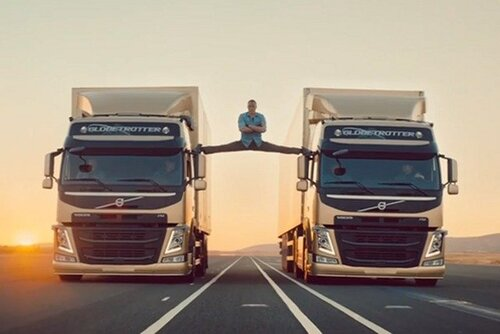

Stowarzyszenie tekom Europe e.V. wzbogaciło się o nową organizację krajową. Z
Polski. I przesłało nam kilka informacji na ten temat. Dla Was.

<!--truncate-->

Wspominaliśmy już o tym stowarzyszeniu,
[pamiętacie](http://techwriter.pl/zostan-mowca-tekom-europe-roadshow-2014/)? Nie
minęło wiele czasu, a dostaliśmy taki list:

> Szanowni Państwo, W imieniu stowarzyszenia tekom Europe e.V. pragnę w skrócie
> przedstawić nasz związek oraz wstępnie zaprosić do wzięcia udziału w naszej
> konferencji międzynarodowej, która będzie miała miejsce 18. wrzesnia 2014 roku
> , w Warszawie, w hotelu Novotel Warszawa Centrum. Kontaktujemy się z Państwem
> (grupą osób, które zajmują się zawodowo tworzeniem, tłumaczeniem,
> dystrybuowaniem, zarządzaniem i wszelkimi innymi "-eniami" związanymi z
> dokumentacją czy mówiąc szerzej - komunikacją techniczną), dlatego, że
> chcielibyśmy zaprosić Państwa do aktywnego udziału (jako prelegent lub
> uczestnik dyskusji panelowej) w naszej konferencji. \*\*\* Tekom Europe e.V.
> to największe w Europie stowarzyszenie zawodowe, poświęcone dokumentacji
> technicznej w szerokim tego słowa znaczeniu oraz promujące zawód "autor
> techniczny" (technical writer). Zrzesza ono ponad 8 tys. czlonków ze
> wszystkich sektorów gospodarczych, w wielu krajach Unii Europejskiej. Ponadto
> posiada wlasne organizacje krajowe, do grona których przystąpiła też Polska,
> tworząc w marcu 2014 roku "tekom Polska".
>
> Konferencja w Warszawie jest jedną z cyklu konferencji w ramach tekom Europe
> Roadshow 2014, organizowanych m.in. też w Paryżu, Kopenhadze czy Wiedniu.
> Hasłem przewodnim naszej konferencji w Polsce jest:  Dokumentacja techniczna
> (w szeroko rozumianym aspekcie) w inżynierii pojazdowej (pojazdy ciężarowe).
>
> Jeżeli Państwa działalność zawodowa związana jest również z dokumentacja
> techniczną w branży samochodowej (z naciskiem na pojazdy ciężarowe). Jeżeli są
> Państwo kierownikami działów dokumentacji technicznej lub / i autorami
> technicznymi w w. w. branży (teksty techniczne, dokumentacje, specyfikacje
> techniczne, instrukcje obsługi, instrukcje montażu, materiały szkoleniowe,
> podręczniki, tłumaczenia techniczne, itp.). Jeżeli chcieliby Państwo wymienić
> doświadczenia; zdobyć i poszerzyć wiedzę w branży oraz zawrzeć nowe kontakty
> na podłożu międzynarodowym, a przy tym wypromować siebie i firmę, to nasze
> zaproszenie skierowane jest wlaśnie do Państwa. Pilnie poszukujemy
> specjalistów oraz osoby z doświadczeniem w dokumentacji technicznej w
> przemyśle automobile do aktywnego udziału jako prelegent lub / i uczestnik
> dyskusji panelowej w naszej konferencji. Poniżej znajdą Panstwo prezentację
> naszego stowarzyszenia w j. angielskim i więcej informacji (m. in. klikając na
> podane linki). W razie jakichkolwiek pytań i wątpliwości prosimy o kontakt z
> nami.
>
> ## Serdecznie zapraszamy do wzięcia udziału w naszej konferencji.
>
> Dear Sir or Madam, We are pleased to provide you with the information on the
> [tekom Europe Roadshow](http://conferences.tekom.de/tekom-europe-roadshow/home/tekom-europe-roadshow-2014/).
>
> The roadshow is a moving to a
> [one-day conference hosted by the tekom Europe](http://www.technical-communication.org/)
> country organizations in September 2014 and presenting the newest trends in
> technical communication.
>
> The focus at our conference in Warsaw on September 18, 2014 is on Automobile
> Engineering (powered vehicles, commercial vehicles, construction vehicles,
> farming and special vehicles, equipment). Most
> [presentations](http://conferences.tekom.de/tekom-europe-roadshow/poland/program/presentations/)
> will be held in Polish language with exception of our international speakers
> (English).
>
> On behalf of Dr. Michael Fritz (CEO of tekom/tekom Europe), I would like to
> ask if you would be interested in presenting or if you could name us another
> person/other persons from your organization (association) who would like to
> present? The speaker should at the same time act as a panelist at our panel
> discussion on "Managing the Automobile Engineering Process".
>
> As a speaker/panelist you will receive a complimentary entrance ticket to the
> roadshow with access to all program points. Furthermore, you will be featured
> on the conference
> [website](http://conferences.tekom.de/tekom-europe-roadshow/poland/at-a-glance/)
> and in the conference program.
>
> Are you interested in participating as a speaker/panelist at our tekom Europe
> Roadshow? Please give us feedback as soon as possible.
>
> Still have questions? Please do not hesitate to contact us.
>
> We look forward to hearing from you!
>
> Best regards
>
> Tekom Europe Roadshow 2014 Team

Podejmiecie wyzwanie?

