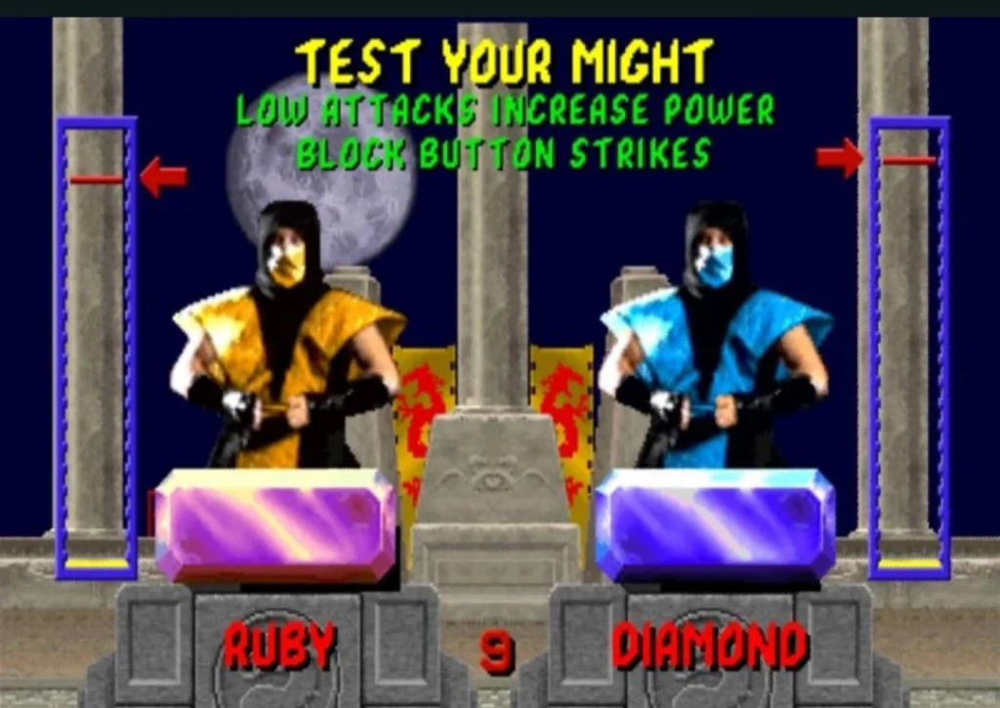
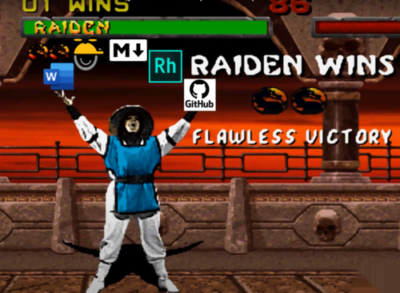

Decyzja o przyjęciu nowej osoby do zespołu nie należy do łatwych, szczególnie w
przypadku rekrutowania na tak wieloaspektowe stanowisko, jakim jest technical
writer. Jak wyłonić właściwego kandydata? Jaką wybrać metodę testowania wiedzy i
umiejętności? W poniższym artykule postaram się odpowiedzieć na te i inne
kwestie dotyczące zatrudniania na stanowisko technical writera.

<!--truncate-->

#### Dla kogo jest ten tekst?

Artykuł adresowany jest w szczególności do team leaderów, którzy stają przed
wyzwaniem wyłonienia właściwej osoby do zadań pisarskich w świecie technologii.

Jeśli z kolei jesteś po drugiej stronie tego równania i przygotowujesz się do
rozmowy kwalifikacyjnej w branży _tech comm_, to powinien zainteresować Cię
przegląd przykładowych zadań testowych.

#### Skąd pomysł, by podzielić się z Wami własnym doświadczeniem?

Jakiś czas temu zadzwonił do mnie team leader, który szukał wskazówek do
napisania testu dla technical writera. Pierwszy raz w życiu rekrutował taką
osobę i wcześniej nie miał w projekcie specjalisty ds. dokumentacji. Był
autentycznie zainteresowany wymaganiami i charakterem pracy w tym zawodzie.
Starałem się przybliżyć specyfikę tego co robię, nie epatując nadmiarem żargonu
i skrótów myślowych. Mam nadzieję, że go zbyt mocno nie skołowałem 😉.
Udzieliłem kilku odpowiedzi "na gorąco", sprawę przekazałem do firmy DREDAR
Darka Drezno doradzającej w takich sprawach i wróciłem do swoich zajęć. Temat
wydał mi się jednak na tyle istotny i ciekawy, że postanowiłem go zbadać,
szczególnie, że miałem już kilka obserwacji z poprzedniej firmy, gdzie lata temu
asystowałem przy rekrutacji nowych ludzi do zespołu i też musieliśmy wymyślić
zadania pisemne.

Niedługo potem miałem zresztą okazję do zebrania nowych przemyśleń, w praktyczny
sposób obcując z tematem z pozycji kandydata. Po latach udanej kariery
postanowiłem poszukać dla siebie nowej przystani, wziąłem więc udział w kilku
procesach rekrutacyjnych, co ostatecznie zaowocowało angażem w Hitachi
Energy.

Jak wybrać najlepszego technical writera? Czy ten kandydat najlepiej poradzi
sobie z e-learningiem, API, tool manualami, instrukcjami do software'u,
hardware'u czy Internet of Things? Prędzej odnajdzie się w tworzeniu materiałów
dla odbiorców wewnętrznych czy zewnętrznych? Artefakt taki jak Tiara Przydziału
z serii książek i filmów "Harry Potter" zaoszczędziłaby wiele czasu zarówno
rekruterom, jak  i kandydatom. Jeśli nie masz do niej dostępu, jak wyłonić
magika pióra? Odpowiedzi znajdziesz poniżej.

## Zanim siądziesz do pisania testu, ustal priorytety i wymagania

Jeśli szukasz pisarza technicznego, zacznij od sprecyzowania poniższych kwestii:

- Do czego służy produkt, który trzeba opisać? Jakie materiały są potrzebne?
- W jakim języku mają być te treści?
- Czy jest to dokumentacja na potrzeby wewnętrzne firmy, dla klienta
  zewnętrznego czy odbiorcy indywidualnego?
- Czy chodzi o instrukcje użytkowania czy dokumentację deweloperską kodu lub
  API?
- Czy istnieją już jakieś materiały? Jeśli tak, to na jakim są poziomie? Czy są
  aktualne?
- Jakiego poziomu ugruntowanej wiedzy technicznej potrzeba, by poradzić sobie na
  tym stanowisku?
- Znajomość których narzędzi będzie niezbędna?
- Czy wykorzystywany jest konkretny style guide np.: Microsoft Manual of Style
  lub Google Developer Guidelines?
- Jak pilnie potrzebna jest ta dokumentacja? Jak często publikowane będą te
  materiały?
- Jaka jest ilość tekstów do opracowania? Czy należy opisać jeden czy wiele
  produktów?
- Jaka jest dojrzałość dokumentacyjna zespołu i świadomość dokumentacji w
  firmie?
- Czy zespół deweloperski współpracował już z "dokumentalistą"? Czy nowy tech
  writer będzie współpracować z wieloma zespołami? Czy w firmie są inni
  doświadczeni koledzy i koleżanki po fachu?
- Jakie cechy osobowości powinna mieć ta osoba, by odnaleźć się w zespole i
  osiągnąć sukces?

Te i inne pytania należy postawić podczas definiowania stanowiska i precyzowania
oferty pracy. Mają one spore znaczenie dla testu, który chcesz opracować.

## Jak przetestować wiedzę, umiejętności i predyspozycje?

Podstawową metodą jest wywiad podczas rozmowy rekrutacyjnej. Nie zawsze wymagane
jest wykonanie próbki pisemnej, czasem wystarczy rozmowa i udostępnienie swojego
repozytorium z przykładowymi dziełami.

Im więcej etapów rekrutacji, tym większa szansa, że poproszą Cię o wykonanie
zadania w formie pisemnej. Większość pracodawców woli w praktyczny sposób
sprawdzić Twoje zdolności i styl pisania, bo śpiewające przejście rozmowy nie
zawsze udowadnia, że ktoś ma wszechstronne doświadczenie, wyrobione nawyki i
umiejętności pisarskie, które pozwalają zaadaptować się do nowego środowiska.

Jest to zawsze kwestia indywidualna czy taki test jest wymagany, co należy
sprawdzić i jaką metodą. Poniżej prezentuję najczęściej spotykane przykłady
tego, jak pracodawcy do tego podchodzą.

## Potrzebny pisemny sprawdzian - pomysły na testy

Przegląd pomysłów rozpoczniemy od tych najbardziej odbiegających od codziennych
obowiązków technical writera, aż po najbardziej realistyczne symulacje
Twoich przyszłych zadań. Niektóre z propozycji są tylko uzupełnieniem i
występują w kombinacji z innymi metodami. Przy wszystkich przykładach zakładana
jest praca w języku Szekspira i Davida Beckhama.

### Test osobowości

Jest to raczej rzadko występująca opcja uzupełniająca. Testy te mogą dać pewne
pojęcie o dominujących cechach osobowości i preferencjach - sam swego czasu
mocno interesowałem się modelem
[wielkiej piątki](https://pl.wikipedia.org/wiki/Wielka_pi%C4%85tka), który z
powodzeniem wykorzystuje się w rekrutacjach, badaniach naukowych i może pomóc w
poznaniu samego siebie i w samorozwoju. Zastanawiam się, co rekruter po drugiej
stronie jest w stanie wywnioskować na tej podstawie. Czy oceni, że pasujesz
psychologicznie do reszty zespołu albo roli? Albo czy preferujesz określonego
typu zadania i oczekujesz takiej a nie innej częstości interakcji z innymi? Kto
wie.

Jedna rada - nie kłam w tych testach i nie naciągaj prawdy, bo testy są
zaprojektowane tak, by próby mataczenia były łatwo widoczne w wynikach.

### Test inteligencji i logicznego myślenia

Tego rodzaju testy stosowane są niezmiernie rzadko. Być może decydują się na nie
pracodawcy szukający dobrych analityków, będących w stanie szybko wyciągnąć
wnioski z dużych ilości danych. Być może chodzi też o zdolności matematyczne.

### Test pisemny znajomości języka angielskiego

W każdej rekrutacji przychodzi moment na rozmowę po angielsku, a czasem trzeba
rozwiązać test dowodzący znajomości zasad gramatyki i słownictwa.

### Opisz ostatnio obejrzany film lub przeczytaną książkę

Opisz coś, udowodnij, że potrafisz szybko ułożyć dobry tekst na niezobowiązujący
temat.

### Opisz i rozrysuj proces sortowania listów na poczcie

Jest to autentyczne zadanie sprzed 12 lat jakie dostałem podczas rozmowy
rekrutacyjnej. Ćwiczenie ma na celu sprawdzić zdolność myślenia o procesach i
ich opisywania.

### Zrób szybki research w internecie i opisz koncepcję

Tutaj sprawdzana jest zdolność wyszukiwania, porządkowania i opracowywania
informacji. Kandydat może dostać do opisania ogólnodostępną aplikację,
urządzenie lub system.

### Opisz różnice między materiałem szkoleniowym a instrukcją

Ćwiczenie to można też wykonać ustnie. Pokazuje czy rozmówca ma doświadczenie
pracy z różnymi materiałami i rozumie jak skrojone powinny być dla innych grup
odbiorców. Jeśli brakuje Ci wiedzy w tym temacie, zapoznaj się
z [ITCQF.org](https://itcqf.org).

### Popraw błędy językowe i zwróć uwagę na problemy w instrukcji

Tutaj można popisać się wyczuciem językowym i zdolnością wychwytywania błędów.
Jest to szczególnie ważne jeśli nowa osoba ma recenzować pracę innych członków
zespołu. Dodatkowo, tech writer powinien być w stanie zaproponować ulepszenia i
mieć swoje zdanie na temat brzmienia procedury.

### Przetwórz podany tekst na opis koncepcji, procedurę czy materiał referencyjny

To zadanie dobrze sprawdza doświadczenie z różnymi typami dokumentacji i
zdolność dostosowania języka i formy zależnie od zastosowania. Jeśli
potrzebujesz zgłębić ten temat, z zapoznaj się z materiałami proponowanego już
wyżej [ITCQF.org](https://itcqf.org).

### Stwórz instrukcję na podstawie rzutów ekranu interfejsu

Tutaj ćwiczenie jest kompleksowe. Wymaga dobrego rozplanowania sekcji i
stworzenia odpowiednich ilustracji. Utrudnieniem jest brak możliwości użycia
danej aplikacji, dlatego screeny powinny być tak wybrane, by jednoznacznie
prezentowały ten produkt. Opisanie go na podstawie tych zdjęć powinno być
możliwe bez potrzeby zgadywania jak ten produkt działa.

### Zasugeruj usprawnienia UX Writing i UX Design

Coraz częściej występują zadania z elementami z dziedzin UX writing i UX design.
Choć nie zawsze technical writer musi być ekspertem w tych kwestiach, odrobina
obycia z nimi daje przewagę podczas rekrutacji.

### Przetestuj witrynę lub aplikację i opisz jak z niej korzystać

Tu mamy przykład czynności, którą często wykonujemy w codziennej pracy: usiądź,
poeksperymentuj z aplikacją i opisz ją na bazie praktycznego doświadczenia
korzystania z niej.

### Ściągnij repozytorium projektowe i wprowadź na nim swoje zmiany

W większości rekrutacji uczestnicy po prostu odsyłają stworzony tekst w Ms Word
czy innym popularnym formacie. Czasem zadanie zbliżone jest do autentycznego
stylu i procesu pracy. Jeśli w danej firmie dokumentację publikuje się na
repozytorium Github w formacie Markdown, a tworzenie _Pull Request_ jest
niezbędnym krokiem, by nowy tekst został sprawdzony i zatwierdzony, to kandydat
powinien bez problemu być w stanie użyć tej metody.

## Dodatkowe aspekty

Powyżej wymieniłem metody sprawdzenia wiedzy i umiejętności.

Dalej, prezentuję dodatkowe aspekty, które wpływają na poziom trudności i
odczucia kandydata.

### Limit czasu

Świetnym rozwiązaniem dla obu stron jest nałożenie limitu czasu. Osoba testowana
wybiera dogodny moment na wykonanie ćwiczenia, które musi ukończyć w godzinę lub
dwie. Nawet proste zadanie robione pod presją czasu ujawni, jak kandydat radzi
sobie z zarządzaniem czasem, panowaniem nad stresem i podejmowaniem trudnych
decyzji w sytuacji, gdy jest się zdanym na siebie samego. Z kolei dla uczestnika
jest to wygodne podejście, bo nie wymaga poświecenia dużo czasu i wynik jest
szybko znany.

### Wykonaj ćwiczenie w czasie spotkania online lub w biurze

Dodatkowym wyzwaniem może być fakt, że rozwiązujesz test będąc na wizji, a
rekrutujący czekają aż skończysz. Niby nic, ale można się spocić 😉

### Objętość

Twórcy testu powinni znać tu umiar, bo kandydaci mogą pracować i nie mieć czasu
na pracę z bardzo obszernymi tekstami. Przesada może być nie na miejscu i nie w
porządku, wobec osoby, która poświęca swój czas wolny. Duża ilość tekstu może
wywołać podejrzenie, że próbka jest tak naprawdę bezpłatną usługą, którą
pracodawca wykorzysta po zakończeniu rekrutacji.

### Realność tematu

Pracodawca może wybrać autentyczne zadanie z codziennej pracy, natomiast
występuje podobna kwestia jak akapit wyżej: nie powinno być wątpliwości, że jest
to tylko krótki test, a nie darmowa przysługa dla firmy, która z góry zamierza w
nieuczciwy sposób wykorzystać Twoją pracę. Nawet pozory takiej sytuacji mogą być
groźne dla reputacji firmy.

Podejściem alternatywnym jest dać fikcyjny produkt do opisania i wtedy nie ma
takich wątpliwości.

### Platforma wygaszająca pozostałe ekrany i ograniczająca dostęp do internetu

Tu innowacyjne utrudnienie: kandydat instaluje aplikację, która ogranicza
widoczny obszar ekranu do zadań testowych i wyłączone zostają dobrodziejstwa,
takie jak dostęp do wyszukiwarek i internetowych słowników.

Mała niedogodność, ale zawsze 😉

## Porada dla rekrutujących

Czasem test odbierany jest jako egzamin ze znielubionego przedmiotu ze szkoły
średniej. Niektóre osoby mocno to przeżywają. Warto pomyśleć o wrażeniach osoby
wykonującej test. Jeśli wymagany jest duży nakład pracy i zaangażowania, to
dobrze byłoby szybko poinformować o wyniku, a w przypadku odrzucenia kandydatury
taka osoba zasługuje na kilka słów wyjaśnienia, co poszło nie tak i z czego
powinna się podciągnąć.

Świetnym zagraniem jest pokazanie, że firmie zależy na tym, by zdający pokazał
się z jak najlepszej strony. Wspierajcie kandydatów na ile jest to możliwe i
udzielacie odpowiedzi na wszystkie potrzebne pytania.

## Porada dla rozwiązujących

Pytaj jeśli coś wydaje Ci się niejasne lub nielogiczne w zadaniu. Prawdopodobnie
nie jest to celowa pułapka, a tylko drobna kwestia do wyjaśnienia. Inicjatywa
jest dobrze oceniana. Brak wyjaśnienia może utrudnić Ci wykonanie testu i
obniżyć liczbę zdobytych punktów.

## Wynik może być tylko jeden:

Tworząc ten mem uświadomiłem sobie, że niewiele wspominałem o sprawdzaniu
znajomości specjalistycznych narzędzi tech writingowych (HAT - Help Authoring
Tools). Biegłość w konkretnym narzędziu może mieć duże znaczenie i zadaniem może
być wykonanie próbnego projektu w danym programie. Najczęściej jednak
pracodawcom wystarczy przeprowadzenie wywiadu i dokładne przepytanie tak, by
poznać poziom znajomości narzędzi. Wielu też zakłada, że jeśli ktoś umie pisać i
przekształcać informacje, to mogą poczekać aż nowa osoba wdroży się i nauczy
nowego dla siebie programu.

W przypadku bardziej technicznych specjalizacji wymagane może być
zademonstrowanie umiejętności czytania kodu w wybranych językach programowania,
ale nie było to głównym tematem artykułu.

Pozdrawiam!

P.S.

Dla wybierających się na rozmowę w niedługim czasie życzę:

## POWODZEEENIAAAA!!!
