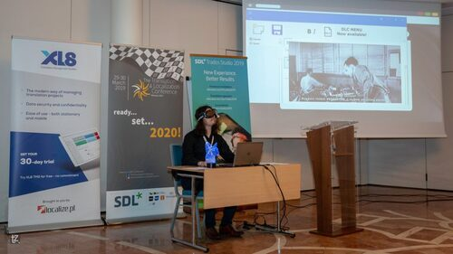
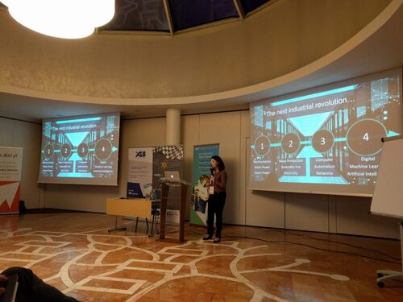
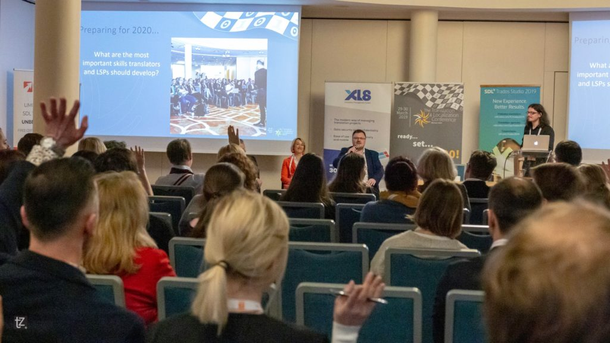
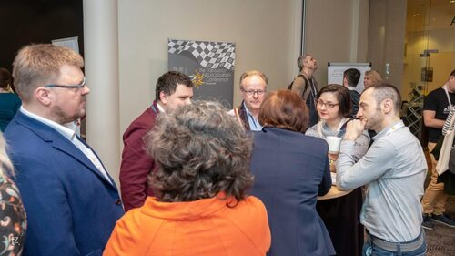

W ramach zacieśniania współpracy ze światem tłumaczeń, w tym roku objęliśmy
patronatem medialnym
[The Translation and Localization Conference (TLC)](https://www.translation-conference.com/).
Konferencja odbyła się w dniach 29-30 marca 2019 w Hotelu Radisson Blu Sobieski
w Warszawie.

<!--truncate-->

Tegorocznym motywem przewodnim były zmiany, jakie czekają branżę tłumaczeniową w
2020 roku. Wybór tego konkretnego roku ma drugie dno - 2020 był często
przedstawiany w kinematografii jako odległa przyszłość, w której świat
całkowicie się zmieni. W związku z tym, że ta filmowa przyszłość nadeszła
szybciej niż nam się wydawało i jest już za rogiem, organizatorzy postanowili
się jej przyjrzeć i zastanowić się co możemy zrobić by się na nią przygotować.

Udało nam się wziąć udział w pierwszym dniu konferencji, dlatego zapraszamy
serdecznie na nasze sprawozdanie z tego co się działo.

## Nietuzinkowe otwarcie

Sposób w jaki organizatorzy rozpoczęli konferencję wpisał się w motyw przewodni
konferencji. Zamiast przemowy, zafundowali uczestnikom scenkę rodzajową, w
której Agenor Hofmann-Delbor odegrał rolę tłumacza z przyszłości, a dokładniej z
29.03.2020.

Pomimo tego, że czasy się zmieniły, pewne problemy pozostały nieśmiertelne, np.
źródło tłumaczenia dostarczone jako kiepskiej jakości skan czy lista fragmentów
tekstu do przetłumaczenia bez żadnego kontekstu. Ciekawą wizją był model, w
którym tłumacz otrzymuje pieniądze za każde wykorzystanie swojego tłumaczenia.
To mini przedstawienie z przymrużeniem oka pokazało nam jak może wyglądać
przyszłość branży tłumaczeniowej oraz wprowadziło nas w klimat nadchodzących
prelekcji.

\[caption id="attachment_7780" align="aligncenter"
width="590"\] Źródło: zasoby organizatora The
Translation and Localization Conference\[/caption\]

Poniżej przedstawiamy opis prezentacji, które najbardziej przykuły naszą uwagę.

## Przestań narzekać i zacznij działać

Pierwszą prelekcję, o tym jak lepiej prowadzić biznes w 2020, wygłosił Robert
Etches z firmy Exfluency. Nie trudno zauważyć, że cały świat ulega zmianom,
dlatego też jest pewne, że branża tłumaczeń również się nim nie oprze. Jednak,
żeby zmiana nastąpiła w nas samych musimy mieć odpowiednie nastawienie i przyjąć
do wiadomości, że najlepsze rzeczy dzieją się poza naszą strefą komfortu.
Dlatego trzeba wziąć byka za rogi i zacząć działać teraz. Nadszedł czas, żeby
pogodzić się z rozwojem technologii i wycisnąć z niego najwięcej korzyści dla
siebie, zamiast negować to zjawisko mając nadzieję, że w końcu zniknie.

Prowadzący pokazał nam jak w miarę prosto możemy zmienić nasze ogólne
nastawienie do branży tłumaczeniowej. Zamiast mówić "Language Service Provider",
"Translator" i "Post Editor", używajmy terminów "Language Solutions Provider",
"Transcreationist" i "Enhancer". Nie chodzi tutaj o zabieg marketingowy, dzięki
któremu sprzedamy łatwiej nasze usługi, ale o sposób na zmianę sposobu myślenia
o tym co robimy jako specjaliści od przekładu. Zamiast przedstawiać siebie jako
pasywnych rzemieślników rzeźbiących tekst, pozycjonujemy się jako proaktywni
eksperci, którzy podchodzą do problemu kreatywnie.

Ciekawym punktem prezentacji było zwrócenie uwagi na to, że sposób wyceniania
pracy tłumaczeniowej jest niewłaściwy. Tłumacze sprzedają swoją pracę jak
produkt a nie jak własność intelektualną. Według Roberta lepszą metodą niż
pobieranie opłaty od liczby słów jest stosowanie wyceny opartej na stawce
godzinowej lub projektowej.

Robert wielokrotnie podkreślał wartość płynącą ze współpracy z kolegami i
koleżankami po fachu. Sam przyznał, że kiedy zaczynał jako freelancer nie
wiedział nic, bo nie nawiązywał kontaktów z nikim ze społeczności. Potem zaczął
jeździć na konferencje i nawiązał nić współpracy ze specjalistami z innych
krajów, z którymi następnie spotykał się cyklicznie, żeby omawiać wyzwania jakie
stawia im branża tłumaczeniowa.

Prowadzący zaproponował też kilka rzeczy, które można zacząć robić już teraz,
żeby poprawić swój byt specjalisty od przekładu. Po pierwsze przestań robić z
siebie ofiarę i zacznij proaktywnie szukać okazji do poszerzenia swojego
biznesu. Po drugie, zrób porządki wśród swoich klientów i dostawców i pozbądź
się tych, którzy wymagają najwięcej uwagi a generują najmniejszą wartość. Po
trzecie, zacznij używać technologii takich jak tłumaczenie maszynowe. Z kolei w
najbliższej przyszłości możesz zacząć stosować lepszy model wyceny swojej pracy,
jak wspomniane wyżej stawki godzinowe, i zatrudniać ludzi, którzy są ciekawi
świata i umieją wyciągnąć korzyści ze zmian. Na koniec Robert pokazał nam jak
według niego będzie wyglądać branża tłumaczeniowa w 2020. Łączenie się firm
będzie nadal trwać, tłumaczenie maszynowe zbliży się jakością do tekstów
tłumaczonych przez ludzi, duże firmy zaczną korzystać z neuronowego tłumaczenia
maszynowego na szeroką skalę i pojawi się kilka projektów opartych na
blockchainie.

Ciekawa prezentacja, w której najbardziej podobało nam się to, że prowadzący
starał się zwracać naszą uwagę na pozytywne aspekty zachodzących wokół nas zmian
i na to jak można wyciągnąć z nich korzyści.

## Twoja przyszłość zaczyna się teraz

Temat postępującej w szybkim tempie rewolucji technologicznej kontynuowała w
swojej prezentacji Beata Strzałka z Sodexo.

Żyjemy w czasach czwartej rewolucji - rewolucji technologicznej. Od poprzednich
trzech odróżnia ją tempo zmian. Obecnie, w ciągu trzech lat dzieje się więcej
niż w przeszłości potrafiło się wydarzyć przez 60 lat. Beata pokazała nam kilka
ciekawych wyników badań. Według szacunków, roboty spowodują, że zniknie 66
milionów miejsc pracy, ale jednocześnie rozwój sztucznej inteligencji stworzy 58
milionów nowych miejsc pracy. Do roku 2030, 30% pracowników w USA zmieni zawód,
a 60% firm planuje zautomatyzować swoje procesy. Jednak pomimo świadomości tak
szybkich i dużych zmian, większość ludzi uważa, ze rozwój technologiczny nie
dotknie ich w najbliższych trzech latach.

Praktycznie każda dziedzina naszego życia zmieniła się gwałtownie. Dobrze widać
to w świecie mediów. Żeby dotrzeć do 50 milionów odbiorców, radio potrzebowało
38 lat, telewizja 13 lat, internet 4 lat, a Facebook 2 lat. W dziedzinie usług
też możemy zaobserwować ciekawe zmiany. Najwięksi gracze nie posiadają swoich
zasobów. Przykładowo, Airbnb, lider usług noclegowych, nie jest właścicielem
żadnego hotelu.

Prowadząca, pokazała nam też, że według badania
[Instytutu Gallupa](https://www.gallup.com/home.aspx), od lat 60. XX wieku nasza
produktywność sukcesywnie spada. Powodem może być to, że tylko 15% osób jest
zadowolonych ze swojej pracy oraz brak poczucia sensu tego co robimy i wypalenie
zawodowe.

 Jak się przygotować na nadchodzącą
przyszłość? Możemy zacząć od spojrzenia na umiejętności, które według World
Economic Forum były nam potrzebne w 2018, żeby przetrwać "inwazję robotów". W
porównaniu do roku 2015, umiejętność aktywnego słuchania została zastąpiona
inteligencją emocjonalną, kreatywność awansowała na 3. miejsce (z 10. pozycji),
a na 10. miejscu pojawiła się elastyczność poznawcza. Polecamy również zapoznać
się z zestawem umiejętności, które będą nam potrzebne w
[2020](https://www.weforum.org/agenda/2018/07/the-skills-needed-to-survive-the-robot-invasion-of-the-workplace).
Warto też, skupić się na kształtowaniu w sobie umiejętności takich jak
kreatywność, krytyczne myślenie, współpraca i komunikacja, zamiast na uczeniu
się konkretnego rzemiosła, bo nie jesteśmy w stanie ocenić czy przy takim tempie
zmian nasza wyuczona profesja nie zniknie za kilka lat.

Kolejną ciekawostką jest to, że tylko 1 na 33 miliony osób ma taki sam zestaw
talentów jak my. Dlatego kluczem do sukcesu jest pełne zrozumienie jak
zaaplikować swoje najlepsze umiejętności w życiu codziennym. Według Instytutu
Gallupa, ludzie, którzy skupiają się na używaniu swoich mocnych stron trzy razy
częściej twierdzą, że ich jakość życia jest doskonała a prawdopodobieństwo
zaangażowania się przez nich w swoją pracę jest sześciokrotnie wyższe.

Beata wspomniała również o modelu
[Golden Circle](https://www.smartinsights.com/wp-content/uploads/2015/10/Screen-Shot-2015-10-14-at-13.17.30.png),
który składa się z elementów WHAT (co), HOW (jak) i WHY (dlaczego). Większość
czasu skupiamy się na tym co robimy, a najważniejsze jest to dlaczego coś
robimy, bo ludzie nie kupują tego co robimy tylko dlaczego coś robimy.

Na koniec prowadząca poleciła zrobienie sobie testu
[CliftonStrenghts](https://www.gallupstrengthscenter.com/), żeby ocenić którym z
[34 typów osobowości](https://www.strengthsquest.com/193541/themes-full-description.aspx) jesteśmy.
Wspomniała jednak, że ma to sens jedynie wtedy jeśli po otrzymaniu wyników
będziemy działać dalej, żeby zmienić coś w naszym życiu.

Prezentacja nie była ściśle związana z branżą tłumaczeniową. Znalazło się w niej
solidna dawka danych, kilka ciekawych spostrzeżeń i wartościowych wskazówek na
temat otaczającej nas rzeczywistości, które możemy wykorzystać w życiu
codziennym.

## Warto się zaprzyjaźnić z tłumaczeniem maszynowym

Areta Kempińska z Bireta Professional Translations mówiła o roli tłumaczenia
maszynowego w pracy agencji tłumaczeniowej i freelancera. Było to rozszerzenie
prezentacji z Konferencji Tłumaczy 2018, której podsumowanie możecie przeczytać
w
[naszej relacji z tego wydarzenia](http://techwriter.pl/konferencja-tlumaczy-2018-relacja/).

Prowadząca zaczęła od stwierdzenia, że nie powinniśmy się bać, bo tłumaczenie
maszynowe nie zastąpi specjalistów od przekładu. Przypomniała nam też, że
maszyna nie wykonuje prawdziwego tłumaczenia a jedynie produkuje na podstawie
dostępnych danych ekwiwalent zbliżony do języka źródłowego. Jednak nie można nie
zgodzić się z tym, że tłumaczenie maszynowe wpływa znacząco na sposób pracy
tłumaczy, dlatego warto wiedzieć co w trawie piszczy.

Jest to wciąż gorący temat w branży tłumaczeniowej, który generuje często
skrajne opinie. Niektórzy tłumacze są sceptycznie nastawieni do tłumaczenia
maszynowego, ponieważ boją się obniżania swoich kompetencji poprzez powtarzanie
błędów maszyny, niższych zarobków i utraty pracy. Do tego nie wiedzą jak
przeprowadzać postedycję, czyli ostateczną redakcję tekstu, kiedy poprawiane są
błędy i struktura, i jak ją wycenić. Warto tutaj wspomnieć, że postedycja
występuję w wersji "light" i "full". Celem pierwszego typu jest doprowadzenie
tekstu do stanu, w którym jest zrozumiały, a celem drugiego doprowadzenie tekstu
do stanu, w którym jest zarówno zrozumiały jak i stylistycznie poprawny.

Według prowadzącej, dostawcy usług tłumaczeniowych powinni inwestować w
"maszyny", żeby podnosić jakość tłumaczeń, obniżyć ich ogólne koszty, nadążyć za
konkurencją i sprostać krótkim terminom wykonania zleceń narzuconym przez
klientów. Jakość neuronowych tłumaczeń maszynowych szybko zmienia się na lepsze
dzięki wciąż rosnącej mocy obliczeniowej komputerów, dlatego warto przyjrzeć się
tej działce, nawet jeśli robiliśmy to stosunkowo niedawno.

Areta pokazała nam krótkie porównanie statystycznego tłumaczenia maszynowego
(SMT) i neuronowego tłumaczenia maszynowego (NMT). Jedną z największych
przypadłości NMT jest brak zdrowego rozsądku. Jakie są skutki takiego braku
doskonale oddaje ta
[grafika](https://cdn.iwastesomuchtime.com/July-11-2011-19-07-32-15507_large.jpeg).
Poza tym, tekst wygenerowany przez NMT czyta się płynnie przez co trudniej
wychwycić błędy. Z kolei SMT ma dość ograniczony zasób słów i gorzej radzi sobie
z bardziej skomplikowanymi językami, takimi jak polski.

Prowadząca zwróciła też uwagę na to, że musimy myśleć o bezpieczeństwie danych,
szczególnie w przypadku projektów tłumaczeniowych, które zawierają poufne
informacje. W takich przypadkach nie jest dobrym pomysłem korzystanie z
dostępnych za darmo rozwiązań online, ponieważ dane, które wtłoczymy do takiego
mechanizmu zostaną zapisane na serwerach dostawcy oprogramowania i nie mamy nad
nimi kontroli.

\[caption id="attachment_7778" align="aligncenter"
width="590"\] Źródło: zasoby
organizatora The Translation and Localization Conference\[/caption\]

Po części opisowej, przeszliśmy do dyskusji. Areta zapytała uczestników co myślą
o pracy z tłumaczeniem maszynowym, jakie mają doświadczenie w kwestii wydajności
i opłacalności pracy, w której jest tłumaczenie maszynowe i postedycja i czy
mają jakieś obawy związane z MT. Nie było zaskoczeniem, że temat wzbudził sporo
emocji. Wnioski z dyskusji można podsumować następująco:

- Tłumaczenie maszynowe to świetne narzędzie, ale trzeba umieć z niego korzystać
  i je skonfigurować.
- Musimy pamiętać, że tłumaczenie maszynowe to nie jest jedna maszyna i jedno
  rozwiązanie - to różne rozwiązania, które generują tłumaczenia różnej jakości.
  Jest wiele zmiennych, np. jakiego oprogramowania używamy, do jakiego rodzaju
  tekstów oraz jaki mamy korpus, które sprawiają, że tłumaczenie maszynowe ma
  sens lub nie.
- Jakość nie zawsze oznacza to samo. To jest coś czego nasi klienci potrzebują w
  danej sytuacji, dlatego czasami trzeba dostarczyć szybkie tłumaczenie, które
  ma braki, a czasami idealne tłumaczenie.
- Do pamięci tłumaczeniowej warto dodawać teksty przetłumaczone maszynowo tylko
  wtedy kiedy zostało solidnie zweryfikowane.

Jak widać tłumaczenie maszynowe to ciekawe i jednocześnie trudne zagadnienie,
które ma zapewne tylu zwolenników co i przeciwników. Trudno o nim rozmawiać, bo
często takim rozmowom towarzyszą skrajne emocje, dlatego tym bardziej warto
docenić wysiłek prowadzącej, która nie bała się (po raz kolejny) włożyć kija w
mrowisko. Nie bójmy się poruszać takich tematów, bo tylko dzięki temu możemy iść
do przodu.

## Co trzeba będzie umieć w 2020?

Pierwszy dzień konferencji zakończył panel dyskusyjny moderowany przez Agenora
Hofmanna-Delbora z udziałem Roberta Etchesa, Arety Kempińskiej i Wojciecha
Froelicha. Uczestnicy panelu chcieli znaleźć odpowiedź na pytanie o
umiejętności, które będą w cenie w najbliższej przyszłości.

Na początek, Agenor wyjaśnił podstawowe pojęcia, takie jak Artificial
Intelligence, Machine Learning i Deep Learning, żeby mieć pewność, że wszyscy
rozumieją je w taki sam sposób. Następnie w ramach zbudowania kontekstu dla
dyskusji, przedstawił wyniki ogólnobranżowej ankiety dotyczącej trendów na rynku
tłumaczeń i sposobów przygotowania się na nie. Ciekawostką było pytanie
skierowane do freelancerów o to czy przewidują dla siebie opcję zmiany branży na
pokrewną, np. na komunikację techniczną, w najbliższej przyszłości. Zdecydowana
większość odpowiedziała, że nie. Bardzo dziękujemy za umieszczenie tego pytania
w ankiecie, ponieważ widać gołym okiem, że musimy jeszcze bardziej się starać
jeśli chodzi o promowanie profesji z dziedziny komunikacji technicznej 😊

\[caption id="attachment_7790" align="aligncenter"
width="590"\] Źródło: zasoby organizatora The
Translation and Localization Conference\[/caption\]

Po przedstawieniu wyników ankiety przeszliśmy do dyskusji. Nawiązując do
wcześniejszych prelekcji i do tego, że jesteśmy negatywnie nastawieni do rozwoju
technologii, Wojciech Froelich zadał nam kilka pozornie prozaicznych pytań o
rozwiązania, z których już korzystamy, takie jak ergonomiczne klawiatury czy
systemy do tłumaczeń. Jego celem było uświadomienie nam, że technologie, które
obecnie przyjmujemy jako część naszej rzeczywistości, dawniej zapewne też
wzbudzały wiele emocji, tak jak teraz tłumaczenie maszynowe. Chciał tym samym
wzmocnić przekaz z prezentacji Roberta Etchesa, że zamiast unikać technologii
musimy ją zaakceptować i wyciągnąć z niej korzyści dla siebie. Taka umiejętność
jest tłumaczom na pewno potrzebna.

Z dyskusji wyszło, że przyda nam się też otwarty umysł, żeby dostrzegać okazje,
które nie są oczywiste oraz gotowość do inwestowania czasu i pieniędzy w nowe
technologie. Padło też stwierdzenie, że znikną kiepskie umiejętności
tłumaczeniowe, ponieważ maszyny wygryzą słabych tłumaczy oraz że narzędzia CAT
powoli będą odchodzić do lamusa.

Ktoś z widowni dołożył cenną cegiełkę do rozmowy słusznie zauważając, że zanim
zaczniemy się skupiać na tym co będzie, musimy zastanowić się nad przyszłością,
którą już mamy, a z której nie umiemy korzystać. Mowa tu na przykład o
narzędziach CAT, których pełny potencjał jest w stanie wykorzystać wciąż
niewiele osób.

W trakcie dyskusji pojawił się też akcent z komunikacji technicznej - padło
pytanie o zmieniające się formy dostarczania pomocy użytkownikom, które wymagają
nowych umiejętności wśród tłumaczy i specjalistów od komunikacji technicznej.
Tutaj mieliśmy okazję dodać swoje trzy grosze mówiąc o chatbotach i rozszerzonej
rzeczywistości.

Podsumowując, była to owocna dyskusja, która dobrze uzupełniła i zamknęła tematy
poruszane wcześniej w prelekcjach oraz dała możliwość zastanowienia się nad tym
jak przetrwać w branży tłumaczeniowej przyszłości.

## Podsumowanie

Pomimo tego, że The Translation and Localization Conference skierowana była
głównie do specjalistów związanych z branżą tłumaczeniową, poruszone problemy
były w większości uniwersalne i dotyczyły nas wszystkich. Dlatego też, wnioski
czy propozycje przygotowania się na nadchodzącą przyszłość mogą być wykorzystane
również przez specjalistów z branży komunikacji technicznej. Proaktywność,
zmiana nastawienia, otwarty umysł, szukanie sposobów na wykorzystanie potencjału
technologii i swoich talentów to propozycje, które możemy z powodzeniem
wykorzystać, żeby poprawić swoją sytuację zawodową.

Dziękujemy organizatorom za ciepłe przyjęcie i możliwość poszerzenia wiedzy na
temat międzynarodowego środowiska tłumaczy. Cieszymy się, że współpraca między
światem tech writerów i tłumaczy kwitnie i czekamy na kolejne okazje, żeby móc
ją poszerzać.

Zdjęcia z wydarzenia znajdziecie pod
[tym linkiem](https://www.facebook.com/pg/TheTranslationConference/photos/?tab=album&album_id=1814162512021924&__xts__%5B0%5D=68.ARAyMTxGY4q6Z5kDd1TZJyzZhXq3JO7Bcjeala7OG0RLc9D0PBXmXEaDsP2EEEIHnB8dj8zvbDZKKuw5o8NyGnZMTmsdb7G8kALlzh2GgZ4GG2lT8fWFHZelUOlKDMJiJwSZHxIXGHIWWNcSeUMe3Ed6w6laAfhWB4wZb5JCmL9iuDHH8nL4MllHYSnhHU6Y8nzMUd24nWvg9ggEe3ymTIP_PsH8fTA8-p-PWh4O_QmLMvvQIe8Cvx4yNwiU-DnnpGnUV-lcOtDtvYSLf4FSNhy68hPJ0Zzp4iQL18ZzkTzfYSiHfTlg75aOXKiILy6-l7oE_DH-EoukKF9Z-mi3zgj4M8qPMi9XxhoQr5uCXx_7huH77bnu5RTDNVyrZnbYTCxhpeehfs_4xlbb_8LScVshbybl8qSxXa_4OU_x_dtUFPNgWWLHCFJdwYhFTVIjcjs9Ln-nrWLsTQvQ7ZzL&__tn__=-UC-R).

\[caption id="attachment_7792" align="aligncenter"
width="590"\] Źródło: zasoby organizatora
The Translation and Localization Conference\[/caption\]
