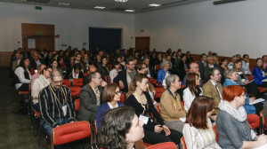

Nie pisaliśmy wcześniej o The Translation and Localization Conference, mimo że
miała ona miejsce w naszym kraju. Wydawało nam się, że nie porusza ona tematyki
dokumentacji i komunikacji techcnicznej. Byliśmy w błędzie. Dziś postaramy się
go naprawić.

<!--truncate-->

Poniżej publikujemy podsumowanie konferencji podesłane nam przez samych
organizatorów. Którym serdecznie dziękujemy i gratulujemy jednocześnie!

> Konferencja TLC’2014, czyli The Translation and Localization Conference 2014,
> to już trzecia edycja tej międzynarodowej imprezy branżowej. Koncepcja
> konferencji, która ma umożliwiać zintegrowanie środowiska tłumaczy, biur
> tłumaczeń i firm zatrudniających tłumaczy (lub kupujących usługi
> tłumaczeniowe) powstała w 2007 roku. Celem konferencji jest tworzenie
> platformy wymiany, wiedzy i inspiracji dla freelancerów, przedstawicieli biur
> tłumaczeń i korporacji.
>
> Od początku bardzo istotnym aspektem konferencji były technologie
> tłumaczeniowe. Silny nacisk kładziono przede wszystkim na narzędzia CAT
> (wspomagające tłumaczenie) oraz nowe technologie związane z cloud
> computingiem, tłumaczeniem maszynowym i usprawnianiem procesów — stanowią one
> istotne tło każdej edycji i sprawiają, że z roku na rok warsztat tłumaczeniowy
> biur i tłumaczy indywidualnych się unowocześnia. To wszystko uzupełniają
> wykłady dotyczące lingwistycznych aspektów przekładu oraz spotkania z
> ekspertami z różnych dziedzin i specjalizacji. Tradycją stało się również
> coroczne wystąpienie uznanych językoznawców. Konferencja oferuje tematy w j.
> angielskim oraz polskim, stopniowo zwiększając udział bloku międzynarodowego –
> angielskiego – w skali całego spotkania.
>
> Absolutnie naturalną przestrzenią do nawiązywania kontaktów biznesowych są
> przerwy między sesjami, podczas których można się zapoznać z ofertą wystawców,
> porozmawiać z prelegentami i innymi uczestnikami. Organizatorzy dbają też o
> wieczorne imprezy integracyjne, które każdego roku odbywają się w innych
> miejscach i cieszą dużą popularnością wśród uczestników.
>
> Przez kilka lat funkcjonowania imprezy jej profil tematyczny ogniskował się
> zawsze na sprawach aktualnych, ważnych i mających realny wpływ na przyszłość
> zawodu.
>
> Tegoroczna edycja odbyła się w dniach 28-29 marca 2014 r. w Warszawie. Do
> zespołu organizatorów jednorazowo dołączyło Stowarzyszenie na Rzecz
> Komunikacji Technicznej Komte, które miało istotny wpływ na poszerzenie
> tematyki konferencji o dokumentację i komunikację techniczną oraz problematykę
> normalizacji. Impreza odbyła się na terenie przestronnego kompleksu
> konferencyjnego hotelu Novotel Airport Warsaw. Na konferencji zjawiło się w
> tym roku 237 uczestników z 29 krajów, co stanowi absolutny rekord wśród
> konferencji branżowych tego typu w kraju. Co więcej, jest to również jeden
> z wiodących wyników wśród międzynarodowych konferencji w Europie. Tradycyjnie
> konferencja uzupełniona była też o wieczorne spotkanie w formie bankietu
> integracyjnego oraz losowanie licznych nagród, które przygotowali sponsorzy i
> partnerzy konferencji. Ranga konferencji TLC stale rośnie, czego dowodem jest
> udział przedstawicieli Komisji Europejskiej, Polskiego Komitetu Normalizacji,
> Ministerstwa Sprawiedliwości, licznych stowarzyszeń branżowych, korporacji,
> biur i uznanych ekspertów.
>
> Jedną z naszych najważniejszych deklaracji jako organizatorów jest stałe
> rozwijanie konferencji, czujne obserwowanie trendów rynkowych i bardzo uważne
> wsłuchiwanie się w uwagi uczestników.

Załączamy zdjęcia, abyście lepiej mogli poczuć klimat.

Widok na audytorium podczas jednej z prelekcji:

CEO Tekom Europe, Michael Fritz podczas swojego wykładu o branży
dokumentacyjnej:

Warto dodać, że w czasie trwania konferencji oficjalnie ogłoszono rozpoczęcie
działalności tekom Polska - polskiej gałęzi organizacji o której
[pisaliśmy jakiś czas temu](http://techwriter.pl/zostan-mowca-tekom-europe-roadshow-2014/).

Dokładny program tej i poprzednich konferencji znajdziecie oczywiście na stronie
głównej
[The Translation and Localization Conference](http://www.translation-conference.com/pl).
