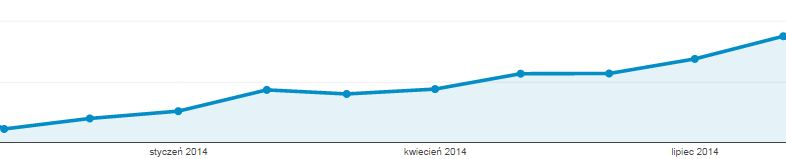

**Dziś są pierwsze urodziny techwriter.pl.** Uwierzycie? Wzruszenie odbiera nam
głos, więc napisaliśmy małe podsumowanie.

Wszystko zaczęło się dokładnie rok temu
[błyskotliwym wpisem otwierającym](http://techwriter.pl/witaj-swiecie/). Przez
rok na naszych łamach pojawiło się **ponad 100 artykułów**, lepszych i gorszych,
mądrzejszych i głupszych, humorystycznych i poważnych. Liczba osób które mają
swój udział w techwriter.pl przekroczyła już na pewno 10 i nieustannie rośnie😊.
Początki, jak łatwo się domyślić, były trudne, naznaczone błędami wieku
niemowlęcego i główną wątpliwością - czy to ma w ogóle sens? Czy ktoś to
przeczyta? Ale szybko pojawiły się pierwsze odpowiedzi na te pytania -
komentarze:

> Miło było trafić na chyba pierwszy polski site TechWriterów. Nie spodziewajcie
> się natłoku fanów bo writerów jest bardzo mało w Polsce. Ale też nie
> poddawajcie się.

... maile:

> znalazłem parę błędów na Waszej stronie. Poprawcie bo brzydko wygląda 😊

... więcej maili, które sprawiły, że poczuliśmy się potrzebni:

> W mojej firmie słyszałem o zawodzie Technical Writera i nawet "popełniłem"
> parę dokumentacji, tworząc strony wiki zawierające najczęściej występujące
> błędy i sposoby radzenia sobie z nimi oraz dokumentacje opisującą poszczególne
> testy w systemie monitorującym. Języki zawsze były moją pasją i chciałbym
> spróbować swoich sił w Technical Writingu, jednak w moim województwie
> (pomorskie) jest takich ogłoszeń jak na lekarstwo. Chciałbym dołączyć do
> Państwa grupy techwriterów i prosić o wskazówki, jak zacząć.

... i pomocni:

> Chciałabym zapytać jakie mam szansę rozwijać się w kierunku techwritera oraz
> chciałabym prosić o pomoc i wskazanie ścieżki, którą powinnam podążać.

... współpraca z innymi zapaleńcami, np. organizatorami konferencji
[soap!](http://techwriter.pl/konferencja-soap-wczoraj-i-dzis/) i
[UA Conference](http://techwriter.pl/ua-conference-relacja/),
[tekom](http://techwriter.pl/zaproszenie-na-konferencje-tekom-europe-roadshow-w-warszawie/).

... [oferty pracy dla Was](http://techwriter.pl/category/news/oferty-pracy/).

I milion pomysłów na więcej!

Przez ten czas strona została odwiedzona przez **kilka tysięcy użytkowników:**

...a listę najbardziej popularnych artykułów otwierają:

Miejsce 5:
[Jak zostać technical writerem?](http://techwriter.pl/jak-zostac-technical-writerem/)

Miejsce 4:
[Kiedy instrukcja staje się sztuką](http://techwriter.pl/kiedy-instrukcja-staje-sie-sztuka/)

Miejsce 3:
[soap! technical communication conference - relacja](http://techwriter.pl/soap-technical-communication-conference-relacja/)

Miejsce 2:
[Jenkins - opis narzędzia](http://techwriter.pl/jenkins-opis-narzedzia/)

Miejsce 1:
[Ile zarabia techwriter?](http://techwriter.pl/ile-zarabia-technical-writer/)

Serdecznie dziękujemy Wam za to że jesteście z nami, Drodzy Materialiści! 😉

Tworząc techwriter.pl, marzyliśmy o stworzeniu czegoś, co "bawiąc - uczy,
ucząc - bawi”. Teraz nazywa się to chyba
"[edutainment](http://pl.wikipedia.org/wiki/Edutainment)", ale my pamiętamy też
o rodzimych wzorcach:

Chcieliśmy stworzyć coś, co pomoże rozwijać się tym z Was, którzy - jak my - już
wybrali swoją zawodową drogę. Coś, co pokaże innym, że istnieje profesja
([najlepsza na świecie](http://techwriter.pl/mamy-najlepsza-prace-na-swiecie/)),
którą warto się zainteresować, poznać ją, a może nawet uczynić z niej sposób na
swoje zawodowe życie.

Wam pozostawiamy ocenę czy udało się osiągnąć ten cel. Na pewno będziemy dalej
próbować. Tworzenie tej strony ciągle nas bawi. I uczy jednocześnie.

A teraz....

Chcemy prezent. Od Was. Nawet my (kilka osób tworzących tę stronę) od czasu do
czasu potrzebujemy jakiegoś docenienia.  Od Was. Napiszcie komentarz, wyślijcie
mail, odezwijcie się do nas na FB (pojawiają się tam nie tylko nasze artykuły),
skrytykujcie nas i powiedzcie co możemy zmienić aby techwriter.pl za rok był
dużo, dużo lepszy.

Dla Was.
