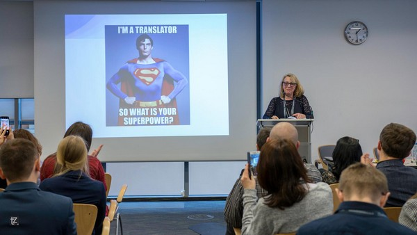
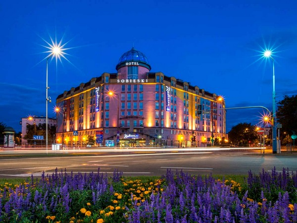

Z wielką radością zapraszamy Was na
[The Translation and Localization Conference](https://www.translation-conference.com/),
która już niedługo odbędzie się w Warszawie. To kolejna impreza związana z
branżą tłumaczeń, którą objęliśmy patronatem medialnym. Jak zapewne pamiętacie,
w ubiegłym roku rozszerzyliśmy nasze horyzonty i zostaliśmy partnerem
Konferencji Tłumaczy. Poniżej znajdziecie garść najważniejszych informacji
dotyczących TLC, z którą robimy kolejny krok w kierunku zacieśniania współpracy
między światem dokumentacji i tłumaczeń.

## O TLConference

Pomysłodawcą konferencji oraz jej głównym organizatorem jest Agenor
Hofmann-Delbor. Wraz z
[grupą osób](https://www.translation-conference.com/tlc-team) związanych z
branżą tłumaczeniową i IT zorganizował pierwszą konferencję w 2012 roku. Od
tamtej pory, z roku na rok, cieszy się ona coraz większym zainteresowaniem.

W ciągu dwóch dni, uczestnicy Translation and Localization Conference mają
możliwość wzięcia udziału zarówno w prelekcjach, jak i warsztatach. Tematyka
oscyluje wokół problemów związanych z tłumaczeniami, komunikacją, a także
wszelkich nowinek branżowych. Tegorocznym motywem przewodnim są zmiany, jakie
czekają tłumaczy oraz osoby z nimi związane w nadchodzącym 2020 roku.

## Czego się spodziewać?

Jak wspomnieliśmy wyżej, centrum zainteresowania organizatorów tegorocznej
edycji jest rok 2020. Dlaczego akurat ta data? Jeszcze do niedawna w wielu
filmach science-fiction rok ten był pokazywany jako odległa przyszłość, w której
dominować będą roboty, latające samochody, a ludzkość założy niezliczone kolonie
w odległych rejonach kosmosu. Tymczasem rok 2020 czeka już na nas za rogiem,
wprowadzając nas w nową erę branży tłumaczeniowej.

Co nas zatem czeka? Wejdziemy w trzecią erę narzędzi CAT oraz silników NMT.
Świat tłumaczeń i zadań, jakie w nim wykonujemy ulegnie automatyzacji.
Powinniśmy się przygotować na zmiany, ale nie te, które proponowali nam twórcy
filmów, ale na takie, które następują w rzeczywistości, w innym tempie oraz
kierunku, jaki ludzkość początkowo zakładała.

Celem konferencji jest uświadomienie tych zmian oraz przygotowanie osób, które
będą nimi dotknięte, tak, by ich dalsza kariera rozwijała się płynnie i z pełnym
sukcesem. Rok 2020 nie przyniesie nam zapewne latających samochodów, ale będzie
na pewno inspiracją dla nowych pomysłów na przyszłość.

## Program

Wstępny program wydarzenia jest już dostępny, możemy zatem przybliżyć Wam, co
będzie się działo. Pierwszego dnia konferencji będą miały miejsce tylko
prelekcje. Poza wystąpieniem otwierającym, reszta sesji zostanie zaprezentowana
w dwóch równoległych ścieżkach. Mamy do wyboru 10 tematów, jednak jeszcze nie
wszystkie są udostępnione, zatem musicie uzbroić się w cierpliwość i śledzić
zmiany w programie [tutaj](https://www.translation-conference.com/schedule) .
Drugi dzień to warsztaty i dobrze nam znana forma unconference. Tu również
możemy wybrać z kilku tematów, które będą odbywać się po dwa jednocześnie. Jak w
przypadku prelekcji i tu nie wszystkie tematy są jeszcze znane, zatem jeśli
jesteście zainteresowani, trzymajcie rękę na pulsie.

Przeglądając program zwróciliśmy uwagę, że niektóre wykłady łączą się
tematycznie z warsztatami. Mamy na przykład prelekcje o automatyzacji zadań w
tłumaczeniach oraz warsztaty, podczas których poznamy konkretne strategie i
narzędzia, które pomogą nam zautomatyzować proces. Kolejny temat, jaki zwrócił
naszą uwagę to debata na temat zmian predyspozycji tłumacza oraz ich wpływ na
przyszłość zawodu w 2020 roku.

Pomiędzy poszczególnymi blokami organizatorzy przewidzieli przerwy na kawę oraz
lunch. W piątkowy wieczór czeka nas jeszcze impreza zapoznawcza, a w sobotnie
popołudnie uroczyste zamknięcie.

## Dla kogo jest TLC?

Konferencja jest szczególnie skierowana do osób pracujących w branży tłumaczeń
oraz wszystkich osób związanych z szeroko rozumianą komunikacją i automatyzacją.

## Termin

Konferencja odbędzie się w dniach 29 – 30 marca 2019 roku.

## Miejsce

Konferencja odbędzie się w Warszawie. Prelekcje oraz warsztaty będą miały
miejsce w hotelu
[Radisson Blu Sobieski](https://www.radissonblu.com/pl/sobieski-warsaw).
Natomiast na piątkowy networking organizator zarezerwował restaurację
[Grand Kredens](http://www.kredens.com.pl/) - uczestnictwo wymaga dodatkowej
rezerwacji i opłaty. Wszelkie szczegóły znajdziecie poniżej oraz na
[stronie organizatora](https://www.translation-conference.com/venue).

## Ceny

Poniżej przedstawiamy ceny wejściówek na konferencję. Jednocześnie przypominamy,
że **termin rejestracji upływa 28 lutego**.

<table className=" aligncenter" style="height: 90px; width: 388px;"><tbody><tr style="height: 18px;"><td style="height: 18px; width: 140.4px;"><strong>Rodzaj biletu</strong></td><td style="height: 18px; width: 157.04px;"><strong>Cena</strong></td></tr><tr style="height: 18px;"><td style="height: 18px; width: 140.4px;">2 dni + lunch</td><td style="height: 18px; width: 157.04px;">€370/1560 PLN</td></tr><tr style="height: 18px;"><td style="height: 18px; width: 140.4px;">Piątek + lunch</td><td style="height: 18px; width: 157.04px;">€230/970 PLN</td></tr><tr style="height: 18px;"><td style="height: 18px; width: 140.4px;">Sobota + lunch</td><td style="height: 18px; width: 157.04px;">€230/970 PLN</td></tr><tr style="height: 18px;"><td style="height: 18px; width: 140.4px;">Networking</td><td style="height: 18px; width: 157.04px;">€65/270 PLN</td></tr></tbody></table>

Cena nie zawiera noclegu, jednak organizator zapewnia zniżkę przy rezerwacji
pokoju w hotelu Radison Blu Sobieski. Szczegóły znajdziecie
[tutaj](https://www.translation-conference.com/venue).

Bilet na imprezę networkingową zawiera w sobie - przekąski, nieograniczony
dostęp do napoi bezalkoholowych, dwa drinki oraz, w razie potrzeby, transport z
i do miejsca zakwaterowania.

Na stronie organizatora jest jeszcze informacja, że wkrótce mają się pojawić
szczegóły dotyczące warsztatów, eventów oraz wycieczek, zatem może będą na Was
czekały jeszcze dodatkowe atrakcje ;-). Zaglądajcie więc
[tutaj](https://www.translation-conference.com/buy-tickets), by być na bieżąco.

## Dlaczego warto wziąć udział?

Naszym zdaniem jest kilka powodów, dla których warto wziąć udział w
TLConference 2019. Po pierwsze, miejsce. Rzadko mamy możliwość wzięcia udziału w
międzynarodowej konferencji, w rodzimym kraju, dlatego gdy pojawia się taka
opcja, warto solidnie ją rozważyć. Po drugie, międzynarodowi eksperci oraz
tematyka konferencji pozwolą na zorientowanie się w nowinkach na rynku
(narzędzia, rozwój nowoczesnych technologii, najnowsze trendy w branży
tłumaczeniowej - to tylko kilka przykładów). Kolejną rzeczą wartą uwagi jest
tematyczne powiązanie części prelekcji i warsztatów, co przy wybraniu konkretnej
tematyki daje nam swego rodzaju kurs z obszaru, który nas interesuje. Poza
zdobyciem nowej wiedzy lub poszerzeniem tego, co już wiemy, mamy szansę na
poznanie wielu osób, które na co dzień spotykają się z podobnymi problemami, co
pozwala wymienić się doświadczeniami oraz strategiami

Jeśli nadal nie jesteście pewni swej decyzji, zapraszamy do zapoznania się z
[fanpagem](https://www.facebook.com/TheTranslationConference/) konferencji,
gdzie znajdziecie informacje o poprzednich edycjach oraz komentarze uczestników.
