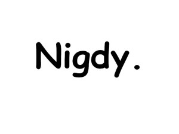

Pamiętacie [wpis o typografii](http://alistapart.com/blog/post/web-font-trends)?
Dziś mały suplement - najmodniejsze kroje pisma, czyli fontologia stosowana.

<!--truncate-->

Zanim odpowiemy na pytanie co będzie się nosić jak będzie się pisać tej wiosny -
kilka ciekawych miejsc z których można zaczerpnąć pełnymi garściami:

- [Google Fonts](https://www.google.com/fonts#)
- [dafont.com](http://www.dafont.com/)
- [1001 Free Fonts](http://www.1001freefonts.com/)
- [Fonts.com](http://www.1001freefonts.com/)
- [Font Squirrel](http://www.fontsquirrel.com/)
- [Adobe Typekit](https://typekit.com/)
- [Fontdeck](https://typekit.com/)
- [Fontspring](https://typekit.com/)
- [Webtype](http://www.webtype.com/)

Zdajemy sobie sprawę, że większość z Was nie użyje nawet promila zawartości tych
stron, ale jeśli przynajmniej jedną osobę zainspirujemy do wypróbowania i
nauczenia się czegoś nowego - to już było warto 😊.

Na wielu z tych stron można sprawdzić, które kroje pisma są najbardziej
popularne, najczęściej oglądane lub kupowane - i na tej podstawie spróbować
odpowiedzieć, które fonty są aktualnie najmodniejsze. Tak jak zrobiono to
[na tej stronie](http://alistapart.com/blog/post/web-font-trends), która zresztą
zainspirowała nas do napisania tego artykułu. Od razu Was uprzedzimy, że nie
udało się znaleźć odpowiedzi😊 Przynajmniej tam. Inni są bardziej konkretni.

Wyszperaliśmy np. artykuł
"[The most popular fonts used by designers](http://www.webdesignerdepot.com/2011/08/the-most-popular-fonts-used-by-designers/)"
z ciekawym omowieniem każdego kroju pisma.

Podobny,
"[The ten most popular web fonts of 2013](http://www.typeandgrids.com/blog/the-ten-most-popular-web-fonts-of-2013)",
podaje przykłady stron internetowych wykorzystujących poszczególne fonty.

A zwolennicy wojen religijnych mogą porównać
"[Most popular fonts in Microsoft products](https://www.microsoft.com/typography/fonts/popular.aspx)"
z
"[Typografy of Apple Inc.](http://en.wikipedia.org/wiki/Typography_of_Apple_Inc.)".

Nas oczywiście najbardziej zainteresowało jaki font jest uważany za najgorszy.
Możecie poszukać sami, jest to pouczające i zabawne jednocześnie (szczególnie
warta polecenia wydaje
się [historia igrzysk olimpijskich w Londynie w 2012 roku](http://boingboing.net/2011/11/04/worst-fonts-ever.html)).
Wydaje nam się, że najgorszy krój pisma dużo łatwiej wytypować niż ten
najlepszy. Comic Sans.

Nigdy go nie używajcie.

